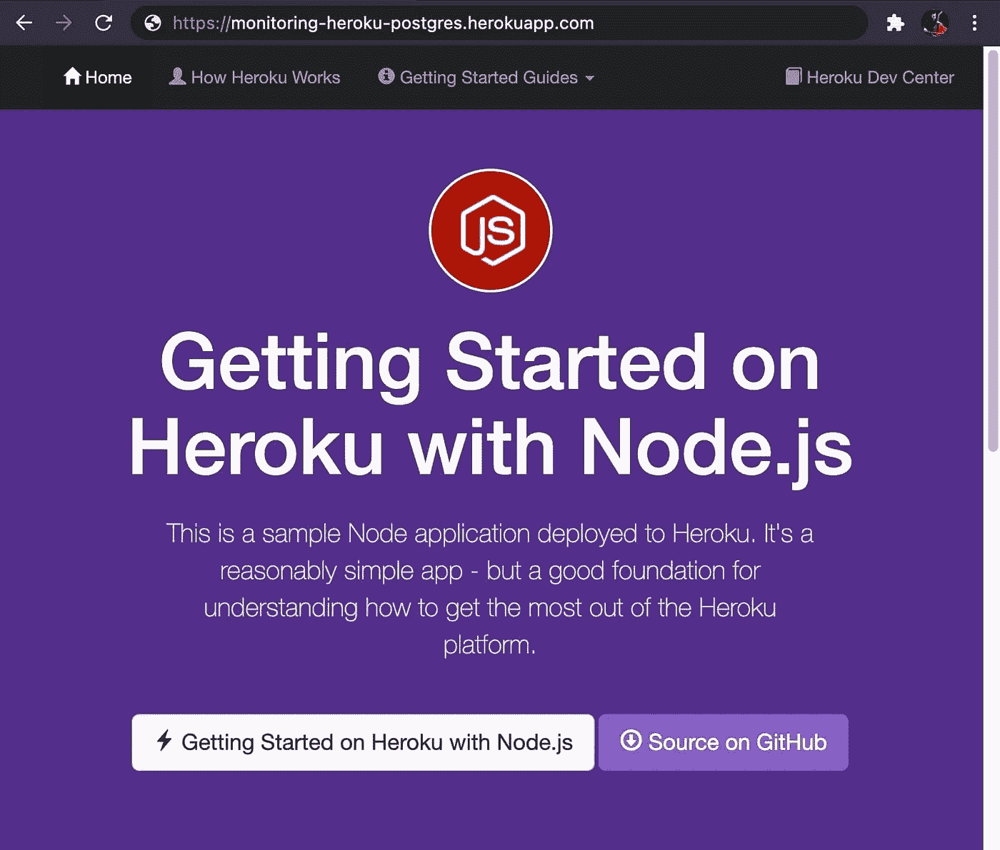
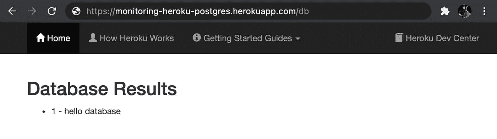
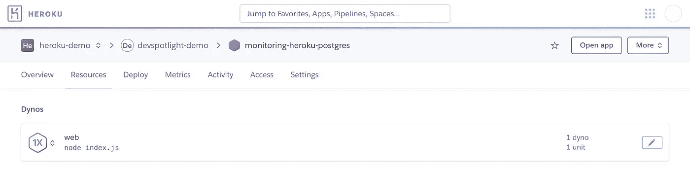
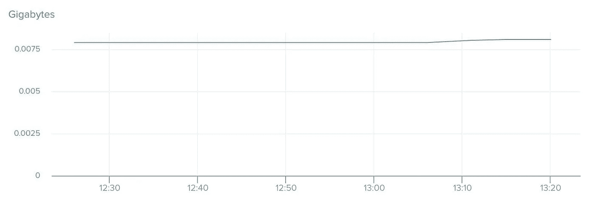
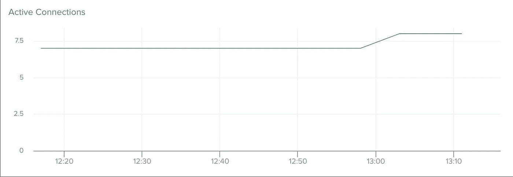
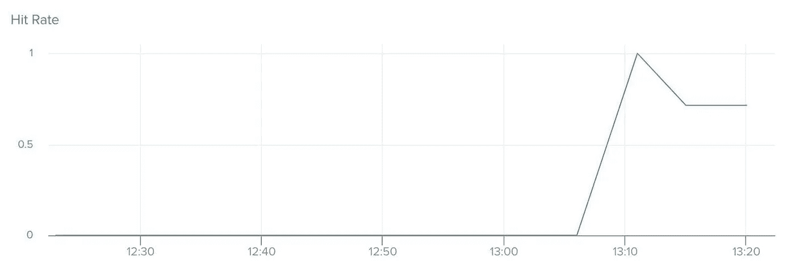
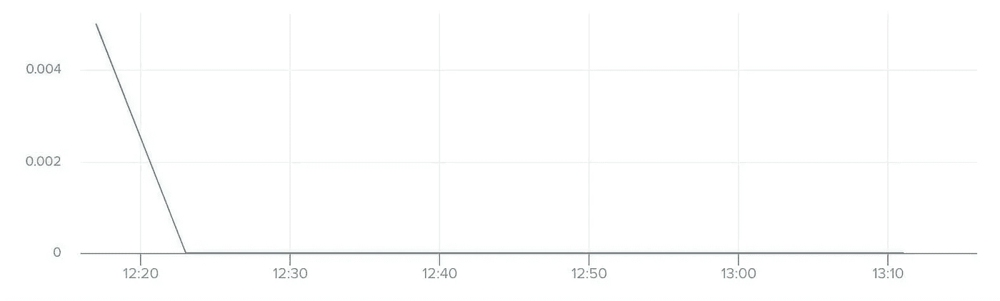
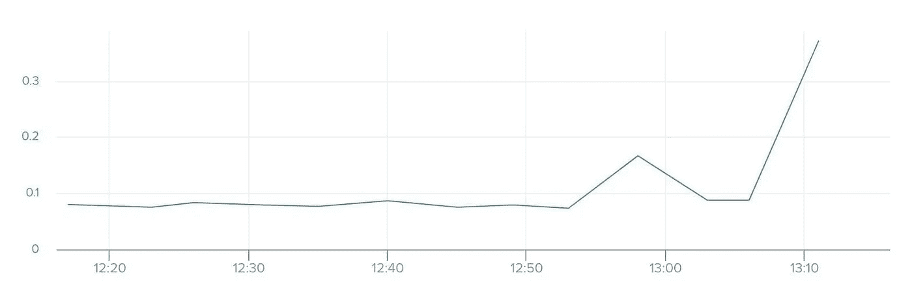
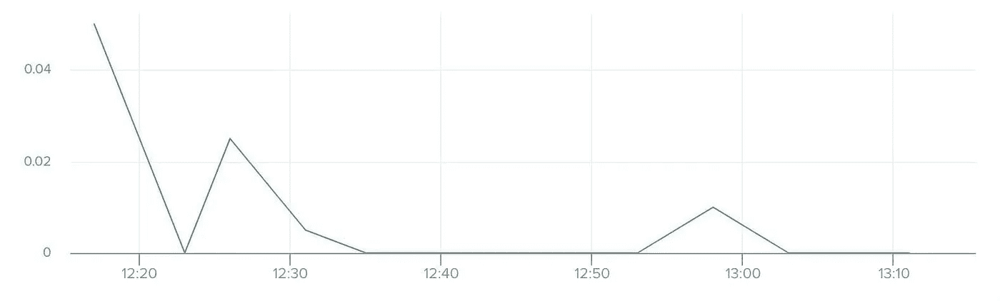
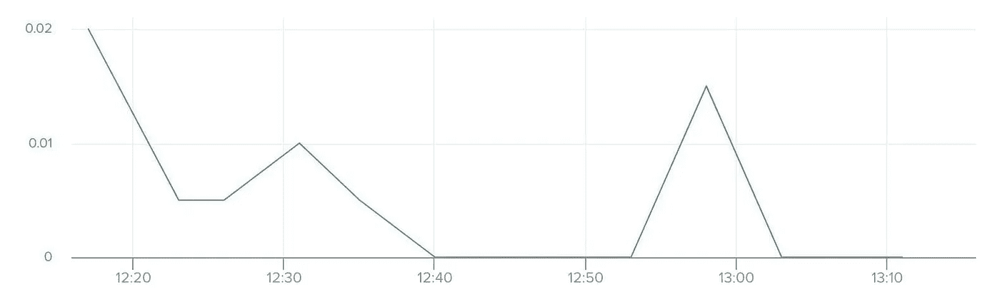

# 如何在 Heroku 应用程序中监控 Postgres

> 原文：<https://betterprogramming.pub/how-to-monitor-postgres-in-your-heroku-app-d25b88769694>

## 活动连接、等待连接等等


照片由[沙哈达特·拉赫曼](https://unsplash.com/@hishahadat?utm_source=medium&utm_medium=referral)在 [Unsplash](https://unsplash.com?utm_source=medium&utm_medium=referral) 拍摄

# 介绍

在绝大多数应用中，数据库是事实的来源。该数据库存储重要的业务记录以及不可替代的用户数据。因此，开发人员必须了解他们的数据库，以便在潜在问题影响业务之前对其进行诊断和补救。如果他们不这样做，开发人员会在月底发现他们可能不理解的意外账单。

在本文中，您将学习如何使用 [Librato](https://www.librato.com/) 建立一个 [Heroku Postgres](https://www.heroku.com/postgres) 数据库，用于[自动监控](https://devcenter.heroku.com/articles/monitoring-heroku-postgres)。然后，我们将查看一系列不同的可用指标，以及如何充分利用每种指标的最佳实践。有了正确的指标，您就可以预测哪里需要提供额外的资源，哪里需要关注潜在的问题。

# 用 Heroku、Librato 和 Postgress 创建我们的示例应用程序

本文假设您已经拥有一个 Heroku 帐户。如果你没有，[创建一个免费账户](https://signup.heroku.com/)就足够了，尽管除非你有一个[标准](https://www.heroku.com/pricing)账户计划，否则这些指标实际上是不可用的。

一旦你有了一个帐户，登录我们的 Heroku 帐户并复制 [NodeJS 入门](https://github.com/heroku/node-js-getting-started.git)模板。您可以使用 web 界面来完成所有这些工作，但是在本文中我们将使用 CLI。然后，我们将`cd`到存储库中，创建一个名为`monitoring-heroku-postgres`的新 Heroku 应用程序。

```
heroku login
git clone https://github.com/heroku/node-js-getting-started.git
cd node-js-getting-started
heroku create -a monitoring-heroku-postgres
```

为启动项目设置`get`遥控器。然后，将项目推送到我们创建的 Heroku 应用程序。

```
heroku git:remote -a monitoring-heroku-postgres
git push heroku main
```

部署应用程序后，我们将启动应用程序的单个实例。

```
heroku ps:scale web=1
heroku open
```



既然我们的应用程序已经设置并部署好了，我们将提供我们的数据库并将`pg`安装到我们的项目中。

```
heroku addons:create heroku-postgresql:standard-0
npm install pg
```

打开`index.js`并包含以下代码，将我们的应用程序连接到数据库:

```
const { Pool } = require('pg');
const pool = new Pool({
  connectionString: process.env.DATABASE_URL,
  ssl: {
    rejectUnauthorized: false
  }
});
```

我们将创建另一条名为`/db`的路线。

```
.get('/db', async (req, res) => {
    try {
      const client = await pool.connect();
      const result = await client.query('SELECT * FROM test_table');
      const results = { 'results': (result) ? result.rows : null};
      res.render('pages/db', results );
      client.release();
    } catch (err) {
      console.error(err);
      res.send("Error " + err);
    }
  })
```

我们的应用程序现在连接到我们的数据库。提交更改并将它们推送到我们部署的应用程序中。

```
git add .
git commit -m "Install PG dependency, connect database, and create db route"
git push heroku main
```

现在我们的数据库是空的。为了将数据写入数据库，我们将使用`[psql](https://www.postgresql.org/docs/9.3/app-psql.html)`。

```
heroku pg:psql
create table test_table (id integer, name text);
insert into test_table values (1, 'hello database');
\q
heroku open db
```



最后，我们将 Librato 添加到我们的项目中进行自动化监控。Librato 是一个用于收集、理解和处理实时指标的插件。它会自动创建交互式可视化效果，以便您可以快速了解数据库中发生的事情。您可以在资源选项卡下访问 Librato 仪表板。



```
heroku addons:create librato
```

# 衡量标准

现在，让我们看看我们的新指标，看看我们获得了哪些见解，以及我们如何使用这些新数据。我们将看看几个数据库指标和服务器指标。

## 数据库指标

**db_size**

`db_size`告诉您数据库中包含的字节数。它包括磁盘上的所有表和索引数据，包括数据库膨胀。

您的数据库将根据您的计划分配一定的大小。如果您的数据库增长超过了分配的大小，您将收到一封警告电子邮件，其中包含如何修复该问题的说明。您可能会收到一个强制日期，规定何时只允许您使用一个数据库连接。访问将被限制到`read`、`delete`和`truncate` ，直到数据库回到计划限制之下。

Heroku 建议当您的数据库达到计划分配大小的 80%时设置警告警报，当达到 90%时设置严重警报。当您接近最大值时，您可以升级您的计划或删除数据以保持在计划限制内。



**活动连接**

`active-connections`告诉您在数据库上建立的连接数。与`db_size`非常相似，Heroku Postgres 实施了连接限制。第 3 级及更高级别的计划有 500 个连接的硬性限制。达到此限制后，您将无法创建任何新的连接。您可以通过两种不同的方式为活动连接设置警报:

**1。当前连接数突然大幅变化**

如果基线连接数发生了很大的变化，这可能是查询和/或事务运行时间增加的迹象。在正常操作条件下进行评估时，警报阈值将取决于应用程序的连接数范围。一个很好的经验法则是，比你正常的每日最高量多+50/+100。

**2。连接数接近其硬最大值**

对于 3 级及更高级别的计划，最大连接数为 500。与`db_size`一样，建议设置 80%和 90%使用率的警报；所以 400 和 450 是开始的好数字。如果您发现您经常接近您的连接限制，那么考虑使用连接池的[。](https://devcenter.heroku.com/articles/postgres-connection-pooling)



**索引缓存命中率**

`index-cache-hit-rate`告诉您共享缓冲区高速缓存提供的索引查找的比率；这些比率四舍五入到小数点后五位。Heroku 建议值为 0.99 或更大。如果您的索引命中率通常低于 0.99，那么值得调查哪些查询的开销最大。您还可以升级数据库计划以获得更多 RAM。



**等待连接**

`waiting-connections`告诉您等待获取锁的连接数。许多等待中的连接可能是数据库并发处理不当的迹象。

我们建议为任何连续等待五分钟的连接设置一个警报。`pg-extras` CLI 插件可以帮助识别阻止其他操作发生的查询。一旦识别出这些查询，就可以终止它们，以解决锁争用问题。了解哪些语句导致了阻塞，有助于识别应用程序代码，以便为减少锁定而进行优化。



## 服务器指标

**平均负载**

`load-avg`告诉您 1、5 和 15 分钟内的平均系统负载除以可用 CPU 的数量。1.0 的`load-avg`意味着平均来说，在 100%的时间跨度内处理请求的 CPU 资源。

超过 1.0 的负载表示进程必须在给定的窗口中等待 CPU 时间。值越高，表示进程等待的时间越长。低于 1.0 的值表示您的 CPU 在给定的窗口内花费了空闲时间。如果这个值很高，那么这意味着您将获得不一致的查询执行时间和更长的等待时间。

一旦该值超过 1.0，您就会过度利用资源。因此，您会希望在负载达到超过 1.0 的值之前知道。同样，我们建议将警报设置为 80% (8.0)和 90% (9.0)。

对于 cpu 密集型查询，您可以使用`pg:ps`命令检查当前活动。如果你的`load-avg`值一直很高，那么升级到一个更大的计划可能是值得的。但是，在升级之前，调整开销较大的查询以减少数据库的处理工作量是很有用的。



**读取 iops**

`read-iops`告诉您向主数据库磁盘分区发出了多少读 IO 请求，以每秒 IO 操作数(IOPS)为单位。每个计划都有一个规定的 IOPS (PIOPS)最大值。这是调配的磁盘卷每秒可以支持的最大总读取数+写入数。

您希望您的读取来自内存(缓存)而不是磁盘，以提高读取速度。由于进程需要等待 I/O 变得可用，因此超过调配的 IOPS 会导致长事务时间和高平均负载。

您可以为 90%的已配置 IOPS 设置警报，以识别需要大量 I/O 的活动或语句。在升级到更大的计划之前，您可以调整昂贵的查询，以减少直接从磁盘读取的数据量。



**用电量百分比**

`wal-percentage-used`告诉你剩余的空间来存储临时 Postgres 预写日志。如果 WAL 生成的速度超过了 WAL 存档的速度，您就有完全填满 WAL 卷的风险。这将关闭数据库，并可能导致数据丢失的风险。

如果您达到 75%的利用率，那么 Heroku 将自动调节您的数据库连接限制。所有连接将在利用率达到 95%时终止。与之前的指标不同，我们建议将 WAL 警报设置为 60%。



# 结论

我们审查了大量不同的指标，这些指标提供了一系列不同的见解。数据库的运行状况取决于许多因素，其中包括:

*   大小
*   连接数
*   缓存利用率
*   服务器负载
*   读取频率
*   WAL 百分比

一旦开发人员了解了这些指标，他们就能更好地做出关于配置和管理数据的明智决策。关于监控的更多信息，我建议您查看 Heroku 的这篇文章。