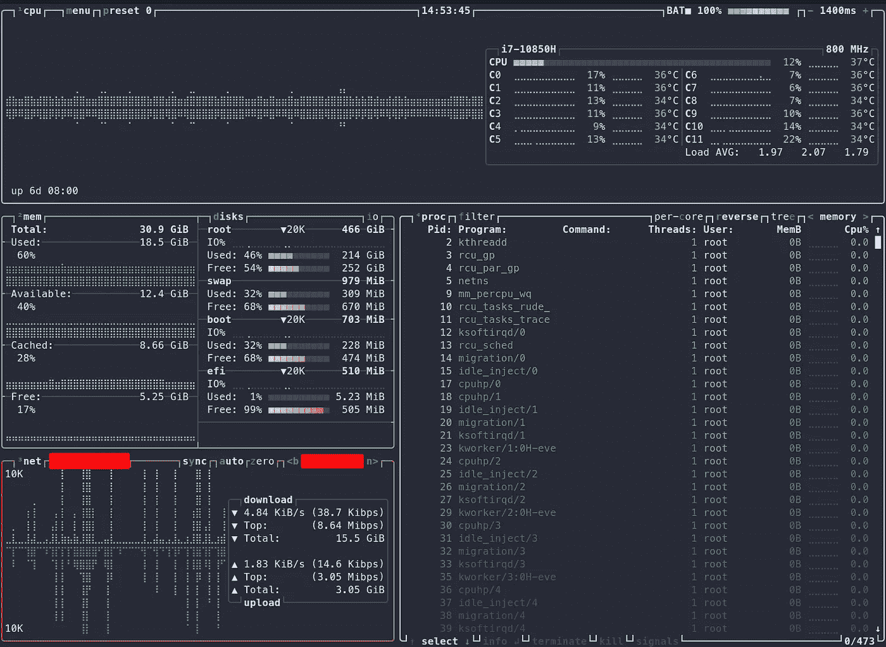
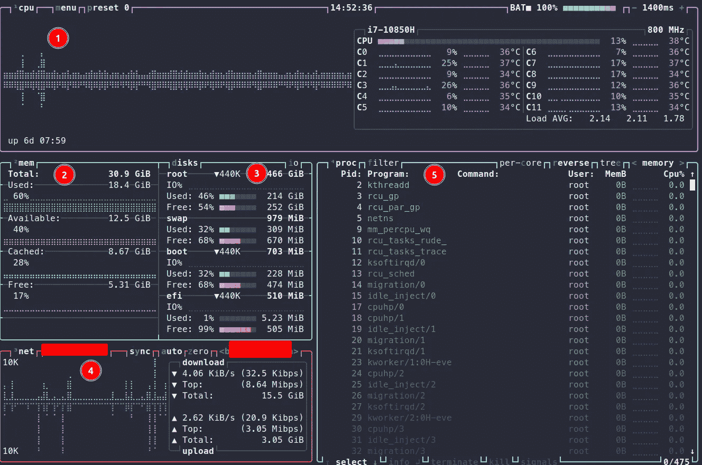
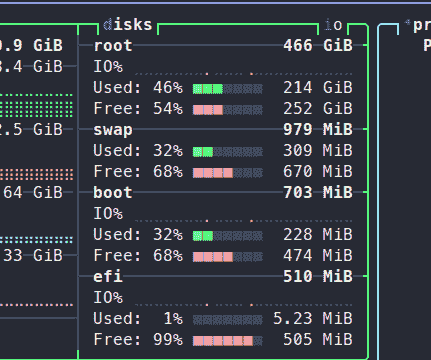
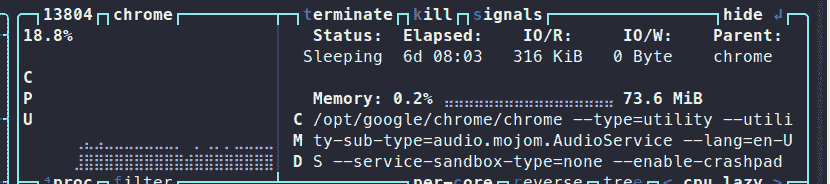
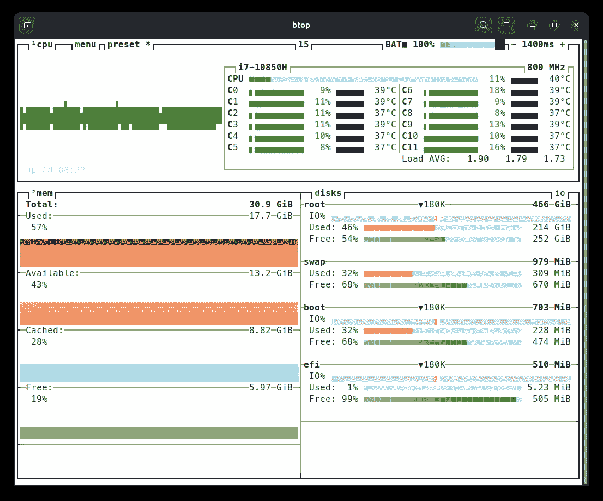
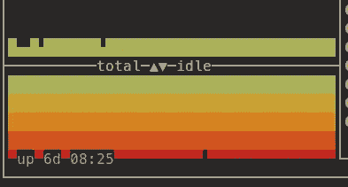

# 如何使用一个引人入胜的 CLI 工具— Btop 来监控您的机器

> 原文：<https://betterprogramming.pub/how-to-monitor-your-machine-with-one-spectacular-cli-tool-a1c3313a409a>

## 使用这款多功能一体的工具做更多事情



关于你的机器你需要知道的一切。

你有没有想过为什么你的电脑很慢？Btop 可能没有完整的答案，但它肯定会告诉你潜在的原因。可能一个进程占用了大量 CPU 周期，或者您的交换分区已满。您可以使用 ps、df 或 swapon 之类的工具来实现这一点——或者您只需使用 btop，就可以将所有东西都放在银盘子上。

# 装置

您可以安装 btop 和所有常用的软件包管理器。我用最新版本的 Ubuntu 和 apt 测试了它，使用的命令是:

```
sudo apt install btop
```

还有一个[卡扣](https://snapcraft.io/btop)套装可供选择。

Btop 是开源的。您可以直接从二进制文件安装 btop。查看 [GitHub](https://github.com/aristocratos/btop#installation) 上的资源库以获得这方面的说明。

Mac 用户可以用[自制](https://brew.sh/)安装 btop:

```
brew install btop
```

Windows 用户被冷落了——抱歉！

# 详细 Btop

安装后在你的终端上运行`btop`即可。它会显示五个面板。



第一个面板显示关于 CPU 使用和温度的信息。两者都被分解到每个内核，并针对整个 CPU 进行总结。如果你使用笔记本电脑，btop 也会显示电池状态。按下`1`可以隐藏面板。

第二个面板显示总体内存使用情况，并细分为已用、可用、缓存和空闲。您可以按 2 隐藏面板。Used 是应用程序当前分配和使用的内存。可用内存是由应用程序分配的。

但是，如果需要的话，Linux 可以重新分配这些内存。缓存内存包含来自磁盘的文件，这些文件被缓存在内存中以便更快地访问。免费内存是免费的。你可以在这里找到更多信息[。](https://www.linuxatemyram.com/)

Btop 在面板 3 中显示已用和空闲磁盘空间。它按挂载点分组。按 d 将隐藏此面板。按下`i`可以看到当前的读写操作。



从磁盘空间切换到 i/o 操作。

网络流量如面板 4 所示。按下`4`可以隐藏该面板。要查看其他网络设备(以太网、Wi-Fi 等)，请按`b`或`n`或*。*

第五个小组是最复杂的，在我看来也是最有用的。它显示所有正在运行的进程，它们使用的线程，内存，CPU，PID，以及哪个用户启动的。你可以用上下箭头键在列表中滚动。左和右将改变排序类别。按下`r`将反转排序。



正在运行的流程的更多详细信息。

如果您按下`enter`，btop 会显示所选程序的更多详细信息。你可以终止它，杀死它或者向进程发送信号。

# 还有更多

btop 是一个非常有用的工具，你也可以定制它！

首先，它有二十种不同的颜色主题。我用了德古拉主题。您还可以稍微调整一下 UI，让它为您服务。例如，您可以禁用圆角并更改图形符号或时钟格式。



具有不同颜色主题和图形符号的 btop。

也可以更改面板的默认内容。例如，您可以向 CPU 面板添加第二个图形，以显示另一种 CPU 模式下的使用情况。



又一个主题；CPU 面板显示空闲模式下的“使用情况”。

我还想提一下，btop 甚至带有鼠标支持。鼠标滚轮可以滚动进程列表等，而不是使用键盘。

Btop 将所有配置参数保存在一个文件中。您可以通过这种方式与同事共享您的预设和设置。它将文件保存在`$HOME/.config/btop`。

最后但同样重要的是，你可以添加自己的主题。该格式可在 [GitHub](https://github.com/aristocratos/btop/tree/main/themes) 上获得。把你的主题放在`$HOME/.config/btop/themes`下就可以了。

# 概述

Btop 是机器资源监控的瑞士军刀。一定要去看看！我希望你和我一样觉得它很有用。

以下是文章中提到的所有链接:

*   [btop 的 GitHub 库](https://github.com/aristocratos/btop#installation)
*   [Mac 版自制软件](https://brew.sh/)
*   [关于 Linux 内存管理的信息。](https://www.linuxatemyram.com/)
*   [快照上的 btop](https://snapcraft.io/btop)

感谢您的宝贵时间！

```
**Want to Connect?**Subscribe to my newsletter and never miss a new post:
[https://verbosemode.dev/subscribe](https://verbosemode.dev/subscribe).
```