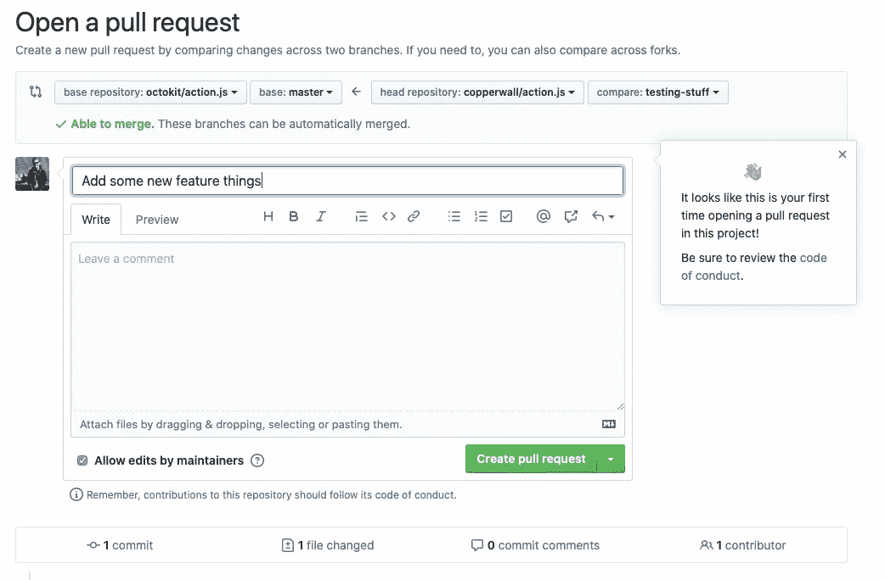
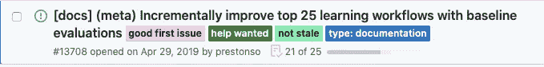
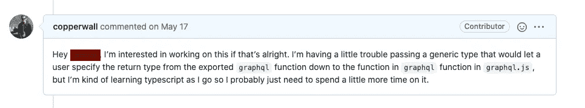

# 如何或多或少地为开源做出贡献

> 原文：<https://betterprogramming.pub/how-to-more-or-less-contribute-to-open-source-99e4604fce27>

## 我在空闲时间为开源做贡献时学到的经验

照片由 [timJ](https://unsplash.com/@the_roaming_platypus?utm_source=unsplash&utm_medium=referral&utm_content=creditCopyText) 在 [Unsplash](https://unsplash.com/s/photos/open?utm_source=unsplash&utm_medium=referral&utm_content=creditCopyText) 上拍摄

在过去的一年里，我一直试图在工作之外花一些空闲时间为开源做贡献，并认为我应该写一点关于我学到的一些经验教训。希望他们也能帮助你！

# 首先，为什么？

首先我想说，为项目做贡献是非常有益的。也许您在工作中使用的节点模块中有这个奇怪的错误，您已经在自己的应用程序中修复了它。如果您能够找到一种方法将补丁移植到模块中，那么您不仅是一个好的开源公民，因为您不仅消费了该模块(对您或您的公司来说是免费的，但是使用了所有的实用程序)，而且您还将时间和精力回馈给了一个工具或库，该工具或库为您的公司节省了时间和资源，而不必自己构建。

你也可以自我感觉良好，因为你知道将来每个使用这个模块的人都会使用你的贡献！也许在 2150 年，当互联网上的所有软件都依赖于那个模块时(你知道，就像[的左键盘](https://www.theregister.com/2016/03/23/npm_left_pad_chaos/)或其他什么)，你将真正达到永生，骗过死亡，生活在网络世界的电信号和电线中，就像一些网络神/实体的一些 90 年代的想法。不管怎样，我们说到哪了？哦对了，在 GitHub 上做一些公关。

在 Maintainer's Anonymous 上有一个非常精彩的播客，Maggie Appleton [讨论开源是一种礼物经济](https://maintainersanonymous.com/gift/)讨论了开源是如何在市场经济之外被看待的，或者仅仅是一个无尽免费包的水龙头。它引起了我的共鸣，作为为什么贡献是回报你(或你的公司)从开源软件中获得的好处的一个好方法的动机。让你的公司[赞助你的产品所依赖的开源项目的维护者](https://github.com/sponsors)是一种更好的回报形式(维护者必须吃饭)，但那是另一篇博文。

# 旅程

## 在开始之前我应该知道什么？

如果你从中拿走了一样东西，记得对待其他项目就像对待你是客人的房子一样。如果某个来自互联网的陌生人来到你家，对你很粗鲁，*和*要求你让他们对你的房子做些改动，把他们赶出去是完全合理的。

“但我完全是一个冷静的人，我永远不会给人留下这样的印象。”

也许你是，但扩展到某人家里的客人主题，想象你去一个朋友家，一进门就径直走过一个满是鞋子的区域，然后径直走进他们的客厅。你的主人有点恼火，要求你在他们家走动之前先脱鞋。但你在家里总是穿鞋，所以，没问题，对吧？问题是你不在你的房子里——你在他们的房子里，到目前为止，你已经开始了错误的访问，或鞋子，或袜子，或…无论什么。仅仅因为你认为你是一个好客人并不意味着你是按照主人的标准。对你来说，什么是“不做混蛋”，对他们来说可能不一样。如果有一种方法可以让你的主人传达他们希望你在他们家时如何表现就好了…

## 行动守则

好消息！现在很多回购公司都有一种叫做*的行为准则*。他们通常有一个他们期望你表现的行为布局，以及他们作为一个项目不会容忍你的负面行为。GitHub 甚至有一个很好的功能，当你第一次在一个项目上提出拉取请求时，他们会给你一个链接。这不是你安装 iTunes 时可以盲目点击进入的 EULA。这是一个指导你在参与这个项目时应该(和不应该)如何行动的指南。维护人员花时间指定他们期望的行为，所以花时间阅读并遵循它。

例如， [Octokit](https://github.com/octokit) 组织在他们的每个回购中都有行为准则降价文件。

“但这和写代码没关系！”

根据我的经验，编写软件(在工作环境和开源环境中)与编写实际的软件一样，需要同等的能力，如果不是更多的话。

## 我该如何开始？

这可能是最难的部分。我如何知道什么需要改进？很多转发使用标准的**好的第一期**和**求助**，用于注释问题，这对新贡献者来说是一个很好的起点。这些都是很好的起点，因为维护者保留了这些来介绍新人为项目做贡献。在较大的项目中，这些可以很快被其他人发现，所以有时很难发现它们没有被分配。不过，不要担心——仅仅因为一个问题没有这些标签之一就意味着你不能处理它，它只是可能需要你多花一点时间。

一个 GitHub 问题，标签上注明这是新投稿人的第一个好问题。

带着你的工作意图评论这个问题也是一个好的开始。有人可能已经在做了，或者这个问题可能不再有效，所以在你花时间做改变之前，最好和维护者确认一下。

## 文档！

作为一个新的潜在贡献者，你完全是在文档中找到不太有意义的地方，或者可以有更好的例子，或者可以更一致的地方的合适人选。

对于一个了解项目所有细节的人来说，很容易向陌生人解释这个项目。这是知识的[诅咒](https://en.wikipedia.org/wiki/Curse_of_knowledge)的一个例子，这基本上意味着一旦你对某个学科了解很多，你就失去了把它教给别人的能力。就工作量而言，与在更新文档时为代码库建立一个完整的环境相比，前期的时间投入更少。改进文档的一个很好的方法是找到一个你在工作中实际使用的项目，并且想一想你不得不花时间找出为什么它的某些方面没有按照你期望的方式工作。无法从文档或项目的 GitHub 自述文件中找出函数的所有选项？不得不去寻找为什么有些功能不像你想象的那样工作？如果你遇到了麻烦，很可能其他人也花时间试图解决这个问题。向文档站点或自述文件添加额外的说明可能意味着模块按预期工作与花一个小时(或更长时间)搜索结果、帮助论坛和源代码之间的差别。

## 其他考虑因素(风格、林挺、测试、CI/CD)

当进行代码更改时，尽量保持它与您正在修复的问题相关。如果项目使用分号，但是您已经发誓在您自己的项目中不再使用它们，那么不要从您接触的每个文件中删除它们。理想情况下，项目有一个类似 pre-commit 或 CI 中运行的 Prettier 格式化程序。如果不是，不要仅仅因为你碰巧喜欢这样就去重新安排别人的项目。您可能会被要求恢复这些更改，因为这些更改将与代码库的其余部分不一致。

如果您所做的更改破坏了现有的单元测试，请确保修复它们。测试套件有助于自动化测试任何回归的每个变更，因此您必须保持它的运行。如果你修复了一个 bug，但是没有测试来捕捉这个 bug，你可以进一步为这个 bug 添加一些测试用例来确保它不会再次崩溃！

请务必注意在您的拉取请求上运行的自动检查。许多 repos 通过 TravisCI 或 GitHub Actions 或其他方式有一些持续的集成管道，这些管道通过 lint 检查、格式化和单元测试(有时甚至是功能测试)自动运行您的更改！).维护回购的人的时间和你的时间一样宝贵，所以这些检查是他们花时间审查和给你反馈的基准。忽略这些肯定会导致你的改变得不到回应——或者至少是延迟的回应。

## 评论

在您打开一个拉请求并确保您没有任何突出的林挺、格式化或测试失败之后，您将有希望从维护者或其他贡献者那里得到一个评论。解释你的改变有什么作用*以及为什么要改变*是很重要的。如果您的更改是可见的，那么提供一些截图来显示软件在您进行修复之前和之后的版本肯定会有所帮助。

在回应评论和批评时，确保遵守行为准则。维护人员很可能会要求您对最初提供的拉请求进行修改。不要因为不完美而自责；作为一个新的贡献者，你很可能不具备一个长期从事这个项目的维护者所具备的背景和历史知识。

从这里开始，事情有两条路可走。我先突出快乐之路。

经过一些来回的评论和代码修改，你的拉请求被合并，你现在是一个贡献者了！耶！

另一条路径是，你提出一个拉取请求，几天都没有听到任何消息。没关系——维护者是有工作、家庭、爱好和生活的真实的人。就像你自愿做出一些改变或修复一些错误一样，维护者也自愿维护项目！如果一周内没有收到回复，请在拉取请求中发布后续评论。希望他们能看到，你也能得到一些评论，你的修改会被合并。如果他们没有回应，他们可能现在没有带宽来检查和合并您的更改。不要在 Twitter 上给他们发垃圾邮件，要求他们进行代码审查；不要给他们发邮件。你不了解他们的生活，你不知道他们个人此刻正在经历什么。归根结底，它只是软件——而且是你自愿使用的软件。

与此同时，如果与维护项目的人交流让你感到不舒服，或者你觉得此时没有时间或毅力继续做某件事，那么走开完全没问题。你的精神和情感健康很重要，如果你觉得不能或不想做，你绝对没有义务去做志愿者或免费提供工作。记得照顾好自己！

# 我该何去何从？

我真的建议在开源项目中寻找标有**需要帮助**或**好的第一个问题**的问题，你可以在附带项目或工作项目中使用。比起尝试在 React repo 上做你的第一次公关，你更有可能从一个仍然有些活跃的小项目中得到回应。关于如何投稿以及在哪里投稿的一个很好的资源是 https://opensourcefriday.com/#participate 的。此外，如果你觉得这样做合适的话，问问你的雇主你是否能定期留出一些时间从事开源工作。