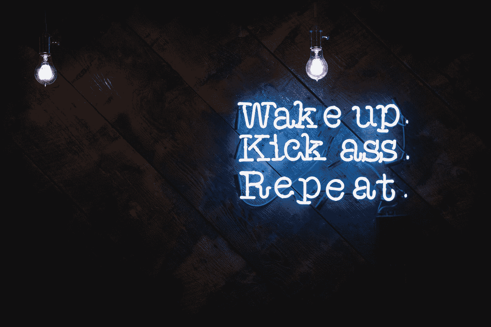
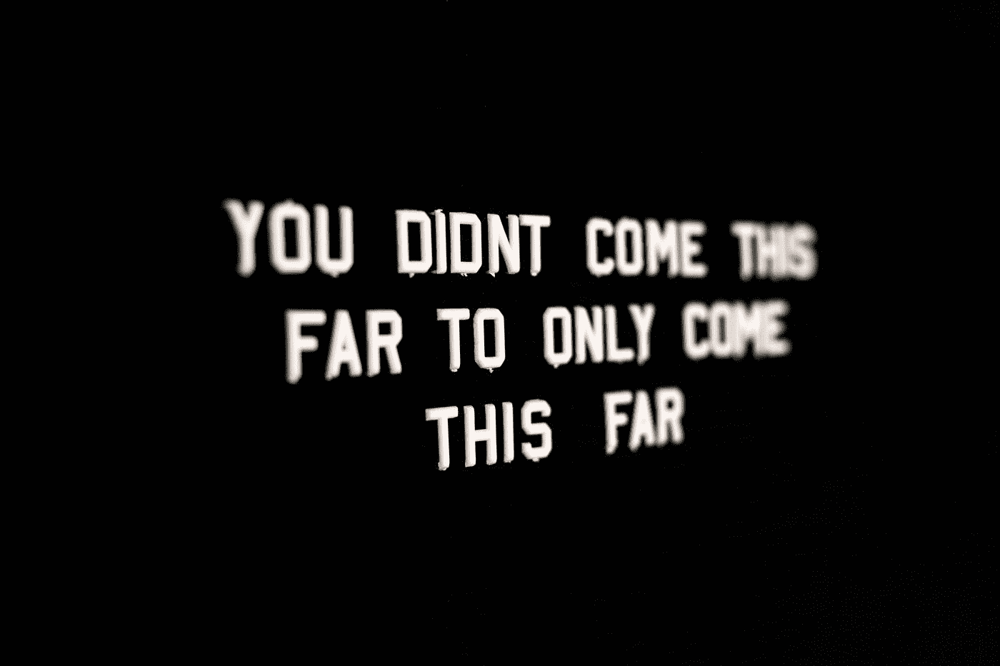
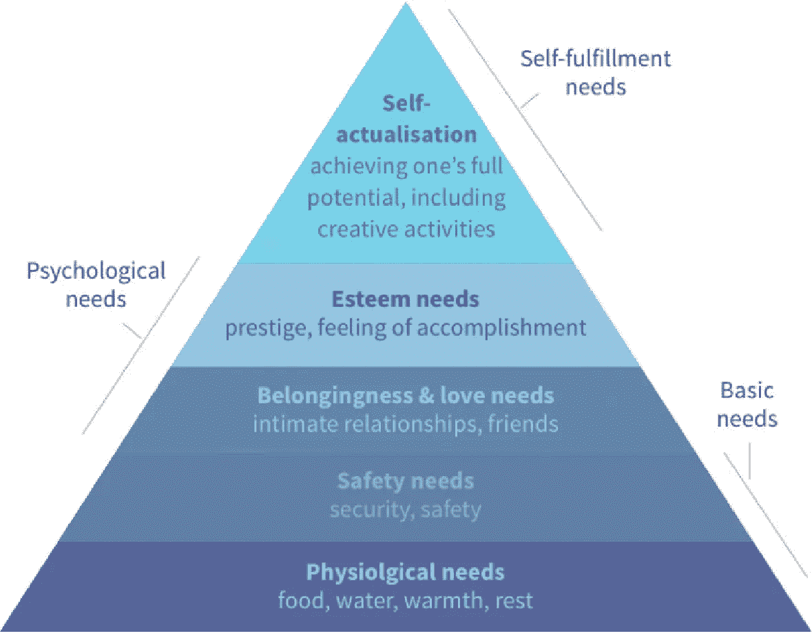

# 如何激励你的团队

> 原文：<https://betterprogramming.pub/how-to-motivate-your-team-8f306407749d>

## 了解心理学教我们如何激励我们的团队

贾斯汀·维内玛在 [Unsplash](https://unsplash.com?utm_source=medium&utm_medium=referral) 上的照片。

在这篇文章中，我们将探讨两个关于动机的心理学理论。更具体地说，我们将探讨工作场所的动机。在探索这些理论时，我们将把它们分解成各自的组成部分，以帮助我们理解它们，然后提出一个可行的计划，说明如何应用它们来帮助您的团队实现目标。

# 为什么要关注动机理论？

有动力的团队更有可能实现他们的目标和交付成果。有上进心的人有成功的动力，更积极主动，并把热情传播给周围的每个人。

> “能力就是你有能力做什么。动机决定你做什么。态度决定了你做得有多好。”—路易斯·卢·霍尔茨

没有动力的团队只是缺乏坚持到底的决心，并且经常寻求改变。

作为高级领导、经理或简单的团队成员，我们的工作是帮助我们的组织、部门和团队实现并超越他们的目标。要做到这一点，我们不能仅仅关注我们的交付成果。我们也必须关注其他人的利益。有什么比确保每个人都有适当的动力更好的方法呢？

照片由[在](https://unsplash.com/@drew_beamer?utm_source=medium&utm_medium=referral) [Unsplash](https://unsplash.com?utm_source=medium&utm_medium=referral) 上绘制的 Beamer 。

# 关于动机，心理学告诉了我们什么？

我们今天将探讨的两个心理学理论有助于确保我们的团队得到适当的激励:

1.  马斯洛的需求层次理论
2.  赫尔茨贝格的动机-保健理论

这两种理论都经受住了时间的考验，今天被公认为工作场所激励的基础。

## 马斯洛的需求层次理论

这个理论是由亚伯拉罕·马斯洛在 1943 年首次提出的，随后得到了进一步的发展和完善。这是一种人类内在行为动机的理论，通常被形象化为五层多彩金字塔。

马斯洛的需求层次，如[维基](https://upload.wikimedia.org/wikipedia/commons/8/88/Maslow%27s_Hierarchy_of_Needs.jpg)所示。

你可能已经从上面的图片中推断出，马斯洛的需求层次理论表明，一个人要想在金字塔上向上移动一级，他们需要成功地达到他们已经达到的水平。然而，人们普遍认为，一个人可以在完全达到现有水平之前开始下一个水平的工作。

任何寻求提高动机的领导者的目标都是帮助他们的团队成员实现自我实现，然后让他们为*元动机而奋斗。*这是马斯洛创造的另一个术语，用来形容那些已经自我实现并努力不断进步的人。

作为团队成员，可以做很多事情来帮助人们达到自我实现阶段。对于金字塔的每个阶段，工作都扮演着重要的角色。随着人们把越来越多的时间花在工作上，满足工作之外的一些需求变得越来越困难。

例如，如果人们感到紧张，长时间长时间工作，那么他们的生理需求可能得不到充分满足。确保人们有足够的休息时间来照顾自己是一个容易的目标。

当考虑*安全需求*时，人们很容易想象敌对的工作环境不会让人感到很受欢迎。为了确保人们能够达到其需求层次的下一个层次并走向自我实现，营造一个平等和安全的环境非常重要。

只有当人们感到安全时，他们才能开始与其他团队成员建立牢固的友谊和良好的工作关系。这增强了他们的归属感，帮助他们感觉自己是组织的一部分。

最后，具备以上所有条件可以让人们为他们的尊重需求而奋斗。也就是说，他们可以通过他们的工作产品来寻找声望和成就感。有了这些，一个人可以走向自我实现，并感到比以往任何时候都更有动力。

## **赫尔茨贝格的动机-保健理论**

赫尔茨贝格的动机-保健理论明确地审视了工作场所，并认为存在引起工作满意度的特定关键因素和引起工作不满意度的独立因素。换句话说，在工作场所，满意的对立面不是不满意。

心理学家弗雷德里克·赫茨伯格的工作基于马斯洛的需求层次理论。在某种程度上，他的发现也支持马斯洛的工作。在他的研究中，他发现人们的动力来自于责任、认可、成就和进步。注意:他的研究是基于会计师和工程师，人们可能会认为他们可能已经掌握了马斯洛金字塔的较低层次。

从本质上说，该理论认为有两个因素在发挥 **:**

1.  激励因素
2.  卫生因素

激励因素包括认可、富有挑战性的工作、个人成长、责任感和重要感。

卫生因素包括工作保障、工资、工作条件和地位。

观察这两个独立的因素，我们可以尝试推导出工作中的整体表现。

1.  高动力+高卫生意味着快乐、有动力的员工。
2.  高动力+低卫生意味着有动力的员工会产生挫折感。
3.  低动力+高卫生意味着员工没有动力，但乐于留在那里。
4.  低动力+低卫生意味着员工对他们的工作条件既没有动力也不太满意。

有了以上的想法，你就可以了解他们团队的感受，并想出一个补救计划来确保他们有足够的动力和满足感*。*

这可能是因为团队需要解决更难的问题，或者拼图中更大的部分，以获得更好的整体情况或工作保障。无论潜在的问题是什么，如果能够解决，团队一定会表现得更好。

如果你觉得这篇文章有趣或有帮助，你可能也想看看这些:

 [## 完美会拖你的后腿。来说说怎么挣脱吧

### 不雅的解决方案有时是好的！

medium.com](https://medium.com/better-programming/perfection-is-holding-you-back-lets-talk-about-how-to-break-free-1fcb86b9ff85)  [## 迪士尼英雄如何帮助我解决问题

### 学会使用迪士尼方法解决问题

medium.com](https://medium.com/better-programming/how-disney-heroes-help-me-solve-problems-bc4d3e230bfb)  [## 时间管理和优先级排序的三种技巧

### 学习如何有效管理你的时间以获得职业成功

medium.com](https://medium.com/better-programming/three-techniques-for-time-management-and-prioritization-9df6dffe2ff1)