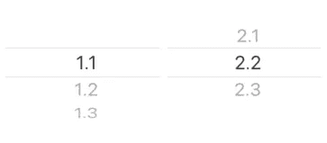

# 在 SwiftUI 中创建多段选择器

> 原文：<https://betterprogramming.pub/how-to-multi-segment-picker-in-swiftui-9c5b909971f5>

## 如何在你的用户界面中选择多个东西

迈克尔·拉罗萨在 [Unsplash](https://unsplash.com?utm_source=medium&utm_medium=referral) 上的照片。

离开 SwiftUI 内容几周后，我回来了！在这篇文章中，我们将讨论如何创建一个多段选择器。这对于选择持续时间(例如一天、四周等等。)，这是我的用例。这是最终产品:

作者照片。

让我们首先在 SwiftUI 中定义一个简单的单段选择器:

作者照片。

让我们快速回顾一下:

1.  SwiftUI 选取器需要某种类型的`data`(即选取器值是什么)。它还需要一个`state`或一个`binding`来通知当前选择的值。
2.  SwiftUI 使得声明提货人[相对容易](https://developer.apple.com/documentation/swiftui/picker)。第一个参数是选取器的标签，第二个(`selection`)是当前选择的绑定。最后一个参数是创建一系列视图的闭包。每个视图都是一个可选值。
3.  在选择器中，我们用`ForEach`创建了一系列视图。注意，我们不是迭代`data`本身，而是迭代索引。只要`ForEach`中的项目数量不变，这就没问题。如果是，考虑将`data`中的项目与`Identifiable`中的项目相一致。
4.  我们使用`Text`显示该值，并给它一个索引的`tag`值。这意味着每个`Text`实例都与数组中的索引相关联。这与 SwiftUI 的`selection`参数一起决定将哪个项目显示为当前选择。

# 创建多个段

这是非常标准的，但是我们如何开始为选取器定义多个段呢？在我看来，首先从视图模型开始总是好的。这样，我们可以清楚地描述传入数据的样子，并相应地创建我们的视图:

我们的视图模型只有一个属性`segments`，它是一个元组数组。每个元组表示选取器中的一个段。每个元组由以下部分组成:

1.  一个`String`标签。
2.  对选择的绑定。在这种情况下，我们使用选择索引作为整数，但是您可以通过更改类型别名来使用您认为合适的任何绑定。
3.  特定段的值数组。我们已经将它们定义为类型`String`，但是同样，类型别名可以用于您的用例。

现在我们可以定义视图:

作者照片。

不错！这正是我们想要的。让我们看看风景。注意，我们使用`HStack`声明了一个水平排列的拣选器集合:

1.  为了能够定义多个段，我们必须相应地调整每个选取器的大小。`GeometryReader`给出了父视图的大小。然后我们可以用它来相应地框住每一个`Picker`。
2.  如上所述，为了让我们以水平方式布置拣选器，我们使用了`HStack`。
3.  我们迭代不同的选择器片段，并使用`ForEach`为每个片段定义一个选择器。请注意，每个单个选取器的定义与我们最初的单段选取器示例相同。
4.  我们使用`.frame(...)`将每个拣选器调整到合适的宽度，即父宽度除以拣选器的数量。
5.  使用`.clipped()`是这里的关键。如果我们不使用修改器，你会看到选择器的线条会重叠。`clipped()`将确保每个拾取器不会超出每个视图的边界。

这就对了:SwiftUI 中的多段选择器。访问 [GitHub playground](https://gist.github.com/frankfka/704645201f384d93afefc9385b2eed81) 获得多段拾取器的所有代码。