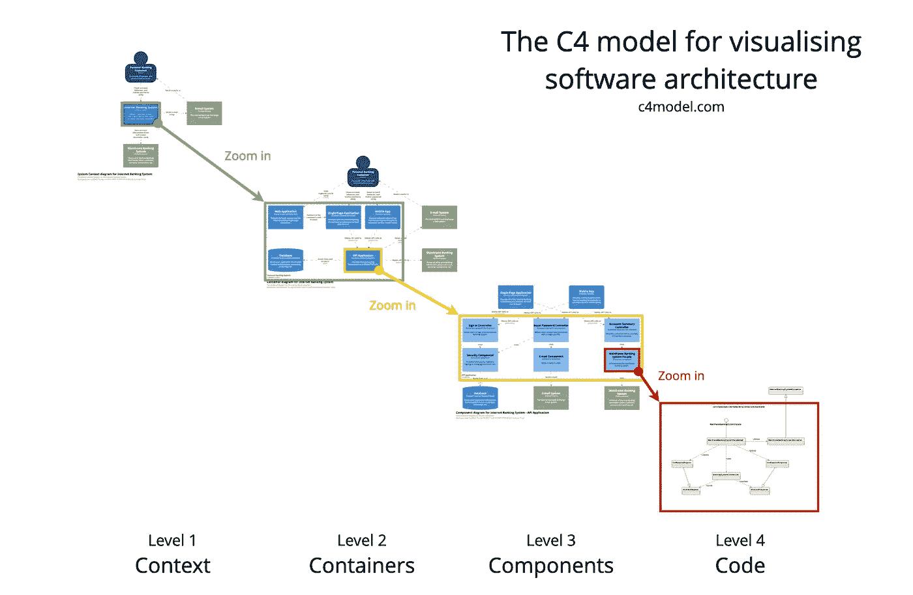

# 如何适应软件开发人员的新工作

> 原文：<https://betterprogramming.pub/how-to-navigate-a-new-job-as-a-software-developer-fd4ac2e4154b>

## 新工作，新团队，新代码库。下面是如何发光！

安妮·斯普拉特在 [Unsplash](https://unsplash.com?utm_source=medium&utm_medium=referral) 上拍摄的照片。

加入一家新公司总是给人一种满足感和兴奋感。最初的几天包括了解公司文化、流程、强制性培训、设备安装以及所有与假期和服务请求相关的典型事情。

然后是团队层面的入职培训，在这里你可以了解你将要从事的产品。这些会议通常包括产品入门、工程入门、使用的不同工具和访问这些工具，以及了解团队的工作方式(WoW)。

作为一名开发人员，访问代码库并立即开始导航是很诱人的。但是作为新人，你的关注点要广。在代码级别实现或更改任何东西之前，有几件事情您应该试着弄清楚。

在这篇文章中，我将尝试从产品和技术角度解释我理解该系统的过程。在几家公司工作过之后，我多次这样做过。每一次，它都变得更容易，并帮助我更快地加入，更好地做出贡献。

# 查看文档

来源:[多像素](https://www.manypixels.co/gallery)

首先，您应该尝试弄清楚您的团队正在使用的所有工具，以记录设计决策、高级架构、服务级别架构、领域知识等。总是试图找出信息的真实来源，因为它可以驻留在多种工具中，只需微小的改变。

开始在你的书签中创建文件夹，并根据类别存储所有相关链接。一旦你能够创建一个心理地图，当你有疑问的时候，你应该很容易找到去哪里找东西。

## 产品文档

接下来，您有两个选择:您可以开始浏览产品文档或技术文档。我更喜欢从产品入手，原因有二:

*   它让我从用户的角度对产品有了更广泛的理解。了解产品的特性和功能有助于我描绘出可能的用户流。
*   它帮助我收集领域知识和领域中所有移动的组件。客户端、集成、第三方依赖等。

## 高级技术文档

之后，您就可以开始研究这些组件的技术文档了。使用 [C4 模型方法](https://c4model.com/)。这是一个相当简单的模型，可以帮助你以更小的块来理解系统。高层理解包括一级和二级。

来源:[C4 模式](https://c4model.com/)

## 组件级技术文档

之后，您可以深入研究各个组件。理解组件的职责、输入和输出、数据库中的表格等。例如，如果是处理所有事务的服务，您需要了解:

*   谁是服务的消费者。
*   此服务的依赖项。
*   它每天处理的请求数。
*   是读负载重还是写负载重？
*   使用的数据库。
*   幂等重要吗？
*   它使用缓存吗？如果是，针对哪个用例？
*   等等。

询问有关技术堆栈和设计决策的问题。如果系统使用事件驱动架构，试着找出原因。如果服务使用 Spring Boot 与科特林，尝试找出原因。

一开始，你的目标应该是理解设计和决策。一旦您了解了设计理念，当您开始研究代码库时，就更容易理解实现细节。采取自上而下的方法有助于你对系统进行推理。

# 挑选第一个任务

来源:[多像素](https://www.manypixels.co/gallery)

收集了所有相关信息后，你将最终开始工作。这是您选择跨多个组件的任务的最佳时机。总是试着挑选需要改变不同组件的较小的任务。不要一开始就坚持使用一个组件/服务，选择不需要深入的代码库知识的任务。

作为一个新人，你所要做的就是确保你浏览了你的团队处理的组件的代码库。这将取决于团队的规模和组件的数量，但以 2-3 个组件为目标应该是合理的。

在处理任务时，确保关注存储库中的代码结构、使用的工具和库、单个端点的流程、使用的设计模式、错误处理、配置文件、如何配置机密、如何部署应用程序等。这里，您还需要应用自顶向下的方法——从目录级别到深入到单个类或存储库实现。

不要急于完成手头的任务。作为一个新人，你会被诱惑越快越好，但那是不健康的。慢慢来，理解代码。试试看能不能重构一些代码。看看能不能增加测试覆盖率。应用[童子军原则](https://www.informit.com/articles/article.aspx?p=1235624&seqNum=6)。

这将帮助你获得更多的背景知识。而且对你的期望也不会太高，所以即使晚一天完成任务，也不会有麻烦。

# 定期补课

来源:[多像素](https://www.manypixels.co/gallery)

第一周结束后，立即与个别团队成员进行一对一会谈。您可以根据您的团队规模和您可能召开的其他会议，将频率设置为两周一次或每周一次。这将确保你有一个持续的反馈。这有助于你与团队建立良好的关系，创造信任和友好的氛围，反过来，也增强了你的自信。

你可以安排 30 分钟的会议，讨论一些事情，比如你正在做的任务，你如何实现它们，你面临的任何瓶颈，你可能有改进的想法，等等。讨论困扰你的事情，提供反馈，寻求反馈，或者只是谈论其他与工作无关的事情。

在家工作使得定期与团队成员保持联系变得更加重要。

# 成为一名团队成员

来源:[多像素](https://www.manypixels.co/gallery)

在那里工作几周后，你会开始意识到需要改变的事情。如果你认为团队可以少开一两次会，那就提出建议。这将是你发挥影响力的机会。

这需要围绕问题及其短期和长期影响收集数据，并给出潜在的解决方案。没有一个团队是完美的，如果你驾驶哪怕是很小的改变，都会让你脱颖而出。毕竟对人来说重要的是结果。

例如，引入新的工具来提高团队成员的生产力。在我工作过的一个团队中，我们的产品经理为文档引入了[概念](https://www.notion.so)。在用了一个月后，团队中的每个人都心存感激。

你有很多这样的机会。不要把注意力完全集中在技术任务和收尾问题上。毕竟这是你的团队，成为团队成员大有帮助！

# 主动沟通

来源:[多像素](https://www.manypixels.co/gallery)

在我看来，这是最重要的品质之一。始终积极主动地沟通任何问题。如果你被困在一项任务中，找不到前进的方向，不要犹豫，在站立会议或任何其他定期的团队会议上提出来。永远要清楚你面临的瓶颈和障碍，并寻求帮助。

团队也能很好地了解正在发生的事情。团队中的每个人都在忙于一些事情，他们可能不知道你是否面临任何问题。你有责任让每个人都注意到这一点。如果您的团队喜欢，您也可以通过向相关团队发送消息或电子邮件来被动地做到这一点。目标是让每个人都参与进来。

不要犹豫！

# 结束语

一开始，你不应该觉得有必要了解所有的事情。一个工程师需要 2-3 个月的时间才能完全融入团队，并成为团队的一个经常性贡献者。最初的几个月是至关重要的，你应该尽量利用它。

## TL；速度三角形定位法(dead reckoning)

找到一份新工作可能会很棘手，为了做到最好并给人留下好印象，你应该关注以下几个方面:

*   审查文档:从产品文档到工程文档。阐明业务流程和使用的组件。
*   挑选第一个任务:关注知识的广度。选择一个跨组件的较小的任务。
*   定期交流:定期与团队成员进行一对一的交流，与团队建立良好的关系。
*   成为团队成员:努力想出能提高团队生产力的事情。利用你以前的经验向团队提出新的建议。
*   主动沟通:有疑问时，提出问题。如果你被卡住了，那就主动和团队沟通。

感谢阅读！