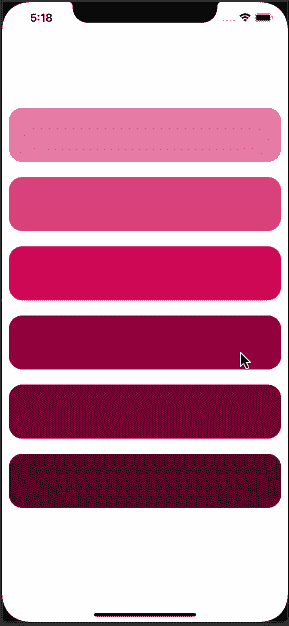
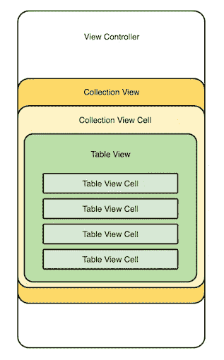
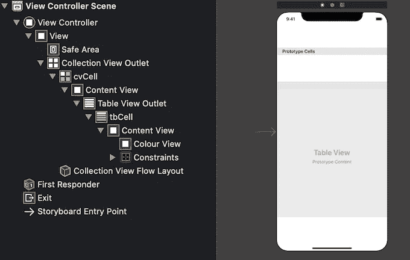
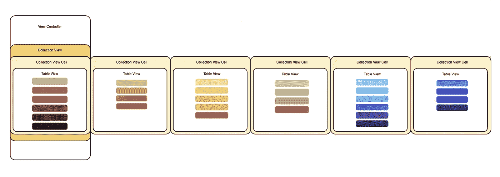
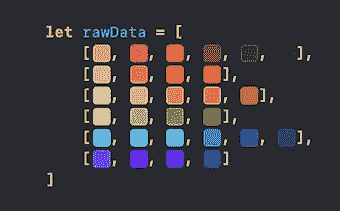

# 如何在类似 Trello 的 UICollectionViewCell 中嵌套 UITableView

> 原文：<https://betterprogramming.pub/how-to-nest-a-uitableview-inside-a-uicollectionviewcell-like-trello-eeec0ea6f097>

## 制作一个 Trello board 样式的 CollectionView，并将数据传递给 CollectionView 中嵌入的 TableView

照片由[克里斯蒂娜@ wocintechchat.com](https://unsplash.com/@wocintechchat?utm_source=medium&utm_medium=referral)在 [Unsplash](https://unsplash.com?utm_source=medium&utm_medium=referral) 上拍摄。

受 Trello 的启发，我尝试制作一个 Trello board 风格的`CollectionView`，在不同的`CollectionView`单元格中呈现不同的数据集。下面的演示展示了最终结果:

# 设置视图

我认为用一个例子会更容易理解视图的层次关系:

1.  我在`ViewController`里设置了一个`CollectionView`。由于`ViewController`持有`CollectionView`，应该设置为`UICollectionView`的代理和数据源。
2.  然后我给`CollectionView`添加一个`CollectionView Cell`原型。将`CollectionView Cell`原型的宽度调整为与`CollectionView`的宽度相同。
3.  一个`TableView`嵌入在`CollectionView Cell`原型中。`CollectionView Cell`应该是`UITableView`的代理和数据源。

视图层次结构

## 视图控制器

作为`CollectionView`的代理和数据源，`ViewController`必须符合`UICollectionViewDelegate`、`UICollectionViewDataSource`和`UICollectionViewDelegateFlowLayout`协议。

`collectionView(_:numberOfItemsInSection:)`和`collectionView(_:cellForItemAt:)`功能必须在`ViewController`中实现。

在`collectionView(_:cellForItemAt:)`函数中，有一个`UICollectionViewCell`的实例方法叫做`updateCellWith(row:)`。这是为传递数据而定制的扩展函数。我会在显示数据部分解释。

## CollectionViewCell

作为`UITableView`的代理和数据源，`CollectionViewCell`必须符合`UITableViewDataSource`和`UITableViewDelegate` 协议。

这里必须实现`tableView(_:numberOfRowsInSection:)`和`tableView(_:cellForRowAt:)`功能。

在这个例子中，我使用一个原型单元格来显示数据。如果您从`nib`创建一个定制的`tableView`单元格，它应该在`CollectionView Cell`中注册。

# 显示数据

整个数据首先被载入`ViewController`。每个`CollectionView`单元上显示的数据集由`indexPath.row`检索并传递给`collectionViewCell`。

当`collectionViewCell`接收到一组数据时，嵌入其中的`tableView`也可以用`indexPath.row`检索数据，然后在`tableView`单元格上显示数据。

## 视图控制器

在这个例子中，原始数据是静态存储在`ViewController`中的`UIColor`的六个数组。您可以用从数据库中动态加载的数据来替换它。

我扩展了`UICollectionViewCell`类，并为其添加了一个名为`updateCellWith(row:)`的自定义函数，以帮助将一组`UIColor`从`ViewController`传递到`CollectionViewCell`，这样我就可以进一步显示`tableView`单元格上的每种颜色。

在`collectionView(_:cellForItemAt:)`中，用`indexPath.row`检索当前`CollectionView Cell`上应该显示的`UIColor`的数组。

调用`updateCellWith(row: )`将数据数组传递给`CollectionViewCell`并存储在`var dataArray`中:

## CollectionViewCell

在`CollectionViewCell`中有一个名为`dataArray`的变量。在`ViewController`传递数据给它之后，它就不再是零了。然后可以在`tableView(_:cellForRowAt:)`中读取，该数组中的每种颜色可以显示在`tableView`单元上:

如果你想用`UIPageViewController`达到同样的效果，这里有另一篇文章你可能会喜欢:

## **【Swift】用 UIPageViewController 制作日志般的无限滚动视图**

 [## [Swift]用 UIPageViewController 制作日志般的无限滚动视图

### 无限地向前和向后滚动视图，并像日志一样相应地显示数据

medium.com](https://medium.com/geekculture/swift-make-a-journal-like-infinite-scrolling-view-with-uipageviewcontroller-6ffe2b0d06df) 

# 参考

 [## 特定 UICollectionViewCell 内部的 TableView？

### 感谢贡献一个堆栈溢出的答案！请务必回答问题。提供详细信息并分享…

stackoverflow.com](https://stackoverflow.com/questions/43231937/tableview-inside-specific-uicollectionviewcell-programmatically)  [## 集合视图中的表格视图

### 感谢贡献一个堆栈溢出的答案！请务必回答问题。提供详细信息并分享…

stackoverflow.com](https://stackoverflow.com/questions/50679338/table-view-inside-of-a-collection-view/50679533)  [## 如何在 UICollectionViewCell 中显示 UITableView

### 我是一名新的 Swift 程序员，目前正在开发一个非常简单的待办事项应用程序。问题是我…

stackoverflow.com](https://stackoverflow.com/questions/45767502/how-do-i-show-a-uitableview-within-a-uicollectionviewcell)  [## 如何使用 Swift | John Codeos 在 UITableViewCell 内添加 UICollectionView

### 今天，我将向您展示如何在 UITableView 中添加 UICollectionView。在本例中，我们有类别，并且…

johncodeos.com](https://johncodeos.com/how-to-add-uicollectionview-inside-uitableviewcell-using-swift/)