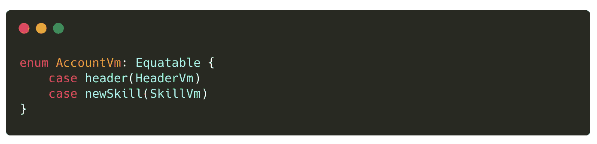
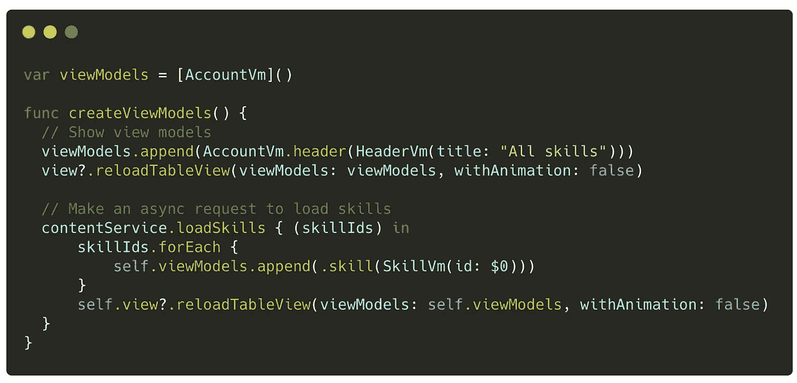
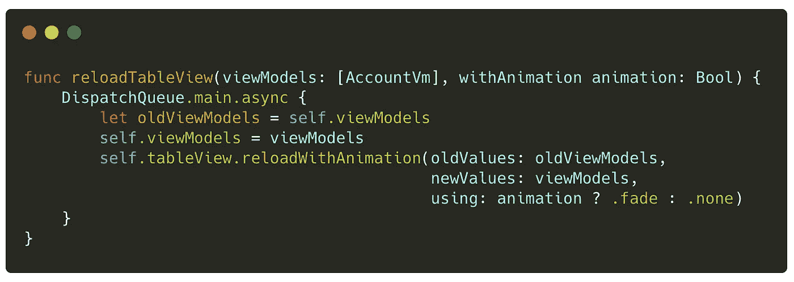
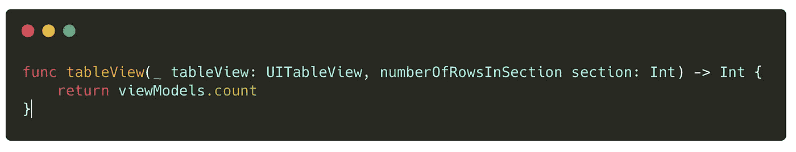
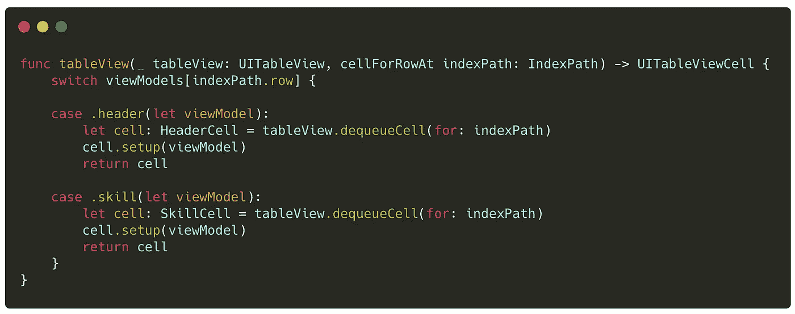
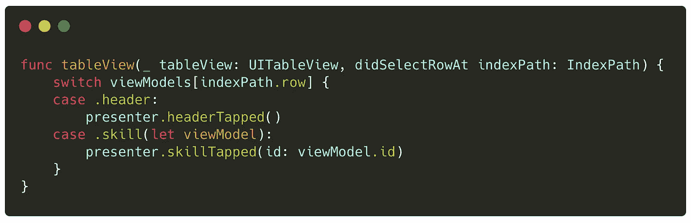

# 如何再也不用跟踪 UITableView 的索引路径

> 原文：<https://betterprogramming.pub/how-to-never-have-to-track-a-uitableviews-indexpath-ever-again-a727be52003a>

## 索引超出范围，不再有


照片由[思想目录](https://unsplash.com/photos/YSZS_nDU8js?utm_source=unsplash&utm_medium=referral&utm_content=creditCopyText)在 [Unsplash](https://unsplash.com/) 上拍摄

有多少次您不得不处理手动跟踪 UITableView 的索引路径的麻烦？或者，你以前调试过多少次？

```
Invalid update: invalid number of rows in section...
```

如果有一种方法可以解决这个问题呢？

# 引入视图模型驱动的 UITableViews

每个 UITableViewCell 都有自己的等价视图模型，在设置时传递给它。下面是一个简单的标题单元格示例，它接受一个包含标题的标签并将其设置在单元格上。

```
Helpful tip: The view model's equatable function doesn't need to be implemented if all the properties in the struct are Equatable.
```


一个 UITableViewCell，它接受一个相等的视图模型结构并设置它

当我们构建一个要在屏幕上显示的视图模型列表时，我们可能想要支持不止一种类型。在这种情况下，我们可以利用带有关联值的枚举。

在这个例子中，我有两个想要显示的单元格。因此，我用两个枚举来表示每个单元格。相关联的值包含等价的视图模型。



表示将在 UITableView 中显示的每个单元格的等价枚举

然后，如果我们使用 MVC，我们可以从我们的控制器创建视图模型，如果我们使用 MVP，我们可以从 presenter 创建视图模型。显然，这将根据您的应用程序的架构而有所不同。在我们的例子中，我们从 presenter 调用 UIViewController 上的一个函数，以便在数据加载后向它提供数据。



创建和设置视图的视图模型的函数

然后我们需要实现 reloadTableView(..)功能。这将获取当前视图模型的快照，将其更新为新的视图模型，并调用我们通过 UITableView 上的扩展添加的函数。



UIViewController 上的 Reload 函数来重新加载 UI。

可以使用以下文件将 tableView 上调用的 reloadWithAnimation 函数添加到您的项目中:

[](https://github.com/aduuub/uitableviewdataflowtutorial/blob/master/Extensions/UITableView%2BReload.swift) [## aduub/uitableviewdataflow 教程

github.com](https://github.com/aduuub/uitableviewdataflowtutorial/blob/master/Extensions/UITableView%2BReload.swift) 

您不需要理解扩展的工作方式，但是它本质上区分了当前快照和新视图模型之间的差异，然后适当地插入、更新和重新加载视图。

# 实现 UITableViewDataSource

对于部分中的行数，我们可以简单地返回数组中视图模型的数量。



numberOfRowsInSection 的 UITableViewDataSource 实现

现在，当我们将单元格出队时，我们不需要担心它是用于什么索引，因为它完全是由视图模型驱动的。我们还防止了会默认返回空的 UITableViewCell 的意外失败。注意，dequeueCell 函数是一个定制的扩展，您可以在这里将它添加到您的项目[中。或者，可以使用标准的 tableView dequeueCell。](https://github.com/aduuub/uitableviewdataflowtutorial/blob/master/Extensions/UITableView%2BExtensions.swift)



cellForRowAt 的 UITableViewDataSource 实现

至于处理点击事件，我们可以很容易地根据选择的 IndexPath 进行切换，以确定相应的视图模型。



didSelectRowAt 的 UITableViewDelegate 实现

# 多个部分

轻松点。您所需要做的就是使视图模型阵列 2D。第一个数组表示节，内部数组表示节中的行。reloadTableViewWithAnimation 有两个支持这两种方法的实现。

# 演示

下面的例子来自我最近创建的一个学习驾驶的应用程序。我只是将项目从一个部分移动到另一个部分，或者完全删除它。这使用了本文中演示的 RowAnimation.fade 和自定义删除逻辑。


从视图模型中删除项目

# 想看看这个项目吗？

你可以在下面的我的 Github 上查看这个项目的所有代码。

[](https://github.com/aduuub/uitableviewdataflowtutorial) [## aduub/uitableviewdataflow 教程

### 有多少次你不得不处理手动跟踪 UITableView 的索引路径的麻烦？或者有一个…

github.com](https://github.com/aduuub/uitableviewdataflowtutorial)