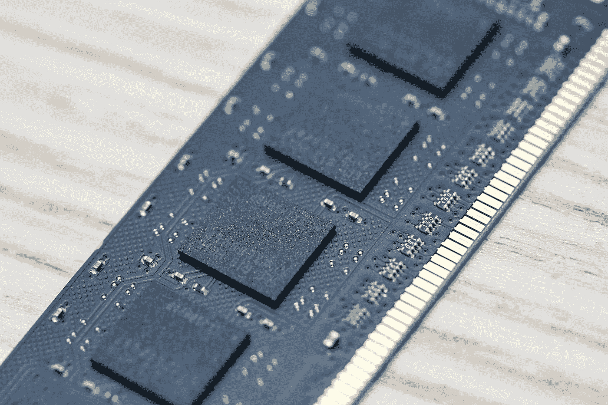
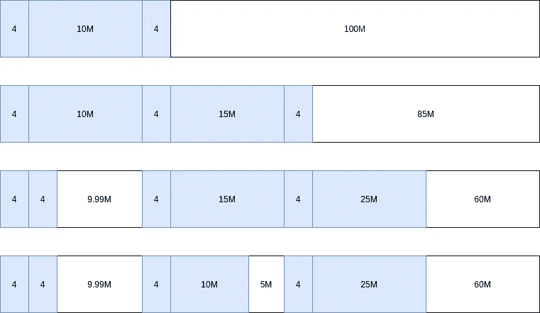

# 如何在使用 C++ STL 容器时不产生内存碎片

> 原文：<https://betterprogramming.pub/how-to-not-fragment-memory-when-using-c-stl-containers-b634adb76dc1>

## 为什么 STL 容器会造成内存碎片，如何避免



杰里米·贝赞格在 [Unsplash](https://unsplash.com?utm_source=medium&utm_medium=referral) 上拍摄的照片

# STL 容器如何分配内存——块和组块

STL 容器提供了各种数据结构，我们在用 C++编码时可以方便地使用这些结构。有三种类型的容器:

*   序列容器
*   关联容器
*   无序关联容器

序列容器是可以顺序访问的容器，而关联容器是那些以键值对或仅键的形式存在的容器。

*   有序:实现为自平衡树
*   无序:实现为哈希表

在内部，除了`std::array`之外的所有容器都动态分配内存来存储我们的数据。`std::array`只是一个类 C 数组的包装器，它将我们的数据存储在适当的位置。在本文中，我们关注的是 STL 容器，而不是动态分配内存的`std::array`。

## 分配器类

当我们构造一个像`std::vector`这样的容器时，有两个模板参数可以设置。

*   元素类型
*   用于分配/释放内存和构造/销毁对象的分配器

在大多数情况下，我们省略了第二个参数，默认使用`std::allocator`。STL 容器为我们提供了使用任何我们想要使用的分配器的灵活性，只要它满足分配器的[需求](https://en.cppreference.com/w/cpp/named_req/Allocator)。

现在，让我们编写一个分配器，它遵循调试目的的要求(详见链接页面),以理解不同容器的行为。

## `std::vector`

下面的代码展示了我们如何使用分配器并向我们的`std::vector`添加三个元素。

引擎盖下发生的事情如下:

*   在第 5 行`std::vector`请求分配 1 个 int
*   在第 6 行`std::vector`请求分配 2 个 int 和释放 1 个 int
    注意，我们在这里分配了一个新块并释放了旧块。
*   在第 7 行`std::vector`请求分配 4 个整数并解除分配 2 个整数
*   在第 10 行`std::vector`超出了作用域并释放了 4 个整数

我们的代码将打印以下内容:

```
Allocating: 1 elements
Allocating: 2 elements
Deallocating: 1 elements
Allocating: 4 elements
Deallocating: 2 elements
Deallocating: 4 elements
```

我们没有在分配器中打印对象的构造和销毁，因为我们想把重点放在分配和释放上。但是，发生的情况是，对于每个元素，两个函数都将被调用，例如，在为四个元素分配内存之后，构造函数将被调用四次。

现在我们证明`std::vector`每次达到它可以存储的最大元素数量时，内存块的大小都会翻倍。这包括将对象从以前的块复制到新的块。

这就是为什么它在分配新的块之后，会释放前一个块，也就是把数据复制到新的块。

另一件有趣的事情是，`std::vector`中的`reserve()`函数会在我们添加数据之前调用我们的`allocate()`函数。

事情是这样的:

```
Allocating: 3 elements
Deallocating: 3 elements
```

好像比上一个版本好多了。在这种情况下，分配只发生一次。这就是为什么人们说如果你知道确切的尺寸，你应该在建造你的`std::vector`时预留空间。

## std::deque

双端队列在内存分配/释放方面表现不同。如果我们简单地用`std::deque`替换`std::vector`，我们会看到不同的行为。

顾名思义，使用双端队列，我们可以将数据添加到存储的前端和后端。现在，让我们看看它是如何分配内存的。

```
Allocating: 8 elements
Allocating: 128 elements
Allocating: 128 elements
Deallocating: 128 elements
Deallocating: 128 elements
Deallocating: 8 elements
```

所以，它分配了多余的空间，这是因为在内部，它通过一个`map`来存储每个块的起始地址，初始大小为`8`，并分配可以存储`128`元素的内存块。这是特定于实现的，我使用的是 GCC。

## 有序关联容器

对于有序关联容器，因为它们是作为自平衡树实现的，所以可以想象分配是针对每个节点的。如果我们检查以下代码的输出，我们会看到代码试图逐个节点地分配。

```
Allocating: 1 elements
Allocating: 1 elements
Allocating: 1 elements
Deallocating: 1 elements
Deallocating: 1 elements
Deallocating: 1 elements
```

## 无序关联容器

无序关联容器被实现为哈希表，这意味着它将使用一些内部状态来管理存储桶。

它不仅为我们的数据分配内存，还为管理内部状态(桶)分配内存。

```
Allocating: 1 elements
Allocating: 13 elements
Allocating: 1 elements
Allocating: 1 elements
Deallocating: 1 elements
Deallocating: 1 elements
Deallocating: 1 elements
Deallocating: 13 elements
```

## 为 STL 容器编写自定义分配器

现在我们知道了 STL 容器如何使用分配器，我们将讨论为什么在某些情况下我们想要为我们的应用程序编写自定义分配器，并在接下来的章节中看看我们如何实现它们。

# STL 容器如何分割内存

如果我们在 C++中分配/释放内存时不小心，我们可能会导致内存碎片。这是一种情况，其中*小内存块*在较大内存块之间分配，导致系统在请求时由于碎片而无法分配大内存块。


内存碎片(作者图片)

我已经介绍了像`std::any`这样的库在用于分配具有不同生命周期的小对象时是如何分割内存的。细节在下面的文章里。

[](/c-memory-pool-and-small-object-allocator-8f27671bd9ee) [## C++内存池和小对象分配器

### 理解在 C++中如何控制小对象的内存分配/释放以避免内存碎片

better 编程. pub](/c-memory-pool-and-small-object-allocator-8f27671bd9ee) 

STL 容器呢？哪些容器，在什么条件下会造成碎片？

## STL 容器和内存碎片

除了`std::array`之外的所有容器都会导致内存碎片。值得一提的是，`std::deque`也不太可能出现这种情况，因为它内部管理内存的方式我们在前面的章节中已经介绍过了。

对于`std::vector`来说，当我们用它来存储*小对象*的少量元素时，就会发生这种情况。当我们用它来存储许多元素时，由于它是如何分配内存的，这就不那么令人担心了(见上一节)。

对于另一些，因为它们是按对象/节点分配的，所以不管元素的数量是多少，仍然会导致内存分段。

> 当我们使用 STL 容器在整个运行期间动态添加新的小对象并保持它们足够长的时间，或者更糟的是从不删除它们时，这很可能发生。

为了进行演示，请考虑下面的代码，它每一到十秒钟添加一个新对象。

在我们应用程序的其他部分，我们分配更大的块，例如`10 MB`、`15 MB`、`25 MB`，临时用于数据处理。这意味着我们分配和释放它们。



内存碎片图解(图片由作者提供)

上图展示了在这个用例中内存是如何被分割的。这只是为了举例说明，实际上，很难预测内存会是什么样子。重要的是我们知道它可以被分割。

当您在一个整体应用程序的大型代码库上工作时，尤其如此。您无法控制应用程序的其他部分。

# 如何避免内存碎片—使用内存池

幸运的是，STL 容器为我们提供了一种方法，通过我们可以传递给 STL 容器的构造函数的分配器类来控制我们如何分配内存。

默认情况下，如果我们不指定它，我们将使用`std::allocator`。没有标准规定`std::allocator`如何分配内存。它是特定于实现的。GCC 默认使用**新分配器**，它使用`::operator new`和`::operator delete`分配和释放内存。

GCC 也提供了我们可以使用的扩展分配器，详见这个[链接](https://gcc.gnu.org/onlinedocs/libstdc++/manual/memory.html#std.util.memory.allocator)。

你可能已经从我的另一篇[文章](/c-memory-pool-and-small-object-allocator-8f27671bd9ee)中知道，要解决这个问题，我们可以使用内存池。我们可以使用 GCC 提供的内存池分配器，如`__pool_alloc`、`__mt_alloc`或`bitmap_allocator`，如果您愿意，可以通过扩展获得，但它们不是可移植的。比方说，如果你想改变编译器，你的代码将需要重写。

为了使它具有可移植性，我们可以编写我们的分配器或者使用像 Boost 这样的库。在本文中，我们将使用`Boost.Pool`。

## 使用 Boost。我们的分配者池

`Boost.Pool`提供了两种使用内存池的分配器，`boost::pool_allocator`和`boost::fast_pool_allocator`。两个类都使用了`boost::singleton_pool`，这意味着只有一个相同类型的池实例，这正是我们所需要的。

两者的区别在于它们如何使用底层池— `boost::singleton_pool`来分配内存。`boost::pool_allocator`将总是调用`ordered_malloc()`来分配连续的块，因此它适用于`std::vector`。当请求的元素只有一个时,`boost::fast_pool_allocator`将调用`malloc()`,这是其余容器分配内存的方式。这是一种更快的方法，因此得名。

> 需要注意的一点是，我们作为模板参数传递的类型的大小将决定底层池的类型。相同大小的两种类型将共享同一个池。

现在，对于`std::vector`，我们的代码将看起来像这样。

而下面是针对`std::map`，我们用的是快速池。

默认情况下，两个池都将为`32`元素分配一个初始内存块，并在整个内存块被完全使用时保持两倍的大小。

# 关键要点

*   C++没有自动垃圾收集，如果我们在使用 STL 容器时不小心，我们的代码会导致内存碎片
*   当我们使用 STL 容器存储小的、长寿命的对象时，很可能会出现内存碎片
*   STL 容器允许我们使用分配器类来控制内存分配/释放，只要它满足分配器类的要求
*   `Boost.Pool`提供使用内存池的分配器，可以防止内存碎片
*   我们是否需要使用自定义分配器取决于我们的应用程序，理解内存碎片是如何发生的以及如何避免它是很重要的