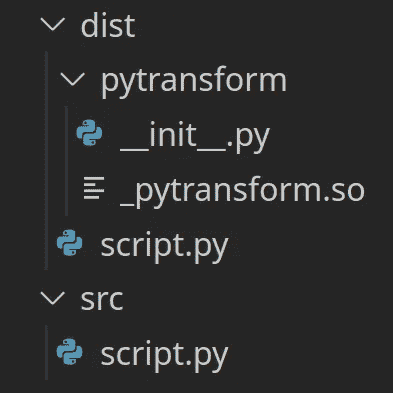

# 如何用 PyArmor 混淆 Python 脚本

> 原文：<https://betterprogramming.pub/how-to-obfuscate-python-scripts-with-pyarmor-7b7d45efaf76>

## 让你的源代码不可读


照片由[马库斯·温克勒](https://unsplash.com/@markuswinkler?utm_source=medium&utm_medium=referral)在 [Unsplash](https://unsplash.com?utm_source=medium&utm_medium=referral) 拍摄

用 Python 编写程序很棒:它们写起来很快，而且非常容易阅读。然而，有时你不希望你的软件代码如此容易理解，原因有很多，从商业秘密到加强付费墙。

分发经典 Python 程序的问题是，任何人都可以在编辑器中打开文件并阅读源代码，可能会修改你作为开发人员不想让用户接触的部分，删除应用内的付费墙，或了解你的程序如何工作。

作为一名开发人员，您可以使用代码混淆来使程序文件对人来说不可读，但对计算机来说仍然是可执行的，从而防止不希望看到的人潜入您的应用程序代码。模糊处理与加密的相似之处在于目标是相同的:隐藏消息，但加密需要解密才能使用信息，而模糊处理的代码通常可以直接运行。

# 安装 PyArmor

要使用 PyArmor，可以通过`pip`安装:

```
pip install pyarmor
```

如果您希望卸载 PyArmor，请遵循其官方文档中“[干净卸载](https://pyarmor.readthedocs.io/en/latest/installation.html#clean-uninstallation)”部分的说明。

## 使用 PyArmor 的基本混淆

让我们首先创建一个名为`script.py`的简单 Python 脚本:

使用 PyArmor 混淆 Python 脚本就像在控制台中运行以下命令一样简单:

```
pyarmor obfuscate script.py
```

这将生成一个`dist`文件夹，其中包含与原始文件同名的模糊 Python 文件以及运行时依赖项，如下面的文件夹结构所示:



文件夹结构

让我们看看输出`dist/script.py`文件中有什么:

这不是很容易让人读懂，是吗？但是您仍然可以像这样运行它:

`python3 dist/script.py`

正如您在控制台输出中看到的那样，它会工作得很好:

```
Hello World
```

## 混淆整个包

PyArmor 还允许您通过使用`--recursive`选项来混淆整个 Python 包:

```
pyarmor obfuscate --recursive --output [output path] [module init path]
pyarmor obfuscate --recursive --output dist/module src/__init__.py
```

## 更安全的混淆

如果您希望混淆源代码中包含的字符串，这可能会给出一些关于程序正在做什么的提示，您可以像这样指定`--mix-str`选项:

```
pyarmor obfuscate --mix-str script.py
```

您也可以使用`--advanced`选项指定高级模糊模式:

```
pyarmor obfuscate --advanced 1 script.py
```

高级模式`1`现在已被弃用，但在撰写本文时仍然有效。

为了获得更多保护，PyArmor 提供了“超级模式”和“超级增强模式”要使用它们，您必须在`obfuscate`命令中使用`--advanced`参数指定它，如下所示:

```
pyarmor obfuscate --advanced 2 script.py # Super Mode
pyarmor obfuscate --advanced 5 script.py # Super Plus Mode
```

不幸的是，超级模式不适用于免费试用用户。

## 添加许可证以获得更多限制

PyArmor 允许开发者通过使用`licenses`命令在混淆程序中包含许可证。许可证可以指定运行程序必须满足的某些条件，如硬盘序列号、IP 地址、日期、MAC 地址等。

例如，要生成指定到期日期的许可证，可以使用以下命令:

```
pyarmor licenses --expired [date] [license name]
pyarmor licenses --expired 2019-01-01 r001
```

为了包含许可证，您运行带有`--with-license`选项的`obfuscate`命令:

```
pyarmor obfuscate --with-license [license path] script.py
pyarmor obfuscate --with-license licenses/r001/license.lic script.py
```

如果您尝试运行一个不符合许可标准的程序，它会退出并显示以下消息:

```
License is expired
```

有关更多信息和许可选项，请查看官方文档。

## 混淆性能

代码混淆很简洁，但是它带来了轻微的运行时性能下降。模糊处理通过添加冗余和看似随机的操作，同时保持程序行为不变，从而以降低可读性为代价换取了一定的执行速度。正因为如此，通常要运行的指令比清除代码要多。

虽然几毫秒的性能下降对于小脚本来说无关紧要，但是大程序在混淆时可能会经历显著的速度差异。如果您计划混淆您的 Python 应用程序，您也应该考虑硬币的这一面。

有关性能问题以及每种模式如何影响性能的更多信息，您可以阅读[官方文档](https://pyarmor.readthedocs.io/en/latest/performance.html#the-performance-of-obfuscated-scripts)，包括一个小型基准测试。

## 分发混淆程序

您可以使用`pack`命令将混淆的 Python 文件打包成可执行文件进行分发。首先，您必须安装`pyinstaller`:

```
pip install pyinstaller
```

然后运行以下命令:

```
pyarmor pack script.py
```

在`dist`文件夹中，您将找到要分发的混淆捆绑应用程序。

# 结论

总结一下，PyArmor 允许你混淆你的 Python 源代码，让不想要的眼睛很难看到你的程序文件。虽然模糊处理并不完美，而且有可能恢复出多少有些可读性的代码版本，但它向更安全的应用程序又迈进了一步。

我希望你喜欢这篇文章。如果你有什么要补充的，请在评论中分享你的想法。感谢阅读！

如果您对另一种开发方法感兴趣，请查看下面的故事:

[](https://aws.plainenglish.io/why-i-now-develop-on-a-remote-virtual-machine-d9b340bbc200) [## 为什么我现在在远程虚拟机上开发

### 通过利用云提高您的工作效率并降低成本。

aws .平原英语. io](https://aws.plainenglish.io/why-i-now-develop-on-a-remote-virtual-machine-d9b340bbc200)