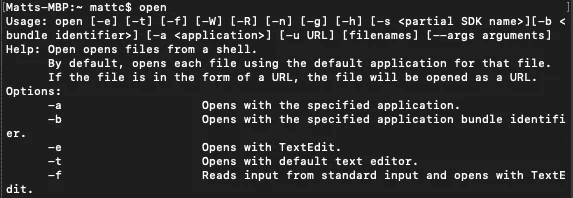
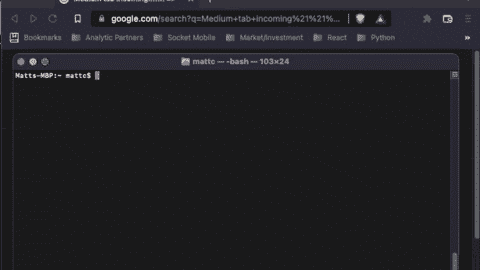

# 如何在 Mac 上从命令行打开浏览器标签

> 原文：<https://betterprogramming.pub/how-to-open-browser-tab-from-the-command-line-on-mac-52744abb4905>

## 从您的终端无缝切换到浏览器


[天一马](https://unsplash.com/@tma?utm_source=unsplash&utm_medium=referral&utm_content=creditCopyText)在 [Unsplash](https://unsplash.com/s/photos/mac?utm_source=unsplash&utm_medium=referral&utm_content=creditCopyText) 上拍照

最近，当我必须弄清楚如何从命令行打开浏览器选项卡时，我尝试了一些 bash 脚本的想法。事实证明这是相当容易做到的！

首先，如果你想简单地在你的默认浏览器中打开一个网页(不包括任何其他选项)，你可以简单地在你的终端中写下以下内容。

```
open "https://medium.com"
```

根据您的默认浏览器，中型主页应该在新的选项卡中打开。现在，如果你想让你的浏览器更具体，你可以添加一个选项。你所需要做的就是找出浏览器的名字并包含一个选项`-a`。见下文。

```
open -a Your\ Browser "https://medium.com"
```

在我们进入`Your\ Browser`部分之前，让我们看看`-a`用我们的`open`命令做了什么。就像其他命令一样，你可以简单地输入不带任何选项的命令(`-LETTER`)然后点击回车——帮助应该会弹出来。



在帮助中，它说`open -a`‘用指定的应用程序打开’。这只是告诉`open`命令期望应用程序是我们的参数打开的地方。有道理对吗？

现在，进入我们命令的下一部分:`Your\ Browser`。从技术上来说，一个更准确的占位符应该是`Your\ Application`，但是因为我们关注的是网络浏览器，所以我认为`Browser`很好，也很具体。这基本上就是你想用来打开 URL 的浏览器的名字。

例如，要在 Chrome 中打开 URL，你可以使用`google\ chrome`(不区分大小写)，因为 Chrome 的官方名称是 Google Chrome。如果你想在 Brave 中打开它，你可以使用`brave\ browser`。如果你想找出你的 Mac 上浏览器的“官方”名称，打开一个新的终端窗口(或 cd 进入你的机器的根目录)并键入以下命令。

```
root:~ > cd /System/Volumes/Data/Applications
root:~/System/Volumes/Data/Applications > ls
```

现在，当我第一次尝试这样做的时候，我试图通过`/System/Applications`，但是我找不到我的任何浏览器应用程序。显然，从 Catalina 10.15 开始，MAC 电脑使用了“分册”格式。这意味着在`/System/Applications`下是“系统”应用程序；Mac OS 中内置的应用程序。而`/System/Volumes/Data/Applications/`将存放用户安装的应用程序。

这里有一个快速的比较。下面列出了我们的“用户”应用程序。

```
Android Studio.app  RingCentral.appBrave Browser.app  Safari.appDocker.app   Slack.app ...
```

这是我们的“系统”应用程序列表。

```
App Store.app  Launchpad.app  Reminders.appAutomator.app  Mail.app  Shortcuts.app ...
```

有关这种分割卷架构的更多信息，请查看[这一](https://apple.stackexchange.com/questions/434390/how-do-i-get-access-to-applications-from-the-command-line)堆栈溢出讨论。

因此，现在我们可以看到我们的“用户”应用程序，我们可以找到我们的“官方”浏览器名称。一旦我们找到了我们的浏览器名称，你所需要做的就是在它们之间的空格前加上一个`\`(如果适用的话)。

勇敢浏览器成为`brave\ browser`，谷歌 Chrome 成为`google\ chrome`。safari…停留`safari`。

既然我们已经理解了这种格式，现在我们可以用本文前面提到的命令在我们选择的浏览器中打开一个标签。让我们试着在 Brave 中为 Medium 打开一个标签。

```
> open -a Brave\ Browser "https://medium.com"
```

让我们看看它是否有效！



现在你知道了！

或者，如果你只想打开一个空白标签，你可以运行`open -a Brave\ Browser “”`。或者，如果你不想打开一个标签页而只是打开应用程序本身，你可以写`open -a Brave\ Browser`。

[***升级您的免费 Medium 会员资格***](https://matt-croak.medium.com/membership) *并接收各种出版物上数千名作家的无限量、无广告的故事。这是一个附属链接，你的会员资格的一部分帮助我为我创造的内容获得奖励。*

*你也可以通过电子邮件* [***订阅，当我发布新内容时，你会收到通知！***](https://matt-croak.medium.com/subscribe)

谢谢你！

# 参考

[](https://apple.stackexchange.com/questions/434390/how-do-i-get-access-to-applications-from-the-command-line) [## 如何从命令行访问“/Applications ”?

### 从 Catalina (10.15)开始，macOS 使用分割卷格式，系统软件在一个锁定的卷上，并且…

apple.stackexchange.com](https://apple.stackexchange.com/questions/434390/how-do-i-get-access-to-applications-from-the-command-line)