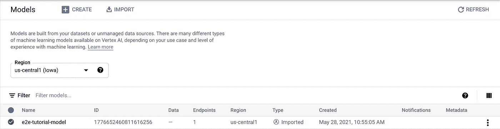
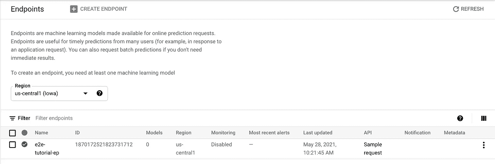
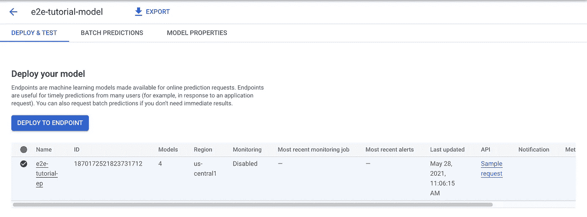
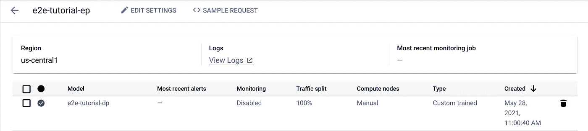
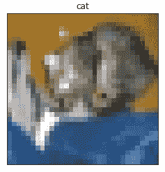
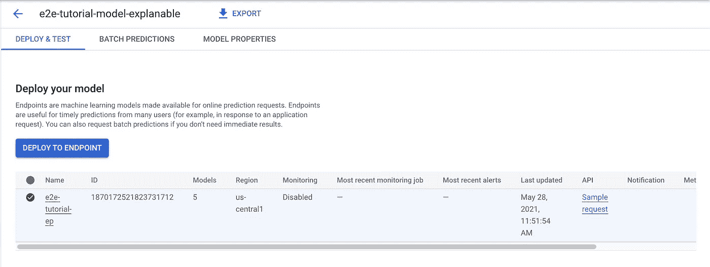
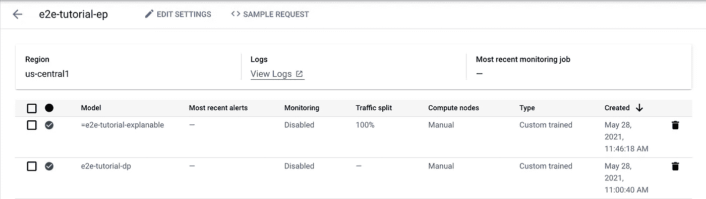
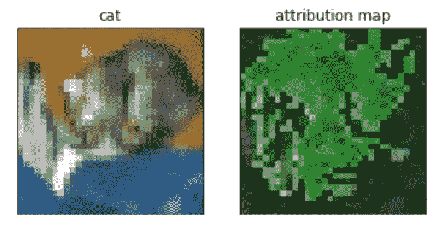

# 如何在谷歌云的顶点人工智能上操作一个模型

> 原文：<https://betterprogramming.pub/how-to-operationalize-a-model-on-google-clouds-vertex-ai-53298b530703>

## 为顶点人工智能上的模型提供服务，以产生在线预测和解释


顶点 AI(来源:[谷歌云](https://cloud.google.com/vertex-ai))

# 顶点 AI 教程系列

1.  [在谷歌云的顶点人工智能上训练模型的逐步指南](/a-step-by-step-guide-to-train-a-model-on-google-clouds-vertex-ai-47faafae1330)
2.  [在谷歌云的顶点人工智能上调整模型的逐步指南](/a-step-by-step-guide-to-tune-a-model-on-google-clouds-vertex-ai-afd2e72af595)
3.  如何在 Google Cloud 的 Vertex AI 上操作一个模型(本文)
4.  [如何在 Google Cloud 的 Vertex AI 上使用 AutoML](/how-to-use-automl-on-google-clouds-vertex-ai-27f8778239ea)
5.  [如何在 Google Cloud 的 Vertex AI 上使用 big query ML](/how-to-use-bigquery-ml-on-google-clouds-vertex-ai-23b1ca0b635)
6.  [如何在 Google Cloud 的 Vertex AI 上使用 Pipeline](/how-to-use-pipeline-on-google-clouds-vertex-ai-863b429c811f)

# 背景

这是[顶点 AI](https://cloud.google.com/vertex-ai) 教程系列的第三集。在[第一篇](/a-step-by-step-guide-to-train-a-model-on-google-clouds-vertex-ai-47faafae1330)中，我们训练了我们的第一个模型。在[第二篇](/a-step-by-step-guide-to-tune-a-model-on-google-clouds-vertex-ai-afd2e72af595)中，我们对其进行了优化。现在是时候利用它了。在本文中，我们将在 Vertex AI 上部署该模型，并查询它以进行预测和解释。

简单回顾一下，我们正在解决的问题是一个图像分类问题。该模型在 [CIFAR10](https://www.tensorflow.org/datasets/catalog/cifar10) 数据集上进行训练，该数据集包含 10 个类别的 60，000 个 32x32 图像。在之前的文章中，我们训练并导出了我们的最佳模型到 Google 云存储文件夹中。

# 模型部署

模型部署的第一步是将模型导入 Vertex AI。这听起来可能有点令人困惑。即使该模型是在 Vertex AI 上训练的，并保存到 Google 云存储中，但在我们将其作为模型资源导入之前，它还没有正式在 Vertex AI 中。使用以下命令导入模型。查看文档了解其他可用的预制集装箱图像。

```
gcloud beta ai models upload --region=us-central1 \
--display-name=e2e-tutorial-model \
--container-image-uri=us-docker.pkg.dev/vertex-ai/prediction/tf2-cpu.2-3:latest \
--artifact-uri=GCS_PATH_FOR_SAVED_MODEL
```

接下来，让我们在顶点 AI 中创建一个端点。端点将是模型的前端。

```
gcloud beta ai endpoints create --region=us-central1 \
--display-name=e2e-tutorial-ep
```

我们需要为后续命令找到模型和端点 id。最简单的方法是在 UI 上查找它们:顶点 AI ->模型和顶点 AI ->端点。



模型 ID 的视图



端点 ID 的视图

现在我们可以将模型部署到端点。

```
gcloud beta ai endpoints deploy-model ENDPOINT_ID \
--region=us-central1 --model=MODEL_ID \
--machine-type=n1-standard-2 --min-replica-count=1 \
--max-replica-count=1 --traffic-split=0=100 \
--display-name=e2e-tutorial-dp
```

这里有一些事情需要注意:首先，机器类型需要与我们用来导入模型的容器图像相匹配。例如，如果您使用 CPU 容器映像导入模型，那么您不能使用 GPU 机器类型将模型部署到端点。其次，流量分割允许您在同一端点后面的多个模型之间分配流量。在我们的示例中，我们总是将 100%的流量定向到最新的模型部署。最后，您选择的机器类型可能在该地区不可用，并且在部署模型时似乎会出现一些不稳定的问题。您可能需要迭代并重试几次。

我们可以在 UI 上检查模型是否确实部署到了端点。在模型的详细页面上，我们可以看到相关的端点。在端点的详细页面上，我们可以看到模型部署。



与模型关联的端点



端点包含的模型

# 在线预测

我们现在可以向查询预测发送实时请求。我们需要首先准备输入数据。端点需要一个 JSON 输入，其中的一个`instances`列表包含模型的输入张量。让我们从测试数据集中加载第一个测试图像和标签。

获取测试图像



测试图像

然后，我们将图像标准化，并将其写入一个`prediction_request.json`文件。

准备预测请求

最后，让我们发送预测请求。

```
gcloud beta ai endpoints predict ENDPOINT_ID \
--region=us-central1 --json-request=prediction_request.json
```

响应是模型的输出，是每个类的概率。

```
[[0.0139101977, 0.000138922522, 0.0321449339, 0.760269284, 0.000860376749, 0.132355079, 0.0505387783, 0.00525797112, 0.00383508834, 0.000689392502]]
```

我们可以看到第四个概率 0.76 最大，类名中第四个类是“猫”。因此，该模型正确地对图像进行了分类。

# 用于解释的模型部署

得到结果很好，但我们也很好奇为什么模型认为它是一只猫，更具体地说，是哪些输入区域导致了“猫”的分类 Vertex AI 支持多种归因方式。我们将使用[综合渐变](https://www.tensorflow.org/tutorials/interpretability/integrated_gradients)方法来突出显示输入图像上的“重要”区域，试图解释模型行为。

不幸的是，为了能够使用顶点 AI 解释，我们需要在模型导入期间指定解释配置。这意味着我们需要重新开始。

这里我就省略一些重复的细节了。与上面的工作流程相比，有几个地方我们需要做出改变。

首先，我们将以下解释元数据准备到解释元数据`.json`文件中。

解释元数据

`inputTensorName`和`outputTensorName`对应于模型的输入和输出层。如果你不确定你的模型，你可以用`saved_model_cli`来检查它们，它预装在 Vertex AI 笔记本上。

```
saved_model_cli show --dir GCS_PATH_FOR_SAVED_MODEL  --tag_set serve --signature_def serving_default
```

它输出以下信息。其中列出了输入和输出张量的名称。

```
The given SavedModel SignatureDef contains the following input(s):
  inputs['conv2d_input'] tensor_info:
    dtype: DT_FLOAT
    shape: (-1, 32, 32, 3)
    name: serving_default_conv2d_input:0The given SavedModel SignatureDef contains the following output(s):
  outputs['dense_1'] tensor_info:
    dtype: DT_FLOAT
    shape: (-1, 10)
    name: StatefulPartitionedCall:0Method name is: tensorflow/serving/predict
```

我们在新模型导入期间指定解释元数据。

```
gcloud beta ai models upload --region=us-central1 \
--display-name=e2e-tutorial-model-explanable \
--container-image-uri=us-docker.pkg.dev/vertex-ai/prediction/tf2-cpu.2-3:latest \
--artifact-uri=GCS_PATH_FOR_SAVED_MODEL \
--explanation-method=integrated-gradients \
--explanation-step-count=50 \
--explanation-metadata-file=explanation-metadata.json
```

然后，我们对之前创建的端点执行相同的模型部署。您可以在 UI: Vertex AI -> Models 上确认新的可解释模型与端点相关联。您还可以在 UI 上确认:Vertex AI -> Endpoints，除了我们之前附加的模型之外，该端点还附加了新的可解释模型。



新模型关联的端点



端点包含的模型

# 在线解释

现在，我们可以向新的可解释模型发送与我们发送预测请求相同的请求，并期待一个归因图像来突出输入的“重要”区域。

```
gcloud beta ai endpoints explain ENDPOINT_ID \
--region=us-central1 --json-request=prediction_request.json
```

响应包含一个`featureAttributions`结构，在其中我们可以找到 base64 编码的属性 JPEG 图像。然后我们解码并在原始图像旁边显示图像。

显示属性地图



属性地图图像

它真的能解释模型行为吗？我将让读者来判断。

# 包裹

到目前为止，我们已经在第一篇文章中构建了模型，在第二篇文章中优化了模型，并在本文中部署和使用了模型。这已经是一段很长的旅程了。但这还没有结束。推出第一个可用的模型仅仅是个开始。我们将在以后的文章中探讨我们将何去何从。