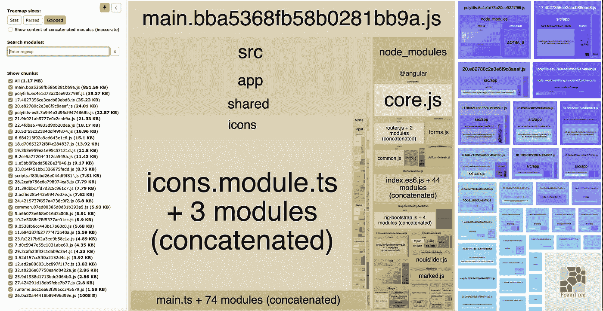
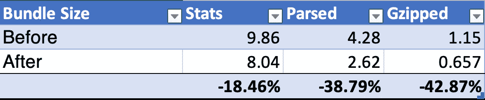
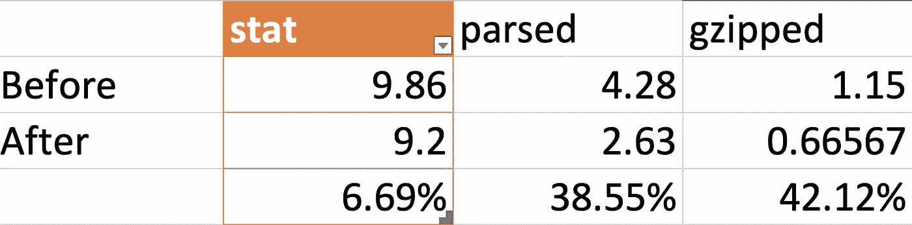

# 使用字体 Awesome 时如何优化角度束大小

> 原文：<https://betterprogramming.pub/how-to-optimise-angular-bundle-size-if-you-use-font-awesome-ef774f629c35>

## 有两种方法可以让你的包裹体积缩小两倍

照片由 [Balázs Kétyi](https://unsplash.com/@balazsketyi?utm_source=unsplash&utm_medium=referral&utm_content=creditCopyText) 在 [Unsplash](https://unsplash.com/s/photos/icons?utm_source=unsplash&utm_medium=referral&utm_content=creditCopyText) 上拍摄

**TL；** : `addIconPacks`博士不好。这将花费你 1Mb 以上的空间(压缩)。`addIcons`好。

# 棱角分明的字体真棒

大家都喜欢[字体牛逼](https://fontawesome.com/)图标库。它有一个令人敬畏的名字，图标做得非常好，他们的网站简单而酷。所以，长话短说，我们说服我们的项目经理买了一个 pro-pack，并开始在任何地方使用它。我们更喜欢 SVG 图标，因为它们在任何地方都受支持，而且非常容易编写，因此可以创建更多的图标。我们使用 Angular 作为框架，所以很自然地，我们得到了一个官方的 [angular-fontawesome](https://github.com/FortAwesome/angular-fontawesome) 库。

该库添加了一个`fa-icon`组件，并允许您以如下方式使用图标:

我们的想法是*好吧，让我们添加它并开始使用它，它可能会处理树抖动等问题*。因此，我们创建了一个图标模块，并像这样导入图标包:

# 问题是

每当我向一个项目添加一个新的库时，以及每隔几周，我通常会做一次包大小检查。为此，我使用了 webpack Bundle Analyzer，这是一个很棒的工具，可以可视化所有模块的大小。我是这样运行的:

令我惊讶的是，当我查看统计数据时，我发现字体 Awesome 占了包的很大一部分！

你不必像唐纳德·克努特一样明白`icons.module.ts`可能会使用一些优化。1.9 Mb 的 gzipped，对于我们在一个项目中使用的大约 60 个 SVG 图标来说太多了。

# 解决方案

长话短说，`addIconsPack`并没有做一个很好的摇树工作。所以，除非你打算在你的项目中使用成千上万个不同的图标，否则你需要清除它们。有两种主要的方法来导入图标。

## 含蓄的方法

使用隐式方法，您将删除模块文件中的`FaIconLibrary.addIconsPack`，然后使用`FaIconLibrary.addIcons`函数列出您使用的图标，如下所示:

注意我是如何从包中导入图标的:`import {faBalanceScale} from ‘[@fortawesome/pro-solid-svg-icons](http://twitter.com/fortawesome/pro-solid-svg-icons)’`而不是`import {faBalanceScale} from ‘[@fortawesome/pro-solid-svg-icons](http://twitter.com/fortawesome/pro-solid-svg-icons)/faBalanceScale’`。两种方式都是完全合法的，而且都是完全可以动摇的。第一种方法更容易阅读，它不依赖于实现，并且需要输入的符号更少，所以我们将坚持使用它。

通过这种方法，你可以像以前一样继续使用你的图标，使用字符串常量，比如`<fa-icon [icon]=”[‘fas’, ‘coffee’]” size=”xs”></fa-icon>`。请注意，如果您忘记在模块中添加某个图标，没有人会在编译时通知您这个错误。运行时控制台会弹出错误，大家看到的是空白的地方，而不是你漂亮的图标。

因此，确保你总是看结果和测试你的代码，咄。这是我们应用这种优化时包大小的差异(所有大小都以 Mb 为单位)。请注意， **Stats** 列具有连接、缩小和树抖动发生之前的原始大小。**解析后的**是拼接、缩小、树抖动后的大小。 **Gzipped** 是用 gzip 算法压缩的最终结果。我们的包大小现在小了两倍——对于仅仅一个优化来说还不错。

## 显式方法

显式方法要求您停止使用图标名称的字符串常量，转而使用您将在组件中导入的图标变量。因此`[icon]=”[‘fas’, ‘coffee’]`将成为模板中的`[icon]="faCoffee"`，并且您将在组件类中创建一个新的字段`faCoffee`。

显式方法遵循 TypeScript 的精神，并允许您的 IDE 快速查看使用某个图标的所有代码片段，而不依赖于自由文本搜索。现在所有的错误都会在编译时被报告，只要你总是使用显式方法。

不利的一面是，你将在每个使用图标的组件中结束大量的代码，这将导致包的大小稍微大一点，而且看起来不太舒服。

下面是我在我们的项目中应用显式方法后得到的结果，我们使用了大约 70 个不同的图标(大小以 Mb 为单位)。

# 分析

我试图证明不应该使用方法`IconLibrary.addIconsPack`,因为它会导致包大小膨胀。为了解决这个问题，你应该单独导入图标，我们看到了两种主要的方法。

如您所见，隐式方法带来了更好的压缩效果。根据您的项目，您可能更喜欢显式方法，尤其是如果您有一个大项目，并且图标集总是在变化。

进一步优化:对于真正大的应用程序，你可能想创建多个图标惰性模块，只把它们导入你需要它们的地方。