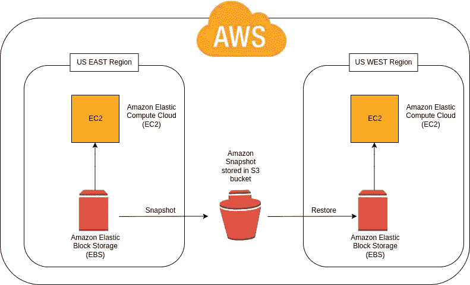

# 如何利用数据块存储和快照优化云成本

> 原文：<https://betterprogramming.pub/how-to-optimize-cloud-cost-with-block-storage-and-snapshots-acab43d6699f>

## 各种选择，让您在没有高成本的情况下保持高质量的服务

由 Freepik 上的 vectorjuice 设计

刚接触云的公司通常会过度调配资源以确保性能，从而导致不必要的额外成本。幸运的是，一些实践可以帮助您降低云存储成本，例如块存储和快照。

# 块存储器

> 块存储有时也称为块级存储，是一种用于在存储区域网络(San)或基于云的存储环境中存储数据文件的技术。— [IBM](https://www.ibm.com/cloud/learn/block-storage)

像 AWS 和 Digitalocean 这样的云提供商提供有本地硬盘的 EC2 实例和 droplets。但是，当实例关闭时，存储在磁盘上的所有数据都会丢失。

块存储解决方案提供可附加到 AWS EC2 实例或 Digitalocean droplets 的持久存储卷。这些卷允许您在特定实例的生存期之后存储数据。

AWS 块存储产品称为弹性块存储(EBS ),它将数据存储在块卷中。EBS 卷可以用作 EC2 实例的根分区。由于该卷在删除实例后仍然存在，因此可以用作备份。EBS 卷也是可扩展的，可以自动复制。

## 优化 EBS 批量成本

通过优化 EBS 的使用，您可以在不影响应用程序性能的情况下降低其成本。您可以使用以下步骤来优化 EBS 批量成本。

## **选择正确的 EBS 卷种类**

AWS 提供了四种类型的 EBS 卷，您可以根据您的预算和应用程序的性能特征进行选择。它们包括[通用 SSD 卷](https://docs.aws.amazon.com/AWSEC2/latest/UserGuide/general-purpose.html)、[配置 IOPS SSD 卷](https://docs.aws.amazon.com/AWSEC2/latest/UserGuide/provisioned-iops.html)、[吞吐量优化 HDD 和冷 HDD 卷](https://docs.aws.amazon.com/AWSEC2/latest/UserGuide/hdd-vols.html)，以及[上一代磁卷](https://docs.aws.amazon.com/AWSEC2/latest/UserGuide/EBSVolumeTypes_standard.html)。

应用程序架构师应该调配通用 SSD (gp2)卷，而不是调配 IOPS SSD (io1)卷，除非运行的应用程序是任务关键型的，并且每个卷需要超过 10000 IOPS 或 160 MiB/s 的吞吐量。管理员应定期监控所调配卷的读写操作。

如果吞吐量低，他们应该降低产量以降低成本。通过使用 Kubernetes 配置卷，可以使用垂直自动扩展来自动执行此操作。

## **选择正确的 EBS 卷大小**

在确定 EBS 卷的正确大小之前，需要考虑的因素包括应用程序的 IOPS、容量和吞吐量要求。

## **利用 EBS 快照**

EBS 快照是 EBS 卷中数据的时间点“拷贝”。EBS 快照的计费费率低于活动 EBS 卷。当 EBS 块的访问容量较低时，您可以在将存储在其中的信息复制到 EBS 快照后删除它。

## **删除未连接的 EBS 卷**

删除未使用的 EC2 实例的管理员可能会忘记删除附加的 EBS 卷。即使这些卷没有连接到任何实例，它们仍然会被 AWS 收费。因此，定期检查是否所有 EBS 卷都在使用，并删除未使用的卷可以降低 AWS 每月的账单。

## **删除旧快照**

在发生数据丢失或灾难时，快照可用于恢复。然而，没有实际价值的过时快照可能仍然存在于 EBS 快照中。恢复过程可能只需要备份的几个快照中的最新快照。当许多人被配置时，这样的 EBS 快照成本可能会滚雪球。

当应用程序架构师配置设置以自动备份快照时，他们还应该配置设置以定期删除较旧的快照。管理员必须为每个卷保留多少快照设置策略。

# 快照

快照是备份和恢复块存储卷上数据的一种方式。您可以生成卷快照，为存储在卷上的数据创建时间点备份。

EBS 快照有时也称为 AWS 快照，是一种备份和恢复 EBS 卷上数据的方法。发生灾难时，用户可以从最新的快照中恢复数据。EBS 快照仅保存上次快照的更改，起到增量备份的作用。

快照子系统仅备份已更改的数据块，并创建与恢复整个卷所需的以前快照中的数据块的逻辑链接。稍后，如果删除了这些最后的快照，则仅会清除未链接到任何后续快照的数据块。

这提供了更快快照的优势，并且能够清除旧快照，而不必担心依赖于以前备份的后续备份。但是，这限制了您使用 AWS S3 存储桶，因为快照不像普通 S3 对象那样保存。

## EBS 快照优点

1.  简单灵活的备份和恢复:卷可以恢复到任何快照。
2.  性价比高。快照比 EBS 卷占用更少的存储空间，定价也更低。使用 EBS 快照使用户能够只保存最新版本，从而减少冗余。

## EBS 快照缺点

1.  您不能在 AWS 之外复制数据。EBS 快照只能存储在 AWS S3 中；因此，您不能在 AWS 之外备份数据。
2.  快照是特定于区域的。保存 EBS 快照时，需要指定要保存的区域，并且不能从其他区域访问它。您必须将其复制到这些区域，以便在其他区域可用。这限制了扩展，并导致额外的数据传输成本。它还要求您为拷贝到的每个区域的快照的持久存储付费。
3.  累积快照最终会占用太多存储空间，从而增加成本。
4.  恢复较慢。与其他存储选项相比，恢复需要更长的时间，因为系统向后工作，还原到您选择的时间点。

# 快照成本

AWS EBS 快照有两个价格组成部分:亚马逊 S3 上的数据传输费和存储成本，这与标准的 S3 定价不同。

## **亚马逊快照:数据传输成本**

每当创建 EBS 卷的快照时，AWS 都会将打算保存在快照中的数据从 Amazon EC2 传输到您选择的 AWS 区域中的 S3 存储桶。

下面是当前的 AWS 转移成本，请记住 AWS 价格经常变化。请咨询 AWS 官方定价页面，了解最新定价和其他详细信息。

AWS S3 转移成本

**亚马逊快照:存储成本**

AWS 标准存储成本

EBS 快照标准版的固定存储成本为 0.05 美元/GB 月。这比 S3 标准存储层要贵得多，后者每 GB 月的成本在 0.021 美元到 0.023 美元之间(在美国东部地区)。

## 如何削减快照成本

从上面的分析中可以清楚地看到，在 S3 保存 EBS 卷快照的方法可以从每月的 AWS 账单中减少大量费用。您可以通过在 Kubernetes 集群中运行您的云基础设施来实现这一点。

> Kubernetes 是一个可移植、可扩展的开源平台，用于管理容器化的工作负载和服务，有助于声明式配置和自动化。— [kubernetes.io](https://kubernetes.io/docs/concepts/overview/)

# ***藏匿点***

在本文中，我将向您介绍一个名为“Stash”的 Kubernetes 原生工具。Stash 是一款用于备份磁盘和帮助制定重要恢复计划的工具。它是一个 Restic 操作员，可以加速备份和恢复您的 Kubernetes 基础设施的任务。

使用 Stash，您可以备份装载在以下工作负载类型中的 Kubernetes 卷:

*   `StatefulSet`
*   `ReplicaSet`
*   `ReplicationController`
*   `Deployment`
*   `DaemonSet`

> Stash 支持存储数据快照的各种后端，如 GCS bucket、AWS S3、Azure Blob Storage 等。或者像 [HostPath](https://kubernetes.io/docs/concepts/storage/volumes/#hostpath) 、 [PersistentVolumeClaim](https://kubernetes.io/docs/concepts/storage/volumes/#persistentvolumeclaim) 、 [NFS](https://kubernetes.io/docs/concepts/storage/volumes/#nfs) 等 Kubernetes 持久卷 *—* [*藏匿*](https://stash.run/docs/v2021.01.21/guides/latest/backends/overview/) *。*

Stash 支持 S3 兼容的存储服务，如 AWS S3、 [tebi.io](https://tebi.io/) 、 [Minio servers](https://min.io/) 、 [Rook Object Store](https://rook.io/) 和用于后端的 [DigitalOceans Space](https://www.digitalocean.com/products/spaces) 。

使用 stash，我们可以创建 K8S (Kubernetes)集群中提供的 EBS 卷的快照，并将它们作为常规 S3 对象存储在 AWS S3 中。我们也可以将它们保存在任何其他 S3 对象存储提供商处。您可以从任何 AWS 区域访问此类存储，而无需将快照存储在该区域中。这也有助于提高应用程序的可伸缩性。

根据你的项目类型，你甚至可以免费使用像 [rook.io](https://rook.io/) 这样的开源 S3 提供者。像 [tebi.io](https://tebi.io) 这样的提供商提供永久免费层(25GB 存储)和按月付费模式(每额外 GB 0.02 美元)。

您可以利用上述选项来帮助有效削减云存储成本，而不会影响应用程序的性能。

感谢阅读。我希望这有所帮助。如果你有任何问题，请随时回复。