# 如何优化网站中使用的图像

> 原文：<https://betterprogramming.pub/how-to-optimize-images-for-usage-in-websites-9eaee88c2e6b>

## 基于 Lighthouse 指标优化网络使用图像的一些方法，并使这一过程自动化


[UX 店](https://unsplash.com/@uxstore?utm_source=medium&utm_medium=referral)在 [Unsplash](https://unsplash.com?utm_source=medium&utm_medium=referral) 拍照

图像通常是任何应用程序负载的最大部分，因此这是一个很大的优化领域。在本文中，我们将尝试所有可能的方法来提高应用程序的效率。在本文中，我们将重点关注静态图像的优化，静态图像包含在我们的代码库中，但所有方法都可以转移到任何其他可能存储在任何 3d party 服务(如 Cloudinary)中的图像，我们将在接下来的文章中更深入地了解它们。

# **先决条件**

所有实际例子都将基于用`create-react-app`脚本创建的项目来展示。要创建项目，您只需完成以下命令:

```
npx create-react-app my-app --template typescript
cd my-app
npm start
```

# **简介**

对于创建登录页面的开发人员来说，这篇文章很有意思，因为大多数图片都是以静态资产的形式交付的。通常，他们从 Figma、Photoshop 等设计系统中提取图像。但是我们应该注意图像的必要质量，因为导出的图像对于网络使用来说可能不是很有效。

有时，我们甚至应该为每个 web 断点创建一堆不同大小的图片——这是一项相当乏味的工作。在这里，我们看一下如何自动化这个过程，并将其作为一个管道包含在我们的捆绑包中，如 Webpack、Rollup 等。

可能会提出的另一个问题是——我们如何衡量我们网站的有效性？为此，您可以使用 [**灯塔**](https://developers.google.com/web/tools/lighthouse) 。Lighthouse 是一个开源的自动化工具，用于提高网页质量。它也是 Chrome DevTools 的内置工具，使用起来非常方便。这是一个非常有价值的工具，因为它不仅突出了问题，还提供了对问题的详细解释以及一系列关于我们如何改进的建议。好，我们开始吧。

# 1 在项目构建期间使用 imagemin 插件减少光栅图像

首先，让我们将任何图片作为静态资源包含在我们的项目中。我刚刚在谷歌搜索中找到了第一张图片，并将它包含在`src/images`文件夹中的一个项目中，并导入到`App.tsx`文件中:

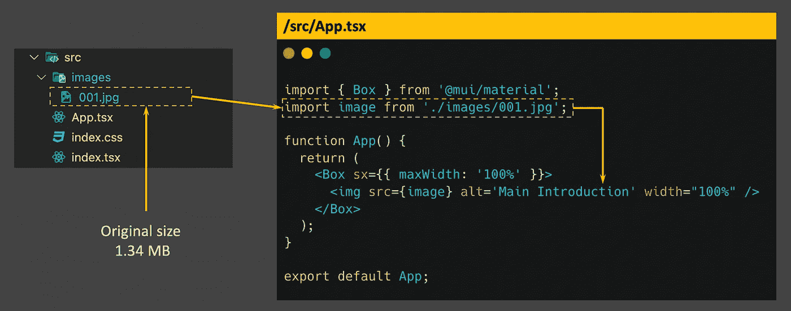

图 1 —在项目中导入图像

该图像的大小为 1.34 MB。我们来分析一下有没有机会优化一下。为此，我们将使用 Chrome DevTools 中默认包含的内置 [Lighthouse](https://developers.google.com/web/tools/lighthouse) 工具。

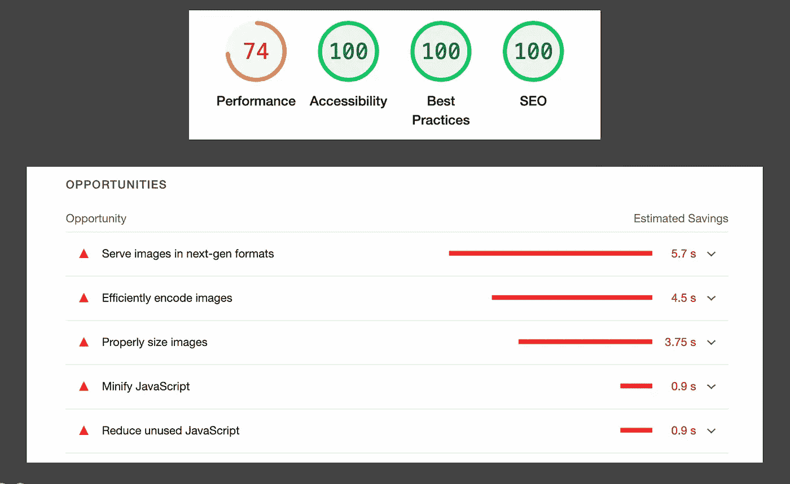

图 2 —图像优化前的灯塔指标

在这里，我们对“性能”指标感兴趣，它等于 74%，因此我们在这里有一些要改进的地方。向下滚动一点，直到“*机会*部分。在这里，Lighthouse 强调了所有的改进选项。目前，我们关注的是“*高效编码图像*”。

让我们到 Lighthouse 文档中查找这个[指标](https://web.dev/i18n/en/uses-optimized-images/)并找出它是如何计算的:

> Lighthouse 收集页面上的所有 JPEG 或 BMP 图像，将每个图像的压缩级别设置为 85，然后将原始版本与压缩版本进行比较。

压缩算法具有*压缩级别(质量)*，以 1 到 100 的标度表示，其中 1 为最低，100 为最高。你想到的第一个问题可能是——应该为它设置什么样的质量值。实际上，这取决于您的项目标准，但是我们应该意识到，激进的优化会导致图像质量明显下降。如果我们的目标是让 Lighthouse metrics 获得更好的性能，那么它应该像文档中所说的那样设置为 85。同时，如果你看一下 NextJS 框架的`next/image`组件的文档，他们设置了默认的质量值 75([next/image documentation](https://nextjs.org/docs/api-reference/next/image#quality))

好的，让我们试着把这个算法包含到我们的项目中。众所周知，在幕后，`create-react-app`使用 Webpack 作为捆绑器。因此，我们需要搜索合适的 Webpack 插件。可能是[image-minimizer-web pack-plugin](https://webpack.js.org/plugins/image-minimizer-webpack-plugin/)。

为了在不弹出 webpack 配置的情况下将这个插件无缝地包含在用`create-react-app`创建的项目中，让我们将`craco`包含在项目中(只需按照这里[解释的步骤](https://github.com/gsoft-inc/craco/blob/master/packages/craco/README.md#installation))。

首先，我们需要安装所有的依赖项:

```
npm i image-minimizer-webpack-plugin imagemin imagemin-mozjpeg -D
```

craco 的配置如下所示(`craco.config.js`在一个根项目文件夹中):

这里我想强调的是，我添加 **6 行**只是为了测试，因为在开发模式下，最好排除任何针对快速开发过程的优化，但是因为我想检查运行`npm start`的性能指标，所以我考虑到了这一点。让我们再次运行灯塔测试:

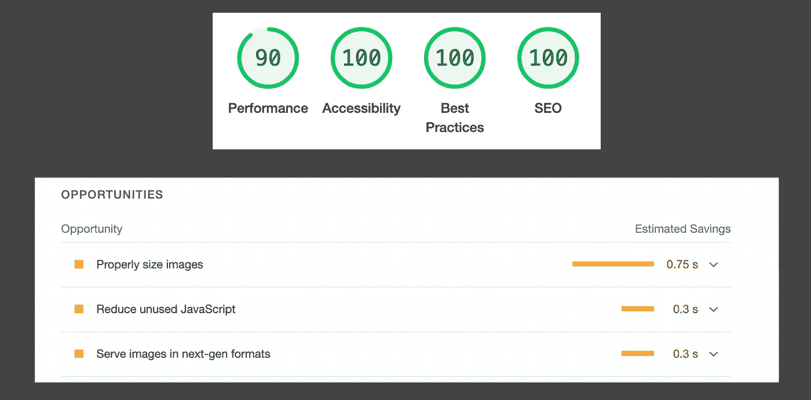

图 3 —对图像应用压缩算法后的灯塔指标

如果我们向下滚动到“ *Opportunities* ”部分，您会看到“*高效编码图像*”选项现已取消，我们将性能指标从 74%提高到 90%。

让我们来看看图像尺寸是如何缩小的:

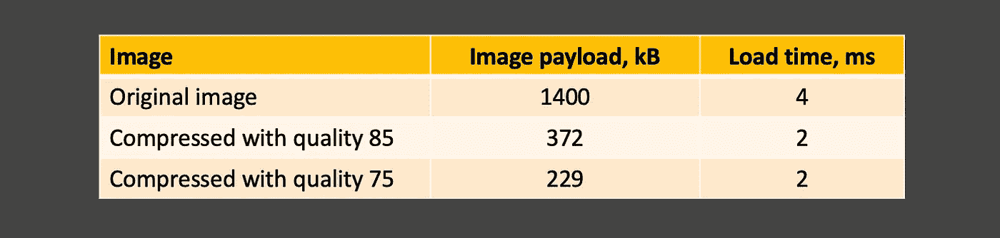

图 4—原始/压缩图像对照表

嗯，同样的方法将用于 PNG 和 SVG 文件，我们只需要包括一个适当的插件，它与[image-minimizer-web pack-plugin](https://webpack.js.org/plugins/image-minimizer-webpack-plugin/):`imagemin-pngquant`或`imagemin-svgo`一起工作

# 2 使用 WebP 编码图像

再看一下图片 2 或图片 3，你会发现另一个优化点:“以下一代格式提供图像”。它推荐使用现代的图像格式 *WebP/AVIF* ，这种格式比它们的老版本 JPEG 和 PNG 具有更好的压缩和质量特性。

好吧，让我们把它修好。首先，我们需要安装额外的插件 [imagemin-webp](https://www.npmjs.com/package/imagemin-webp) :

```
npm i imagemin-webp -D
```

让我们将它也包含在我们的网络包中:

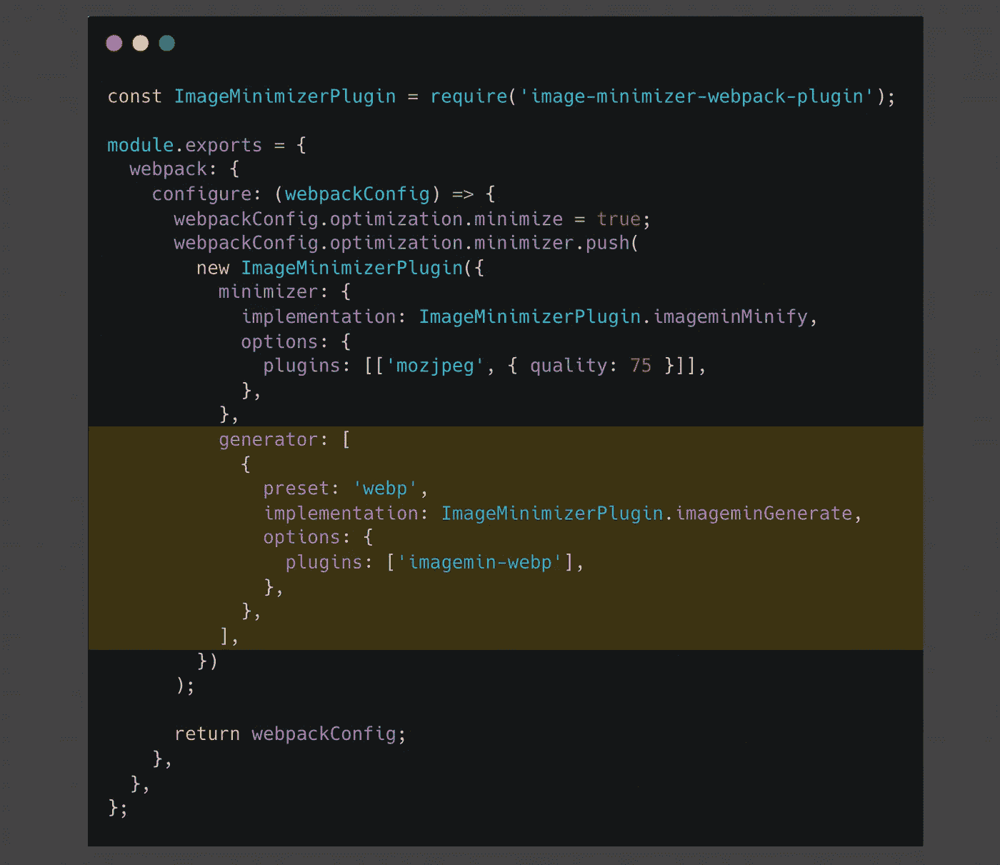

图 5—添加从其他格式生成`webp`的生成器。

要说将文件`./images/001.jpg`转换成 WebP 格式的生成器，我们需要为导入的文件加上后缀`?as=webp`，就像这样:

```
import imageWebp from './images/001.jpg?as=webp';
```

因此我们的`App.tsx`看起来会像这样:


图片 6—将 JPG 图片转换成 WebP 格式

如果使用 TypeScript 初始化项目，您可能会遇到以下问题:

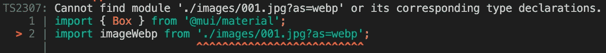

图 7—当我们在文件导入过程中加入后缀时，模块声明的类型脚本问题，这对于 webpack 加载器/生成器很重要

别担心，这很容易解决。让我们在根项目文件夹中添加一个文件`index.d.ts`，并为 TS 声明一个新模块:

```
// index.d.ts file
declare module '*.jpg?as=webp';
```

让我们将这个声明也包含在`tsconfig.json`文件中:

```
// tsconfig.json
{
    "compilerOptions": {....},
    "files": ["index.d.ts"]
}
```

这个问题应该解决了。好了，让我们用 Lighthouse 再分析一下我们的进度:

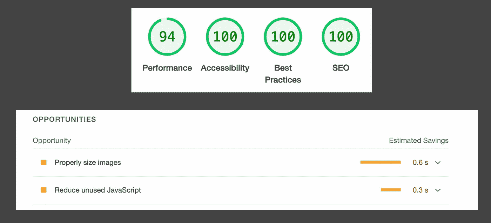

图 8——JPG 图片转换成 WebP 格式后的灯塔

我们在性能方面又赢得了 4 分(与图 3 相比)，而且“**以新一代格式提供图像**”的机会也已经失去。此外，我们可以确保在 Chrome DevTools 的“网络”选项卡上更改了图像的格式:


可惜不是这样。我们需要记住的是，一些旧版本的浏览器不支持 WebP，在这些情况下，最好使用备用的 PNG/JPEG。在这里，您可以分析 WebP 支持的可用性:[我可以使用](https://caniuse.com/?search=webp)吗？我们可以使用`<picture>`标签来实现这一点，它允许我们按优先级顺序列出多个图像目标，这样客户端将请求它可以正确显示的第一个候选图像。它看起来会像这样:

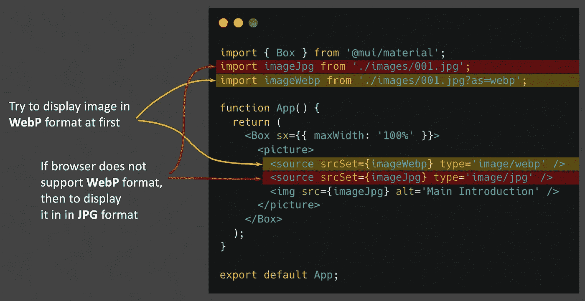

# 3 个响应图像

现在我们有了一张原始尺寸为 1600x664 像素的图片。嗯，浏览器在上传一张桌面断点原始大小的图片时(视口宽度> 1600 px)，完全没问题。对于所有设备，此图片也可能会缩小，但对于移动断点(视口宽度 600 px)上传 1600x664 px 的图片并依靠浏览器缩放是否有效？我觉得没有。

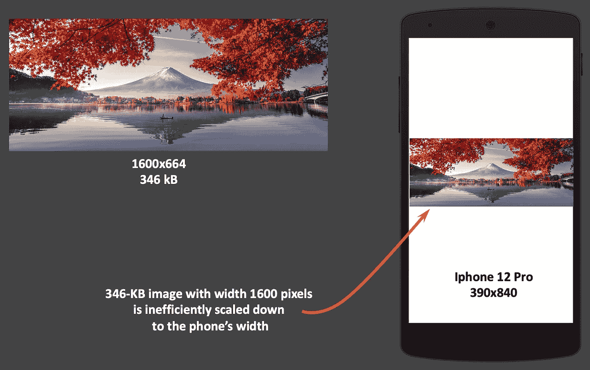

相反，提供最符合设备需求的图像是有意义的。这意味着我们需要一堆图像，这大大有助于我们减少上传图像的大小。假设我们的网站有五个支持的断点:*特大、小、中、大*和*特大*。因此，我们应该有五个不同宽度大小的图像，保持相同的纵横比。它如何影响性能，您可以分析下表:

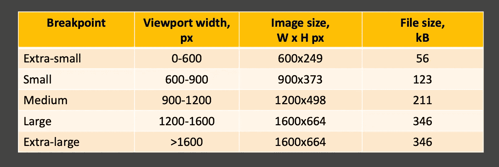

从字面上看，这意味着我们可以将移动设备的文件大小从 346 kB 减少到 56kB，从而缩短网站的加载时间。

## 使用 srcset

显示响应图像的一种方式是基于``标签的 HTML5 特性，它带有属性名`srcset`。这个可选属性并不取代`src`属性，而是对其进行补充:

```

```

浏览器进行计算，并选择最佳大小显示给用户。浏览器不仅会考虑屏幕的宽度(视窗宽度)，还会考虑像素密度。

我在上面强调了浏览器会考虑像素密度，因为我一开始发现这个特性时很困惑。我看到我的视窗宽度等于 599 像素，但出于某种原因，浏览器选择了宽度= 1200 像素的图像。为什么，为什么不是 600？为什么它甚至跳过了`srcset`的 width=900px 的图像？

这是因为设备的像素密度，我的设备等于 2。这意味着当我的视口为 599 像素时，实际像素数是 599 像素×2 = 1198 像素——这就是为什么我的浏览器选择宽度为 1200 像素的图片。请记住这一点。

在图 9 中，我用 Chrome DevTools 展示了我的实验(如上所述)。Chrome DevTools 允许定义设备的宽度/高度和所需的设备像素比率。

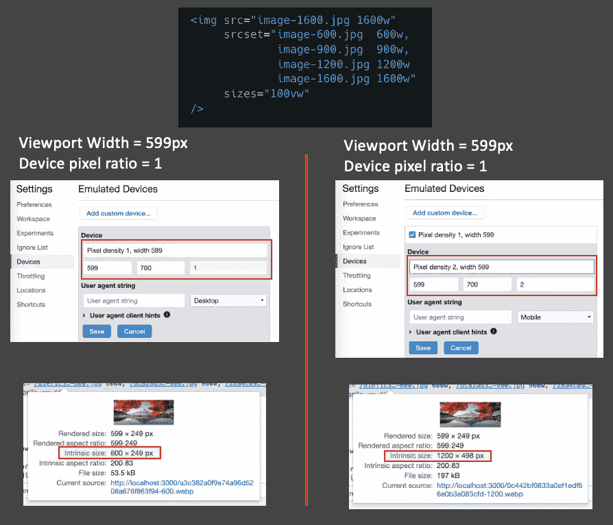

图片 9 —浏览器如何根据视窗宽度和设备像素比率计算应显示哪张图片

到目前为止一切顺利，但问题是——我们应该为每个断点手动创建一堆图像吗？哦，这将是一项艰巨的工作。幸运的是，我们有一个特殊的 Webpack 加载器，它的工作方式与`imagemin-webp`生成器大致相同，它允许导入带有额外参数的文件，如下所示:

```
import img from './img.jpg?sizes[]=600,sizes[]=900';
import imgWebp from './img.jpg?sizes[]=600,sizes[]=900&format=webp';
```

加载程序可以解析这个后缀，并在项目构建时创建一组具有必要大小和格式的图片。我们将使用`webpack-image-resize-loader` ( [npm 链接](https://www.npmjs.com/package/webpack-image-resize-loader))。让我们首先添加所有的依赖项(包括`sharp`):

```
npm i webpack-image-resize-loader sharp -D
```

在包含这个依赖项之后，让我们将它合并到 webpack 配置中的`craco.config.js`文件中:

这里我想强调一下，这个配置适用于版本为`5.0.1`的`react-scripts`，如果你的版本不同，可能你也需要调整它。定义自己的图像加载器，这里的目的是覆盖它。因此，我在`webpackConfig.module.rules`中查看了它们包含的加载器，找到了负责图像处理的加载器，并用一个新的来覆盖它。因此，在您的情况下，图像加载器`module.rules[1].oneOf[1]`的路径可能会不同——请记住这一点。

那么，让我们用新的加载器将图像导入到我们的`App.tsx`文件中:


图 10 —响应图像

请注意，如果您的项目已经用 Typescript 初始化，您会遇到这个问题:


当我们需要将图像从 JPG 转换成 WebP 格式时，我们看到了同样的问题(图 7)。在这里，声明这个新模块并不容易。可能出现在脑海中的第一个想法——让我们这样宣布:

```
declare "*.jpg?*";
```

但是 Typescript 不允许定义包含多个`*`的模式。幸运的是，在这里，`webpack-image-resize-loader`在检查后缀时，它不验证`?`之后的属性，这给了我们一个定义新的假参数的机会，例如`useResponsiveLoader=true`，然后我们的模块声明将如下所示:

```
declare module '*useResponsiveLoader=true' {
   const value: { srcSet: string; src: string };
   export default value;
}
```

考虑到这一点，我们的文件导入将如下所示:

```
import image from './images/001.jpg?sizes[]=600,sizes[]=900,sizes[]=1200,sizes[]=1600&useResponsiveLoader=true';import imageWebp from './images/001.jpg?sizes[]=600,sizes[]=900,sizes[]=1200,sizes[]=1600&format=webp&useResponsiveLoader=true';
```

这里我们需要记住，每次当我们需要定义这个后缀时，我们需要在末尾加上`&useResponsiveLoader=true`——但是不要担心，TS 在任何情况下都会强调这个问题。如果你不喜欢这种方法，这里有另一种选择:
-使用`require`而不是`import`
-只需将`//@ts-ignore`放在文件导入下

在我们继续之前，有什么方法可以检查我们如何改进我们的性能？让我们看看图 8。您应该会看到一个名为“**大小合适的图像**”的机会。让我们回顾一下它是如何计算的文档:

> 对于页面上的每个图像，Lighthouse 会将渲染图像的大小与实际图像的大小进行比较。渲染尺寸也考虑了设备像素比率。如果渲染的大小比实际大小至少小 4kb，则图像未通过审核。

当我们检查我们的图片时，我们应该看到两个参数:“渲染大小”和“内在大小”(图 11)，Lighthouse 比较了这两个维度的图片文件大小。

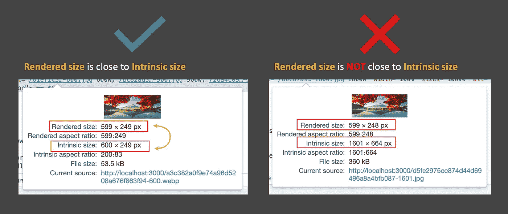

图 11 —检查图像尺寸

因此，当我们在`srcSet`中为每个断点定义一组图像时，这意味着我们使**“渲染尺寸”**和**“内在尺寸”**彼此接近。让我们仔细检查一下 Lighthouse 指标是否已经更改:

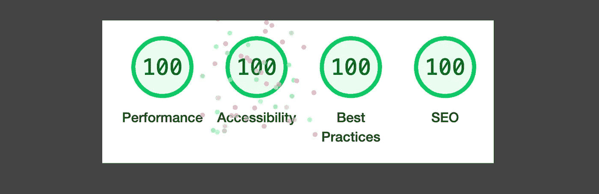

图 12 —下一次优化后的灯塔指标

还不错。

# **偷懒加载图片**

我们需要上传放在页面底部的图片吗？可能没有，用户甚至不能向下滚动到底部。如果用户正在旅行并且开启了漫游，我们应该注意每一点。

最简单的实现方法是给`` — `loading="lazy"`添加属性，如图 10 所示。它可用于指示浏览器推迟加载屏幕外的图像，直到用户滚动到它们附近。

当然，如果你需要支持某些浏览器的旧版本，这可能是一个问题——目前，该功能被测量为 71%可供用户使用([我可以使用](https://caniuse.com/?search=loading))。如果你想改善这一点，你需要自己实现这个特性，例如，基于交叉点观察器 API(见本文后续:[在 React](/lazy-loading-images-with-intersection-observer-in-react-ad6135f1ca59) 中延迟加载图像)

我希望你喜欢阅读这篇文章。很高兴看到任何评论或任何项目，应该已经涵盖。感谢任何有助于改进文章的帮助。谢谢你。