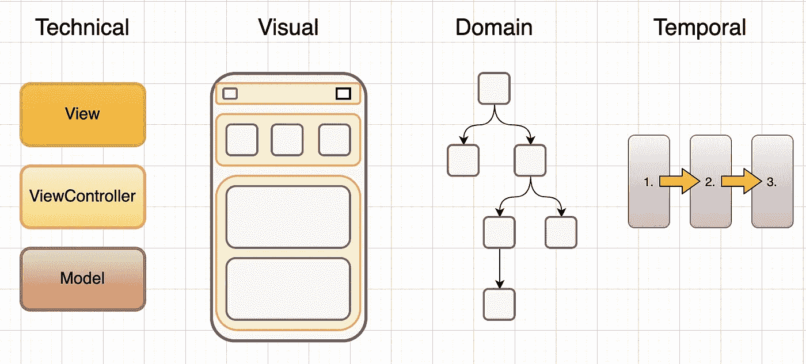
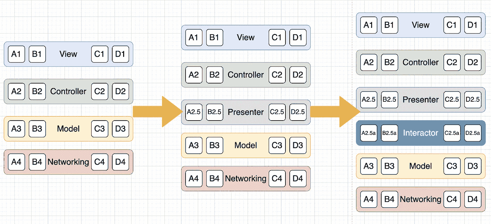
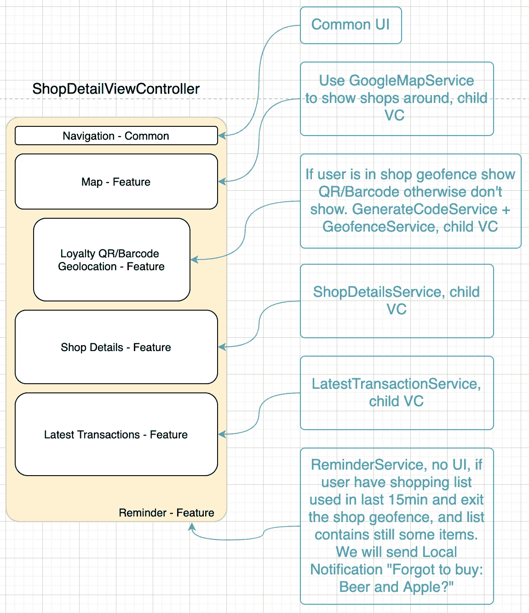
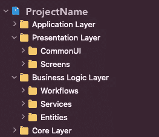
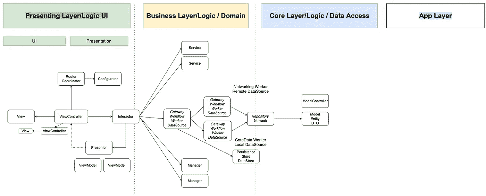
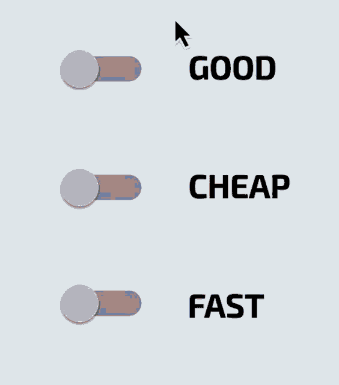

# 组织 iOS 项目架构的最佳方式

> 原文：<https://betterprogramming.pub/how-to-organise-your-project-1e0c98825f77>

## 我对 iOS 代码库中架构模式的看法

图片来自 Unsplash

> 软件架构的目标是可理解性和可替换性。—约阿希姆·库尔茨"

如果你阅读博客和观看大量关于架构模式的视频教程，有时你会被术语弄糊涂。元素的命名可能因模式而异——但是，主要概念是相同的。我会试着添加一些同义词，这样更容易理解。

没有解决所有问题的万能方法。这解释了为什么我们有许多架构模式。每种模式都试图解决一些特定的问题。对某个问题应用错误的“解决方案”只会让事情变得复杂。

# 介绍

当我成为一名移动开发人员时，基于以前的软件工程师经验，我有一些期望，挑战将是技术、数学和算法相关的。令我吃惊的是，我意识到我错了。一个例外是如果你直接进入 SDK(框架，包)开发。

通常，在移动应用程序开发中，事情发生得更快。适应需要做得更快。在“业务”方面，产品负责人和经理通常没有直接的最终目标，只有一个方向。有时开发从 R&D、PoC 格式或 A/B 测试格式开始。
如果里程碑时刻都在变化，并且在桌面上没有明确定义的特征，那么很难提前做出好的预测。

加入一个正在进行的项目意味着你需要在开始成为一个团队中富有成效的一员之前学习项目的组织结构。我所说的组织结构是指文件夹结构和架构模式——通常是分解的方式。

对于开发人员来说，要解决一个问题，他们需要分离出问题的关键部分，对其进行近似，并专注于达到某种解决方案的目标。我在这篇文章中的目标是通过 iOS 项目的例子告诉你我发现的组织项目的最佳方式和我的架构模式方法。但是，这些原则也可以应用于其他前端和基于 UI 的项目。

# 模型-视图-控制器系列

当我们谈论如何组织项目时，大多数人会想到架构模式。最基础的是 MVC。

我不会详细介绍每一个类似 MVC 的模式。如果屏幕有太多的责任，你可以添加一个子视图控制器。

如果需要更多的分离，带有一些服务的 MVC 可能会有所帮助。如果视图具有复杂性，MVP 也许可以完成这项工作。我们可以升级到 MVVM，蝰蛇，CleanSwift 等。

在高层次上，所有这些模式都试图通过添加一些层来从代码中提取一些责任。稍后我们将回到这一点。

# 项目分解

当我们谈论项目分解时，有很多方法可以做到。我将介绍 4 种不同的方式，但还有更多。

分解方式

*   **技术—** 这对大多数人来说都很熟悉。当你围绕一个架构模式分组时，就是这种情况。例如:在 MVC 中有一个`View`文件夹，包含`LoginView`、`RegisterView`和所有视图。明白了吗？
*   **视觉—** 这是我在大多数情况下更喜欢的。如果屏幕的数量明显大于特征的数量，那么这就是分解的方式。这允许您在同一项目中引入更多的架构模式，同时降低混淆的风险。此外，这是市场上大多数应用程序的最佳选择。
*   **领域** —这在某种程度上与特性更有关联。如果某个屏幕呈现许多特征，并且可以基于这些特征进行分割。示例:一些图表和一些文章列表，这可以由不同的`ViewController`(子 VC)管理，因为它们是由不同的模型构建的。当应用程序有一个包含十几个功能的复杂屏幕或查看较少的 SDK 时，这很有用。这种分解的思想来自并行编程世界。
*   **时间上的** —这代表了某事的顺序。例如:如果你创建一些入职框架，其中入职是线性的。或者一些教程页面视图。那这就是你的选择了。

当开发人员开始他们的职业生涯时，他们过于关注这个技术维度，更糟糕的是，他们将它应用到整个项目中。也许这是网上教程偏颇？太多的注意力放在从技术上分解应用程序，而没有考虑业务的真正需求。

通过添加新层对应用程序进行分解转换

聚焦在技术维度分解，我们只是多加了一层。可能有些部分不需要联网。也许有些功能不需要视图。因此，我们有许多小零件，这些零件没有用，只会降低可读性。使用这种方法，代码可能看起来更干净，但这并不意味着它是可以理解的。

用不同的分解维度解决不同的问题，但是是局部的。问题是局部的，解决方案不需要应用于整个项目的全局。例如:如果有一个屏幕需要一些更复杂的架构模式，如 CleanSwift 或 VIPER，这并不意味着需要应用到整个项目中。

当一个高级开发人员团队开始项目并应用一些模式(如带有模板的 VIPER)时，这可能会发生。在中期，初级开发人员被介绍到项目中，没有机会一步一步地介绍技术。开发人员被迫马上学习 VIPER、业务逻辑、团队结构，也许还有一些敏捷过程。这可能是压倒性的，令人生畏的，并处于压力之下。

# 项目组织

如果你有很多变化，并与产品负责人进行头脑风暴，我会围绕你应该建立的应用程序分开两个概念。`Scene` (示例:登录屏幕)和`Feature` (例如:地理定位，当用户进入范围内的某个特定商店时，获得关于商店最佳交易的推送通知)。此外，我喜欢创建屏幕图形，并标记哪个部分正在使用哪个功能。

屏幕和功能图

我发现的第二个有用的东西是[分层架构](https://www.vadimbulavin.com/layered-architecture-ios/)概念。3 + 1 层的版本。如果有一些复杂的应用，层次可以增加。这些层数足以覆盖大多数情况。它降低了软件的复杂性，增加了代码的可理解性和可读性。这种分层架构也可以反映在文件夹结构中。

*   **应用层**
*   **表示层** *(UI 层)*
*   **业务逻辑层** *(领域层)*
*   **数据层** *(核心层、数据访问层、持久层)*

文件夹结构

# 应用层

这是 app 的入门级。这部分是全局层，应该包含像`[AppDelegate](https://developer.apple.com/documentation/uikit/uiapplicationdelegate)`、`SceneDelegate`、配置、常数、起始 [DI](https://en.wikipedia.org/wiki/Dependency_injection#:~:text=In%20software%20engineering%2C%20dependency%20injection,object%20is%20called%20a%20service.) 组件这样的元素。让我们说一下所有需要在整个应用程序中可访问的东西，并且需要从开始就处于活动状态。

# 表示层

大多数应用程序都有很多屏幕。与功能数量相比，屏幕更多。在这种情况下，这一层是中心人物。

正如你在前面的图片中看到的，它包含了一个`CommonUI`文件夹。该文件夹的用途是包含扩展、一些通用基类、UI 助手、通用按钮等。它包含`Screen` / `Scene` 文件夹，这是核心组件。如果你有一个登录界面，它会有一个包含`LoginView`、`LoginViewController`、`LoginInteractor`、`LoginViewModel` ( `ViewData`)等类别的`LoginScreen`文件夹。这也取决于屏幕架构模式。

请记住，不同模式中的 ViewModel 可能有一点不同的职责，并且属于不同的层。这可能会令人困惑。在我的例子中，这是针对 MCV 模式的，其中 ViewModel 只为视图提供简单的数据，如文本、数字。

# 业务逻辑层

这一层是关于客户端业务规则的。这是应用程序逻辑的核心，并为代码库提供了意义。

我称之为`**Feature**`部分。更多的屏幕可以共享相同的`Feature`方面。从技术的角度来看，这包含了`Services`、`Workflow`、`Manager`、`Worker`、`Gateway`、`DataSource`、`Provider`——任何一种作为输出的数据结构，它服务于表示层或核心层。这些组件是无状态的。例如:表示层，可以要求`UserWorkflow`给你一些用户 id——这会给你一些`UserModel`

## **一些事实**

*   功能可以由多个服务和提供者构建。
*   更多的屏幕可以用不同的方式表示相同的功能，或者表示功能的某个方面。
*   一个屏幕可以代表更多的功能。
*   该特征可以在没有屏幕的情况下被表示(像推送通知)

# 数据层

这是我们从远程或本地数据源获取数据的部分。或者对数据进行一些操作后，我们保存它。这可能类似于 CoreData、一些网络 API 或 UserDefaults。也是我们可以找到一些模型、实体、`DTO`、*(数据传输对象)*、`ModelController`的地方。有人会把这里的`NetworkManager`或`LocalDataBaseManager`看作是`ModelControllers`，我会说它们是把 JSON 转换成模型的服务。

分层架构中的 CleanSwift like (CleanVIP)架构

上图可以看到，有些部分是层间的。这意味着在不同的模式中，组件可以属于不同的层。从我的角度来看，这无关紧要。重要的是你有一个分离和明确的数据流。

所以让我们后退几步。开发者一般在开始构建一个 app 的时候，关注点大多是开发速度、重用性、一致性、可移植性、易维护性等。然后，它演变成编译时优化、易上手、运行时性能等。

在任何情况下，这些目标在桌子的不同端，并且焦点可以同时在 1 或 2 上。

这同样适用于前面提到的发展重点

引用 start 的话来说，技术上的重点应该是可理解性和可替换性，我完全同意这一点。

每个应用都有几个复杂的屏幕和 10-15 个甚至更多真正简单的屏幕。从这个角度来看，我赞成每个屏幕使用不同的架构模式。通常中心类是`ViewController`，每个屏幕至少有一个。这个屏幕上对下一个开发人员有帮助的是一些关于所用模式的描述或任何技术信息。我会将这些信息作为注释留在标题中。

## **示例**

*   `ScreenA`(登录，简单)—使用 MVC + some `LoginService`
*   `ScreenB`(一些具有更多 API 调用、可选和不同图表的复杂仪表板，预计它将具有新功能，A/B 测试)—使用 CleanSwift
*   `ScreenC`(一些半复杂的视图部分)——带有子 VC 的 MVC

## **这种方法的优点**

*   可更换性:屏幕可以很容易地更换，因为所有的屏幕组件都在一个地方
*   如果初级开发人员参与项目，入职会更容易。大部分部分都很好理解。可以从简单的部分开始。
*   对于大多数屏幕来说，MVC 和一些服务就足够了。
*   对于几乎空类的简单屏幕，不需要遵循复杂的架构模式。
*   可理解性:只有几个屏幕有更大的复杂性
*   调试更容易，因为可理解性很重要
*   可替换性:也意味着更容易测试它

## **这种方法的缺点**

*   不是最好的代码组织，如果有比屏幕更多的功能
*   对 SDK 开发不利

# 概述

类似`MassiveViewController`的东西不应该存在。如果你看到这正在发生，那么问问你自己。这个屏幕是做什么的？这个特性是用来做什么的？

如果答案不是一个简单的句子，那么可能需要一些分解，重构它。没有通用的最佳模式。每个模式都是某个问题的解决方案。此外，问问你自己，这将解决全球或局部的问题吗？如果我们想要好的可理解性，那么我们需要问很多问题。

如果你到了这一步，感谢你的阅读。你应该得到一杯咖啡☕️.🙂如果你喜欢的内容，请👏，分享，还有[跟着](https://varga-zolt.medium.com/)，对我来说就意味着一个。如果您有一些建议或问题，请随时发表评论。

**想要连接？**
你可以在 [LinkedIn](https://www.linkedin.com/in/varga-zolt/) 、 [Twitter](https://twitter.com/skyspirit86) 或[https://skyspiritlabs.com/](https://skyspiritlabs.com/)与我联系。还有更多文章和教程。