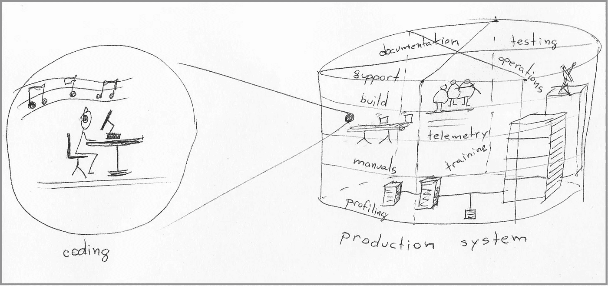
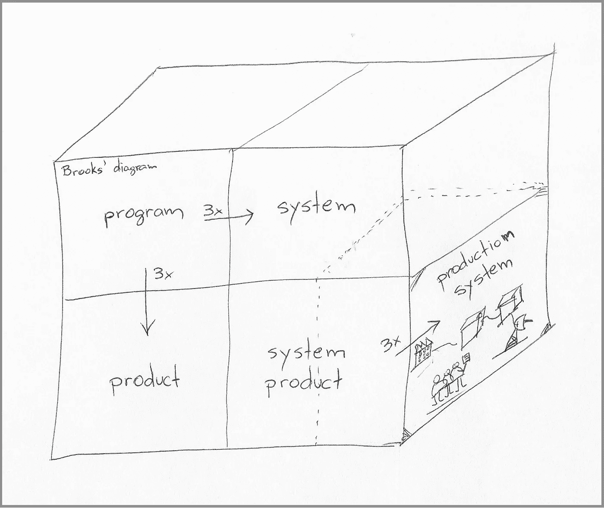
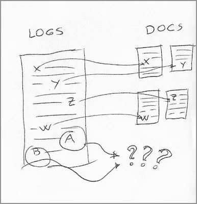
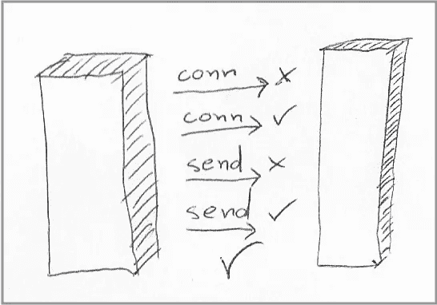
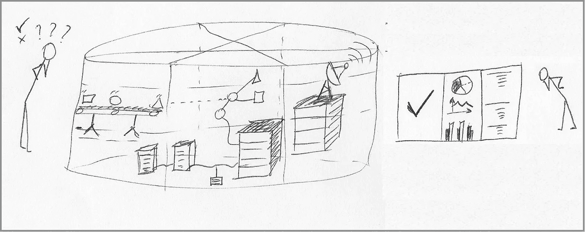
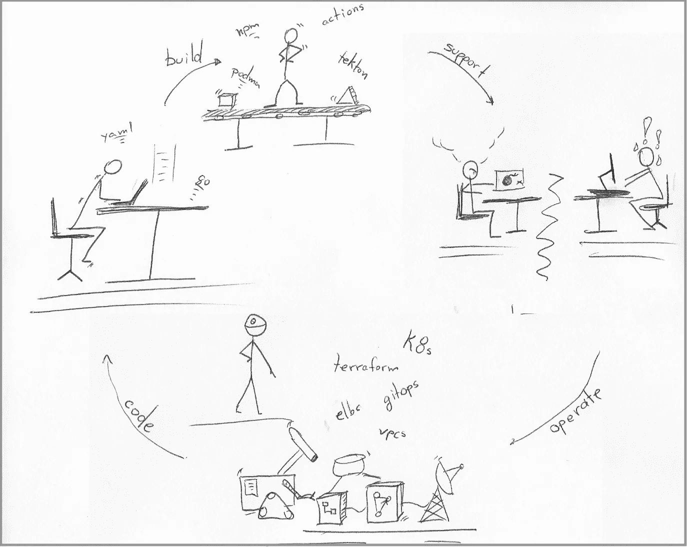

# 如何超越 10 倍的开发者

> 原文：<https://betterprogramming.pub/how-to-outperform-a-10x-developer-fa1132807934>

## 第一意识。然后是生产力。



从软件开发人员的角度来看，生产系统的复杂性使它变得抽象和遥远，因此我们倾向于将其排除在外，并专注于编写代码的直接工作。

杰夫·福斯特写了一个关于“10 倍开发人员”的起源的伟大故事，对比了 T2 高超的代码编写技能和专注于产品的能力。

从 DevOps 的角度来看，其从开发到运营的全方位覆盖需要协作。专注于产品每次都胜过编码技能，因为有时不写新代码对产品来说是最好的决定。

这个故事提供了具体的例子，在这些例子中，对生产系统的更好理解可以改变我们如何看待自己作为软件开发人员的角色，并显著改进我们设计系统和编写代码的方式。

# **质量不够时**

当然，高质量的代码和磨练出来的技能仍然很重要。软件开发人员应该[遵守良好的实践](https://opensource.com/article/17/5/30-best-practices-software-development-and-testing),比如自动化测试、代码审查、单元测试等等。然而，快速编写高质量的代码只是将系统投入生产并保持其活力所需任务的一小部分。

从这个意义上说，组织不应该花费太多的资源去寻找和培养 10 倍的开发者。首先，他们[可能不是真正的 10x 开发者](https://www.simplethread.com/the-10x-programmer-myth/)。其次，也是最重要的:*持续的*软件开发必须包括支持材料，比如设计文档和操作程序。这些文件必须与使用它们的人一起不断地审查和更新。您可以简化协调活动，但是底层的人员交互和工作流不会快 10 倍。

**9/22 更新:** [Hajime Vukelic](https://medium.com/@hayavuk) 给故事添加了一条评论，指出我让它听起来像是超大的个人表演是不可能的或不可取的。我仍然认为这在 DevOps 实践中是困难的，但是他深思熟虑的推理是独立的，并引导我阅读了他的一个个人故事，名为[“什么是高差异开发者”](https://medium.com/@hayavuk/whats-a-high-differential-developer-2fc42e2ee6a3)。我认为这是一个很好的补充。

您希望开发人员的表现更高，但可以达到的水平(1.2 倍开发人员？)以便其他团队成员可以理解和吸收更有成效的技术和行为。


培养人才是提高生产力的更好途径。右边的角色过于独特和罕见，无法对多个团队产生重大影响。

# 第一课——伟大需要时间:27 倍以上。

我不是指“几十年的经验”中的“时间”——这也有帮助——而是指“时间”，即完成伟大工作所需的实际时间。

即使是最有才华的开发人员也会因为对从原型到生产中的可持续系统需要多长时间的错误估计而自毁前程。我必须强调“可持续”这个词，即随叫随到的轮班几乎不会产生页面调出，即使没有编写代码的人也能解决这个问题。

我最喜欢的估计产品中一个特性的总成本的技术是创建一个工作原型，然后*用花费在原型上的时间乘以 27* 。这是正确的；如果我花两天时间开发一个原型，那么整个团队可能需要将近三个月(2x27=54 个工作日)的共同努力才能让它投入生产。

**9:22**更新:用户 [Liquid Analytics](https://medium.com/@liquidanalytics) 在评论部分提出了一个很好的观点，即 27 倍乘数可能成为有意义进展的抑制剂。我应该提到，这个想法是使用现代的“生产测试”方法部署原型，例如[黑暗发布](https://www.split.io/glossary/dark-launch)或[功能标志](https://www.atlassian.com/continuous-delivery/principles/feature-flags)背后的[基于主干的开发](https://trunkbaseddevelopment.com/)。

## ***为什么是 27x？***

小弗雷德里克·布鲁克斯(Frederick Brooks Jr .)在《人月神话》(The mythed Man-Month)中解释了第一个“9x”，这是他关于软件开发的一系列具有里程碑意义的书籍形式的文章。

第一个 3 倍乘数是从运行代码(这本书使用术语“程序”，这个时代的特征)到可靠的应用程序(这本书使用术语“程序产品”)的成本)

第二个 3 倍乘数来自将可靠的应用程序转化为系统(“系统产品”)所需的额外测试)

Brooks 讲述了创建交付给客户进行现场部署的软件的各个方面——这是当时 IBM 商业模式的特点。因此，它排除了与运营方面相关的成本，在运营方面，我添加了最后一个 3 倍因素(基于我在运营工程方面的经验，因此您的乘数可能会有所不同)，以将系统转变为可运营的基于云的服务。



Brooks 解释了为什么准备在客户站点部署的东西需要花费九倍于创建原型的努力。我为部署和维护系统增加了额外的 3 倍因素。

最终乘数包括发展活动，例如:

*   测量系统的可观测性
*   根据系统设计记录操作程序
*   持续部署管道的开发和维护
*   与其他云提供商服务的集成测试。

综合所有乘数(3x3x3 ),我们将原型投入生产的成本增加了 27 倍。

**为什么重要:**虽然一个经验丰富的开发人员可能不会通过整个 27 倍乘数来低于新功能的规模，但任何超过[2 倍或 3 倍因子](https://fibery.io/blog/software-development-time-estimation/)的东西都肯定会给整个团队带来棘手的惊喜，更重要的是，会剥夺您添加和验证所需一切的时间，以免给运营团队带来噩梦。

# 第二课——运营工程胜过艺术

无论如何，艺术有它的位置，系统的一些角落可能看起来聪明或精致，但最终[形式遵循功能](https://en.wikipedia.org/wiki/Form_follows_function)，生产系统的功能是运行满足需求和成本目标的软件。

本节涵盖了在运营中获得的经验教训，以及它们应该如何影响设计和编码活动，占 27x 倍数的一部分。

这一节没有涵盖代码开发之外的全部内容，这会使这个故事现在显得太长。

**更多组件。成本更高。检查每个人的预算。**在设计和架构期间考虑运营成本是我在运营期间学到的最重要的一课。系统中的任何*新*组件都会改变操作该系统的成本结构，所以你需要问自己该组件移除的成本是否大于增加的成本，并准备好放弃向系统中添加看起来真的*有趣的东西。*

毕竟，在同一个世界里，首席财务官(理所当然地)告诉你，带来更多收入比削减开支更重要的是开发人员，他们将 50 毫秒的 SQL 查询抽象为一系列微服务包装的分页 RESTful 调用(真实故事。)

我并不是说要采取被动的方式来改变，但这是一个需要找到合作方式或至少与运营团队协商的领域。

**世界级地位和健康终点。**没有人能够在停电期间摸索系统状态，尤其是在有数百个组件的微服务架构中。

一个生产系统需要一个总体健康点来聚合来自不同依赖项的健康。这个想法是，操作员可以快速评估(1)系统的哪些部分不工作,( 2)哪些依赖项不工作——“为什么”部分在后面。

我在关于 Kubernetes 容器的[就绪性和活性](https://dnastacio.medium.com/the-art-and-science-of-probing-a-kubernetes-container-db1f16539080)的文章中列出了我对设计健康端点的建议——那篇文章中的大多数建议也适用于非 Kubernetes 系统。

从读者的角度记录错误。一旦操作员意识到系统并不完全正常，下一步就是了解是什么原因造成的以及如何修复。

从基本层面来说，应该有事情发生，但它没有。从阅读日志消息的人的角度来看，最有帮助的日志消息遵循如下模板:

```
[ERROR|WARNING|INFO]*:* [Component X] *attempted to* [take action Y]*, which returned* [response Z]*.*
```

这种格式乍一看似乎很明显——它看起来像一个常规的主语-动词-宾语结构——但最重要的是术语:

*   *“组件 X”*是否存在于系统文档中？
*   那个*“动作 Y”*是读者能接触到的东西吗？
*   *“响应 Z”*是否在故障排除部分的某处被提及？



日志消息有助于解释系统行为，但前提是消息内容与官方文档的内容相匹配，即使与产品无关的论坛填补了一些空白。

我读过相当多的错误消息，这些消息让我庆幸有人花时间将它们添加到代码中，但也让我对引用文件名和库调用感到犹豫，这些文件和库调用只对它们的作者有意义。这些内部引用应该在专用的跟踪文件中，或者用“debug”前缀标记，以便于过滤。

最终，每条日志消息都必须有一个明确的解决步骤，不需要联系消息作者或阅读源代码。

写系统文档:写文档迫使你把你对系统的理解组织成一种新的媒介。除了告诉人们如何安装、监控、保护系统或排除系统故障的必要性之外，该活动还为系统带来了许多好处。

写作行为要求作者*思考系统的方方面面*，这可能很难解释。

通常，这种困难可能表明潜在的设计缺陷，例如难以解释所有组件的正确安装顺序。其他时候，这种挣扎可能是由于产品的“不发达”区域需要为读者提供很长的伪代码说明(*“…然后点击这里，输入这个，等待几秒钟，然后一个面板会弹出，找到一个名为…“*”的按钮

如果处理得当，文档还可以作为合作者的聚集地，这些合作者可能愿意贡献他们的知识，但没有时间想出如何去做。这些类型的贡献对于整个生态系统(开发者和用户)来说是一个巨大的生产力提升，否则容易迷失在团队渠道和私人谈话中。

**对远程组件的时间盒调用**。在分布式系统中，我们知道不能依赖远程代理总是快速可靠地响应。尽管如此，我们经常在客户端库和实用程序中使用默认的超时设置，而不加考虑，因为我们假设他们的开发人员已经找到了适合每个人的神奇设置。

这是一个常见的疏忽，在这个世界上，库和实用程序都有合理的默认设置，系统采用最新的设计和操作技术来实现最大的可用性。对最终系统的错误信任一直持续到其中一个系统失败，让您的组件无条件地等待 [2 小时](https://man7.org/linux/man-pages/man7/tcp.7.html)TCP 超时。

始终在代码中寻找远程调用，并确保您知道它们的限制以及您的代码将如何处理这些限制:

*   最长连接响应时间
*   最大请求响应时间
*   最大重试次数



远程系统或您的系统与远程系统之间的网络路径可能非常可靠，以至于我们开始将它们视为本地内存中的函数调用。仔细检查所有库和网络堆栈，找出它们对连接问题的容忍度以及出现问题时的错误代码。

为远程调用创建一个有效的重试策略对任何系统来说都是一个受欢迎的改进。尽管如此，它仍然有可能掩盖即将出现的问题的可见性，例如掩盖响应时间的持续恶化，直到它们最终超过最大限制，这将我引向下一点。

**遥测、可观察性和分布式跟踪**:处理中断不仅仅是查看系统状态和日志条目。操作不仅仅是处理停机，比如主动查看系统的内部度量、跟踪和日志条目的遥测。

许多平台已经在源代码中用[最少的工具生成了大量的遥测数据。然而，仍然需要在源代码中混合相当多的遥测专用代码，尤其是对于度量标准。](https://opentelemetry.io/docs/instrumentation/)



每个系统组件可能不会告诉您它是否达到了目标。让代码生成指标需要额外的工作，将它们聚合到一个可操作的仪表板中，供运营团队使用。

此外，确保您(和其他开发人员)能够定期访问系统操作中使用的遥测框架的本地设置。许多框架支持在您的工作站或免费试用的基于云的帐户中本地执行。允许从本地环境无缝过渡到远程环境的统一设置需要开发、验证、记录和维护。创造这样的环境很有趣，但也需要时间和金钱。

我再怎么强调*也不为过，即使是最有经验和自信的开发人员在查看他们代码的遥测技术*时，总能学到一些新的或令人惊讶的东西。

更上一层楼，*与您的运营团队合作，确保与运营团队达成数据共享协议*，对数据匿名化和访问等方面给予特别关注和努力。

当心排队系统。编写排队系统很有趣，设计架构图也很刺激(也很诱人)，但是大多数人都严重误判了向系统中添加排队模式的成本。

我知道排队系统有一些合理的用例，比如高容量事务——每天有数百万条消息——其中调用组件不能等待响应，只关心事务最终在合理的时间内得到处理。

但是，如果您不处理这些用例，您可能需要认真考虑将异步消息处理包含到系统中。这种通信模式增加了在消息生产者“A”和消息消费者“b”之间的整个业务交易过程中的成本。下面是这种额外复杂性的几个例子:

*   系统管理员处理超过特定限制的队列大小的操作程序
*   处理过期消息的额外设计和代码。
*   处理过期后发送到死信队列的消息的操作过程。
*   扩展系统以管理死信队列
*   处理跨越消息传递的业务事务的分布式跟踪。

# 第 3 课——线程四重奏:编码、构建、支持、操作

虽然长期的职业生涯可能会逐渐教会你 DevOps 实践的不同领域，但你可以通过有意地在开发、集成、支持和运营之间轮换来加速你的成长。这个想法是学习事物是如何工作的，并构建在工程周期的每个重要领域都工作良好的软件。

一旦你了解了这些领域的人和工作流程，在你的核心专业知识之外做出贡献就会变得更容易，技术和社会摩擦也会更少。

职业生涯中期和高级开发人员可能不太倾向于改变工作角色，但他们的经验允许他们学习得更快。几周的临时轮换、共享项目，甚至访问客户支持单和事故报告，都可能起到同样的作用。



DevOps 实践鼓励对不同领域的更多访问和洞察。更进一步，进入这些领域，即使是短暂的，去理解各种软件特性如何影响他们的工作。

## **案例研究 1(构建)**。

在之前的项目中，我们有一个团队主要负责开发和维护构建系统。在本地工作站上构建(编译和打包)整个代码库大约需要两分钟。相比之下，构建周期中的相同操作花费了看似永恒的 15 分钟。

构建团队之外的一名开发人员花了一个下午的时间向构建脚本添加各种日志条目来隔离问题，将可能的原因缩小到构建将编译后的二进制文件写入磁盘的步骤。不知何故，磁盘写操作在构建系统中比在本地工作站中花费的时间要长几个数量级(是的，构建机器有 SDD 存储:-)

构建团队分析了这些发现，并尝试了不同的替代方案(其中一些超出了最初开发人员的 Unix 技能范围)，最终找到了增加虚拟机内存分配并将每个构建的临时目录移动到内存文件系统( [tmpfs](https://en.wikipedia.org/wiki/Tmpfs) )的解决方案。)

## **案例研究 2(操作)**。

我曾经为我们整个组织——几百人——共同管理了几个月的页面责任升级策略和警报规则。有时，根据假期安排和当地假日，这意味着接收紧急的直接消息，要求我在我的直接范围之外的系统部分中启用警报触发器。

在按下按钮之前，我总是会问几个问题，比如:

*   "生成这些新警报的组件将于何时部署？"
*   “我在描述中没有看到剧本链接。运营团队知道去哪里找吗？”

没有进入令人困惑的答案的偶然组合，那个(兼职)任务给我上了宝贵的一课:管理系统中各种警报的重要性，向生产系统添加新组件的成本效益，以及让操作团队参与架构决策的绝对必要性。

# 第四课——有意识的学习:在每项任务中学习。

至此，您知道了如何保证编写可用于生产的代码的时间，以及您需要在代码中包含的内容。

这是一个很长的清单；尽管有“10000 小时”规则，你也不想等几十年才能有机地掌握这些技能。

我们总是在执行任务的时候学习一些东西，但是[有意学习](https://learntechasia.com/intentional-learning-global-reskilling-emergency/)意味着超越完成工作，并弄清楚为什么有些东西会起作用以及如何改进它。

网络搜索可能会给你一个特定问题的精确答案，你可以通过这种方式学到很多东西，但通过有意识的学习，这种想法超越了现成的解决方案:

1.  **浏览**。如果解决方案涉及框架的模式化解决方案，例如 Terraform 的一组特定资源，请返回到[浏览这些资源的完整定义](https://registry.terraform.io/browse/providers)，也可以浏览来自同一提供商的相邻资源。
2.  如果解决方案涉及具有特定参数的实用程序，请回到实用程序的手册来研究这些参数，并浏览其他参数。这个想法不是去记忆，而是在你的头脑中索引它们，特别是在使用工具的情况下，比如像" [awk](https://www.gnu.org/software/gawk/manual/gawk.html) "手册可以是一整本书。
3.  **解释**你学到了什么。对于源代码，拉出“[橡皮鸭](https://en.wikipedia.org/wiki/Rubber_duck_debugging)”，对着一个没有生命的物体解释源代码。对于概念，你甚至可以不去找别人，而是使用[费曼技巧](https://en.wikipedia.org/wiki/Learning_by_teaching)，假装你正在向一个孩子展示这个概念。
4.  关于主题写。写作是一种更有意识的学习形式，帮助你巩固和扩展你对一个概念(可能是写一篇文章)、相关概念(使用类似技术论文的东西)或整个领域(例如，写一本书)的知识。)写作远远超出了学习，所以它可能对组织你头脑中相邻的知识更有帮助。如果你决定从事这项激动人心的活动，请务必阅读海因里希·哈特曼的[《为工程师写作》](https://www.heinrichhartmann.com/posts/writing/)。


*“看过产品指南了吗？谁有时间做那个？”*

我意识到现在是谷歌搜索“如何让这个错误信息消失”的时代，这在时间紧迫的情况下很有意义。尽管如此，你并没有从这些捷径中学到什么。

在这里，我必须引用斯蒂芬·金的话，他是有史以来最成功的小说作家之一，他为有抱负的作家提供了一些严厉的建议:

> “如果你没有时间阅读，你就没有时间(或工具)写作。就这么简单。”

如果你不从时间表中抽出时间来探索项目中使用的技术并加以扩展，你就把自己限制在只能完成眼前任务的范围内。当你周围的人认为你只能完成同样的任务时，这种动力就会自我强化。这些假设不需要很长时间就会变得合理。

根据不同的情况，时间的“划分”可能或多或少具有挑战性，但意识是一个起点。有时候，你可能会不断加倍承担重复性的(但有价值的)任务，因为这样更舒服。在其他时候，你的组织可能会对某个人比其他人更有效率地做重复性的工作感到满意。不管情况如何，认识到你不再从每项任务中学到新东西是第一步。

# 结论

DevOps 实践覆盖了许多不同的和广泛的学科，这使得人们专注于一个给定的领域，例如软件开发、持续交付或操作。

有时候，兴趣和目标的缩小发生在人们有机会探索其他领域之前，所以要抵制在职业生涯早期专攻的冲动和压力。作为一个组织，平衡可能在一个职位上呆得太久的人的生产力和日本式的每年轮换的好处。

在你职业生涯的早期，与你的管理团队一起“实习”编码、交付和操作。那种全面的经历是珍贵的，也是极其难得的。它将帮助你在你选择贡献的任何领域倍增你的潜力，无论是作为程序员、系统架构师、UX 设计师、技术客户经理、基础设施工程师，还是任何你可能喜欢的角色。

愿意从不同的角度理解是什么让一个产品变得更好，并将这些经验融入到你的日常工作中，这是一种强大的力量，甚至远远超过一个实际的 10 倍开发人员在一个利基领域所能获得的。

归根结底，这些经验来自个人经验，每条道路都是不同的。我欢迎评论区的反馈，并承诺将它们恰当地融入到故事的主线中。

如果你喜欢阅读这篇文章，你可能也会喜欢我关于软件开发的最新故事。

[](https://dnastacio.medium.com/real-to-virtual-b2bacd2423c9) [## 软件开发最难的是什么？

### 命名，但不是以你想的方式。

dnastacio.medium.com](https://dnastacio.medium.com/real-to-virtual-b2bacd2423c9)