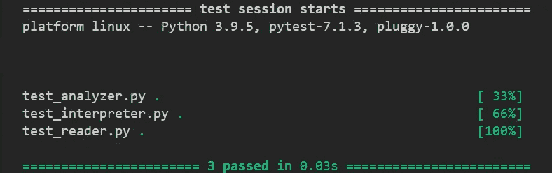
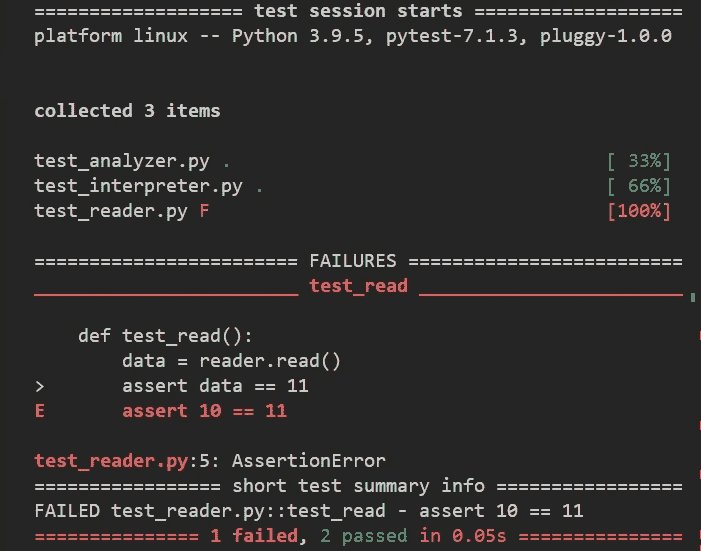
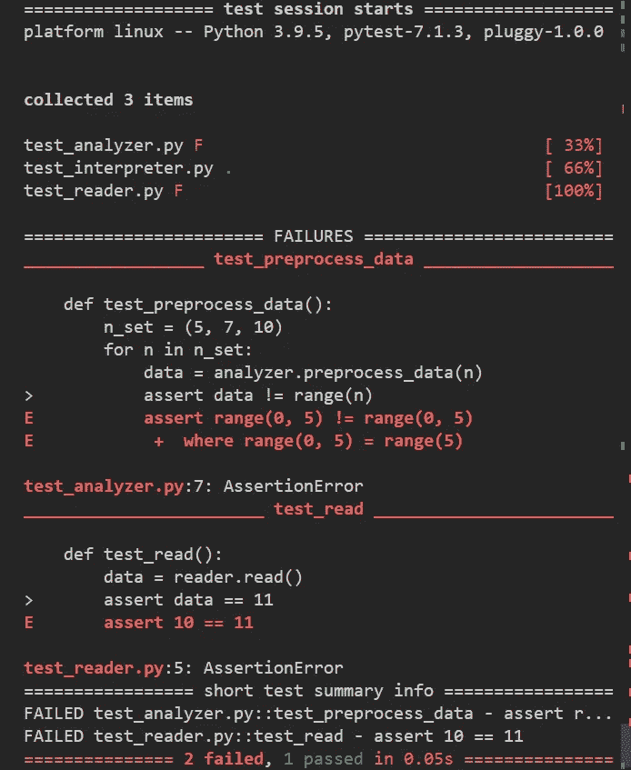
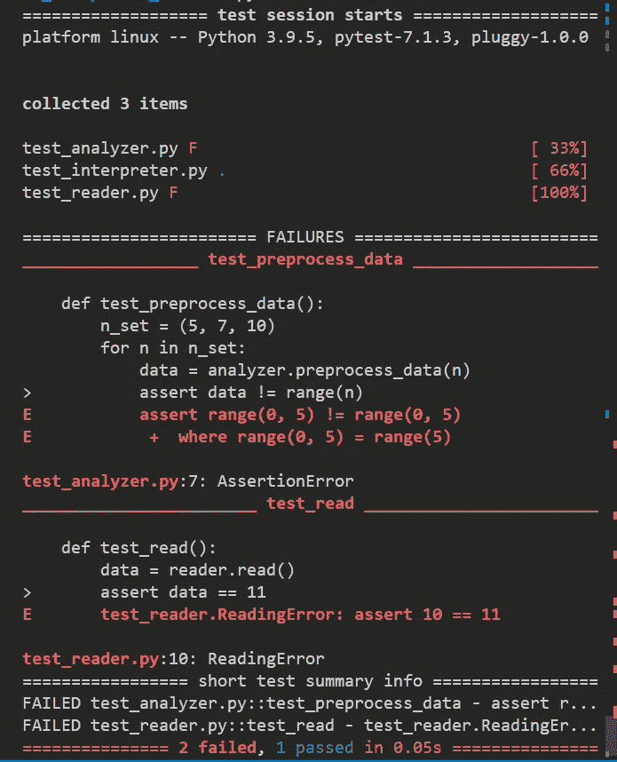

# 如何在 Python 中覆盖 AssertionError 并使用自定义异常

> 原文：<https://betterprogramming.pub/how-to-overwrite-asserterror-in-python-and-use-custom-exceptions-c0b252989977>

## Python 的 assert 语句使用 AssertionError。了解如何使用不同的异常


马克·特里亚皮奇尼科夫在 [Unsplash](https://unsplash.com?utm_source=medium&utm_medium=referral) 上拍摄的照片

假设您是 PharmaDharma 项目的 Python 开发人员。您正在使用`pytest`为代码编写单元测试。`pytest`是一个丰富的测试框架，但归根结底，大部分都要使用`assert`，这是一个 Python 内置语句，使您能够检查条件是否有效。

当您使用`assert`语句进行测试时，您被迫使用`AssertionError`。除了断言失败之外，它不携带任何其他信息。您可能想知道为什么您被迫使用它，即使您可能希望使用`ValueError`或`TypeError`——或者[一个定制的异常，就此而言](https://towardsdatascience.com/should-we-use-custom-exceptions-in-python-b4b4bca474ac)。这些错误难道不比`AssertionError`更能说明问题吗？

当然，您可以使用带有`AssertionError`的消息，但是一个定制的异常可能非常有用，即使没有消息。你想，为什么我一定要用`AssertionError`？今天，我想用点别的！为什么我不能对每个模块使用不同的错误？或者甚至是每个类和函数？

在本文中，我将向您展示让`assert`语句引发不同的异常而不是`AssertionError`有多简单。我想你可能会对这个戏法的简单感到惊讶。

下一节将展示一个简单的例子，说明`assert`如何在`pytest`中工作。如果`pytest`和`assert`对您来说并不陌生，您可以直接跳到“如何使用自定义异常”一节。

# pytest 和 assert

当你决定使用`pytest`时，通常你会最终使用`assert`语句作为测试的主要工具。假设我们的 PharmaDharma 由三个模块组成:

*   【PharmaDharma 数据读取模块
*   `analyzer.py`:数据分析模块
*   `interpret.py`:用于解释和可视化数据的模块

类似地，我们将在三个相应的测试模块中收集单元测试:

*   `test_reader.py`
*   `test_analyzer.py`
*   `test_interpret.py`

每个都将收集在相应模块中收集的所有函数和类的测试。为了简单起见，我们将使我们的模块过于简单，每个模块都由一个函数组成，或者说是它们的一些过于简化的[模仿](https://en.wikipedia.org/wiki/Mock_object)。例如:

现在，我们将编写相应的测试文件:

这些都是过于简单的测试，没有什么意义。我没有使用过 conftest 文件或者参数化测试，只是简单的断言。

三项测试全部通过:



我们的 *PharmaDharma 应用程序的 pytest 输出，编辑后删除了路径。来源:图片由作者提供。*

如果这是您第一次使用`pytest`，并且您想要运行这个例子，那么本文末尾的附录展示了如何组织项目和运行测试。

让我们看看测试失败时的输出是什么样的。为此，我们来改变一下`test_read`测试:

现在，您将看到以下输出:



我们的 PharmaDharma 应用程序的 pytest 输出，编辑后删除了路径。有一项测试没有通过。来源:图片由作者提供。

现在把注意力集中在失败上。我们看到模块`reader`的测试失败了，因为`test_read()`失败了(正如我们预料的那样)。失败是因为 10 不是 11。因此我们看到红色的`E assert 10 == 11`，其中`E`代表错误。然后我们看到以下内容:


所以，这是第 5 行的`test_reader.py`文件，`AssertionErorr`被提出。

现在让我们再介绍一个错误，这次是关于`test_analyzer.py`:

运行测试后，我们看到:



我们的 PharmaDharma 应用程序的 pytest 输出，编辑后删除了路径。两次测试都没有通过。来源:图片由作者提供。

我们已经说到点子上了:两个测试都通过了，因为完全相同的`AssertionError`，它并没有告诉我们太多，不是吗？

# 如何使用自定义异常来代替？

要使用一个定制的异常来代替`AssertionError`，你可以使用一个如下所示的小技巧。在`test_reader.py`中，在导入后添加以下行:

此后，您将看到以下输出:



我们的 PharmaDharma 应用程序的 pytest 输出，编辑后删除了路径。两个测试都没有通过，但是这一次 test_reader.py 的测试没有抛出 AssertionError 而是 ReadingError。来源:图片由作者提供。

这是我想给你看的魔术。归结起来就是这句话:

以下是如何使用这一技巧的例子:

*   用项目的通用自定义异常覆盖`AssertionError`，如`PharmaDharmaError`
*   在每个模块中独立地重写`AssertionError`，就像我们为`test_reader.py`所做的那样；同样，我们可以在`test_analyzer.py`中用`AnalyzingError`覆盖`AssertionError`
*   为每个函数/类覆盖`AssertionError`；这将需要创建特定于函数或类的错误，并在专用的测试模块或内部测试函数中覆盖它们。
*   用内置的异常来覆盖`AssertionError`,这些异常更多地说明了特定测试中发生了什么；如上所述，这意味着在每个测试函数中覆盖`AssertionError`。

当您在代码中使用`assert`语句时，您也可以使用这个技巧——除非出于开发目的，否则您很少会这样做。我认为这是一种特定的情况，在这种情况下，内置或自定义错误比`AssertionError`更能提供信息。

然而，在生产代码中，如果您想要运行断言，您可能希望使用不同的工具——原因很简单，在生产代码中不应该使用`assert`。这是因为代码中所有的`assert`实例都可以用一个`-O`标志关闭，就像这个调用:`python -O my_app.py`。

这个标志将关闭所有断言(例如，你将在这里读到更多的)。在这种情况下，您可能希望使用专门用于这种情况的`[easycheck](https://github.com/nyggus/easycheck/)`[Python 包](https://github.com/nyggus/easycheck/)。你可以在这篇关于比较浮点数的文章中找到使用这个包的例子。

# 结论

我给你展示了一个覆盖`AssertionError`的小技巧。当断言失败时，如果您希望错误消息更有意义，它可以帮助您。正如我在上面展示的，您可以在各种场景中这样做，有些场景没有其他场景复杂。

尽管如此，你应该三思而后行使用这种伎俩。只有当你知道自己在做什么，并且有目的时，才使用它。虽然我不相信它能破坏任何东西，但使用它会改变 Python 的典型行为，这至少会导致混乱。当你知道自己在做什么时，这种改变的行为不会让你感到惊讶，但你的同事可能会感到惊讶——有些是积极的，有些是消极的。

感谢阅读。总而言之，我写这篇文章并不是为了说服你用其他内置异常或自定义异常来覆盖`AssertionError`。但是我认为这一招的知识可以帮助你发展你的 Python 编程技能。几年来，我不知道这样的事情是可能的。我当然知道覆盖是 Python 中一个强大的工具，但不知何故，我没有想到我可以覆盖内置的异常，或者为什么我应该这样做。

现在我知道了如何去做和它是如何工作的，我觉得我知道了 Python 的另一个复杂之处，因此我更好地了解了这门语言。如果你觉得这个技巧很有趣，最重要的是，如果你已经在你的项目中成功地使用了它，请在评论中告诉我。

# 附录:PharmaDharma 项目组织机构

在本文中，我使用了一个非常简化的 Python 项目结构，这是我自己的项目中没有使用的结构。这是因为我想避免`pytest`出现任何问题。这是因为`pytest`有时会抛出难以在另一台机器上复制的错误。我在这里使用的组织非常简单，我不认为任何人会在使用`pytest`运行测试时遇到问题，除非是由于不正确的虚拟环境。

在我的项目中，我几乎总是打包代码。我很快会写一篇关于这个的文章。为了简化事情，可以使用`[makepackage](https://github.com/nyggus/makepackage/)`[Python 包](https://github.com/nyggus/makepackage/)，这样事情就简单了。你可以使用 shell 命令`pip install makepackage`从 [PyPI](https://pypi.org/project/makepackage/) 安装它。

转到机器中您想要创建项目的特定位置。创建一个`PharmaDharma`文件夹:

现在您已经在里面了，创建一个 Python 虚拟环境。然后激活并安装`pytest`:

shell 提示符前的`(venv-ph-dh)`(这里是`>`)表示你正在`venv-ph-dh`虚拟环境中工作。如果您没有看到它，请检查发生了什么。还有一个小概率是，您的机器有一个格式奇怪的定制提示，不显示虚拟环境(如果您计划使用 Python，您应该更改这种格式)。这些主题远远超出了本文的范围，所以我不得不离开你。

让我们创建一个源文件夹，我们将在其中保存我们的代码和测试文件:

现在，将所有文件保存在这个`src`文件夹中。要运行测试，在项目的根文件夹中使用下面的简单命令，在我们的例子中是`src`。

仅此而已。

**注意**:通常情况下，我们应该将测试保存在一个专用的`tests`文件夹中，这样我们就可以对你的项目进行如下组织:

```
PharmaDharma
+-- venv-ph-dh
+-- pharma_dharma
|  +-- src
|  +-- tests
```

在这个文件夹组织中，`pharma_dharma`是项目的根文件夹，而不是`PharmaDharma`。您不应该将虚拟环境保存在您的根目录中。

同样，如果你想了解更多，你可以阅读`[makepackage](https://github.com/nyggus/makepackage/)`的文档，或者一篇我发表后会链接到这里的文章。

# 资源

[我们应该在 Python 中使用自定义异常吗？](https://towardsdatascience.com/should-we-use-custom-exceptions-in-python-b4b4bca474ac)

[GitHub — nyggus/makepackage:用于轻松打包 Python 代码的包](https://github.com/nyggus/makepackage/)

[制作包](https://pypi.org/project/makepackage/)

[GitHub — nyggus/easycheck](https://github.com/nyggus/easycheck/)

[用 easycheck 比较浮点数](https://towardsdatascience.com/comparing-floating-point-numbers-with-easycheck-dcbae480f75f)

[模拟对象—维基百科](https://en.wikipedia.org/wiki/Mock_object)

[](https://medium.com/@nyggus/membership) [## 加入我的介绍链接媒体-马尔钦科萨克

### 阅读马尔钦·科萨克(以及媒体上成千上万的其他作家)的每一个故事。您的会员费直接支持…

medium.com](https://medium.com/@nyggus/membership)