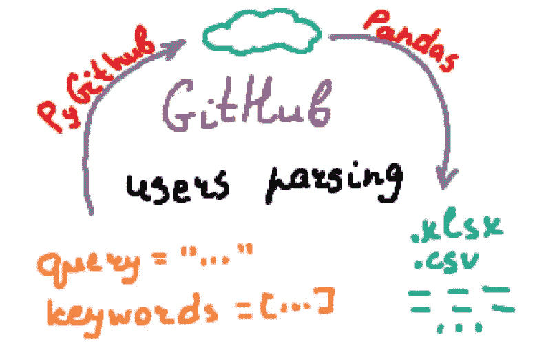
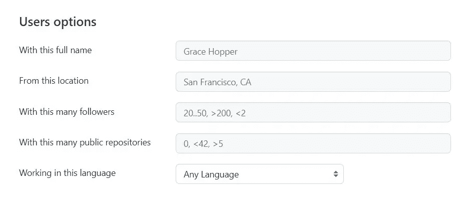
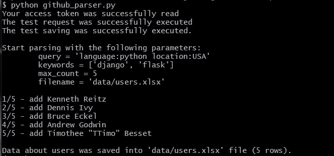
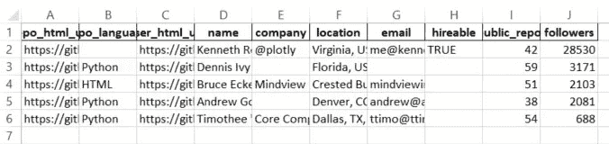
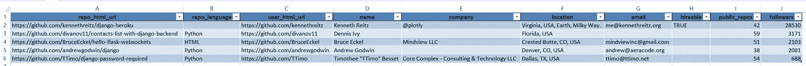

# 如何基于位置和多个关键词解析 GitHub 用户

> 原文：<https://betterprogramming.pub/how-to-parse-github-users-based-on-location-and-multiple-keywords-c08d68578c8d>

## 人力资源部门使用 PyGithub 库的案例



预览。作者图片

我的一个好朋友是人力资源专员。他与候选人沟通，进行面试，还有许多其他职责，但有时他必须手动搜索某个职位的候选人。

最近，他向我提出了一个请求:“嘿，你一定可以写一个程序，它会解析 GitHub，并根据招聘职位为我输出一些用户。这对我帮助很大。肯定比手动搜索更高效更快捷！”

好吧，让我们试试。

# GitHub 搜索 API

首先应该说 GitHub 有*相当丰富的搜索功能*。即使没有第三方库直接使用 [GitHub 搜索 API](https://docs.github.com/en/rest/reference/search) ，也能获得大量信息。但是像 [PyGithub](https://pygithub.readthedocs.io/en/latest/introduction.html) 这样的库承担了使用 API 的微妙之处——它们返回类而不是原始 JSON，监控返回元素的数量，并做许多其他有用的工作。

如果你不使用 Python，像我一样，你可以在这里[找到一些其他语言的官方或第三方库](https://docs.github.com/en/rest/overview/libraries)。有很多，你一定会为你喜欢的语言选一个:。NET，Java，JavaScript，PHP，甚至 Go，Julia 或者 Scala，还有很多很多其他的。


你可以使用大量的编程语言。作者图片

# 程序的本质

其实这篇文章现在就可以写完。我花了大部分时间试图弄清楚请求的格式，并找到正确的库。然后一切都像时钟一样。

让我用一个很好的旧流程图来解释程序的功能。这是非常高层次的，错过了很多细节，但它将有助于了解正在发生的事情。


程序的本质。作者图片

首先，我们需要获得使用某种请求的用户的信息。在我看来，最方便的方法是使用形式为`location:... language:...`的查询，尽管搜索 API 允许您设置更复杂的查询。我们将在后面的**参数**部分讨论更多关于构造查询的内容。

仔细检查收到的列表，我们查看每个用户的存储库中是否存在任何关键字。搜索是在存储库的名称和描述中执行的，尽管您也可以在这里添加`README.md`文件的内容。如果在任何用户存储库中找到了任何关键字，该用户将被添加到结果表中——关于他的信息将被保存，搜索将继续进行。

如果出现意外错误或达到所需的用户数量，信息将保存到. xlsx 或。csv 文件使用[熊猫库](https://pandas.pydata.org/docs/getting_started/index.html)。

为什么不在第一步就停下来呢？因为搜索 API 不允许您在用户搜索请求中指定关键字。事实上，你可以，但根据我的实验，这将产生更糟糕的结果。

例如，您可以指定一种编程语言，但是通过在请求中设置 *Python* ，您将在一个响应中得到 *Python 后端开发人员*和 *Python ML 工程师*，这将许多位置混合成一堆。我将在**参数**部分详细讨论这一点。

在存储库中，这些代码被打包成一个类，但是类`parse_users()`的 main 方法做的正是上面描述的事情。请随意试验这段代码，以增加更多的灵活性或功能。让我知道它是否会成长为一个大项目:)

# 关于参数的更多信息

程序有 6 个参数必须设置:`is_path`、`token_or_path`、`max_count`、`filename_to_save`、`query`和`keywords_list`。让我们更详细地研究一下它们。

一对参数`is_path`和`access_token_path`设置您的 GitHub 令牌。要获得它，注册一个 GitHub 帐户，然后进入设置中的[令牌页面。点击**生成新令牌**，确认您的密码，在**备注**字段中填写任何内容，选择**到期**选项之一，点击页面底部的**生成令牌**，复制您的令牌。请注意，每个令牌都有一个过期期限，该程序将无法使用过期的令牌。GitHub 会在到期前几天给你发邮件，所以确保你创建了一个新的令牌或者选择了**无到期**选项。然后:](https://github.com/settings/tokens)

*   如果`is_path` =True，`token_or_path`必须是到的路径。包含访问令牌的 txt 文件；
*   如果`is_path` =False，`token_or_path`必须是直接访问令牌。

`max_count`参数是一个整数，它设置了想要获得的用户数量。这个数字等于结果表将包含的行数。

`filename_to_save`参数设置保存结果数据的文件名，包括扩展名。数据可以保存为 Microsoft Excel 格式(。xlsx)或逗号分隔值(。csv)。

一对参数`query`和`keywords_list`设置了解析的目的——这些参数的组合定义了程序输出。

*   `keywords_list`是一个 Python 列表，包含不同的搜索关键字。你可以想加多少关键词就加多少，也可以一个都不加；
*   `query`是根据 GitHub 搜索 API 的搜索查询。

它是根据一定的规则形成的，可以指定:

*   用户的位置；
*   对关注者或公共存储库数量的限制；
*   和编程语言。

也可以指定一个名字，但我觉得没什么意义。您可以通过检查[高级搜索页面](https://github.com/search/advanced)和[官方 GitHub 文档](https://docs.github.com/en/search-github/searching-on-github/searching-users)来验证这一点。



用户选项。一个[公共网页的截图](https://github.com/search/advanced)

正如我上面所说的，对于这个任务来说，最合理和最广泛使用的查询格式是指定一个位置和语言。但是正如您所看到的，API 允许您创建更强大的查询。

你可以在下面看到不同查询的例子。

# 运行程序

该程序可在[git lab 资源库](https://gitlab.com/Winston-90/github_users_parser)中获得。

[](https://gitlab.com/Winston-90/github_users_parser) [## dmytro Nikolai ev/github _ users _ parser

### 使用 Python 和 PyGithub 库用多个关键字搜索 GitHub 用户

gitlab.com](https://gitlab.com/Winston-90/github_users_parser) 

在其他辅助文件中，这个存储库包含 Python 脚本`github_parser.py`和`guthub_parser.ipynb`笔记本。它们有相同的内容，所以你可以使用命令提示符或 Jupyter 笔记本来运行这个程序。

为了简单起见，我建议您将这个程序作为常规的 Python 脚本运行。如果你不知道如何做到这一点，检查[这个教程](https://realpython.com/run-python-scripts/)。事实上，您需要做的只是几个简单的步骤:

1.  确保您已经安装了 Python 和所需的库。否则，[安装 Python](https://www.python.org/downloads/) 并安装库:

*   您应该创建一个虚拟环境(尽管这不是强制性的)，激活它，并运行`pip install -r requirements.txt`。
*   您也可以直接使用 conda 或 pip 安装这些库。您可以在`requirements.txt`文件中看到库的列表。

2.用任何文本编辑器打开`github_parser.py`文件，并在第 218–246 行的**设置参数**部分**设置您的参数。记住，如前所述，您必须指定访问令牌。不要忘记保存文件。**

3.然后用`python github_parser.py`命令运行程序。

设置好环境和有效的访问令牌后，在不更改其他参数的情况下，您将在命令行上看到如下内容:



使用默认参数执行脚本的结果。作者图片

通过打开`data/users.xlsx`文件你会看到以下内容:



带有默认参数的程序的输出。作者图片

它可以很快变成一个更有吸引力的版本。使用 **Ctrl+T** 快捷键创建表格，并使用**Main—Format—AutoFit Column Width 设置列宽(i** 在某些版本的 Excel 中，这是自动发生的，而在某些版本中则不是)。


让你的桌子更有吸引力。作者 Gif

经过这些简单的转换后，您就可以得到一个可以工作的表格了。该表的字段是不言自明的。



结果表。作者图片

当然，一些用户没有指定关于他们自己的数据，并且表中的每一行都需要特别注意，但是正如我前面所说的，这比手动搜索要好得多。

关于执行时间—用户大约需要 3 秒钟。当然，这很大程度上取决于您的互联网连接、您的请求的复杂性等。

# 结论

我面对这个任务完全不知道如何解决，但几天后，我已经有了一个工作程序的原型。我对这个结果很满意，我认为它会对你有用。

## 对你有用的资源

*   高级 GitHub 搜索以形成正确的查询—[https://github.com/search/advanced](https://github.com/search/advanced)
*   在 GitHub 上搜索信息—[https://docs.github.com/en/search-github](https://docs.github.com/en/search-github)
*   PyGithub 文档—【https://pygithub.readthedocs.io/en/latest/introduction.html 

```
**Want to Connect?**If you have an queries, hit me up on [LinkedIn](https://www.linkedin.com/in/andimid/) or [Twitter](https://twitter.com/dimid_ml).
```