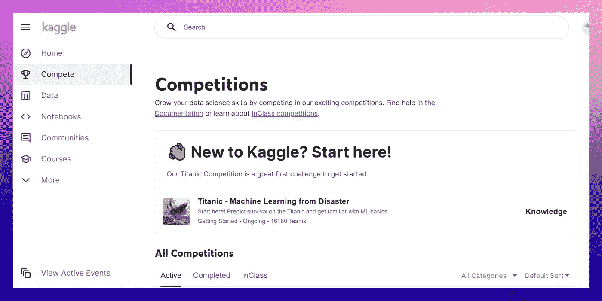
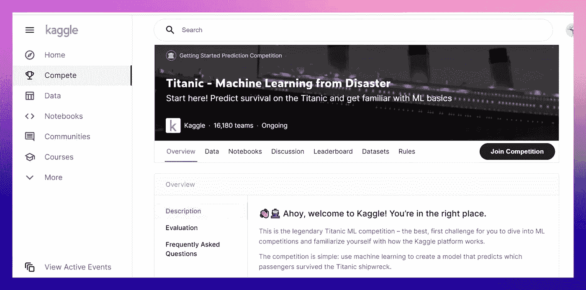
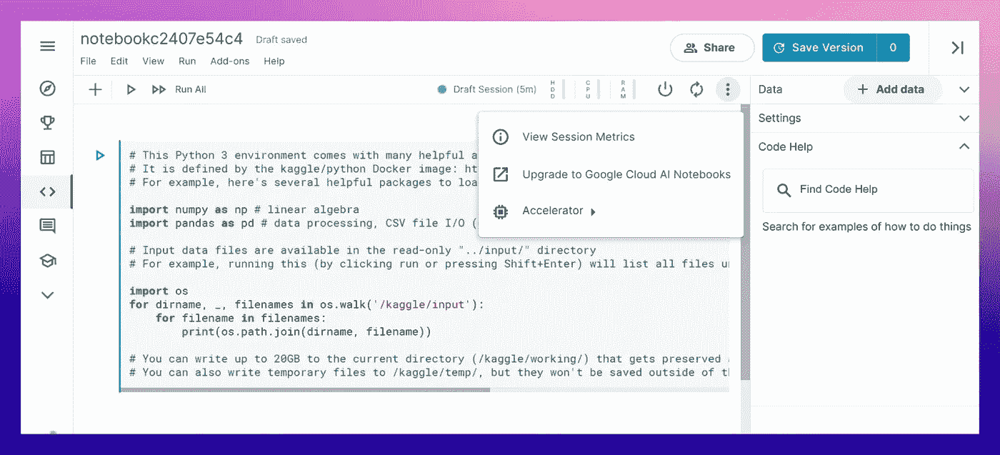
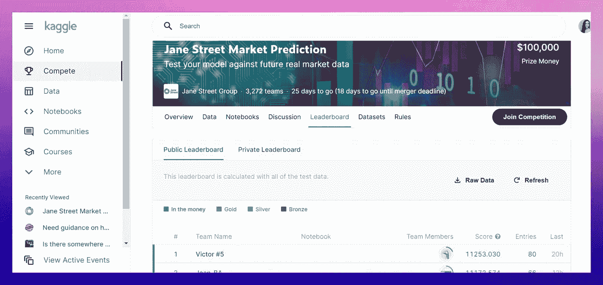
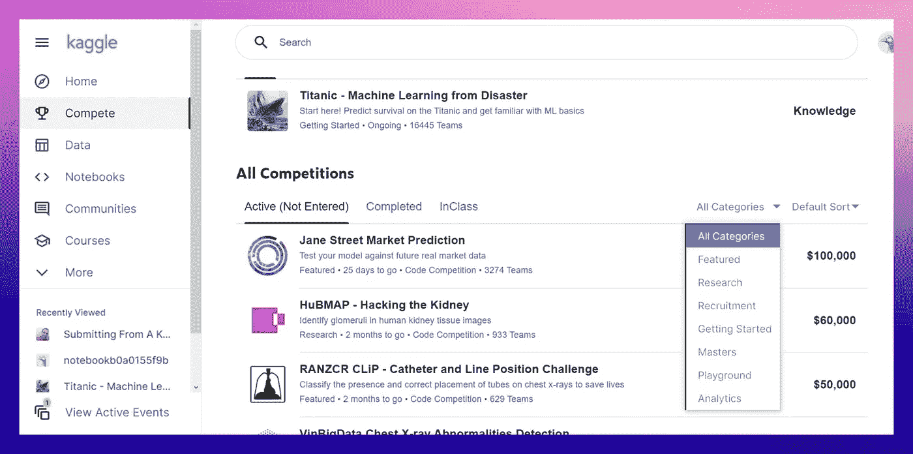

# 如何参加 Kaggle 比赛

> 原文：<https://betterprogramming.pub/how-to-participate-in-a-kaggle-competition-82c5ba83e41c>

## 入门所需的一切

菲尔·霍金森在 [Unsplash](https://unsplash.com/s/photos/competition?utm_source=unsplash&utm_medium=referral&utm_content=creditCopyText) 上的照片

对于任何学习机器学习的人来说，Kaggle 是第一个要去的地方。这个互动的在线平台提供了数百个数据库和教程，你可以用它们来启动你的 ML 职业生涯。

但是这个网站最出名的是它的竞赛。对于一个新来的人来说，很难在界面中定位自己，也不知道从哪里开始。所以，在这篇文章中，我们将带你开始你的第一次 Kaggle 比赛！

# 关于 Kaggle 竞赛的几句话

Kaggle 竞赛是由 Kaggle 或谷歌或世卫组织等其他公司制作的机器学习任务。如果你竞争成功，你可以赢得真钱奖。

竞赛在问题的类型和复杂性方面有所不同。即使你是初学者，你也可以参加。然而，高级比赛要有趣得多，在一场比赛中取得领先地位对你的机器学习工程师简历来说是一个很好的补充。

比赛有三种不同的形式:

## 简单的比赛

这些是你的标准卡格尔比赛。您访问数据、构建模型并提交。然后，比赛主持人会检查你的成绩，并在排行榜上给你打分。Kaggle 上的大多数比赛都遵循这种形式。

## 两阶段竞争

在两阶段比赛中，每个挑战都有两个部分。第二阶段提供一个新的测试数据集，该数据集在该阶段开始时发布。要访问它，你必须在第一阶段提交。要想成功参加此类比赛，需要仔细阅读规则，盯紧时间线。

## 代码竞赛

在代码竞赛中，提交的内容来自 Kaggle 笔记本(我们稍后会解释它是什么)。在某种程度上，这些竞争更加公平，因为所有用户都拥有相同的硬件。代码竞赛可能会对您可以提交的笔记本有所限制。例如，CPU 或 GPU 运行时间、使用外部数据的能力以及对互联网的访问。所以，阅读这里的规则也很重要。

在 Kaggle 比赛中，每个人都以一人或多人为一组进行比赛。每个团队都必须有一个团队领导。你可以邀请你的朋友或通过比赛中的团队标签加入其他用户的团队。您的团队也可以与另一个团队合并，例如，如果您意识到独自提交模型太具挑战性。但是，你只能做到某个截止日期。如果您想了解任何其他细节，请随时浏览 [Kaggle 竞赛页面](https://www.kaggle.com/docs/competitions#forming-a-team)。

# 如何使用 Kaggle 进行竞争

让我们学习如何使用平台。注册后，您会被重定向到一个个性化的订阅源，其中包含您可能感兴趣的帖子、比赛和讨论。从这里，您可以转到“竞争”选项卡。

点击泰坦尼克号比赛。所有新注册的用户都被邀请参加一个简单的比赛，以了解 Kaggle 的工作原理。就算你不懂编码，也不是问题。

在[泰坦尼克号比赛](https://www.kaggle.com/c/titanic/overview)中，你需要使用机器学习来创建一个模型，预测哪些乘客在泰坦尼克号沉船中幸存。你被要求建立一个预测模型来回答这个问题:“哪些乘客更有可能幸存？”使用姓名、年龄、性别、社会经济阶层等数据。

每个竞赛都有这些标签:

*   在**数据**中，你会找到用来训练和测试你的模型的数据集。
*   **笔记本**是你的工作空间。它们包含教程、博客文章和文档。它们也可以在你不安装任何东西的情况下执行代码。
*   在**讨论**中，你可以和其他参与比赛的人交流，提问，给出建议。
*   **排行榜**显示参赛选手的分数。
*   **数据集**包括参与者添加的附加数据集。
*   最后，**规则**包含了比赛的规则。

如果你想参加，请点击“参加比赛”

# 如何提交你的第一份材料

现在让我们一步一步地学习如何参加比赛。

## 1.下载数据

如果您想在启动内核之前做一些初步的探索性分析，或者只是将文件放在您的计算机上，请转到 Data，向下滚动，然后单击 Download all。

## 2.阅读规则

是的，这很重要。例如，有时规则可以对数据的使用施加限制。你需要遵守这些规则以避免被取消资格，尤其是那些由第三方机构举办的比赛。

## 3.研究开放的内核

你可以访问其他人的公共笔记本，看看他们是如何处理这个问题的。去比赛的 tab 笔记本就行了。研究排名前 1%-3%的最佳例子肯定是有用的。没有胜出的解决方案也很方便，因为您可以检查它们，并寻找需要改进的地方。

## 4.创建您的内核

你可以在 Kaggle 内核上建立模型。这个带有免费 GPU 的可定制 Jupyter 笔记本环境非常方便，预装了库，并允许您生成 CVS 预测文件进行提交。

要创建自己的内核，请转到“笔记本”选项卡，然后单击“新建笔记本”。通过点击添加数据->竞赛数据->添加，轻松地将您的数据添加到提交内容中。不需要上传任何东西。

如果您与其他人一起工作，您可以通过单击“共享”按钮轻松地与同事共享您的笔记本。笔记本允许您在提交的不同版本之间切换，并安全地存储它们。您可以向保留的目录中写入高达 20GB 的数据。

## 5.提交呈文

Kaggle 上的提交是 CSV 格式的，通常有两列:ID 列和预测列。上传您提交的内容，并获得准确性分数。

要尝试在 Kaggle 上提交，请遵循这个[教程](https://www.kaggle.com/alexisbcook/titanic-tutorial)。它甚至为你提供代码；不需要写任何东西。

## 6.查看排行榜

看谁赢了总是令人激动的！查看您的模型在排行榜上的排名。您可以赢得金牌、银牌或铜牌，这将提高您在平台上的声誉。在高级比赛中，有可能赢得丰厚的奖金。

## 7.提高你的分数

通常有可能提高你的分数，甚至在排行榜上排名更高。阅读讨论，提出问题，并从其他竞争对手那里获得见解，以进行学习和改进。

# 如何在 Kaggle 上找到适合初学者的比赛

如果你没有太多机器学习的经验，可能很难找到适合初学者的比赛。我建议你使用过滤。

我们现在感兴趣的类别是入门和游乐场。其他类别提供了更高级的任务，这些任务在开始时可能看起来令人沮丧。但是，让我们简要地谈谈所有这些问题:

*   **精选。**第三方组织的比赛提供丰厚的奖品。通常，滚动窗口是 2-3 个月。
*   **研究。面向研究的任务几乎没有奖金，但它们有助于提升你的技能。**
*   **招聘。想要雇佣精英中的精英的公司可以举办这样的比赛来雇佣数据科学家。**
*   **入门。**这些比赛是为那些刚刚开始学习 ML 进行练习的人准备的。通常，他们没有任何奖金池，但有时可以提供小额奖励。提交入门材料更容易，因为网上有大量的教程和示例提交。您可以随时输入它们。
*   **大师。** Kaggle 有等级之分，成为 Kaggle 大师是相当有声望的。它甚至可以被你的雇主在招聘过程中考虑。有时 Kaggle 会举办一些比赛，让精英中的精英相互竞争。
*   **游乐场。这些提交的内容通常与游戏有关，而且大多是为了好玩。它们适合已经获得了一点点经验，想要成长的初学者。**
*   **数据分析。**此类别专门用于数据分析。

然而，如果您应用过滤器入门，您将只看到一些竞争。一旦你获得了一些经验，就可以随意探索更多的选择。使用搜索来查找帖子和讨论主题是一个好主意，在那里人们可以分享他们对适合初学者的比赛的看法。

以下是我的建议:

*   学会用线性回归[预测房价](https://www.kaggle.com/c/house-prices-advanced-regression-techniques)。
*   预测申请人是否有能力偿还[贷款](https://www.kaggle.com/c/home-credit-default-risk)。
*   尝试计算机视觉，教机器[识别手写数字](https://www.kaggle.com/c/digit-recognizer)。
*   [预测人脸图像上的关键点位置](https://www.kaggle.com/c/facial-keypoints-detection)以分析面部表情或跟踪图像和视频中的人脸。
*   用谷歌的 Word2Vec 迈出情感分析的第一步。
*   在音频文件中练习[解码莫尔斯电码](https://www.kaggle.com/c/word2vec-nlp-tutorial)。
*   探索一场不寻常的竞争，你的对手是电脑。
*   学会使用张量处理单元进行[花分类](https://www.kaggle.com/c/tpu-getting-started)。
*   用 GANs[制作艺术品](https://www.kaggle.com/c/gan-getting-started)。

难度上一步:

*   创建一个算法[区分狗和猫](https://www.kaggle.com/c/dogs-vs-cats)。
*   教你的算法给[分类树叶](https://www.kaggle.com/c/leaf-classification)。
*   学会[预测出租车行程的时长](https://www.kaggle.com/c/nyc-taxi-trip-duration)。
*   用一个[可接近的 ML 数据库](https://www.kaggle.com/c/tabular-playground-series-jan-2021)练习回归技巧。
*   创建一个人工智能在一个简单的游戏中与他人对战。
*   多练习[打造 AI 游戏代理](https://www.kaggle.com/c/hungry-geese)。

如果您有任何比赛要添加，请随时将您的想法发送给我们，我们会将它包含在帖子中。

# 在 Kaggle 比赛中我会处理什么样的问题？

Kaggle 竞赛多种多样，但在大多数情况下，它们会处理以下问题之一:

*   分类
*   回归
*   计算机视觉
*   图像处理
*   自然语言处理

算法的选择取决于你正在处理的问题。仅仅通过使用神经网络和深度学习来解决一切问题是很有诱惑力的，而且通常它们确实保证了良好的结果。但不是一直如此。有时坚持人工神经网络只是效率低下。所以不要害怕简单问题的简单解决方案，明智地选择一种机器学习技术。

# 大赛前怎么练？

现在让我们来谈谈在参加比赛之前你能做些什么。

1.  首先，你需要选择一种语言:比赛通常要么用 R 要么用 Python 来主持，有时候用其他语言，比如 Julia。但主要是 Python。
2.  一旦你选择了这门语言，你就可以开始在真实数据集上练习了。我推荐 UCI 机器学习库。尝试解决一个简单的问题，如分类或聚类，看看会发生什么。UCI 的数据集是按问题分组的，所以你很容易找到自己的方向。不要忘记将数据集分为训练集和测试集，然后将测试集分为“公共”和“私人”集，因为这是检查 Kaggle 上竞争的方式。想了解更多关于[酷酷的 ML 数据集](https://serokell.io/blog/best-machine-learning-datasets)的信息，你也可以浏览我们的博客。
3.  在 Kaggle 或 GitHub 上的笔记本部分，你可能会找到你试图解决的任何简单问题的解决方案，甚至可能使用你使用的相同数据集。在你之前，成百上千的人也在努力学习 ML。随意使用他们的笔记本来获得灵感，这样你就能很好地解释结果。
4.  练习我们提到的简单的纸牌游戏。不要从那些提供数百美元作为奖励的开始。使用其他参与者发布的笔记本和教程来逐步提高您的技能，同时也让自己熟悉该平台的特性。当你提交的作品在排行榜上获得高分(前 10%-25%)后，你就可以开始考虑特色比赛或研究比赛了。

# 如果我没有令人惊叹的硬件用于 Kaggle 比赛，该怎么办？

[高效的硬件](https://timdettmers.com/2018/12/16/deep-learning-hardware-guide/)不会与计算斗争的硬件极大地简化了数据科学家的工作，但升级硬件并不总是可能的。

首先，你可以用 GPU 运行 [Kaggle 内核，加速深度学习模型的训练。了解如何设置它。这个选项的一个很大的优点是它是免费的。然而，从](https://www.kaggle.com/dansbecker/running-kaggle-kernels-with-a-gpu)[的一些评论](https://www.kaggle.com/product-feedback/110496)来看，这种选择并不总是奏效。所以，这里有一些其他的选择。

如果需要更强的电脑能力，可以直接在笔记本里升级到谷歌云 AI 笔记本。你可以免费探索[一些选项](https://cloud.google.com/free)，还可以获得 300 美元的积分。但是当处理大量数据时(例如，训练一个深度学习模型)，你将需要很快升级，并且成本相当高。这就是为什么有些人更喜欢在其他地方建立服务器。在这种情况下，您必须在自己的计算机上设置环境，最流行的选择之一是 Anaconda。如果你决定选择这个选项，使用 Faizan Ahemad 的教程来安装它。

另一个受欢迎的选择是从 AWS、微软 Azure、 [Digital Ocean](https://www.digitalocean.com/) 或类似的公司租用计算机电源。许多人专门为深度学习推荐的平台是 [FloydHub](https://www.floydhub.com/) 和 [Crestle.ai](https://crestle.ai/) 。

# 结论

现在你知道了在 Kaggle 上首次提交所需的一切。唯一剩下的就是开始了。

如果你正在寻找更多关于机器学习的信息，请随意浏览我们的[博客](https://serokell.io/blog/kaggle-competition)。祝你好运，希望你永远好运！

*最初发布于*[*https://sero Kell . io*](https://serokell.io/blog/kaggle-competition)*。*