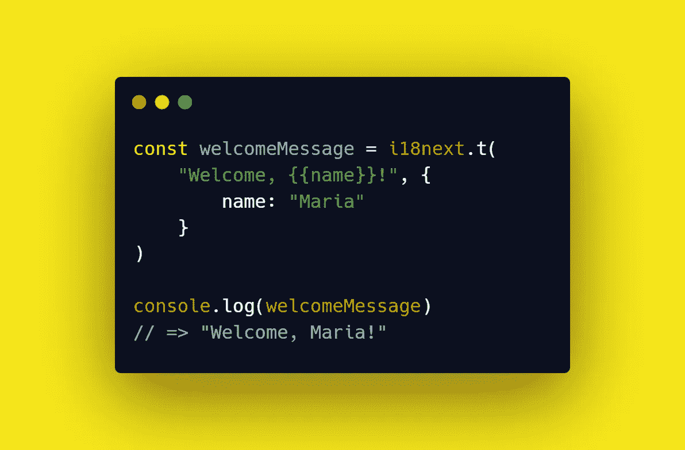

# 如何用 i18next 将变量传递给翻译字符串

> 原文：<https://betterprogramming.pub/how-to-pass-a-variable-to-your-translation-string-with-i18next-b07614c33514>

## 关于 i18next 插值你需要知道的一切



在处理国际化时，您可能需要将动态值集成到翻译中。这是因为您的字符串可能需要外部数据来向最终用户提供完整的信息，比如用户名。

可以想象，这是处理翻译消息时最常见的场景，而`[i18next](https://www.i18next.com/)`为您提供了轻松完成这项任务所需的一切。

因此，让我们深入研究如何使用`i18next`库向您的翻译传递一个或多个变量。

# i18 中的插值接下来

> 插值是 I18N 中最常用的功能之一。它允许将动态值集成到翻译中。— [插值](https://www.i18next.com/translation-function/interpolation)

当定义应该包含一个或多个参数的翻译字符串时，必须以某种方式标识这些参数。具体来说，i18next 允许您使用一个键在翻译字符串中定义一个参数。

正如官方文档中的[所解释的，一个键只不过是一个由花括号括起来的字符串。这就是在`i18next`翻译字符串中识别参数的方法。](https://www.i18next.com/translation-function/interpolation#basic)

在上面的例子中，`name`是一个键，它标识一个应该用用户名替换的参数。这可以通过以下方式实现:

运行时，将返回:

```
Welcome, Antonello!
```

类似地，通过使用更多的键，可以在翻译字符串中定义更多的参数，如下所示:

这将返回以下字符串:

```
Antonello has 5100 followers
```

默认情况下，参数值被转义以避免 [XSS 攻击](https://en.wikipedia.org/wiki/Cross-site_scripting)。您可以通过将`-`字符放在花括号后来禁用此行为:

或者在请求翻译时将`escapeValue`选项设置为`false`:

这只是`i18next`支持的众多翻译选项之一。你可以在这里找到它们。

请注意，禁用 XSS 攻击防御是危险的，应该避免。

## 处理数据对象

`i18next`插值特性允许您将整个数据模型传递给翻译字符串。这将用作插值的值，如下例所示:

同样，这将返回:

```
Welcome, Antonello!
```

# 结论

在这里，我们看了如何将一个或多个参数传递给你的`i18next`翻译字符串。这可以通过利用 i18next 插值特性轻松实现，该特性允许您将动态值集成到翻译中。正如本文所学，您可以传递字符串和对象。此外，您可以使用几种可用的选项来产生完美的国际化消息。

感谢阅读！我希望这篇文章对你有所帮助。