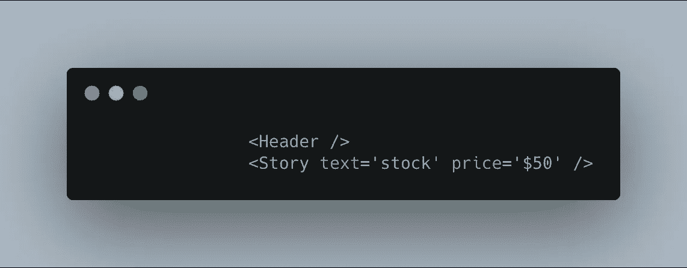
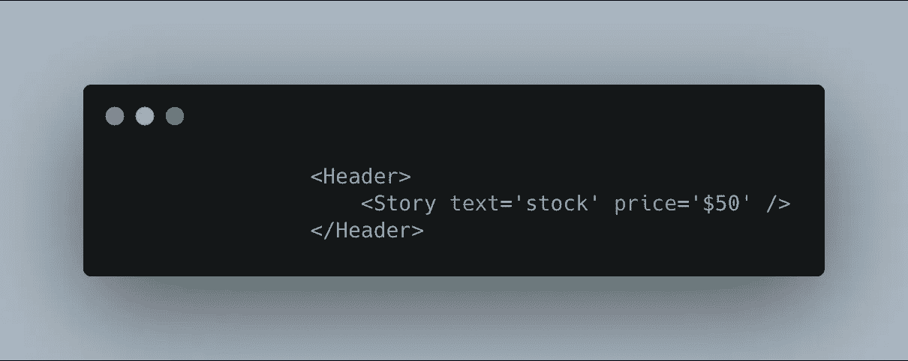
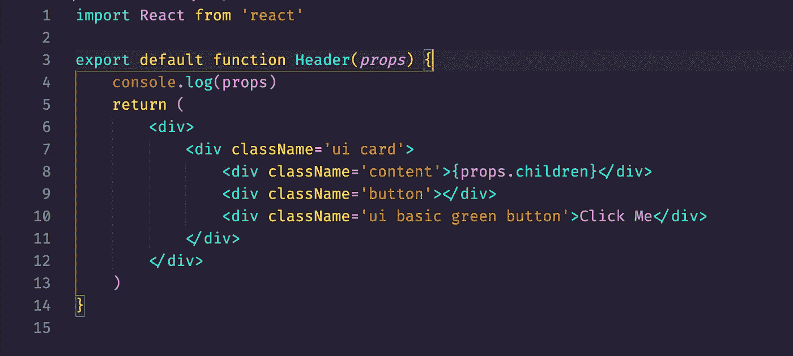
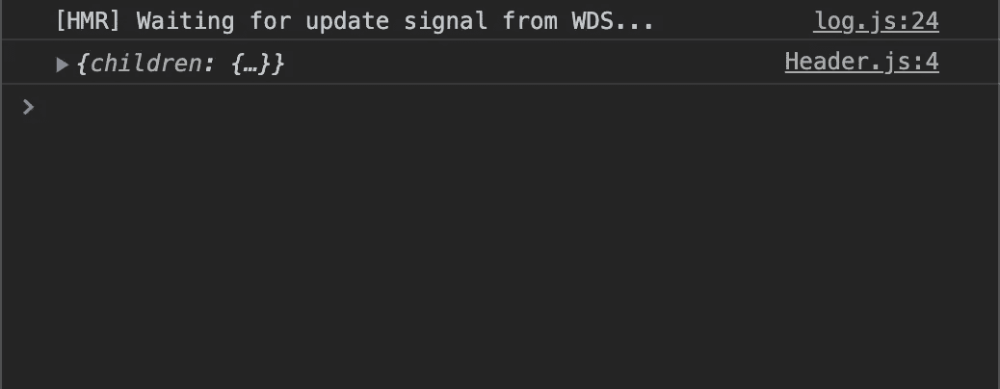
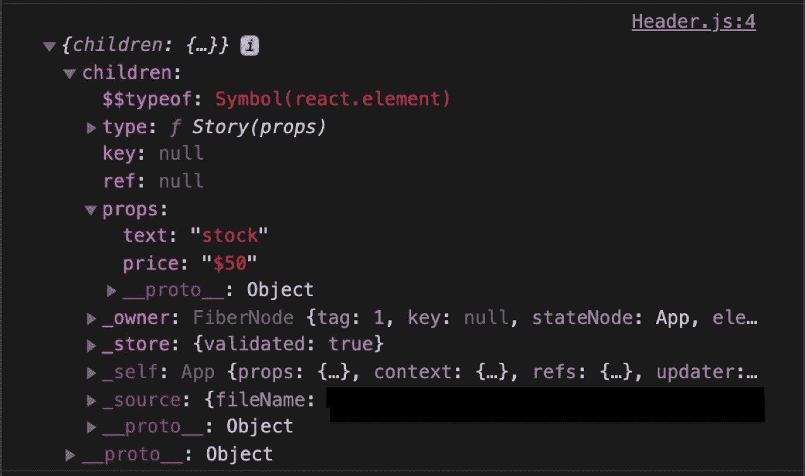

# 如何在 React 中将组件作为道具传递

> 原文：<https://betterprogramming.pub/how-to-pass-components-as-props-4058ea17dff2>

## 道具可以不仅仅是基本的数据类型

[KT](https://unsplash.com/@ktphotographyx?utm_source=unsplash&utm_medium=referral&utm_content=creditCopyText) 在 [Unsplash](https://unsplash.com/s/photos/props?utm_source=unsplash&utm_medium=referral&utm_content=creditCopyText) 上拍照

这首曲子会很短很甜。

在我学习 React 和它所提供的奇妙之处的过程中，我没有意识到我可以把组件作为`props`传递下去。到目前为止，`props`对我来说一直是一个属性名，然后是一些值。然而，为了使我的组件可重用，我知道我可以将整个组件传递给另一个组件。

为此，我们不像上面那样将`Header`组件写成自结束标记，而是用开始和结束标记来编写`Header`组件，如下所示。

现在我将向你展示我的`Header`组件是什么样子的。我还会放入一个`console.log`，这样你就可以在控制台中看到我们取回的对象。

正如你所看到的，我们用一个名为`children`的键获得了一个对象。

在那个对象内部，有一个名为`props`的键，它的值等于另一个对象，每个键/值对等于我们传递给`Story`组件的`props`。为了访问这些我们想要渲染的道具，我们必须使用`props.children`。

在第 8 行，我们写`{props.children}`。这将使我们能够访问从`Story`组件传入的那些道具。

现在我们可以看到文本“股票”和价格“50 美元”。这些是故事中的道具。

即使我们不向`Story`组件传递任何属性，这也是一样的。

如果你把我们给`Story`组件的属性硬编码到`Story`组件的实际主体中，当使用`props.children`时，它们仍然会显示。这就是你如何使你的组件更加可重用。