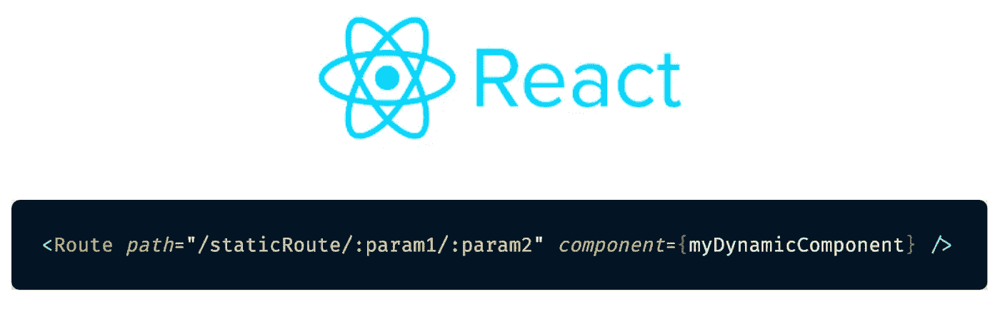
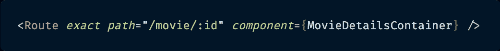
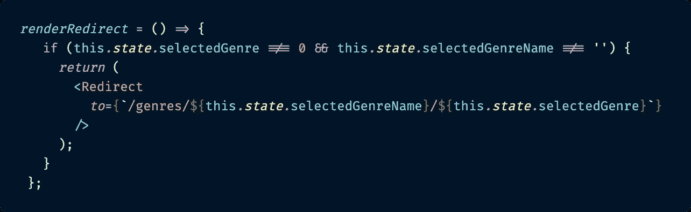
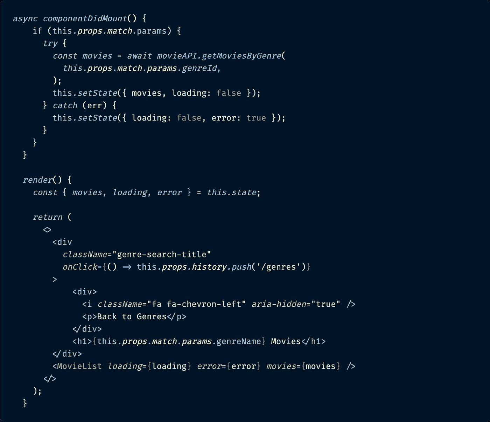

# 如何在 React URL 路径中传递多个路由参数

> 原文：<https://betterprogramming.pub/how-to-pass-multiple-route-parameters-in-a-react-url-path-4b919de0abbe>

## 重定向相当普遍。用它们传递多条动态数据则不是。



URL 路径中多个路由参数的 React 解决方案。

# 介绍

最近，我遇到了一个以前没有遇到过的有趣的问题。我想在 React URL 路由路径中传递多个路由参数，然后在重定向时在组件中访问这些参数。

这个问题的原因出现在我构建一个[演示项目](https://movie-demo-3.paigen11.now.sh/)来说明用 ReactJS 做[响应式 web 设计](https://www.smashingmagazine.com/2011/01/guidelines-for-responsive-web-design/)的各种方法的时候。我使用电影数据库 API 向我的 React 前端项目提供电影数据。

我想让用户看到一个电影类型的列表(动作片、冒险片、喜剧片等)。)，点击一个类型，并被重定向到属于该类型的电影列表。看起来很简单，对吧？


这是用户点击类型列表中的“动作”后应该看到的:被归类为“冒险”电影的电影。

是的，这看起来很简单……除了提供基于类型的电影列表的电影 API 需要一个`genreId`来获取数据，而我想和电影列表一起显示给用户的是他们实际点击生成这个列表的`genreName`。你看到我的问题了吗？

两个不同的数据片段，在从通用的`Genres`组件重定向到显示与该类型相关的电影的特定的`GenreList`组件时，两个不同的、不相关的组件都需要这两个数据片段(所以像通过典型的子组件一样通过`props`传递数据是不可能的)。

令人惊讶的是，当我开始在 React 中寻找如何在 URL 路径中传递多个路由参数的示例时，我没有找到多少。

这就是我今天想分享的内容:如何在 ReactJS 项目中使用 React 应用程序最流行的路由器`[react-router-dom](https://reacttraining.com/react-router/web/guides/quick-start)`进行重定向时添加和访问多个路由参数。

# 反应路线和路线参数

在我继续深入之前，让我澄清一下 ReactJS 中有哪些路由和路由参数，以防您不熟悉。

我将使用我的演示项目 repo，所以如果你想看完整的代码库或工作演示，它们可以在这里[和](https://github.com/paigen11/movie-demo-3)[获得。](https://movie-demo-3-git-master.paigen11.now.sh)

如果你对 ReactJS 中路由的工作方式完全陌生，我建议你先看看`react-router-dom`的[文档](https://reacttraining.com/react-router/web/guides/quick-start)。这将不会是一个深入的解释，但它是我在这篇文章中使用的路由器。

## 路线

**Routes** 指定 ReactJS 应用程序中不同组件的路径。当用户点击一个页面的链接或者点击一个重定向他/她的按钮时，路由器为该组件呈现匹配的`<Route />`。例如，这是我的电影应用程序中的`Genres`页面的路径。

React 中传统的静态路由 URL:


这是 React 应用程序中的静态 URL 路由。

```
<Route *exact* *path*="/genres" *component*={Genres} />
```

这是一个静态路由，不管用户是谁，也不管他们来自哪个页面，它总是相同的。不管怎样，每当他们点击链接进入`Genres`页面时，这条路径总是被用来将他们带到那里，并且总是呈现相同的组件——不需要动态内容。

## 路线参数

**路由参数**是在页面的 URL 中动态设置值的参数。这允许路由呈现相同的组件，同时将 URL 的动态部分传递给该组件，以便它可以根据参数更改其数据。

您可能认识的 URL 路由参数的例子包括产品、书籍、用户的 id，或者在我的例子中是电影的 id。至少在 React 中，为了获得正确项目的详细信息，动态组件需要所提供项目的惟一的、特定的 ID，这样它才能获得正确的数据来显示。

下面是我的应用程序中带有动态 URL 参数的`MovieDetailsContainer`路线的样子。

React 中的动态路由 URL:



这是一条动态路线，带有“: id”占位符，将根据用户输入动态更新。

```
<Route *exact* *path*="/movie/:id" *component*={MovieDetailsContainer} />
```

这是一个动态更新路由的示例。`path`的第一部分`"/movie/”`没有改变，但是`:id`是一个动态设置的路由参数——通常来自用户的操作，比如点击一个链接或者键入一个输入并点击一个搜索按钮。

这就是所发生的变化，它使得`MovieDetailsContainer`被渲染成包含电影的 ID。然后，该组件在渲染时将它从 URL 路径中提取出来，以获取特定电影的详细信息并显示给用户。

## 访问组件中的动态路线参数

通常，在重定向上呈现的组件将从 URL 访问它需要的动态路由信息。

访问 URL 中的动态路径参数:


这是您需要访问以到达 ReactJS 中的 URL 路径的对象。

```
this*.props.match.params.*id
```

在需要 URL 路径数据的 React 组件中，这是您必须用来访问路由的实际 ID 的代码，该 ID 在路由路径中显示为占位符`:id`。我承认这有点冗长，但是在`react-router-dom`的 React hooks 更新之前，这是我们必须用来访问数据的。

在那里，它可以被设置为本地组件状态，用于获取数据，在 JSX 中呈现，等等。

在线教程差不多就到此为止了:一个重定向示例显示了一个单独的`:id`路径参数。这是我的作品开始的地方。

## 设置新的动态路由路径

希望我们现在意见一致。路线很清楚。路线参数清晰。从用户被重定向到的组件访问这些参数是很清楚的。唯一不清楚的是，如果有多个动态路径参数要添加到路径中，该怎么办。

了解了我对`react-router-dom`中 React route 路径的了解，我决定尝试为`GenreList`组件创建一个 route 路径。这个组件使用两个动态参数显示与特定类型相关的电影列表:`:genreName`和`:genreId`。

*注意*:为了清楚起见，我的应用程序的所有实际路径都包含在`src`文件夹中的`App.js`文件中。

`App.js`


这是一个动态路由，URL 中包含“genreName”和“genreId”占位符。

```
<Route
  *exact
  path*="/genres/:genreName/:genreId"
  *component*={GenreList}
/>
```

这是处理包含多个路由参数的路由的第一步。下一步是在`Genres`组件中设置流派 ID 和流派名称。

## 向 URL 添加多个路由参数

除了其他内容之外，`Genres`组件还包含两个状态对象:`selectedGenre`(一个最初设置为`0`的数字)和`selectedGenreName`(一个最初设置为`‘’`的字符串)。这是两种状态，用户单击列表中列出的风格之一即可设置。

一旦用户点击了一个流派，该流派的 ID 和名称就被设置在`Genres`组件的状态中。这触发了下面的`renderRedirect()`函数，将用户重定向到`GenresList`组件，如路由路径所定义的。

`this.state.selectedGenreName`作为路线占位符`:genreName`插入。`this.state.selectedGenre`被替换为路线占位符`:genreId`。

`Genres.js`



用于在 URL 中包含流派名称和流派 ID 的重定向代码。

```
*renderRedirect* = () => {
  if (this*.state.*selectedGenre !== 0 && this*.state.*selectedGenreName !== '') {
    *return* (
      <Redirect 
        *to=*{`/genres/${this*.state.*selectedGenreName}/${this*.state.*selectedGenre}`}
      />
    );
  }
};
```

第二步现在完成了。不相关的`GenreList`组件获取该流派的电影所需的特定流派 ID 是 URL 的一部分，并且还包括流派名称，以显示用户观看电影的流派。让我们转到重定向组件`GenreList`，它现在需要这些数据。

## 从 URL 访问路由参数

好了，最后一步:被重定向到的组件`GenreList`，需要取出动态 React 路由路径的不同部分。它需要`genreId`从电影数据库 API 中获取电影列表，该列表是用`this.props.match.params.genreId`提取的，它需要`genreName`在组件的 JSX 中显示，显示用户点击的类型，该类型是通过`this.props.match.params.genreName`访问的。

相当酷！

`GenreList.js`



用于从数据获取调用的 URL 中取出‘gen Reid’并从 URL 中取出‘gen rename’以在 JSX 渲染代码中显示的代码。

```
if (this*.props.match.*params) {
  *try* {
    *const movies* = *await movieAPI.getMoviesByGenre*(
      *this.props.match.params.genreId*,
    );
    this*.setState*({ movies, loading: false });
  } *catch* (err) {
      this*.setState*({ loading: false, error: true });
    }
  }
}*render*() {
  *return* (
    <>
      <div className="genre-search-title" onClick={() => this.props.history.push('/genres')} >
        <div>
          <i className="fa fa-chevron-left" aria-hidden="true" />
          <p>Back to Genres</p>
        </div>    
        <h1>{this*.props.match.params.*genreName} Movies</h1>
      </div>
      <MovieList
       *loading*={this*.state.*loading}
       *error*={this*.state.*error}
       *movies*={this*.state.*movies}
      />
    </>
  );
}
```

我不相信重定向会这么简单，但事实就是如此！

仅仅通过使用正确的 URL path params 语法(`this.props.match.params...`)并传递相应的变量名(`genreId`或`genreName`)，我就能够取出正确的值。

当从一个不相关的组件重定向到另一个组件时，这种事情可以在任何需要动态数据的地方进行。

# 结论

动态重定向在任何 web 应用程序中都很常见，包括 React 应用程序，但尽管如此，演示它们的教程并不容易找到。不存在包含多条动态数据的重定向的例子，这就是为什么我决定写一篇关于这方面的文章。

在`react-router-dom`的路由路径和动态参数的帮助下，通过重定向将多个数据从一个组件传递到另一个不相关的组件并不像我曾经认为的那么复杂。

过几周再来看看，我会写更多关于 JavaScript、React、ES6 或其他与 web 开发相关的东西。跟着我，这样你就不会错过了！

感谢您的阅读，我希望我已经用动态 URL 路由参数使 ReactJS 重定向更加清晰，并且您会发现这在您自己的应用程序中是有用的。

**如果你喜欢读这篇文章，你可能也会喜欢我的其他作品:**

*   [展开&其余参数:JavaScript ES6 特性系列(Pt 4)](https://itnext.io/spread-rest-parameters-javascript-es6-feature-series-pt-4-c9e9f0c0228f)
*   [JavaScript 的异步/等待与承诺:大辩论](https://itnext.io/javascripts-async-await-versus-promise-the-great-debate-6308cb2e10b3)
*   [字符串模板文字:JavaScript ES6 特性系列(Pt 5)](https://medium.com/better-programming/string-template-literals-javascript-es6-feature-series-pt-5-a40e55a5485b)

# 参考资料和更多资源

*   现场试玩电影网站:[https://movie-demo-3.paigen11.now.sh/genres/Animation/16](https://movie-demo-3.paigen11.now.sh/genres/Animation/16)
*   Github 回购，电影网站:[https://github.com/paigen11/movie-demo-3](https://github.com/paigen11/movie-demo-3)
*   电影数据库 API:[https://developers . themoviedb . org/3/getting-started/introduction](https://developers.themoviedb.org/3/getting-started/introduction)
*   `react-router-dom`文档:[https://react training . com/react-router/web/guides/quick-start](https://reacttraining.com/react-router/web/guides/quick-start)