# 如何使用 Cypress.io 对您的 Web 应用执行端到端测试

> 原文：<https://betterprogramming.pub/how-to-perform-end-to-end-testing-on-your-web-apps-with-cypress-io-47997375bad4>

## 有效地测试你的前端元素

凯利·西克玛在 [Unsplash](https://unsplash.com/s/photos/blank-paper?utm_source=unsplash&utm_medium=referral&utm_content=creditCopyText) 上的照片

在本文中，我们将了解以下内容:

*   什么是柏树，什么时候使用它
*   赛普拉斯的基本测试
*   赛普拉斯的先进理念
*   与用户界面元素交互
*   最佳实践

# 介绍

要测试您的应用，您必须执行以下步骤:

*   启动应用程序。
*   等待服务器运行。
*   手动执行测试(单击按钮，在文本框中键入随机文本，或者提交表单)。
*   验证你的测试结果是否正确(题目或一段文字的改变等)。
*   在简单的代码更改之后，再次重复这些步骤。

一遍又一遍地重复这些步骤会变得乏味，会占用你太多的时间和精力。如果我们能自动化这个测试过程会怎么样？因此，您可以专注于更重要的事情，而不是浪费时间一遍又一遍地测试您的 UI。

这就是[柏树](https://www.cypress.io/)发挥作用的地方。使用 Cypress 时，您唯一需要做的事情是:

*   编写测试代码(单击按钮，将文本写入框中)。
*   启动服务器。
*   运行或重新运行测试。

就是这样！Cypress 库为您处理所有的测试。最棒的是，它不仅能告诉你所有的测试是否成功，还能告诉你哪个测试失败了。

除此之外，测试你的代码是很好的实践，所以你必须在以后学习一个相关的框架。Cypress 允许你在几分钟内完成测试。

现在我们已经讨论了它的优点，让我们了解一下这个库的基础。

# 入门指南

## Cypress 安装和设置

首先为您的项目创建一个单独的文件夹，然后初始化它:

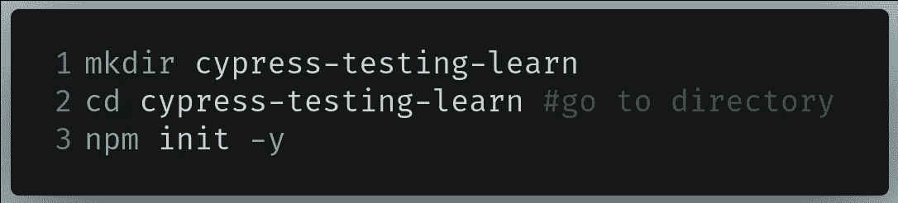

正在初始化项目

最后，要安装 Cypress 库:

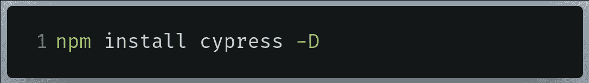

安装 Cypress

**注意**:如果你使用的是 Linux 发行版，那么在继续通过 NPM 安装 Cypress 之前，请转到[这些说明](https://docs.cypress.io/guides/getting-started/installing-cypress#Linux)。

现在已经安装了 Cypress，尝试用下面的终端命令运行二进制文件:

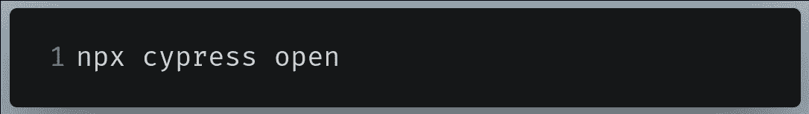

打开 Cypress 应用程序

这将打开**测试滑道**:

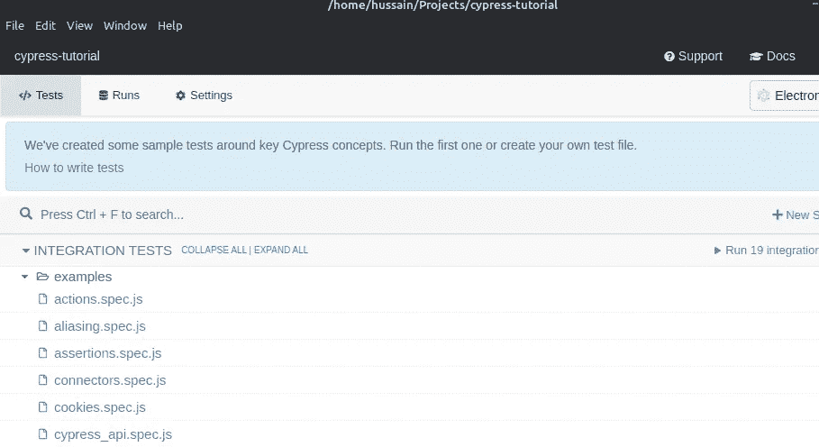

测试运行界面

现在让我们从编写测试开始。

# 柏树:基础

## 创建文件

Cypress 要求我们所有的测试都在`cypress/integration`目录中。首先像这样导航到这个目录:

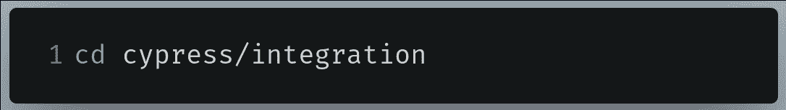

导航到 cypress/integration

现在创建一个名为`basicTest.js`的 JavaScript 文件:

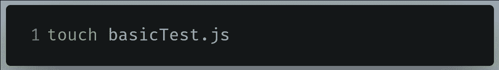

实例化 JavaScript 文件

如果您保持 Cypress 服务器运行，您的新文件将实时出现在测试运行器中:

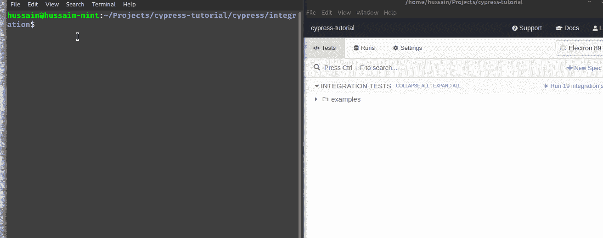

测试文件结构实时更新

现在让我们编写第一个测试。

## 使用 expect 的简单断言测试

在您的`/cypress/integration/basicTest.js`文件中，编写以下代码:

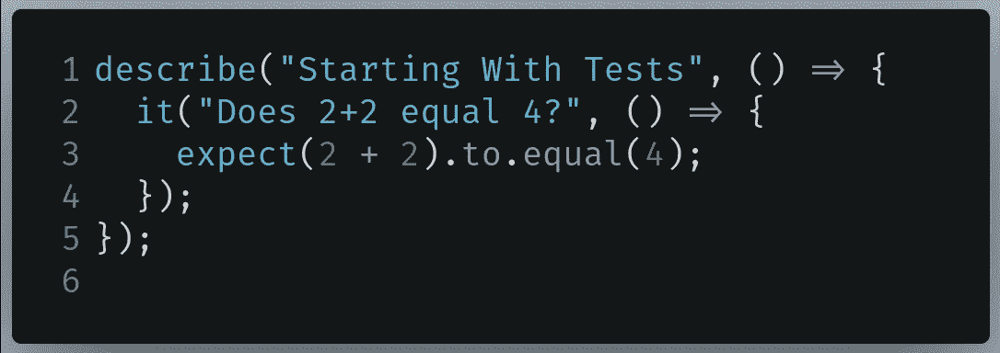

要在 basicTest.js 中编写的代码

*   第 1 行:`describe`函数告诉 Cypress 我们测试的描述。
*   第 2 行:`it`函数本质上表示我们测试的一个“部分”。
*   第 3 行:创建一个断言。这里，我们正在确认 2 和 2 的和是否返回 4。如果该结果为`false`，则立即停止测试。

要运行你的程序，点击 Cypress 服务器上的`basicTest.js`文件。

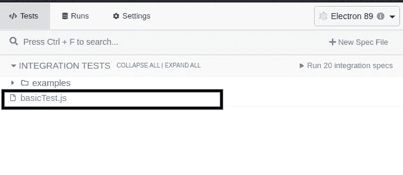

单击测试运行器中的 basicTest.js

这将是结果:

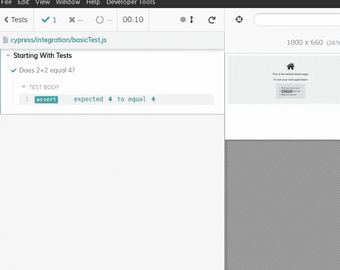

我们测试的结果

太好了！这意味着我们的断言是成功的。

如果我们做了一个不正确的断言呢？在`/cypress/integration/basicTest.js`中，现在在`describe`功能块中添加以下代码:

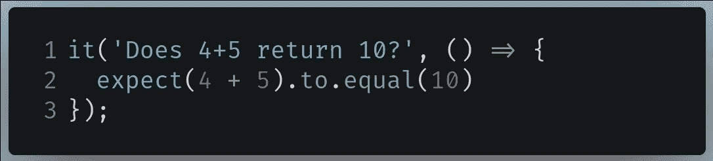

要在 basicTest.js 中编写的代码

*   第二行:如果 4 和 5 的和是 10，那么通过测试。否则，立即停止。

再次运行代码。这将是结果:

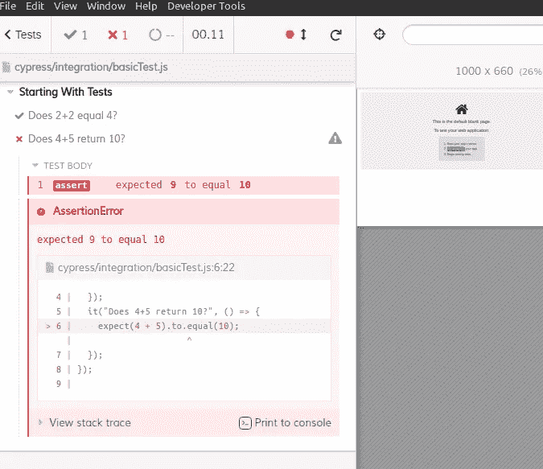

我们第二次测试的结果不正确

请注意我们的第二个测试是如何失败的。如果我们的结果是正确的，我们的考试就会通过。

让我们更多地使用断言。将以下代码添加到您的`basicTest.js`文件中:

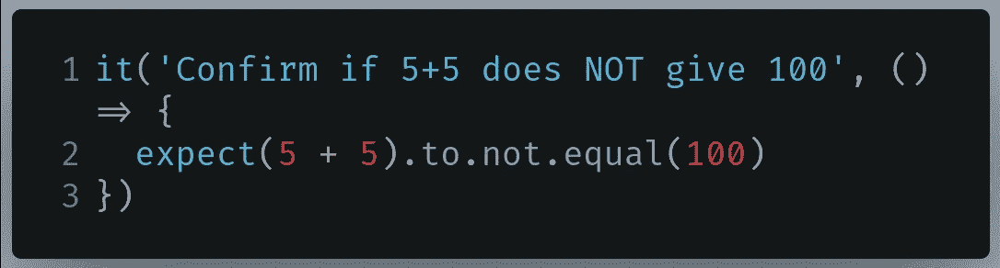

要在 basicTest.js 中编写的代码

*   第 2 行:如果 5 和 5 的和是**而不是**等于 100，那么测试应该通过。

这将是代码的输出:

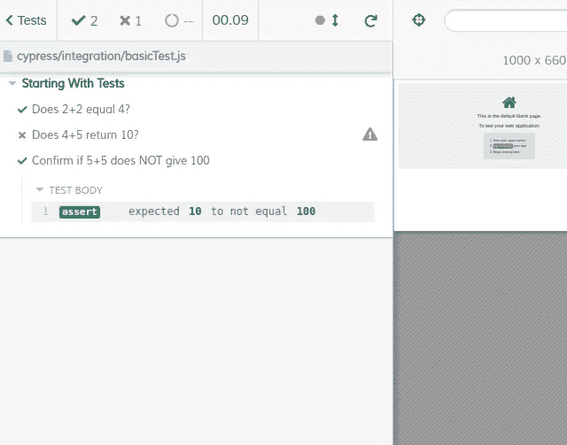

我们的测试结果:通过！

太好了！我们的测试通过了。`expect`函数执行 [BDD(行为驱动)](https://www.bddtesting.com/)断言。在下一节中，我们将制作测试驱动的断言。

最后，`/cypress/integration/basicTest.js`应该是这样的:

## 用 assert 编写测试驱动的测试

我们甚至可以通过`assert`做出基于 TDD(基于测试驱动)的断言。

在您的`basicTest.js`文件中，编写以下代码:

*   第 2 行:创建一个具有`name`和`age`属性的对象。
*   第 6 行:`isObject`函数确认`person`变量是否是对象。如果`true`，那么`value is object`被打印出来。否则表明该测试失败。
*   第 10 行:确认`name`变量是否包含字符串值。
*   第 14 行:确保`name`变量是**而不是**整数。

运行代码。这将是结果:

我们测试的结果

太好了！我们的代码有效。在下一节中，我们将学习如何通过 Cypress 启动一个网站。

最后，`basicTest.js`应该是这样的:

## 启动网站

这里我们将尝试启动 [Demoblaze](https://www.demoblaze.com/) ，这是一个为运行测试而创建的网站。

在您的`/cypress/integration/`文件夹中，创建一个名为`basicCommandsTest.js`的文件。在该文件中，编写以下代码:

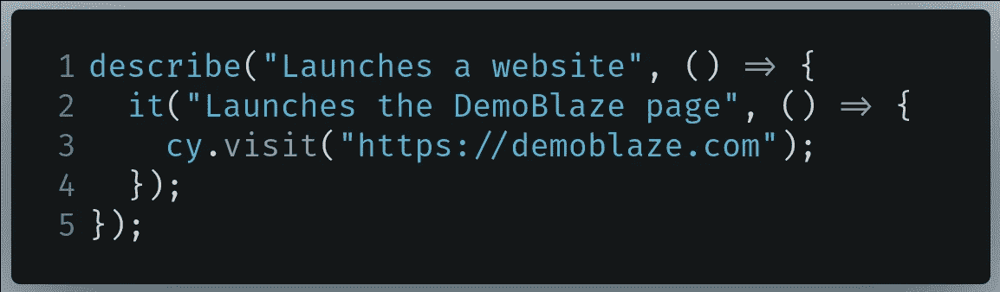

要在 basicCommandsTest.js 中编写的代码

*   第 3 行:使用`visit`方法告诉 Cypress 访问 Demoblaze 网站。

保存您的代码并在您的测试运行器菜单中点击`basicCommandsTest.js`:

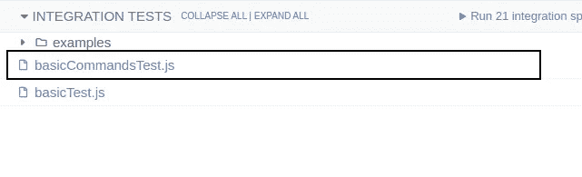

点击 Cypress 服务器中的 basicCommandsTest.js

这将是代码的输出:

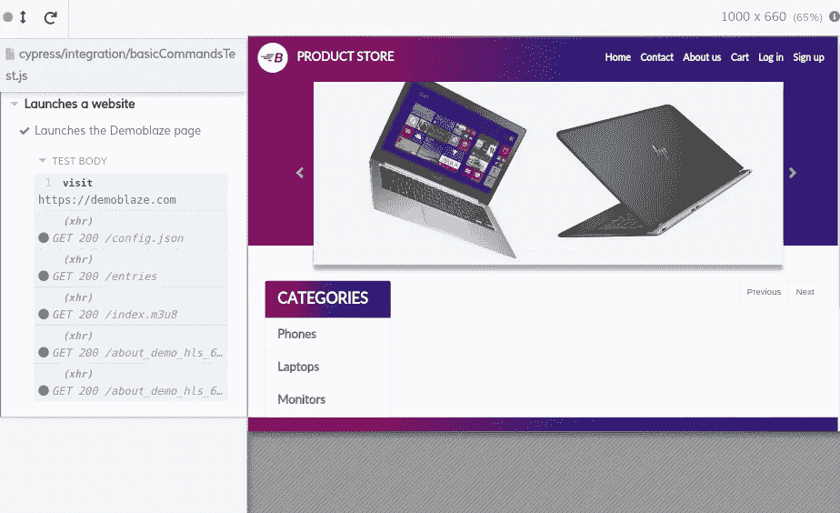

我们测试的输出

太好了！我们的代码有效。在下一节中，我们将更深入地用 Cypress 进行测试。

最后，`basicCommandsTest.js`应该是这样的:

# Cypress:高级命令

在这一部分，我们将尝试与页面上的元素进行交互。然而，在继续这个过程之前，我们需要首先学习告诉 Cypress 如何识别 HTML 元素。

## 如何识别元素

Cypress 使用 JQuery 选择器来识别网页上的组件。

例如，要获得带有`myButton`的`id`的元素，我们将编写以下代码:

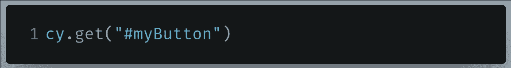

获取 id 为的元素

或者，为了识别具有`myButton`的`class`的元素，我们将使用下面的行:

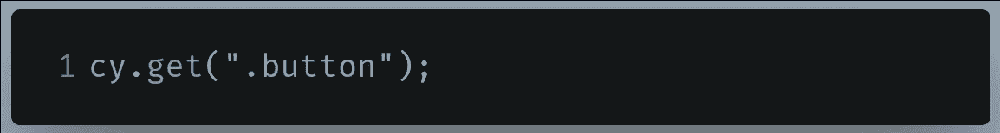

使用类获取元素

现在让我们开始与我们网站的用户界面互动。

## 单击按钮

对于这一部分，我们将使用互联网网页来运行我们的测试。在该网站中，我们将使用[添加/删除](https://the-internet.herokuapp.com/add_remove_elements/)元素部分。

让我们首先尝试识别我们的添加元素按钮。

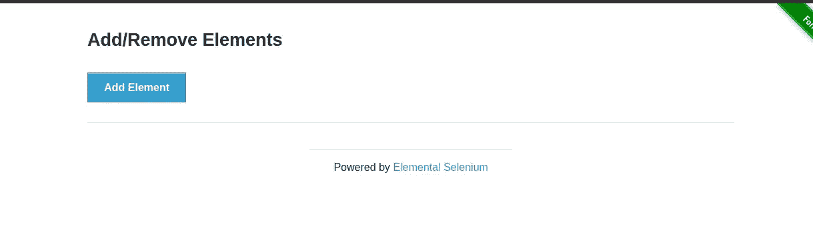

我们要测试的页面

在我们的 DevTools 中，注意我们的`button`有一个值为`addElement()`的`onclick`属性。

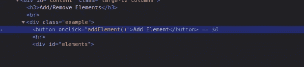

开发者工具的屏幕截图

该按钮的[相应选择器](https://api.jquery.com/attribute-equals-selector/)将由以下代码表示:

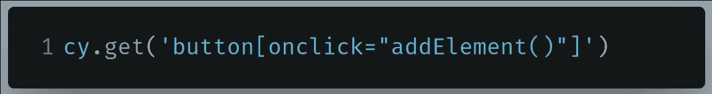

识别元素

在你的`/cypress/integration`文件夹中，创建一个名为`runningClickCommand.js`的文件。在该文件中，编写以下代码:

*   第 2 行:访问网页。
*   第 6 行:首先检索`button`元素，然后链接`click()`方法。这将告诉 Cypress 点击这个按钮。

运行代码。这将是结果:

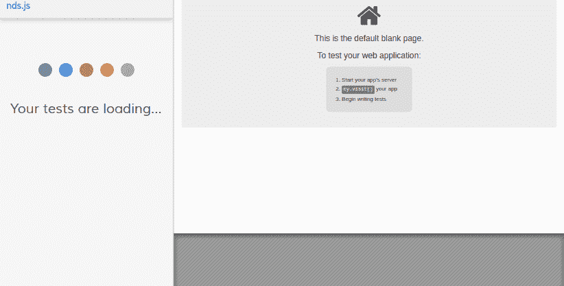

代码的输出

太好了，我们的代码成功了！注意，页面一加载，我们的测试就自动点击了`Add Element`按钮。

现在让我们在文本字段中输入文本。

## 文本输入

在本节中，我们将使用互联网的登录页面。我们首先需要一种识别元素的方法。

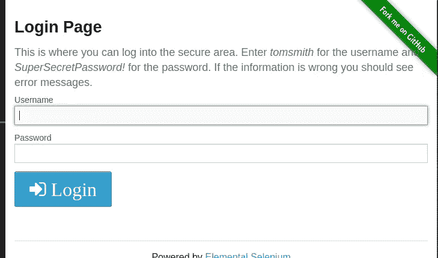

测试网站截图

看看开发工具:

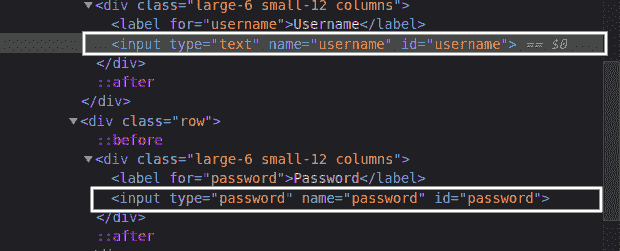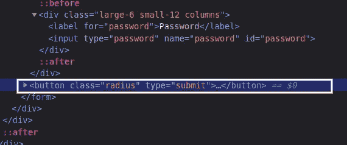

开发者工具

`username`字段的`id`为`username`，而`password`文本字段的`id`为`password`。此外，`Login`按钮有一个`type`属性为`submit`。因此，为了识别`username`和`password`字段，我们需要`[id](https://api.jquery.com/id-selector/)` [JQuery 选择器](https://api.jquery.com/id-selector/):

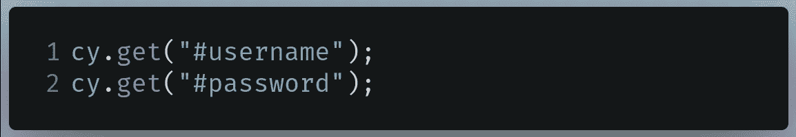

通过 ID 识别元素

此外，要获得`button`，我们需要[属性选择器](https://api.jquery.com/attribute-equals-selector/)，如下所示:

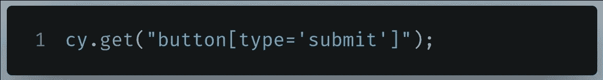

识别元素

在你的`/cypress/integration`文件夹中，创建一个名为`runningTypeCommand.js`的文件。在该文件中，编写以下代码:

*   第 3 行:访问登录页面。
*   第 6 行:转到`username`字段，链接`type`方法来键入`tomsmith`。
*   第 7 行:转到`password`字段并输入`SuperSecretPassword`。
*   第 10 行:点击提交按钮。

运行代码。这将是结果:

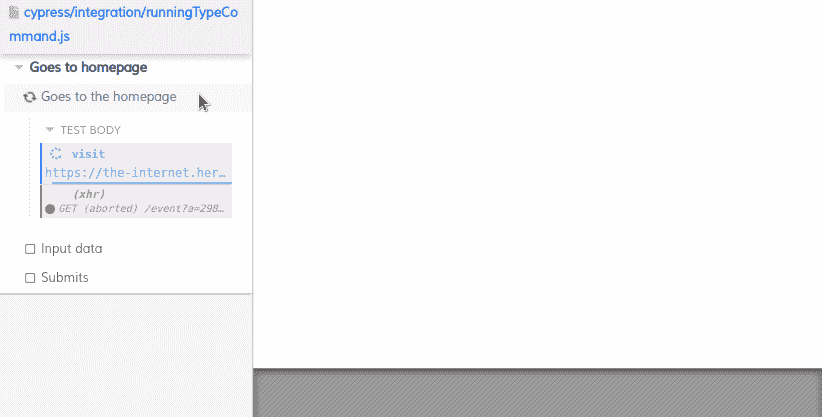

代码的输出

我们完事了。在下一节中，我们将学习如何使用复选框。

## 勾选复选框

在这一部分，我们将使用互联网页面的[复选框部分。](https://the-internet.herokuapp.com/checkboxes)

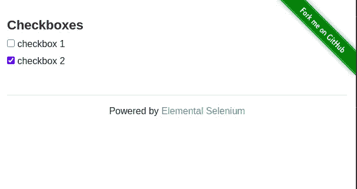

测试网页的屏幕截图

让我们先来看看开发工具:

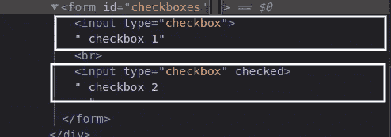

开发者工具

这两个复选框都有`checkbox`的`type`属性。而且，它们也是一个`form`的子元素，带有`checkboxes`的`id`。在这种情况下，我们将使用 [JQuery 父子选择器](https://api.jquery.com/child-selector/):

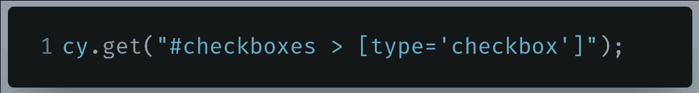

标识我们的复选框元素

在您的`/cypress/integration/`目录中，创建一个名为`runningCheckCommand.js`的文件。在该文件中，编写以下代码:

*   第 4 行:识别两个复选框组，然后使用`check`方法勾选它们。
*   第 7 行:告诉 Cypress 暂停测试一秒钟。
*   第 8 行:获取已经勾选的复选框列表。然后使用`uncheck`方法将其松开。

运行代码。这将是结果:

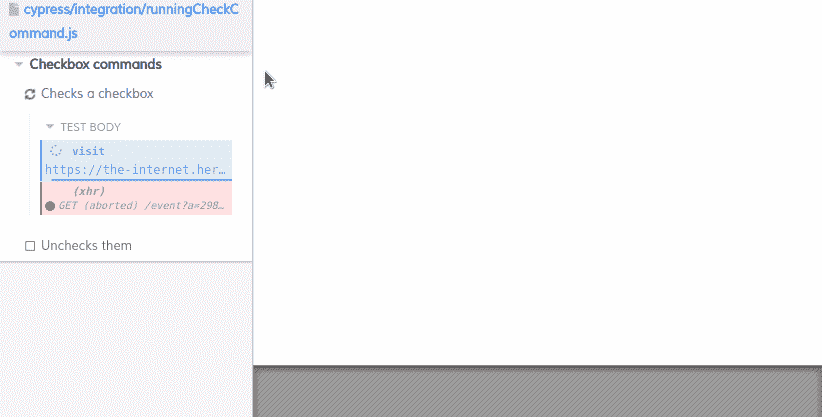

代码的输出

太好了！我们的代码有效。现在让我们用 Cypress 来处理隐式断言。

## 隐式断言

前面，我们对变量和对象执行了断言。然而，在现实世界中，我们希望对位于 HTML 元素中的文本执行断言，或者验证我们的`ul`元素是否有子`li`元素。

为了执行这样的断言，我们将使用`should`关键字。在这一节中，我们将在互联网的添加元素页面上做隐式断言。

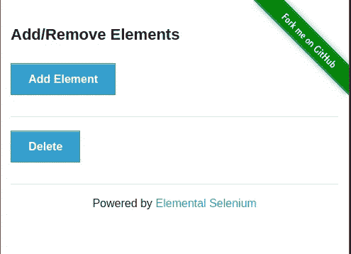

测试页面截图

简单看一下开发人员的控制台:

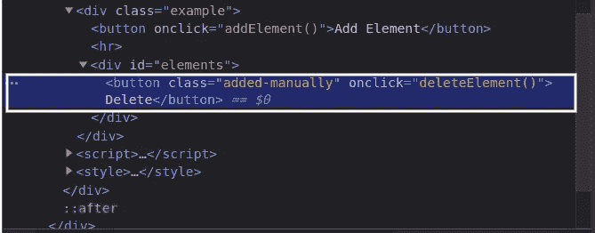

开发者工具

我们的`Delete`按钮有一个`added-manually`类。我们希望对这个`button`元素执行以下断言:

我们的主张

为此，我们必须使用以下语法:

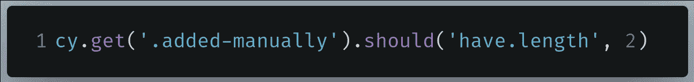

检索元素，然后断言

或者，要执行此断言:

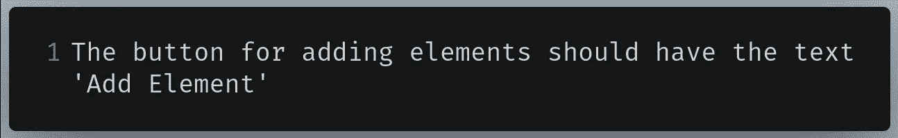

我们的主张

我们可以使用这行代码:

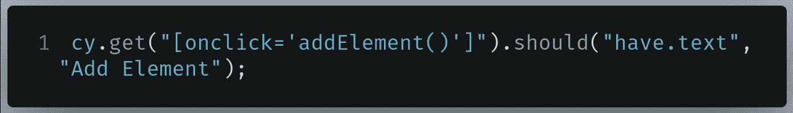

检索元素，然后断言

转到`/cypress/integration/runningClickCommand.js`，添加下面这段代码:

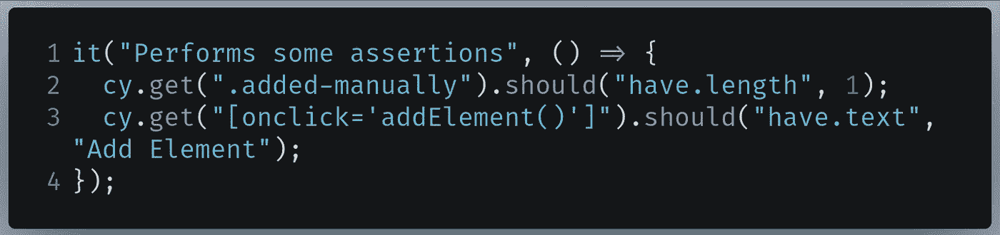

要在 runningClickCommand.js 中编写的代码

*   第 1 行:用类`added-manually`获取元素。然后检查它们的数量(`have.length`)是否只是一个。
*   第 3 行:获取`Add Element`按钮，然后验证按钮中的文本(`have.text`)是否完全是`Add Element`。

运行代码。这应该是测试结束时的结果:

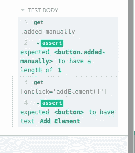

代码的结果

太好了！我们的代码有效。现在让我们继续学习`each`命令。

最后，`cypress/integration/runningClickCommand.js`应该是这样的:

## 每个命令

再看一下[互联网的添加元素页面](https://the-internet.herokuapp.com/add_remove_elements/):

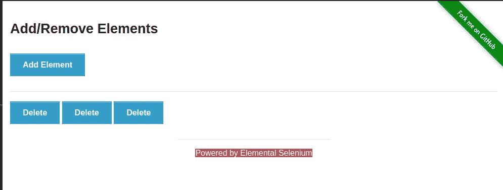

考点截图

要删除所有这些项目，我们可以手动点击所有的`Delete`按钮。那是可能的；然而，考虑有超过一百个`Delete`按钮的情况。因此，手动删除它们会非常耗时。

这就是`each`命令的用武之地。它允许您遍历一系列元素，然后对每个元素执行任何功能。在这种情况下，我们希望遍历所有的`Delete`按钮，并对它们运行`click`函数。

打开开发者工具:

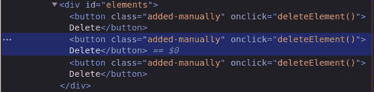

开发者工具

我们所有的`Delete`按钮都有一个`added-manually`的`class`属性。在这种情况下，我们将使用[类选择器](https://api.jquery.com/class-selector/)并将其与`each`命令配对，如下所示:

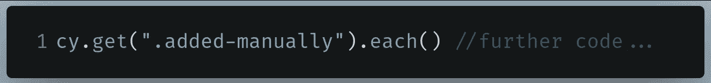

检索元素，然后使用 each()

转到`/cypress/integration/runningClickCommand.js`，添加下面这段代码:

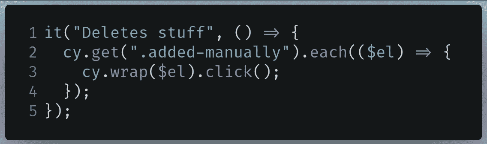

要在 runningClickCommand.js 中编写的代码

*   第 2 行:获取所有具有类`.added-manually`的元素。序列中的每个元素将由`$el`参数表示。
*   第 3 行:包装这个元素，以便我们可以对它执行 Cypress 命令。这里我们发送一个命令来点击这些元素。

这应该是代码的结果:

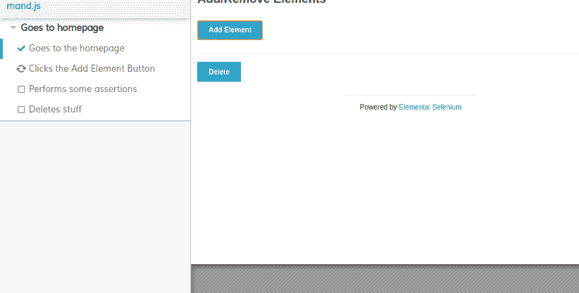

代码的输出

我们的代码有效！因为我们的测试很快，所以让我们尝试在页面上添加更多的元素。

找到下面这段代码:

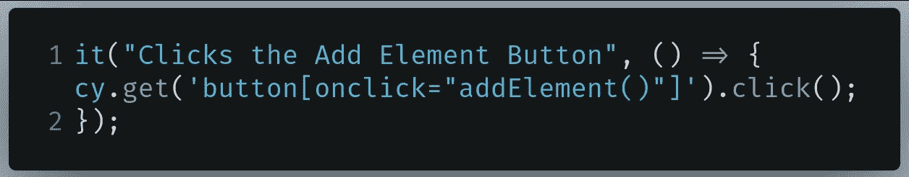

要在 runningClickCommand.js 中查找的代码

像这样改变它:

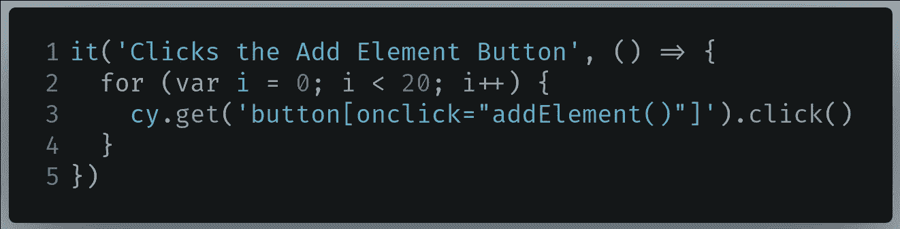

runningClickCommand.js 中要替换的代码

*   第 2 行:运行一个循环，告诉 Cypress 点击`Add Element`按钮 20 次。

再次运行代码。结果应该是这样的:

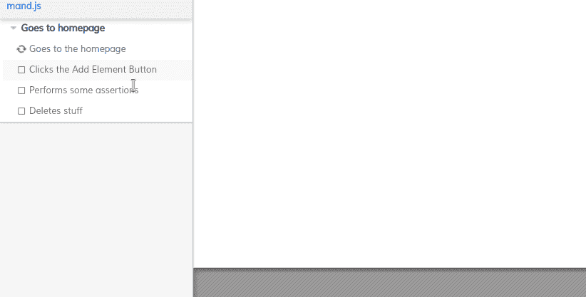

代码的输出

如您所见，我们的程序自动删除了页面上的所有元素，无需任何人工操作。太好了！

在文章的下一部分，我们将了解用 Cypress 测试的注意事项。

最后，`cypress/integration/runningClickCommand.js`应该是这样的:

# 最佳实践

## 保持测试隔离

考虑一个测试应用程序的情况。您的测试文件结构如下所示:

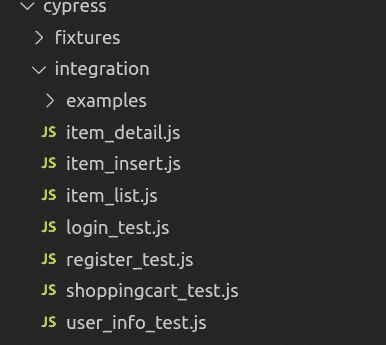

错误的文件结构

在您的测试运行程序中，它看起来像这样:

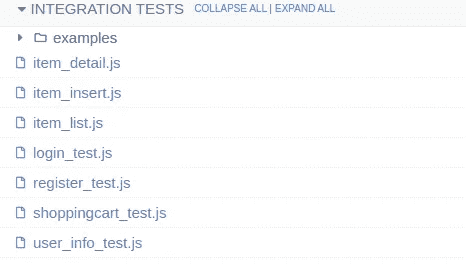

测试运行程序中的文件结构

Cypress 的团队认为你的测试文件需要更有条理。一个更好的方法是将它们重新组织到进一步的文件夹中，就像这样:

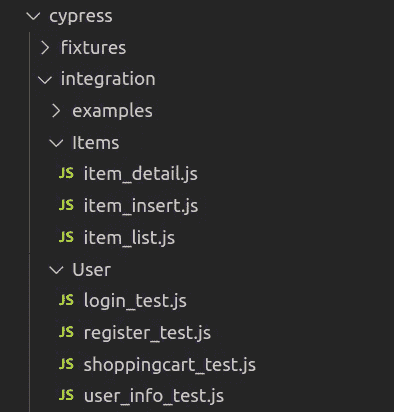

正确的文件结构

因此，它看起来像这样:

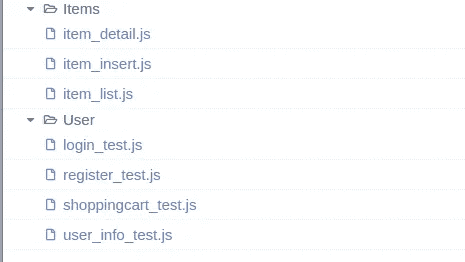

测试转轮中的测试结构

## 尽可能使用自定义命令

看看这段代码:

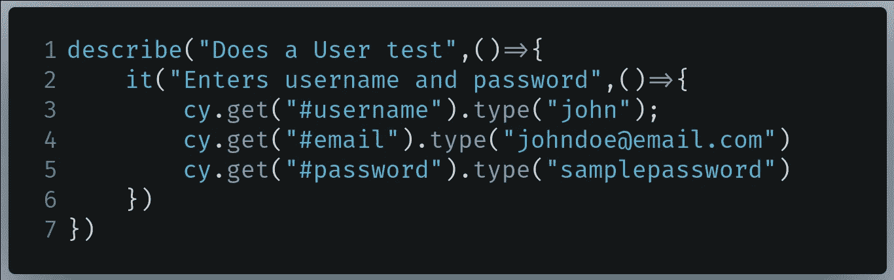

示例代码

注意，我们必须重复使用`get`和`type`命令。这是我们可以实现[定制命令](https://docs.cypress.io/api/cypress-api/custom-commands#Parent-Commands)的地方，以使它们更短。

在你的`cypress/support/commands.js`中，写下这段代码:

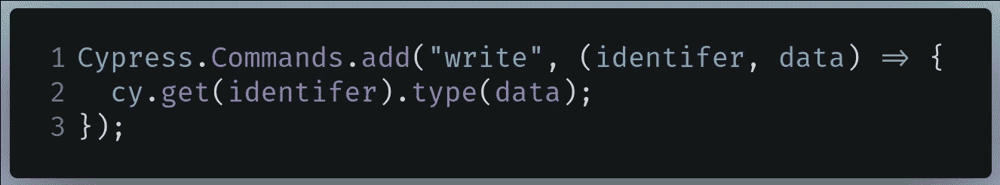

*   第 1 行:创建一个客户命令，它有两个参数，`identifier`和`data`。
*   第 2 行:检索带有适当标识符的元素，然后向其中输入一些数据。

**注意**:在`/cypress/support/commands.js`文件中编写您的定制命令被认为是一种很好的做法。

现在回到您的测试文件，并像这样替换它:

示例代码

如您所见，我们的代码看起来明显更短了。

## 避免“原子”测试

看一下这段代码:

这里我们用`first`的`id`对一个 HTML 元素重复运行测试。

赛普拉斯不鼓励这种行为。它不是高性能的，有一种更好的方法来重写这段代码，如下所示:

我们可以使用`and`方法将额外的`should`命令链接到我们的元素。

## 不要在 Cypress 中启动服务器

`[exec](https://docs.cypress.io/api/commands/exec)` [命令](https://docs.cypress.io/api/commands/exec)用于运行终端命令。**但是非常不鼓励用这个命令启动服务器。**

如果你想在`localhost`上测试你的应用，那么首先启动服务器**，然后**运行你的 Cypress 测试。

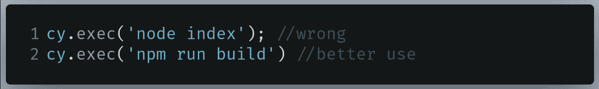

终端命令

# GitHub 资源库和更多资源

## GitHub 代码

*   [这里是这个项目的代码](https://github.com/HussainArif12/cypress-learn)

## 进一步阅读

*   [柏树教程视频](https://docs.cypress.io/examples/examples/tutorials#Video-playlists)
*   codedamn 的 Cypress 端到端测试
*   [对柏树真正有信心](https://blog.logrocket.com/real-confidence-with-cypress-e2e-tests/)
*   [Cypress 最佳实践:AssertJS 会议](https://www.youtube.com/watch?v=5XQOK0v_YRE)

# 结论

测试是开发过程中至关重要的一步，因为它可以确保你的应用程序正常工作。一些程序员喜欢手工测试他们的程序，因为编写测试需要大量的时间和精力。幸运的是，Cypress 通过允许开发人员在短时间内编写测试缓解了这个问题。

谢谢你坚持到最后！如果您遇到任何困惑，我建议您研究代码并解构示例。