# 如何对漫威和 DC 漫画数据进行探索性数据分析

> 原文：<https://betterprogramming.pub/how-to-perform-exploratory-data-analysis-with-marvel-vs-dc-comics-data-ec75f457ac60>

## 使用 Python 查找您最喜欢的超级英雄角色何时出现


埃里克·麦克林在 [Unsplash](https://unsplash.com?utm_source=medium&utm_medium=referral) 上的照片

美国工程师/统计学家爱德华兹·戴明有一句名言:

> “没有数据，你只是另一个有观点的人。”

使用新数据集时，首先要做的一件事就是执行探索性数据分析(EDA)。EDA 的首要目标是帮助数据科学家理解数据包含什么，以及数据能够回答什么类型的问题。注意:EDA 并不试图回答任何一个问题。这是你腰带上的调查工具。在本文中，我们将对漫威和 DC 漫画数据使用各种 EDA 技术。

# 1.入门:预处理数据

在 [Kaggle](https://www.kaggle.com/fivethirtyeight/fivethirtyeight-comic-characters-dataset) 上可以获得漫威与 DCdata 的对比。它由 FiveThirtyEight 编译，拥有 CCO: public-domain 许可证。数据是从两个公开的粉丝网站复制的。数据集下载有三个文件:两个 CSV 文件和一个`readme.md`文件。

人们通常从数据集开始数据科学，这些数据集已经过清理和微调，用于深度学习或机器学习。然而，真实世界的数据可能是混乱和不一致的。我们在这里使用的数据集并不一致。他们有不同的日期格式。他们还有 99%是空的列(还有其他问题)。清理数据的能力对于任何数据科学家来说都是一项有价值的技能，因此这是我们在第一个示例中重点关注的内容。下面的第 2 部分和第 3 部分将着重分析。我们将对数据执行的一些操作包括:

*   从现有列中的数据创建新列
*   删除多列
*   删除一列或多列为空值的行
*   基于条件更改数据帧中的字符串值

```
import pandas as pddf_marvel = pd.read_csv('marvel-wikia-data.csv')df_dc = pd.read_csv('dc-wikia-data.csv')
```

现在我们有两个数据框架，一个是漫威的数据(`df_marvel`)，另一个是 DC 的数据(`df_dc`)。熊猫数据框架是一个二维数据结构——你可以把它想象成一个 Excel 电子表格或数据库表。它有行和列，每一列是一个特征，在这种情况下，每一行代表一个特定的漫画人物(超级英雄或超级恶棍)。

`head`和`tail`功能显示了一些数据:

```
df_marvel.head(2)
```

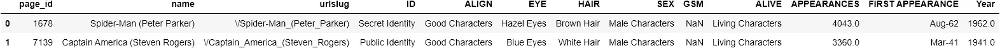

每个数据帧的大小:

```
print(df_marvel.shape)
print(df_dc.shape)(16376, 13)
(6896, 13)
```

漫威宇宙的人物数量似乎是 DC 宇宙的两倍多，至少在这个数据集中是这样的。

## 使用列

寻找丢失的数据:

```
df_marvel.isna().sum()page_id                 0
name                    0
urlslug                 0
ID                   3770
ALIGN                2812
EYE                  9767
HAIR                 4264
SEX                   854
GSM                 16286
ALIVE                   3
APPEARANCES          1096
FIRST APPEARANCE      815
Year                  815
dtype: int64df_dc.isna().sum()page_id                0
name                   0
urlslug                0
ID                  2013
ALIGN                601
EYE                 3628
HAIR                2274
SEX                  125
GSM                 6832
ALIVE                  3
APPEARANCES          355
FIRST APPEARANCE      69
YEAR                  69
dtype: int64
```

在两个数据帧中，`GSM`列几乎是空的。对我们的分析不会有太大贡献，就不要说了。我们也可以删除`page_id`和`urlslug`列，因为这些列不包含我们感兴趣的数据。另外，`Year`和`FIRST APPEARANCE`列本质上是相同的数据，所以我们可以删除`Year`。注意，漫威数据帧和 DC 数据帧对于该列有不同的名称:`Year`和`YEAR`。

要删除多个列，请执行下列操作:创建一个包含列名的列表。然后，使用 DataFrame `drop`功能。

```
cols = ['page_id','urlslug', 'GSM', 'Year']
df_marvel = df_marvel.drop(cols,axis=1)cols = ['page_id','urlslug', 'GSM', 'YEAR']
df_dc = df_dc.drop(cols,axis=1)df_marvel.head(2)
```

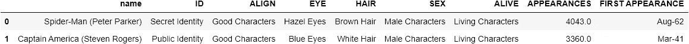

```
df_dc.head(2)
```

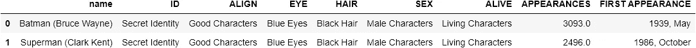

注意漫威数据帧中`FIRST APPEARANCE`的数据格式不同于 DC 数据帧。这些不一致在真实世界的数据中很常见。在这种情况下，最好的选择可能是将`FIRST APPEARANCE`列拆分成`MONTH`和`YEAR`列。这对分析阶段很有用。

我们可能想要调查角色第一次出现的月份/季节，以及这些年来发生了怎样的变化。比如年初有新角色推出吗？我们可以使用`FIRST APPEARANCE`列中的数据创建两个新列:`month`和`year`。

我们还想删除`FIRST APPEARANCE`为空的行:

```
df_marvel = df_marvel.dropna(subset=['FIRST APPEARANCE'])df_dc = df_dc.dropna(subset=['FIRST APPEARANCE'])df_marvel[['MONTH','YEAR']] = df_marvel['FIRST APPEARANCE'].str.split('-', expand=True)df_dc[['YEAR','MONTH']] = df_dc['FIRST APPEARANCE'].str.split(', ', expand=True)df_marvel.head(2)
```

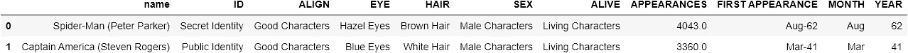

```
df_dc.head(2)
```


```
df_marvel['YEAR'].value_counts().head(3)93    554
94    485
92    455
Name: YEAR, dtype: int64
```

漫威数据中的年份形式为:`64`、`06`等。我们希望它们是`1964`、`2006`等形式。

由于漫威漫画在 20 世纪 20 年代之前并不存在，我们将把`19`添加到数字大于 20 的日期中(否则，将`20`添加到日期字符串中):

```
df_marvel['YEAR'] = df_marvel.YEAR.apply(lambda x: '19' + x if int(x) > 20  else '20' + x)df_marvel['YEAR'].value_counts().head(3)1993    554
1994    485
1992    455
Name: YEAR, dtype: int64
```

最后掉柱`FIRST APPEARANCE`:

```
df_marvel = df_marvel.drop('FIRST APPEARANCE',axis=1)df_dc = df_dc.drop('FIRST APPEARANCE',axis=1)df_marvel.head(3)
```

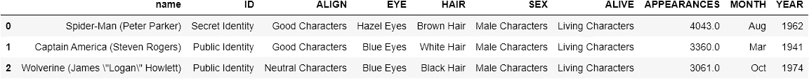

```
df_dc.head(3)
```

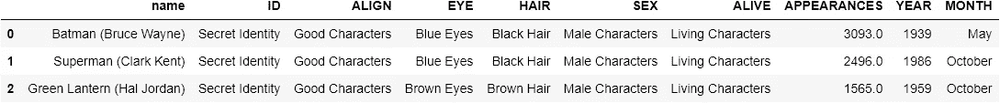

我们还可以将`df_dc MONTH`列更改为与`df_marvel`相同的格式。

```
df_dc["MONTH"] = df_dc["MONTH"].replace({"January": "Jan", "February": "Feb", "March": "Mar", "April": "Apr", "June": "Jun", "July": "Jul", "August": "Aug", "September": "Sep", "October": "Oct", "November": "Nov", "December": "Dec"})
```

最后反转`df_dc`中最后两列的顺序。

```
cols = ['name', 'ID', 'ALIGN', 'EYE', 'HAIR', 'SEX', 'ALIVE', 'APPEARANCES', 'MONTH', 'YEAR']
df_dc = df_dc[cols]df_marvel.head(1)
```


```
df_dc.head(1)
```

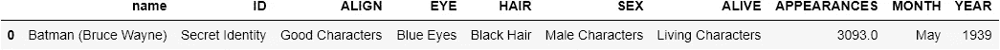

两个数据框架的格式和列顺序现在是一致的。我们可以对数据做一些最终的表面调整:

## 调整列中的数据

我们可以简化某些列中的值—例如，对于性别，所有值都包含术语`Characters`。这并不是使值不同所必需的。这一步不是必需的，但是对于一些可视化来说，它有助于保持标签的简短——它使得可视化更加清晰易读。

```
df_marvel["SEX"] = df_marvel["SEX"].replace({"Male Characters": "Male", "Female Characters": "Female", "Agender Characters": "Agender", "Genderless Characters": "Genderless", "Genderfluid Characters": "Genderfluid", "Transgender Characters": "Transgender"})df_dc["SEX"] = df_dc["SEX"].replace({"Male Characters": "Male", "Female Characters": "Female", "Agender Characters": "Agender", "Genderless Characters": "Genderless", "Genderfluid Characters": "Genderfluid", "Transgender Characters": "Transgender"})
```

对于只有两个值的`Alive`列，我们可以使用:

```
df_marvel['ALIVE'] = ['Living' if x == 'Living Characters' else 'Deceased' for x in df_marvel['ALIVE']]df_dc['ALIVE'] = ['Living' if x == 'Living Characters' else 'Deceased' for x in df_dc['ALIVE']]
```

我们可以用`ID`和`ALIGN`列继续这个过程:

```
df_marvel["ID"] = df_marvel["ID"].replace({"Secret Identity": "Secret", "Public Identity": "Public", "No Dual Identity": "No Dual", "Known to Authorities Identity": "Known to Authorities", "Identity Unknown": "Unknown"})df_dc["ID"] = df_dc["ID"].replace({"Secret Identity": "Secret", "Public Identity": "Public", "No Dual Identity": "No Dual", "Known to Authorities Identity": "Known to Authorities", "Identity Unknown": "Unknown"})df_marvel["ALIGN"] = df_marvel["ALIGN"].replace({"Bad Characters": "Bad", "Good Characters": "Good", "Neutral Characters": "Neutral"})df_dc["ALIGN"] = df_dc["ALIGN"].replace({"Bad Characters": "Bad", "Good Characters": "Good", "Neutral Characters": "Neutral"})
```

对于眼睛和头发，我们将保持数据不变:

```
df_marvel.head(2)
```

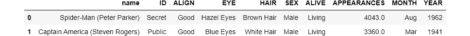

```
df_dc.head(2)
```


现在我们有 10 列有趣的数据和简化的标签。两个数据帧的数据格式是一致的。存在一些缺失值，但是对于真实世界的数据，这通常是正确的。

在接下来的两个例子中，我们开始查看数据。分析数据的过程有时被称为探索性数据分析(EDA)或用数据讲述故事。在这两种情况下，我们都试图将原始数据转化为信息。在商业环境中，EDA 的目标是为决策者提供做出正确决策所需的信息。在公司中，数据科学家可能被分配到一个团队，以提供对可用数据的洞察。

# 2.用数据讲故事

当 EDA 试图回答特定的问题或用数据讲述故事时，它是最有效的。这通常涉及某种形式的数据可视化。

## 超级英雄与超级恶棍/简单与复杂的数据可视化

就英雄和反派的比例而言，漫威和 DC 有什么不同吗？

因此，我们有一个具体的问题，可能证明答案的最简单的方法是用一个简单的图表。简单的条形图非常强大——直观地显示了数据在不同类别中的分布。条形图不需要太多的书面解释，很多人都很熟悉。在商业领域，数据科学家可能会向没有技术或数学背景的经理和决策者展示他们的发现。因此，使用熟悉而简单的数据可视化往往比复杂或晦涩的统计可视化更有效。

```
import matplotlib.pyplot as pltplt.subplot(1, 2, 1) #this line simply enables both graphs to appear in the same cell
df_marvel['ALIGN'].value_counts(normalize=True).plot(kind='bar',title='Marvel Character Alignment')
plt.subplot(1, 2, 2)
df_dc['ALIGN'].value_counts(normalize=True).plot(kind='bar',title='DC Character Alignment',color='red')
plt.show()
```

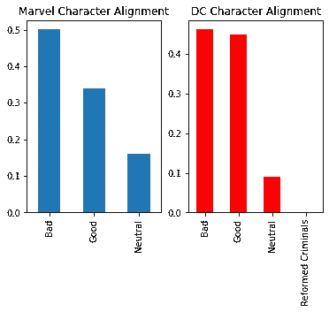

所以我们问题的答案是:是的，有区别。漫威似乎更喜欢反派而不是英雄，而 DC 则更加平衡。另一个区别是 DC 更具二元性——中性角色更少。

## 漫威的恶棍有时是秃头，而 DC 从来没有秃头的恶棍

在数据帧中，`HAIR`列的值有时是`No Hair`，有时是`Bald`。我认为这些是等价的，所以我将它们合并成一个值:

```
df_marvel['HAIR'] = df_marvel['HAIR'].replace({"No Hair": "Bald"})
df_dc['HAIR'] = df_dc['HAIR'].replace({"No Hair": "Bald"})
```

我们可以通过选择满足一个或多个条件的行来创建数据帧的子集:

```
df_marvel_villain = df_marvel[df_marvel['ALIGN']=='Bad']df_dc_villain = df_dc[df_dc['ALIGN']=='Bad']
```

然后绘制数据，以更好地了解漫威和 DC 恶棍的头发颜色有何不同:

```
fig, ax = plt.subplots(1, 2)
plt.subplot(1, 2, 1)
df_marvel_villain['HAIR'].value_counts(normalize=True).head(5).plot(kind='bar',title="Marvel Villains' hair")
plt.subplot(1, 2, 2)
df_dc_villain['HAIR'].value_counts(normalize=True).head(5).plot(kind='bar',title="DC Villains' hair",color='red')
fig.tight_layout()
```

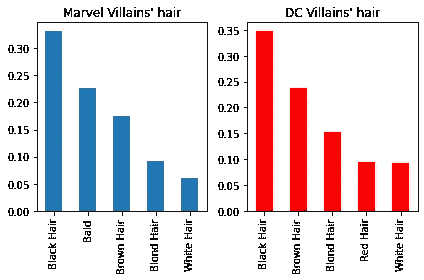

## DC 不喜欢光头角色

似乎漫威喜欢让他们的反派人物秃顶，而 DC 不喜欢。事实上，DC 没有任何秃头人物、英雄或恶棍:

```
df_dc['HAIR'].value_counts(normalize=True).plot(kind='barh',title="DC Characters' Hair");
```

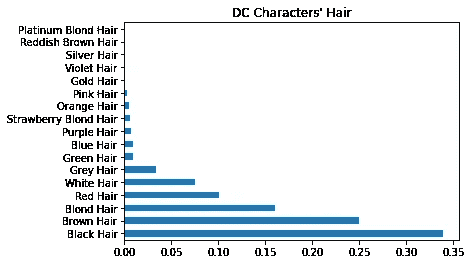

有秃顶的漫威英雄吗？

```
df_marvel_hero = df_marvel[df_marvel['ALIGN']=='Good']df_marvel_hero['HAIR'].value_counts(normalize=True).plot(kind='barh',title="Marvel Characters' Hair");
```

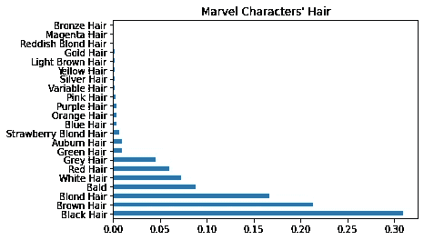

大约 9%的英雄是秃头，而大约 20%的反派是秃头，所以在漫威的例子中，如果一个角色是秃头，他们更可能是反派而不是英雄。

## 在漫威和 DC 的世界中，英雄的眼睛通常是蓝色或棕色的，而反派的眼睛颜色则更加多样

对于眼睛颜色，漫威和 DC 的前五种颜色相同，但顺序不同。反派和英雄的眼睛颜色分布也有细微的差别，这种差别对于 DC 和漫威来说是一样的。

```
df_dc_hero = df_dc[df_dc['ALIGN']=='Good']fig, ax = plt.subplots(2, 2)
plt.subplot(2, 2, 1)
df_marvel_villain['EYE'].value_counts(normalize=True).head(5).plot(kind='bar',title="Marvel Villains' Eyes")
plt.subplot(2, 2, 2)
df_dc_villain['EYE'].value_counts(normalize=True).head(5).plot(kind='bar',title="DC Villains' Eyes",color='red')
plt.subplot(2, 2, 3)
df_marvel_hero['EYE'].value_counts(normalize=True).head(5).plot(kind='bar',title="Marvel Heroes' Eyes")
plt.subplot(2, 2, 4)
df_dc_hero['EYE'].value_counts(normalize=True).head(5).plot(kind='bar',title="DC Heroes' Eyes",color='red')
fig.tight_layout()
plt.show()
```

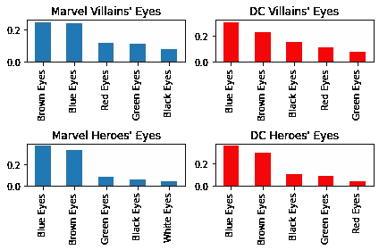

这里的区别较小，但有两件事很突出:在漫威宇宙中，白眼睛更有可能属于一个英雄。同样在《漫威》和《DC》中，英雄的眼睛颜色比反派少一些。在这两种情况下，英雄的眼睛通常倾向于蓝色或棕色。是的，有一些变化，但反派表现出更多的变化——蓝色和棕色不太占优势。这是一个很好的例子，说明简单的数据可视化有助于揭示数据中的信息。

## 秘密身份？

DC comics 有一个简单的 ID 方法——大约一半的角色有公开身份，不到一半的角色有秘密身份(例如，戴面具的角色，如蝙蝠侠)。漫威漫画中人物的身份稍微微妙一些。他们有秘密和公开的身份，但他们也有相当数量的角色被归类为双重身份。这个类似乎适用于只有日常名字的角色——他们没有特别的昵称。

```
plt.subplot(1, 2, 1)
df_marvel['ID'].value_counts(normalize=True).plot(kind='bar',title='Marvel Character Alignment')
plt.subplot(1, 2, 2)
df_dc['ID'].value_counts(normalize=True).plot(kind='bar',title='DC Character Alignment',color='red')
plt.show()
```

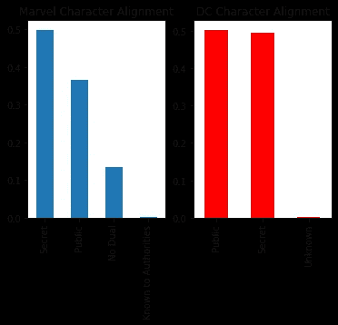

在所有这些例子中，简单的条形图有助于讲述故事。条形图的常见替代方法包括:

*   ie 图表 s
*   D [onut 图表](https://en.wikipedia.org/wiki/Pie_chart#Doughnut_chart) s
*   图表

在第三部分中，我们将看看漫画随着时间的推移发生的一些变化。

# 3.漫画的演变:随时间的差异

作为最后一个例子，我们将分析漫威和 DC 的角色是如何随着时间的推移而变化的:

## 新角色在一年中的什么时候首次出现？

```
fig,ax = plt.subplots(1, 2)
plt.subplot(1, 2, 1)
df_marvel['MONTH'].value_counts().plot(kind='barh',title='Marvel Character First Appearance')
plt.subplot(1, 2, 2)
df_dc['MONTH'].value_counts().plot(kind='barh',title='DC Character First Appearance',color='red');
fig.tight_layout()
```

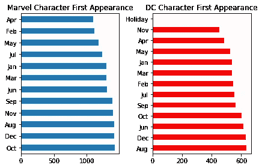

这里有一些不同，但故事并不清楚。我们可以尝试创建一个名为`season`的新列，并将这些数据压缩到更少的类别中——这可能会使事情更清楚。为此，我们将创建一个函数，并将其应用于两个数据帧:

```
def get_season(row):
    if row['MONTH'] in ['Jan','Feb','Mar']:
        val = 'Q1'
    elif row['MONTH'] in ['Apr','May','Jun']:
        val = 'Q2'
    elif row['MONTH'] in ['Jul','Aug','Sep']:
        val = 'Q3'
    else:
        val = 'Q4'
    return valdf_marvel['SEASON'] = df_marvel.apply(get_season, axis=1)df_dc['SEASON'] = df_dc.apply(get_season, axis=1)
```

现在我们可以重现剧情:

```
fig,ax = plt.subplots(1, 2)
plt.subplot(1, 2, 1)
df_marvel['SEASON'].value_counts().plot(kind='barh',title='Marvel Character First Appearance')
plt.subplot(1, 2, 2)
df_dc['SEASON'].value_counts().plot(kind='barh',title='DC Character First Appearance',color='red');
fig.tight_layout()
```

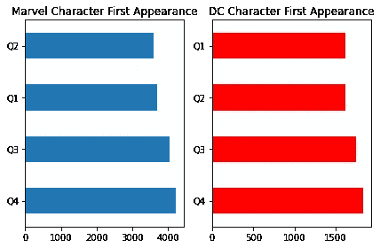

通过减少类别的数量来简化数据已经创建了一个更清晰的画面——我们可以看到漫威和 DC 都稍微倾向于在下半年引入新角色。

我们还可以研究这种模式随时间的变化。让我们将上述分析与 1980 年以前的情况进行比较。我们将创建两个新的数据帧:一个用于漫威，一个用于 DC。

```
df_marvel_pre1980 = df_marvel[pd.to_numeric(df_marvel['YEAR']) < 1980]df_dc_pre1980 = df_dc[pd.to_numeric(df_dc['YEAR']) < 1980]fig,ax = plt.subplots(1, 2)
plt.subplot(1, 2, 1)
df_marvel_pre1980['SEASON'].value_counts().plot(kind='barh',title='Marvel Character First Appearance')
plt.subplot(1, 2, 2)
df_dc_pre1980['SEASON'].value_counts().plot(kind='barh',title='DC Character First Appearance',color='red');
fig.tight_layout()
```

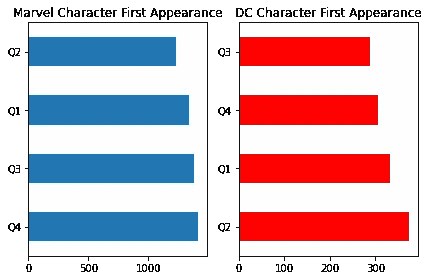

看起来漫威这些年来在何时引入新角色方面一直保持一致，但 DC 漫画公司却不是这样。在 1980 年之前，DC 倾向于在年初引入更多的新角色，然后改变这一政策，更像漫威的做法。

## 随着时间的推移引入的新字符的数量

```
m = df_marvel.groupby('YEAR')plt.rcParams['figure.figsize'] = [15, 5]
m['YEAR'].value_counts(sort=False).plot(kind='bar',title='Marvel First Appearances by Year');
```

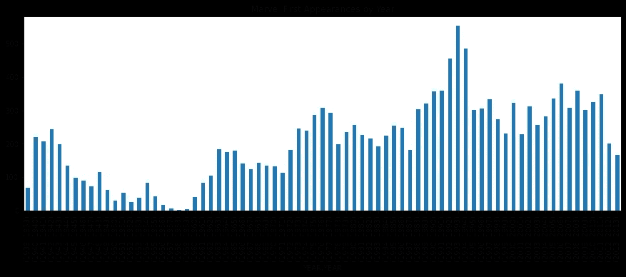

```
d = df_dc.groupby('YEAR')plt.rcParams['figure.figsize'] = [15, 5]
d['YEAR'].value_counts(sort=False).plot(kind='bar',title='DC First Appearances by Year');
```

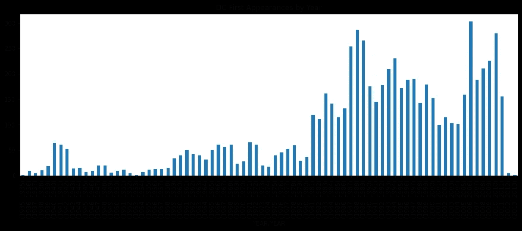

随着时间的推移，引入的新角色数量之间似乎存在真正的差异:在公司存在的大部分时间里，漫威引入的新角色数量一直比 DC 多。还记得我们之前看到的漫威宇宙是 DC 宇宙的两倍多。同样根据这个数据，DC 似乎在 2011 年后几乎停止了引入新角色。

## 第一批女性角色是什么时候出现的？

```
df_marvel_female = df_marvel[df_marvel['SEX']=='Female']
df_dc_female = df_dc[df_dc['SEX']=='Female']
```

第一个 DC 女性角色出现在:

```
df_dc_female['YEAR'].min()'1936'
```

第一个漫威女性角色出现在:

```
df_marvel_female['YEAR'].min()'1939'
```

所以漫威和 DC 都在制作漫画的第一年或第二年引入了他们的第一个女性角色。DC 漫画公司成立于 1934 年，漫威成立于 1939 年。

可以用这些数据回答的其他问题包括:

*   随着时间的推移，性别平衡发生了怎样的变化？
*   随着时间的推移，英雄和反派之间的平衡发生了怎样的变化？

关于数据可视化的最后一句话:

在本文中，我们使用了 pandas 的`plot`函数和一点点 [Matplotlib](https://matplotlib.org/) 来组织情节，但是还有许多基于 Python 的可视化库可用，包括:

*   Seaborn :它建立在 Matplotlib 的基础上，在视觉上比基本的熊猫情节更吸引人
*   散景:主要用于交互式网络可视化
*   [Altair](https://altair-viz.github.io/) :其中一些数据可视化库需要大量代码——Altair 试图将代码最小化，将更多精力放在可视化上
*   再次强调，最好用于交互式的基于网络的可视化

# 快速回顾一下您所学的内容:

如果你已经做到了这一步，我想感谢你花时间阅读这本书。此时，您应该很好地理解了以下概念:

*   如何使用现有列中的数据创建新的 DataFrame 列
*   如何根据条件更改列中的值
*   如何删除列和行
*   如何根据条件创建数据子集
*   如何基于`value_counts()`功能绘制条形图

如果你有任何反馈或不同意这个分析，我很乐意听到你的意见！我一直在寻找改进这些文章的方法。再次感谢！

## 参考

1.  perk hofer l .在可视化大数据时，设计重要吗？调查可视化类型和交互使用效果的实证研究，2021 年 3 月 30 日，[https://link . springer . com/article/10.1007/s 00187-020-00294-0](https://link.springer.com/article/10.1007/s00187-020-00294-0)
2.  Roberts，r .,《讲故事与视觉化:一项扩展调查》，2021 年 3 月 30 日，[https://www . research gate . net/publication/323777213 _ 讲故事 _ 视觉化 _An_Extended_Survey](https://www.researchgate.net/publication/323777213_Storytelling_and_Visualization_An_Extended_Survey)

## 与数据科学先生联系:

[MrDataScience.com](https://www.mrdatascience.com)， [GitHub](https://github.com/MrDataScience) ，[中型](https://medium.com/@mrdatascience)