# 如何使用 JavaScript 执行 PDF 操作和创建

> 原文：<https://betterprogramming.pub/how-to-perform-pdf-manipulation-and-creation-using-javascript-559ed70478c4>

## 在 Node.js 中使用 PDF-Lib 的强大功能


来源:[完美卡普西尼](https://unsplash.com/@perfecto_capucine)关于 [Unsplash](http://unsplash.com)

# 介绍

## 什么是 PDF-Lib，为什么使用它？

假设你拥有一家成功的网上企业。在这种情况下，您需要生成发票并通过电子邮件发送给客户。要为每个买方创建收据，您必须执行以下操作:

*   打开你的文字处理器，粘贴用户的个人信息。
*   将用户的购买记录在表格中，并计算总数。
*   接下来，下载这个文件并将其转换为 PDF 格式。
*   最后，通过电子邮件将该文档发送给用户。

当然，那可能有用。但是考虑一下:如果你在一天之内有数百名顾客，那该怎么办？这将浪费大量的时间和精力，因为你在一遍又一遍地重复同样的过程。那么，我们如何缓解这个问题呢？

解决这个问题的最好方法是通过使用一个库来自动化这个操作。这就是 [PDF-Lib](https://pdf-lib.js.org/) 的用武之地。它是一个开源、易用的库，允许开发人员使用 Node.js 环境生成 PDF 文档。

既然已经谈了它的成果，那就开始吧！

# 入门指南

首先，使用以下终端命令初始化 Node.js 存储库:

```
npm init -y 
```

## 模块安装

对于这个项目，我们将使用以下软件包:

*   `pdf-lib`:帮助更新和创建 PDF 文档。
*   `node-fetch`:这种依赖将让我们从远程资源获取 PDF 文件。
*   `@pdf-lib/fontkit`:`@pdf-lib/fontkit`库将允许我们在文档中加入自定义字体。

要安装这些依赖项，请运行以下终端命令:

```
npm install pdf-lib node-fetch @pdf-lib/fontkit
```

# 基本用法

## 创建一个空白文档

以下代码片段使用 PDF-Lib 模块实例化一个新文档:

*   第 5 行和第 6 行:实例化一个 PDF 文件，并在其中添加一个空白页。
*   第 7 行:保存这个文档，并将它的内容存储在`pdfFile`变量中。
*   第 8–11 行:将`pdfFile`的值存储到`example.pdf`中。这将告诉我们的程序把我们新创建的文件保存到磁盘上。

当程序运行时，它将在您的项目目录中创建一个名为`example.pdf`的文件:

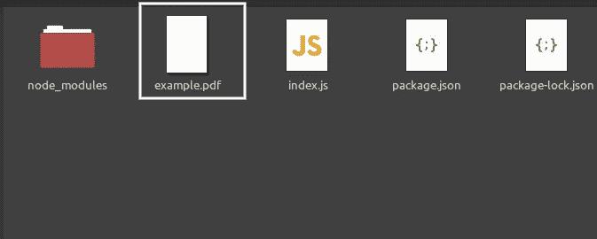

文件系统中的 Example.pdf 文件

这将是`example.pdf`文件的内容:

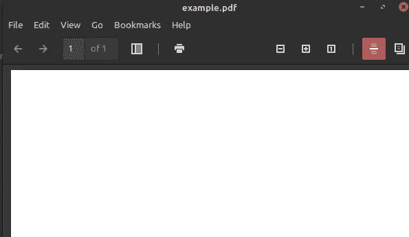

文件内容

如您所见，我们得到了一个空白页面作为输出。这意味着我们的代码成功了！

## 显示文本

文本对于数据可视化非常重要。要呈现一段文本，使用`drawText`方法，如下所示:

*   第 4 行:使用`drawText`方法。第一个参数是我们想要显示的消息。
*   第 5–6 行:指定文本元素的坐标。
*   第 6 行:这个图形的`y`坐标是从当前页面顶部开始的`50`个单位。

这将是代码的输出:

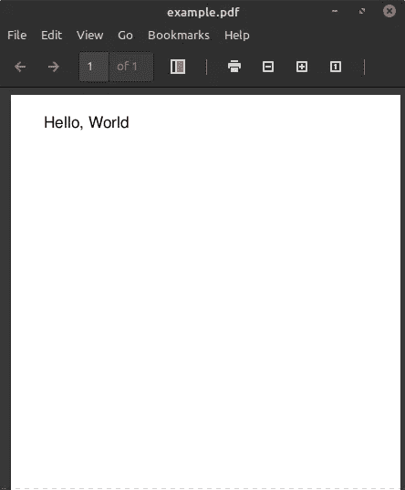

代码的输出

那真的很简单！

如果你想放大或缩小你的内容，自定义`size`属性:

```
newPage.drawText("Hello, World", {
  x: 50,
  y: newPage.getSize().height - 70,
  size: 80, //change the size to 80 units
});
```

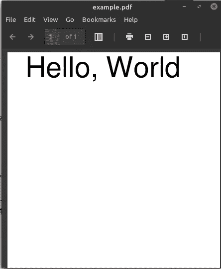

代码的输出

## 字体定制

PDF-Lib 甚至允许用户改变图形的字体系列。一些内置字体出现在`[StandardFonts](https://pdf-lib.js.org/docs/api/enums/standardfonts)`枚举中。

例如，我们将使用`Courier`字体系列:

*   第 4 行:在使用字体之前，我们需要先嵌入它。这将允许我们在我们的项目中使用这种字体。
*   第 10 行:最后，将该文本的`font`属性改为`courier`。


代码的输出

如果你愿意，你甚至可以使用你自己定制的字体。为此，首先保存要使用的字体。例如，我们将使用[海洋夏日字体](https://www.1001freefonts.com/ocean-summer.font)。

下载字体后，将它的归档文件解压缩到项目文件夹中:

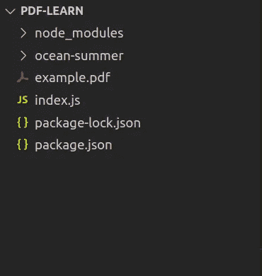

“海洋-夏天”文件夹。这将是我们的字体

完成后，编写以下代码块，将自定义字体集成到文档中:

*   第 7 行:`regiserFontKit`方法告诉`PDF-Lib`想要在我们的文档中嵌入自定义字体。
*   第 9 行:最后，将我们选择的字体集成到文件中。

这将是代码的输出:

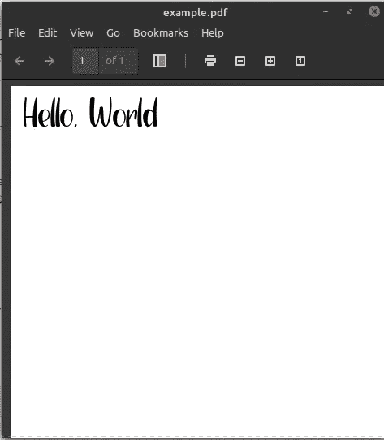

代码的输出

要改变文本的颜色，使用`rgb`属性，如下所示:

*   第 6 行:使用 RGB 值修改内容颜色。`rgb`功能的每个参数将在`0`和`1`之间。

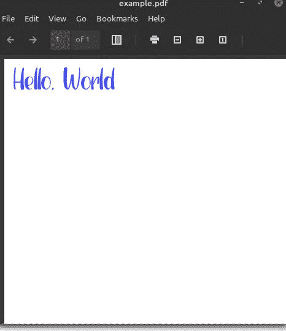

代码的输出

我们的文本现在看起来确实好多了！

# 高级用法

在这一节中，我们将关注从远程资源获取文件并通过 PDF-Lib 库编辑它们。出于演示目的，我们将使用来自非洲大学的这个 [PDF 文件](http://www.africau.edu/images/default/sample.pdf)。

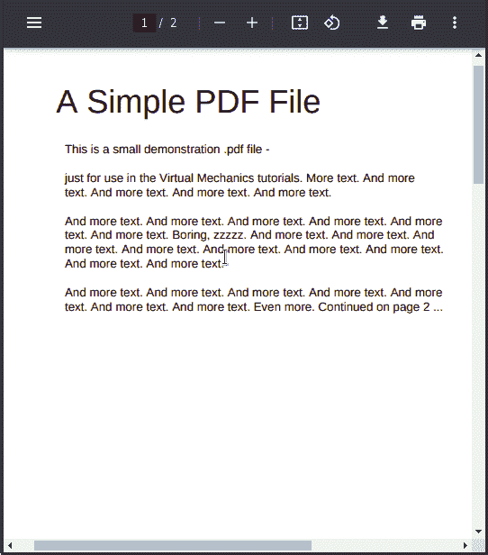

我们的入门 PDF 文件

## 创建我们的效用函数

在开始之前，我们需要首先创建一个助手函数来从服务器获取我们想要的 PDF。这将鼓励代码的组织和可读性。

在您的项目目录中，创建一个名为`fetchUtils.js`的新文件。在这里，编写以下代码:

*   第 4 行:获取当前资源并保存它的响应。
*   第 5 行和第 6 行:从响应中提取原始的二进制数据，并将其返回给客户机。

完成后，就该测试这个功能了。为此，请在主文件中键入以下代码片段:

*   第 4–6 行:从我们选择的 PDF 中获取缓冲值。
*   第 7 行:将这个二进制数据传递给`load`函数。因此，PDF-Lib 将创建该文件的本地副本。
*   第 9–11 行:在空白页上呈现一段文本。
*   第 14–19 行:最后，将这个编辑过的文档保存到系统中。

这将是结果:

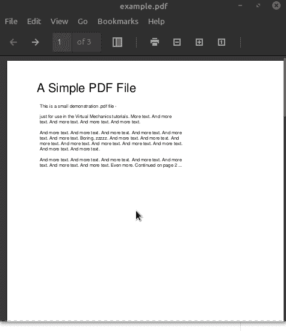

代码的输出

## 绘制形状

您甚至可以在文档中呈现形状。如果您想显示 SVG 图，这是很方便的。在本指南中，我们将渲染两种常见的形状:正方形和圆形。

绘制正方形时，使用`drawSquare`功能，如下所示:

*   第 6 行:改变这个图形的颜色。

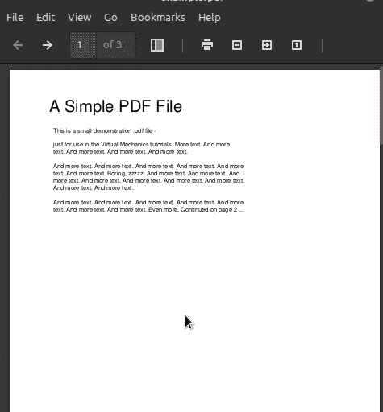

代码的输出

如果你想画一个圆，使用`drawCircle`方法:

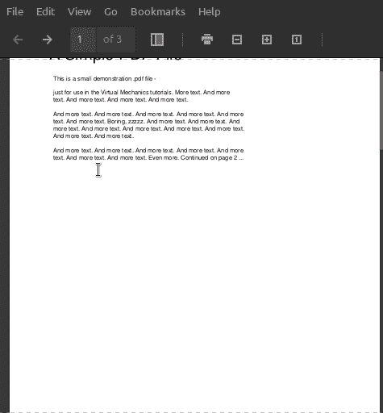

代码的输出

## 显示图像

图像对于显示文档中的插图或图表至关重要。

下面的代码片段将一个不清晰的图像嵌入到我们的 PDF 文件中:

*   第 1 行:获取图像的原始二进制数据。
*   第 4 行:使用`embedJpg`方法将图片合并到文档中。如果要使用 PNG 文件，请使用`embedPng`方法。
*   第 5 行:`getPages`方法返回文件中的页面数组。这里，我们只检索第一页。
*   第 9–10 行:指定图像的尺寸并将其绘制到页面上。

这将是输出:

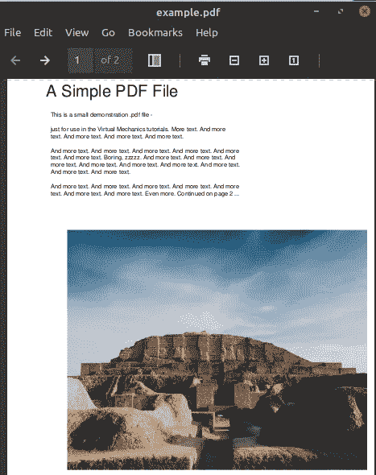

代码的输出

## 删除页面

要删除页面，请使用`removePage`方法。

```
pdfDoc.removePage(0);
```

`removePage`方法告诉 PDF-Lib 删除特定索引处的页面。在这种情况下，我们剪下第一页。

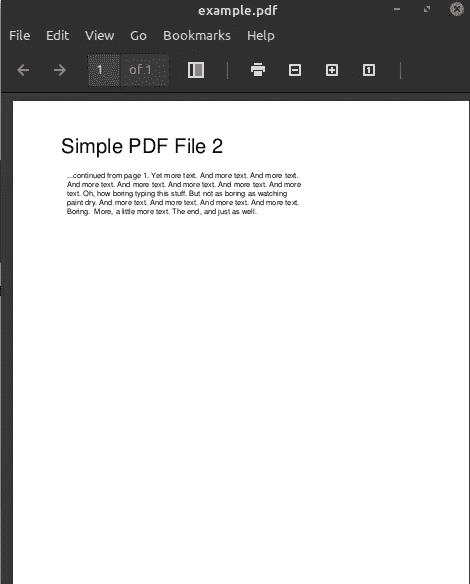

代码的输出

## 合并文档

假设您有两个文档，并希望将它们连接在一起。使用`copyPages`方法可以做到这一点。

为了演示合并功能，我们将使用 W3 的这个[文档。](https://www.w3.org/WAI/ER/tests/xhtml/testfiles/resources/pdf/dummy.pdf)

作为第一步，我们将首先获取所需的 PDF 文件:

*   第 3–10 行:从两个 PDF 文件中检索二进制数据，并将它们加载到项目中。

现在我们已经获得了数据，调用`copyPages`方法来合并它们:

*   第 1–5 行:复制这个文档中的所有页面，并将它们存储到`mainDocument`实例中。
    `copyPages`函数接受两个参数:源文件和源文件页面的索引。这里，我们使用了`getPageIndices`方法。这将选择该文件的所有页面。

这将是输出:

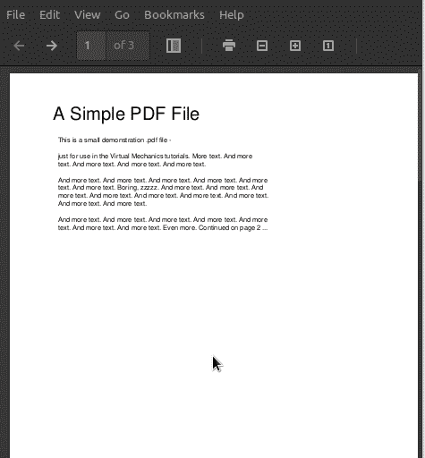

代码的输出

## 建筑形式

如果您想从用户那里收集数据，表单是至关重要的。幸运的是，PDF-Lib 捆绑了一个`getForm`方法，允许开发人员为他们的文档构建表单。

让我们从创建几个文本字段元素开始:

*   第 3 行:`getForm`函数告诉 Node.js 我们想要在这个文档中嵌入一个表单。
*   第 4–7 行:创建两个文本框并指定它们的默认值。
*   第 8–17 行:最后，将这些文本字段呈现到页面上。

这将是结果:

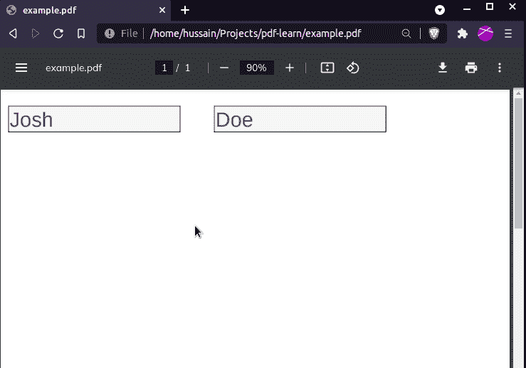

代码的输出

要添加单选按钮组，请使用`createRadioGroup`方法，如下所示:

*   第 6 行:为表单创建一个单选按钮组。
*   第 7–14 行:将`Yes`和`No`选项添加到我们的单选按钮组。
*   第 15 行:单选表单的初始值将是`Yes`。

输出:

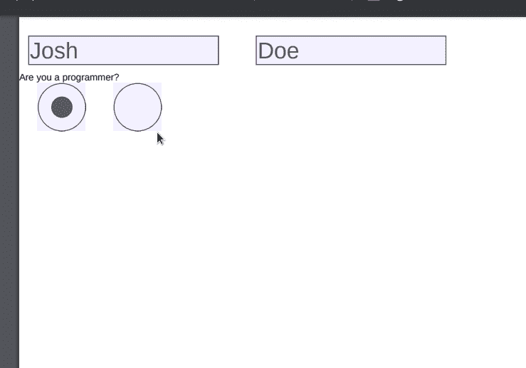

代码的输出

# 更多资源

[这里是 GitHub](https://github.com/HussainArif12/pdf-lib-tutorial) 上代码示例的源代码。

*   [代码野蛮人使用 pdf-lib 在 Node.js 中处理 pdf](https://thecodebarbarian.com/working-with-pdfs-in-node-js.html)
*   [在无服务器 AWS 上使用 Pdf-lib 创建 PDF](https://medium.com/swlh/create-pdf-using-pdf-lib-on-serverless-aws-lambda-e9506246dc88)作者 [Crespo Wang](https://medium.com/u/e0eaafa4ee6e?source=post_page-----559ed70478c4--------------------------------)
*   [由](https://medium.com/nerd-for-tech/dynamically-create-and-merge-pdfs-in-angular-using-jspdf-and-pdf-lib-aa82ae35f1e3)[哈迪克·帕里克](https://medium.com/u/203133790ed1?source=post_page-----559ed70478c4--------------------------------)使用 jspdf 和 pdf-lib 动态创建 Pdf

# 结论

在本文中，我们探索了 PDF-Lib 模块的基础。它的文档很简洁，这使得它非常容易使用。除此之外，它非常稳定，这意味着您的应用程序在生产中运行时没有任何问题。

非常感谢您的阅读！编码快乐！