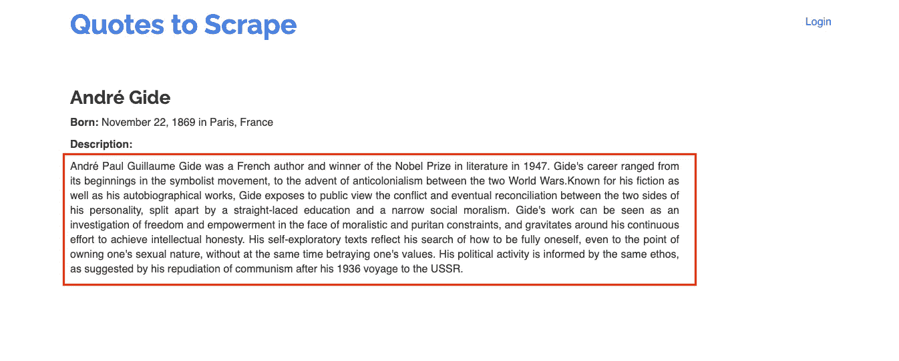
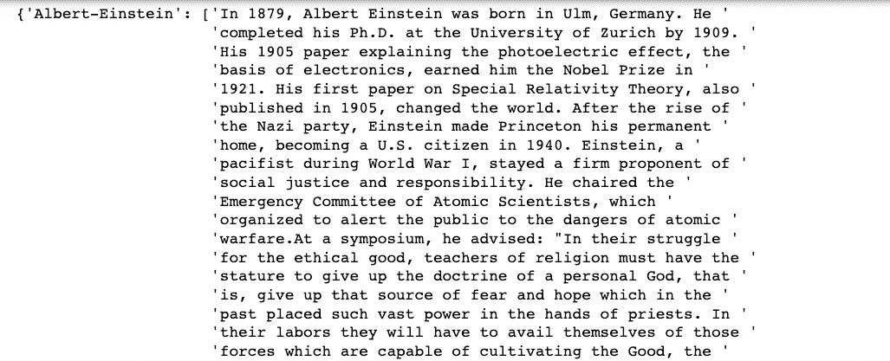
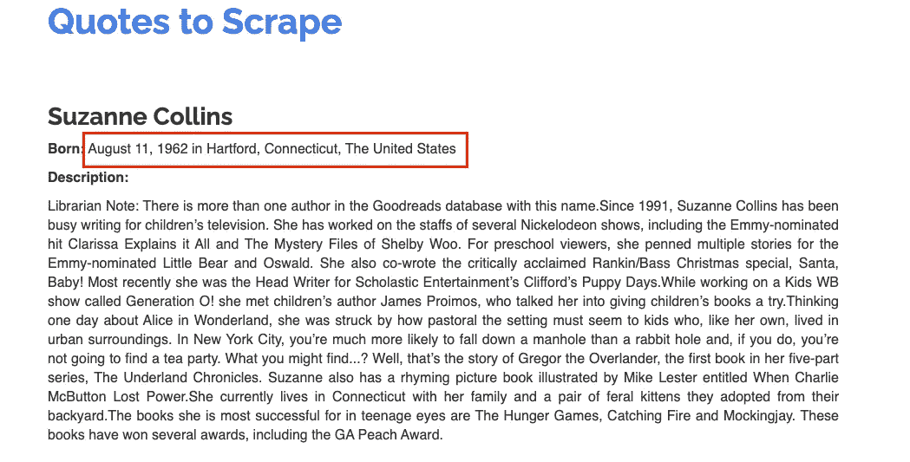
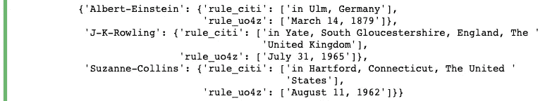
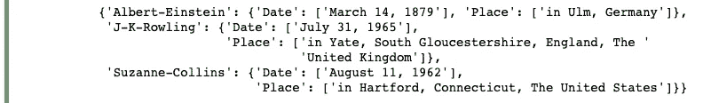
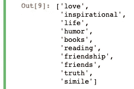
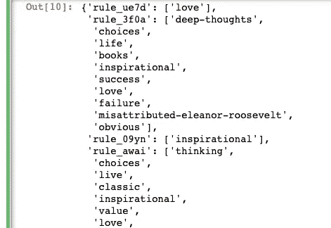
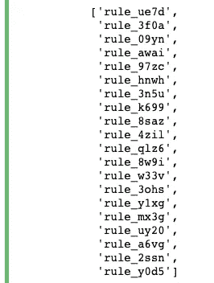
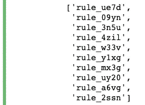

# 如何在 12 分钟内完成 Python 网页抓取

> 原文：<https://betterprogramming.pub/how-to-perform-python-web-scraping-in-12-minutes-bec3bb336015>

## 一个简短的教程，介绍如何在没有 HTML 或 XPath 知识的情况下使用 AutoScraper Python 库


米格尔·a·阿穆蒂奥在 [Unsplash](/s/photos/search?utm_source=unsplash&utm_medium=referral&utm_content=creditCopyText) 拍摄的照片。

Web 抓取对于数据工程师、数据科学家等等来说是一个非常有用的工具。虽然有许多公开可用的数据集和 API 可以用作您的项目或业务的输入，但在 web 上也有大量免费可用的信息，您可以使用 web 抓取来收集。

现在，当谈到 web 抓取的实践时，有许多跨不同语言的不同工具和方法可供您使用。很多网页抓取库需要你对网站如何工作有一些了解。您可能还需要花一些时间来学习使用某个特定的库。例如，Python 中漂亮的 Soup 库能够从 HTML 文件中提取数据，因此被广泛用于 web 抓取上下文。然而，要使用这个库，您需要对 HTML 有所了解，并花一些时间熟悉特定于模块的方法。

我并不是说学习 HTML 和网站的一般工作方式不好。然而，如果你并不真正感兴趣，只是想使用网站作为数据来源，那么使用像 [AutoScraper](https://github.com/alirezamika/autoscraper) 这样的库可能会更好！自动 web 抓取有付费的解决方案，但是如果你有 Python 知识，你可以利用这个轻量级的 web 抓取库从 web 页面抓取内容，而不需要知道任何 HTML 术语。相反，您需要的只是复制和粘贴文本的能力(或多或少)。

在本文中，我想通过一个简短的实践演示向您展示 AutoScraper 可以做什么，演示您如何在没有任何先验知识的情况下使用它来开始 web 抓取。我们将通过几个例子来了解仅使用 AutoScraper 就能获得著名的[报价相关数据](http://quotes.toscrape.com/)(只需十分钟的时间)。

如果你想跟着做，确保你已经安装了 AutoScraper 提供)。此外，为了更好地在我们浏览示例时检查进度，我使用了`pprint`模块(data pretty printer)并在 Jupyter 笔记本上浏览示例。导入这两个库然后我们开始吧！

```
from autoscraper import AutoScraper
from pprint import pprint
```

*提醒:您应该确保检查哪种数据(如果有的话)可以从特定来源获得。一个好的做法是检查* `*robots.txt*` *文件，看看站点是否主动允许抓取。如果你看到* `*robots.txt*` *禁止某些用户代理(比如你用来抓取网页的代理)访问网站，你最好去找另一个数据源。你还应该检查你要抓取的网站的条款和条件页面(通常链接在网站的页脚)，看看它是否允许自动数据收集/抓取。负责任的刮！*

# 从网页中获取一个元素

首先，让我们试着从网页中获取一个东西。一些有用的东西是简短的传记/描述，对于那些想了解更多作者信息的人来说。



来源:[行情刮](http://quotes.toscrape.com/author/Andre-Gide/)

这就是复制粘贴部分的用武之地。每个作者的个人资料页面看起来都很相似，所以为了让我们的 AutoScraper 获取我们传递给它的每个个人资料 URL 的描述，我们需要首先在一个站点上训练它。这样做看起来像这样:

首先，我们为想要抓取的页面设置一个 URL(在本例中，它是个人资料页面)。不同作者的 URL 中不同的部分是作者的名字，所以要访问 J.K .罗琳的个人资料页面，你需要将`desired_author`设置为`J-K-Rowling`。最好在一开始就这样做，而不是为你想看的每个新作者重写 URL。

为了使 AutoScraper 在许多不同的站点上工作，我们首先必须用我们想要收集的数据在一个样本站点上“训练”它。在这种情况下，我们需要“描述”数据，即上图中框内的所有文本。训练数据必须以列表的形式出现，即使你只取一个元素，所以我们需要做的是复制并粘贴描述，并将其分配给`profile_training_data`。

然后，我们创建一个新的`AutoScraper`类实例并运行`build`方法，提供`profile_url`(我们想要抓取的页面)并将`profile_training_data`传递给`wanted_list`(我们想要收集的数据)。这个新定义的`AutoScraper`将学习如何获取你想要的训练数据。它还会记住如何为你传递给它的类似网站这样做。

要在其他链接上测试 scraper，让我们运行以下代码:



笔记本结果—作者简介

我们上面所做的是抓取三位新作者的简介:阿尔伯特·爱因斯坦、J.K .罗琳和苏珊·科林斯。我们所做的就是将三位作者的名字分配给一个列表，然后遍历该列表，并使用经过训练的`profile_scraper`来获取这三位作者的简介。对于存储，我们定义了一个字典来存储所有结果，其中键是作者姓名，值是作者描述。当然，您可以自由地以不同的方式存储它们，或者建立自己的管道将这些结果转移到数据库(sqlite3、MongoDB 等)中。)取决于您的使用情况。

为了获取数据，我们使用了来自`AutoScraper`类的`get_result_exact`方法，该方法返回来自与`profile_scraper`从训练数据中学习到的规则相匹配的站点的结果列表。稍后，我们将看到另一种在抓取数据时允许模糊匹配的方法。

# 从一个页面获取多个元素

现在我们已经介绍了基础知识，让我们尝试另一个简单的例子，我们只是用 AutoScraper 从一个网页中抓取多个东西。假设我们想从每个作者的个人资料页面中获取他们的出生日期和出生地。



来源:[行情刮](http://quotes.toscrape.com/author/Suzanne-Collins/)

代码看起来和以前差不多，只是这一次，我们将多个值的列表传递到训练数据中。这样做应该是这样的:

然后我们可以在三个新作者身上测试新的刮刀。同样，代码看起来和上次差不多，但是我们要给`get_result_exact`方法传递一个额外的参数。这样做会看起来像这样:



笔记本结果—使用“分组”作为别名

通过设置`grouped=True`，我们可以看到每一项的`rule_id`。这个`rule_id`可以认为是返回数据的类别标签。因为我们之前向`wanted_list`传递了多个值，所以我们需要`grouped=True`来确保我们能够识别返回的结果。从`get_result_exact`返回的结果将是一个条目字典，以`rule_id`为键，以找到的数据点列表为值。

我们可以通过不同的组来识别元数据项，这很好，但是您会看到我们为每个规则取了任意的名称。我们可以通过在传递训练数据时为规则添加一个别名来解决这个问题。我们不是将一个列表传递给`build`方法，而是将一个值字典传递给`wanted_dict`参数。这个字典应该将键作为别名(要收集的数据的类别标签或名称)，然后将值作为要收集的数据(前面的`wanted_list`中的内容)。重新训练`metadata_scraper`会是这样的:

然后，我们可以在多个作者身上运行 AutoScraper，使用与之前相同的格式，但是有一处修改。我们没有将`grouped=True`传递给`get_result_exact`方法，而是传递了`group_by_alias=True`。这意味着该方法将返回一个字典，其中前面定义的别名作为键，匹配数据的列表作为值。执行此操作的代码如下:



记录单结果—按命名别名分组

# 抓取精确的结果与从网页抓取相似的结果

到目前为止，我们只使用了`get_result_exact`方法来收集数据。AutoScraper 库还提供了`get_result_similar`方法，如果您想从与您的训练数据格式不完全相同的网页中获得额外的结果，该方法会有所帮助。

为了测试这一点，让我们试着从主要报价抓取页面的顶部标签:


来源:[行情刮](http://quotes.toscrape.com/)

这里，我们需要复制并粘贴在页面右侧列表中找到的前十个标签，并将它们分配到我们的培训数据列表中。和以前一样，我们将使用`wanted_dict`，这样我们可以为 AutoScraper 将要学习的`rule_id`分配一个别名。训练这个顶级标记刮刀将如下所示:

现在我们已经训练了`tags_scraper`，让我们看看在我们用来训练自动抓取器的同一个站点上调用`get_result_exact`会发生什么:

```
tags_scraper.get_result_exact(tag_url)
```



笔记本结果—获取结果精确

正如您所看到的，代码正确地返回了您可以在主页上看到的顶部标签。然而，页面上的每个可见帖子都有标签，这可能是另一个有趣的数据集。为了获取这些数据，我们可以执行以下操作:

```
tags_scraper.get_result_similar(tag_url, grouped=True)
```



笔记本结果-获取结果相似

上面，我们使用了`get_result_similar`方法来获得页面上所有标签的列表，尽管我们在训练数据中没有包括页面上的 post 标签。根据您的使用情况，此方法可能有助于获取更多超出用于训练 AutoScraper 的确切数据范围的数据。

# 定制自动刮刀

注意，你也可以看看你的刮刀在训练时学到的所有规则，而不必从中获得结果。为此，我们来看看我们已经训练过的`tags_scraper`的`stack_list`:

```
existing_rules = [rule["stack_id"] for rule in tags_scraper.stack_list]
pprint(existing_rules)
```



笔记本结果—堆栈列表名称(自动抓取学习规则)

上面，我们只是通过使用一些列表理解来找到`tags_scraper`已经学习的规则的名称，并将它们全部放在一个列表中。输出显示 scraper 已经学习了许多规则，但是如果您查看来自`tags_scraper.get_result_similar`的输出，您会看到每个规则包含相同的数据。您可以使用`remove_rules`或`keep_rules`方法编辑刮刀，使其仅包含您需要的规则。您所需要做的就是为相应的方法传递一个您想要删除的规则或者您想要保留的规则的列表。

在我们的例子中，因为我们只想从页面中获取顶部的标签，所以让我们编辑掉返回具有多个值的结果的规则。如果您滚动查看来自`tags_scraper`的早期输出，您会发现顶部的标签只出现在具有单值列表的规则中。我们可以用另一个列表理解片段巧妙地实现这一点:

然后，为了检查我们是否已经删除了除了一个规则之外的所有规则，让我们运行我们之前使用的相同的列表理解片段来查看当前存在于`tags_scraper`中的所有规则:

```
edited_existing_rules = [rule["stack_id"] for rule in tags_scraper.stack_list]
pprint(edited_existing_rules)
```



笔记本结果—堆栈列表名称(编辑后自动抓取学习的规则)

瞧啊。我们已经编辑了`tags_scraper`，现在只有我们想要的规则列表。

# 使经过训练的刮刀可重复使用

在完成训练自动铲运机的工作后，有一种方法来储存训练过的铲运机以备将来使用是有意义的。这样做比每次你需要运行铲运机时都要重新训练要有效得多。

使用`save`方法将把规则(我们知道保存在分配给我们初始化的 AutoScraper 的`stack_list`中)序列化为 JSON，并将它们保存到您指定的文件路径中。然后，当您想要再次使用保存的 scraper 时，您可以使用`load`方法替换您调用它的`AutoScraper`类的实例的现有`stack_list`。这可以像这样简单地完成:

```
# saving the tags_scraper we trained before
tags_scraper.save("tags_scraper_trained")# fresh session might look like
tags_scraper_trained = AutoScraper()
tags_scraper_trained.load("tags_scraper_trained")
```

现在，我们可以像前面使用`get_result_exact`或`get_result_similar`方法一样使用`tags_scraper_trained`实例。一旦你在探索阶段完成了训练和定制你的 scraper 的工作，保存`AutoScraper`实例可能是很好的第一步。然后，当您准备好定期抓取数据时，您可以在代码的最开始调用`load`方法来使用保存的 AutoScraper。

# 结论

仅此而已！

无论您是在寻找一种无需 API 即可获取数据的方法的数据工程师，还是希望为机器学习项目收集自己的数据而不是使用现有数据集的数据科学家，Web 抓取都是一种添加到您的工具包中的有用实践。

如果你是网络抓取的新手，或者对学习 HTML 或 XPath 之类的东西不太感兴趣，AutoScraper 可能是你可以依赖的工具。自动化工具确实有其局限性，所以根据您需要定制 web 抓取操作的程度，您可能会发现您需要学习使用其他更实用的库。

无论如何，我希望这篇关于 AutoScraper 库的简短介绍对您有所帮助。祝你的(负责任的)数据收集之旅好运！