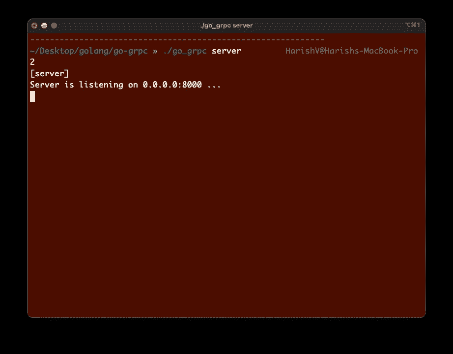
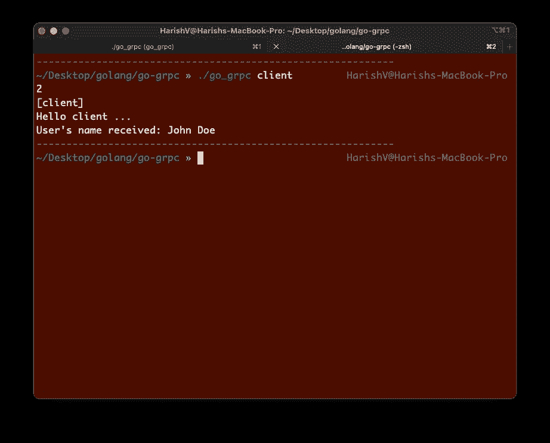
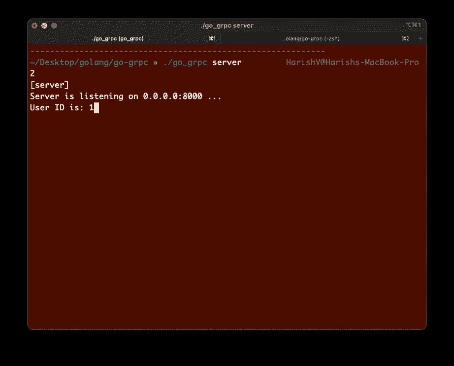

# 如何使用 Go 执行远程过程调用

> 原文：<https://betterprogramming.pub/how-to-perform-remote-procedure-calls-with-go-e96e9eee691d>

## Golang 中的 gRPC API 入门


REST APIs 长期以来一直统治着开发世界，但是现在出现了一个新玩家——gRPC！在本文中，让我们探究 gRPC 到底是什么，并使用 Golang 构建一个简单的初学者 API。

# gRPC 是什么？

gRPC 是 Google 开发的用于执行远程过程调用(RPC)的开源框架。这为我们连接多个服务提供了一种有效的方式。gRPC 最好的地方是我们可以直接调用 API，就像调用其他方法一样！

以下是来自官方 [gRPC 文档](https://grpc.io/docs/what-is-grpc/introduction/)的参考:

> 在 gRPC 中，客户端应用程序可以直接调用不同计算机上的服务器应用程序上的方法，就像它是本地对象一样，这使您可以更轻松地创建分布式应用程序和服务

此外，gRPC 客户机和服务器可以在各种环境中相互通信，而不用考虑所使用的语言或框架。

Arun Mathew Kurian 在这里写了一篇很棒的文章[，详细探讨了 REST 和 RPC 架构之间的差异。一定要去看看！](/understanding-grpc-60737b23e79e)

# Go 中的 gRPC 入门

让我们尝试在 Go 中开发一个简单的 gRPC API。在我们开始之前，请确保您已准备好以下先决条件:

## 安装 Go

您需要安装 Go。点击官方[链接](https://golang.org/doc/install)下载。

## 安装协议

`protoc`是一个协议缓冲编译器。检查此处的说明[以安装](https://grpc.io/docs/protoc-installation/)。

## 安装协议编译器插件

通过下面的命令安装协议编译器插件。

```
go install google.golang.org/protobuf/cmd/protoc-gen-go@v1.26
go install google.golang.org/grpc/cmd/protoc-gen-go-grpc@v1.1
```

## 更新路径

使用以下命令更新路径:

```
export PATH="$PATH:**$(**go env GOPATH**)**/bin"
```

# 创建新的 Go 项目

为了简单起见，我们将在同一个包中进行所有的编码。创建一个名为`go_grpc`的文件夹，并在该文件夹中执行以下命令:

```
go mod init go_grpcgo get google.golang.org/grpc
go get google.golang.org/protobuf/reflect/protoreflect@v1.25.0
go get google.golang.org/protobuf/runtime/protoimpl@v1.25.0
```

# 创建原型文件

现在我们已经准备好了设置，让我们创建一个原型文件，在其中定义我们的 API。让我们创建一个返回用户详细信息的 API。

创建一个名为`user.proto`的文件。在我们的原型定义中，我们将用必需的字段定义请求和响应对象。

我们定义了一个名为`UserService`的服务，它提供了一个名为`GetUser`的 rpc(类似于一个函数)。

根据我们的定义，让我们生成一个 Go 文件。为此，我们执行以下命令:

```
protoc --go_out=. --go_opt=paths=source_relative **\
**    --go-grpc_out=. --go-grpc_opt=paths=source_relative **\** users.proto
```

这将创建两个文件，`users.pb.go`和`users_grpc.pb.go`。这两个文件都包含填充、序列化和检索我们在原型文件中定义的消息所需的所有代码。

它还将包含为客户端和服务器生成的代码。

# 创建服务器

接下来，创建一个`main.go`文件，在我们的`main`函数中，让我们创建 gRPC 服务器并开始监听端口`8000`。

我们服务器的主要目标是服务`GetUser`的请求。它在请求体中打印出`id`，并返回一个名称为“John Doe”的标准响应。

我们为命令行参数添加了条件检查。因为我们将所有文件放在同一个包中，所以我们将接受一个命令行参数来指定我们是启动服务器还是客户端。

# 创建客户端

最后，让我们创建一个客户机，它可以对我们的服务器进行 gRPC 调用`GetUser`。

请注意，我们进行调用的方式类似于调用函数。我们所做的是`client.GetUser(context.Background(), request)`，这将从服务器返回响应。

# 运行我们的服务器和客户端

在运行我们的代码之前，让我们从文件夹的根目录使用`go build .`来构建它。这将在根目录下创建一个可执行文件`go_grpc`。

现在，让我们打开两个终端——一个用于服务器，一个用于客户端。

在第一个终端中，运行`./go_grpc server`。如果您已经成功运行了服务器和客户端，您应该会立即看到以下输出:



在第二个终端中，使用`./go_grpc client`启动客户机，您应该看到服务器终端和客户机终端都将打印出以下输出:



在客户端



在服务器上

我们走吧！我们的 gRPC 服务器和客户端已经准备好了。

# 结论

在本文中，我们看到了使用`protoc`定义一个 API 并让服务器和客户端生成是多么容易。使用 gRPC 的一个主要优点是，由于它使用的协议缓冲区优于 REST 中的标准 JSON 或 XML，因此可以更好地编码数据。

另外，gRPC 允许我们使用 HTTP2 作为传输协议。考虑到它能与各种语言很好地集成，在各种微服务之间进行有效的通信对我们来说也是一个很好的选择。

Napon Mekavuthikul 也写了一篇关于 gRPC 如何节省开发时间的文章[这里](https://medium.com/red-crane/grpc-and-why-it-can-save-you-development-time-436168fd0cbc)。请仔细阅读，以了解我们如何使用 gRPC 进一步改进我们的开发过程和生命周期。

为您的下一个项目尝试 gRPC，并分享您的经验！