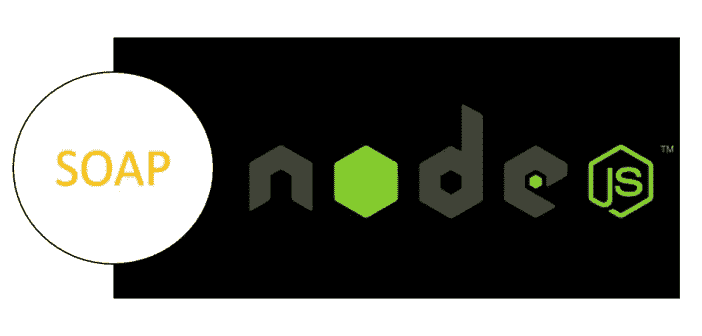

# 如何用 Node.js 执行 SOAP 请求

> 原文：<https://betterprogramming.pub/how-to-perform-soap-requests-with-node-js-4a9627070eb6>

## 当你不能休息的时候



# 什么是肥皂？

SOAP 代表简单对象访问协议。基本上是休息前唯一存在的东西。这是一个基于 XML 的 API……在进一步深入之前，要知道 REST 要好得多。

SOAP 服务器由一种叫做 WSDL (Web 服务描述语言)的东西组成，它包含一个 XML 模式来定义什么动作可以发送到服务器。想想 REST API 文档。

 [## SOAP -维基百科

### SOAP(最初的简单对象访问协议)是一个消息协议规范，用于交换结构化…

en.wikipedia.org](https://en.wikipedia.org/wiki/SOAP) 

# 如何使用 SOAP 服务？

在花了大约一两个小时在网上寻找仍然有效的 SOAP 服务后，我终于找到了一个。幸运的是，NOAA 仍然有一些使用 SOAP 的功能性遗留技术。

要使用 SOAP API，您需要发送一个 POST 请求，其中包含一些内容:

*   右侧标题(通常为两个)
*   肥皂信封

## 头球

对于几乎所有的 SOAP 请求，您需要以 XML 格式发送数据:

```
Content-Type: text/xml;charset=UTF-8
```

您需要发送的另一个报头是`soapAction`。现在，不是所有的服务都需要一个`soapAction`(如果 WSDL 说`soapAction=""`)，但是如果 SOAP 服务提供了多个功能，你通常需要发送它。找到`soapAction`的方法是“ctrl+f”WSDL 或者依赖于 API 文档(如果有的话),在我看来这很难找到，因为 SOAP 已经过时了。这是美国国家海洋和大气管理局提供的我将要测试的 WSDL。

这里有一个例子`soapAction`为上述 WSDL:

```
soapAction:'https://graphical.weather.gov/xml/DWMLgen/wsdl/ndfdXML.wsdl#LatLonListZipCode'
```

总之，我们至少需要这两个头，但是您可能还想添加第三个头，以便对一些需要用户代理的外部 web 服务友好。例如:

```
user-agent: "Mozilla/5.0 (Macintosh; Intel Mac OS X 10_7_3) AppleWebKit/535.19 (KHTML, like Gecko) Chrome/18.0.1025.151 Safari/535.19"
```

## 肥皂信封

接下来，您需要向服务发送一个 SOAP“有效负载”。这是您希望服务在得到您的响应之前使用的数据。我合作过的大多数开发人员都使用一种叫做 [SOAP UI](https://www.soapui.org/) 的工具来生成他们的有效负载。

当您在 SOAP UI 中输入一个 WSDL(本地文件或 HTTP URL)时，它会在侧边栏树中生成“SOAP 绑定”和测试用例(针对所有的`soapActions`)。这些是供您的 SOAP web 服务使用的样板 XML 模式。你所需要做的就是填写数据。

对于 NOAA 服务，我插入了[这个 WSDL](https://graphical.weather.gov/xml/SOAP_server/ndfdXMLserver.php?wsdl) ，并选中了“为 SOAP 绑定创建测试套件”选项，所有的测试用例都为我呈现出来了。我只需要替换“？”用可接受的数据来消费服务。

[使用 SOAP UI 的视频](https://www.youtube.com/watch?v=6BhJhTALOs4)

# 用 Curl 测试服务

我想用一些非常简单和原始的东西来测试服务，以确保 SOAP UI 不会在我面前施展魔法，并完全理解幕后发生的事情。

我从 SOAP UI 中复制了`LatLonListZipCodesoapAction`的信封，并将其粘贴到一个文件中供`curl`使用(对于一个长命令来说，以字符串形式传递会更好)。

然后，我用有效的邮政编码替换了`<zipCodeList>`标记之间的`?`，并运行了以下命令:

请看，我得到了下面的响应，它给了我正确的经纬度坐标数据！

# 为什么我要用 Node？消费像肥皂这样古老的东西？

如果你像我一样在一家大公司工作，你会知道传统技术被推进和维护的时间太长了。我更倾向于使用 Node 这样的现代工具来完成工作，因为我可以更快地编写更少的代码。

我的任务是用 Java 编写旧 SOAP 服务的集成测试…我鄙视 Java。要编写像 HTTP 请求这样简单的东西，代码实在太多了。我想…我打赌我可以在 Node 中轻松做到这一点。

# [简单 Soap 请求节点模块](https://github.com/circa10a/easy-soap-request)

有几个流行的 SOAP node.js 模块可供选择来执行 SOAP 请求，例如:

*   [肥皂](https://www.npmjs.com/package/soap)
*   [强力肥皂](https://www.npmjs.com/package/strong-soap)
*   [简易香皂](https://www.npmjs.com/package/easysoap)

但是我设法为我的特定用例找到了所有这些错误的地方。每个都需要太多的代码或者太多的开销。我心想:“我只需要发三个参数，就这样。当我想做一些如此简单的事情时，为什么要为所有模块准备如此大量的文档。”所以…

我编写了一个简单的`.js`文件，使用 [Axios](https://www.npmjs.com/package/axios) 执行 POST 请求，重新创建了上面的过程，但是我认为“做这么简单的事情，代码还是太多了……”所以我创建了`easy-soap-request`节点模块。

模块没有太多内容，但它提供了“提升力”。这将为那些刚刚了解可怕的遗留 SOAP 的人节省时间。该模块如下所示:

该模块接受三个参数(URL、headers、XML ), XML 是 soap 信封。

它使用较新的异步 await 语法，所以你可以用你的异步编码和诸如此类的东西得到所有的花式。

# 实际使用这个东西

## **Node.js 用法**

首先，您需要通过运行以下命令来安装该模块:

```
npm install easy-soap-request
```

接下来，您需要创建一个`.js`文件，并需要下面第一行中的模块。

这是一个很好的例子:

在第 11 行，我从一个文件中读入 XML，因为这将是一个非常长的字符串，但这是您的首选。

在第 15 行，通过等待`soapRequest`函数返回响应体和状态代码，您可以看到我创建了一个“析构”对象。

**浏览器用法(新)**

我甚至经历了学习 [webpack](https://webpack.js.org/) 的麻烦，这样你就可以在客户端使用`easy-soap-request`:

*但是要记住，*[*CORS*](https://developer.mozilla.org/en-US/docs/Web/HTTP/CORS)*有时候会是个问题。*

在这里你可以找到[带自述文件的回购](https://github.com/circa10a/easy-soap-request)和 npm 上的[模块。](https://www.npmjs.com/package/easy-soap-request)

# 用摩卡和柴测试

以下是如何在测试框架内执行上述操作的方法:

# 鳍状物

感谢阅读，希望你能在不久的将来继续休息！