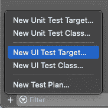
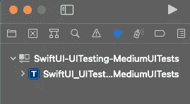
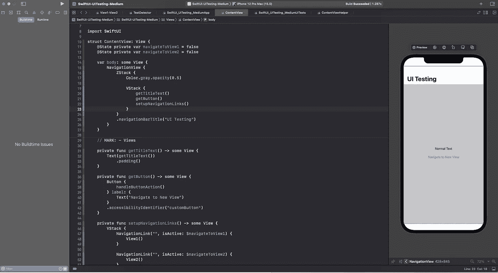
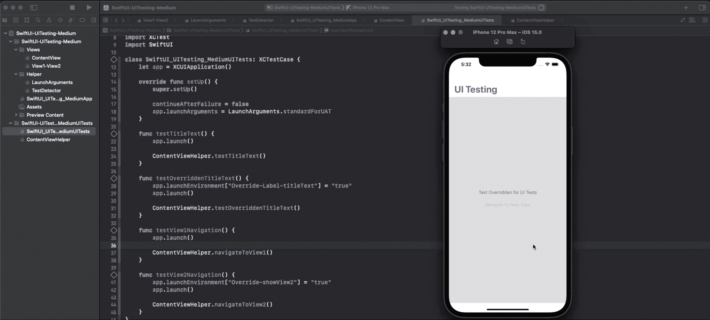

# 如何在 SwiftUI 中执行 UI 测试

> 原文：<https://betterprogramming.pub/how-to-perform-ui-testing-in-swiftui-b24f231f4316>

## 了解更多关于 LaunchArguments、LaunchEnvironment、使用辅助功能以及在 SwiftUI 中运行 UITests 的提示


照片由 [Aaron Burden](https://unsplash.com/@aaronburden?utm_source=medium&utm_medium=referral) 在 [Unsplash](https://unsplash.com?utm_source=medium&utm_medium=referral)

## 什么是 UI 测试？

[UI 测试](https://developer.apple.com/documentation/xctest/user_interface_tests)是一种非凡的方法，可以保证当你添加新功能或重构应用程序的代码库时，你最基本的 UI 协作能够继续进行。

编写和运行 UI 测试与进行单元测试有些不同，因为您实际上是在与您的应用程序协作，而不是针对 API 执行一些测试。

这是自动化重复任务的好方法，尤其是当我们处理 UI 逻辑的时候。例如:如果你正在重构，想要确保你的应用程序以你想要的方式浏览，测试深度链接，或者测试复杂的用户界面。

## 为什么要进行 UI 测试？

单元测试计划测试一小部分代码。单元测试可以在后台完成。您可以为您的类、结构和方法编写测试用例。单元测试不能验证我们得到的结果是否正确地显示给用户。单元测试不能验证你的应用在真实环境中的表现。这时你想进行 UI 测试。

借助于 UI 的功能测试通常是扩展测试的程度和深度的最快和最好的方法，以结合协调应用程序框架的每一部分的真实世界条件。

UI 测试可能是框架测试、实践测试或确认测试的别名，在这些测试中，您一起测试整个系统，以保证它在真实场景下做它应该做的事情。

UI 测试将确保我们的应用程序的用户界面在执行预期的操作时行为正确。

如果你想知道单元测试和 UI 测试之间的区别，看看这篇文章。

*如果你是单元测试和 UI 测试的新手，有那么多文章解释你，但是我最喜欢*[*Raywenderlich*](https://www.raywenderlich.com/21020457-ios-unit-testing-and-ui-testing-tutorial)*视频。*

# SwiftUI 中的 UI 测试

在我们开始 UI 测试之前，我们必须知道:

1.  `[LaunchArguments](https://developer.apple.com/documentation/xctest/xcuiapplication/1500477-launcharguments)`:启动时传递给应用程序的参数。
    如果没有修改，这些是 Xcode 将在启动时传递给应用程序的参数。可以更改、添加或删除参数。与不同，在应用程序启动后修改这些参数也是合法的。此类更改不会影响当前的启动会话，但会在下次启动应用程序时生效。
2.  `[LaunchEnvironment](https://developer.apple.com/documentation/xctest/xcuiapplication/1500427-launchenvironment)`:启动时传递给应用程序的环境变量。如果没有修改，这些是 Xcode 将在启动时传递给应用程序的环境变量。可以更改、添加或删除环境变量。与不同，在应用程序启动后修改环境变量也是合法的。此类更改不会影响当前的启动会话，但会在下次启动应用程序时生效。

`LaunchArguments`和`LaunchEnvironment`可以给出一个简单的方法来设置真正有价值的调试活动，这可以帮助我们提高事件和测试的速度。

添加`LaunchArguments`我们可以:

*   加快我们的开发工作
*   我们可以完全消除手动设置自定义数据的需要

现在，我们将使用一个简单的例子来回顾使用上述两个概念的 UI 测试。

我们先在 SwiftUI 中创建一个 app。如果您没有任何 UI 测试目标，请通过`Command + 6`或选择`Test Navigator`创建一个。它应该是这样的:



创建 UI 测试目标



创建 UI 测试目标后

现在，我有一个简单的代码，它使用`Text`、`Button`和`NavigationLink`视图来帮助我们理解流程。



用于测试的示例代码

请注意，我们已经为我们的`Button`使用了`accessibilityIdentifier`来在我们的`UITesting`中访问它们。

现在，我们的应用程序有了一些 UI 元素，它完成了一项工作。让我们创建我们刚刚了解的`LaunchArgument`:

此外，创建一个助手类来标识我们是否正在运行 UI 测试，如果需要，还可以帮助我们覆盖标志或者向 UI 元素注入模拟数据。

测试探测器

让我解释一下这里发生了什么:

1.  我们创建了一个叫做`TestDetector`的`class`
2.  我们有一个名为`Keys`的枚举，帮助我们覆盖在`ContentView.swift`中使用的按钮动作的布尔标志
3.  `isRunningUITests`会告诉我们是否正在运行 UI 测试
4.  静态函数，帮助我们覆盖标志，使应用程序可以显示我们想要的视图。

既然我们已经设置了 UI 测试所需的一切，我们得到的问题是我们将在哪里以及如何在我们的应用程序中使用`LaunchArguments`。

以前，我们使用`AppDeleagte`来处理覆盖任何标志、监听远程通知、记录等等的逻辑。现在有了新的 SwftUI 应用程序，它们使用一个定制的`struct`来启动，这个定制的`struct`符合一个叫做`App`的协议。你还是可以用`didFinishLaunchingWithOptions`的方法来使用我们的`LaunchArguments`。

为此，首先，创建一个从`NSObject`继承并适应`UIApplicationDelegate`协议的定制类

你不应该忘记在`App`场景中添加以下内容。SwiftUI 有责任委任该代表并负责其生活:

```
@UIApplicationDelegateAdaptor(AppDelegate.self) var appDelegate
```

如果您不想这样做，您仍然可以在`App`场景中使用`init()`，并像这样添加代码:

好了，我们把一切都安排好了。现在，让我们为我们的`ContentView`写一些测试用例。

为简单起见，下面是我们根据业务逻辑必须涵盖的测试案例:

1.  测试默认`Title`文本
2.  测试`Title`文本是否响应更改并正确更新。
3.  导航至`View1`
4.  导航到`View2`(调整逻辑来测试)

示例 UI 测试—swift UI _ UI testing _ MediumUITests

在上面的代码中，我们必须记住的一件关键事情是，你想添加到你的`launchArguments`中的任何东西都必须在应用`launch()`之前完成。
`launchEnvironment`将帮助我们覆盖我们在应用程序中使用的任何功能标志。查看测试案例

```
func testView2Navigation() {
    app.launchEnvironment[“Override-showView2”] = “true”
    app.launch() ContentViewHelper.navigateToView2()
}
```

当用户点击`ContentView.swift`中的按钮时，`launchEnvironment["Override-showView2"]`将帮助用户导航至`View2`。

此外，我们必须在测试用例中以及在`TestDetector`中使用相同的键`Override-showView2`。

当您按下`Command + U`来运行测试用例时，您将会看到神奇之处:



运行 UI 测试

## **重要提示**

`XCTest`使用可访问性 API 获取视图层次结构中的所有 UI 元素。SwiftUI 默认提供可访问性支持，并且非常容易使用。

`XCUIApplication`可以用来查询视图层次结构中存在的任何 UIElement，但是我们必须确保`UIElement`的可访问性已经打开。

通过添加或使用可访问性进行测试是一个很好的方法，因为你可以同时做这两项工作(添加可访问性和 UI 测试)

## **提示**

1.  如果你之前已经运行了测试用例，你会发现结果仍然显示。要清除测试结果，您可以执行`Control + Option + Command + K`或点击 Xcode 工具栏上的`Product`并选择`Clean Test Results`
2.  也可以通过做`Option + Command + R`添加`launchArguments`，在工具栏选择`Arguments`。

你可以在这里找到 Github 回购[。如果您有任何问题或建议，请联系我。祝你好运。](https://github.com/dheerajn/SwiftUI-UITesting)

希望这对你有帮助。感谢阅读。