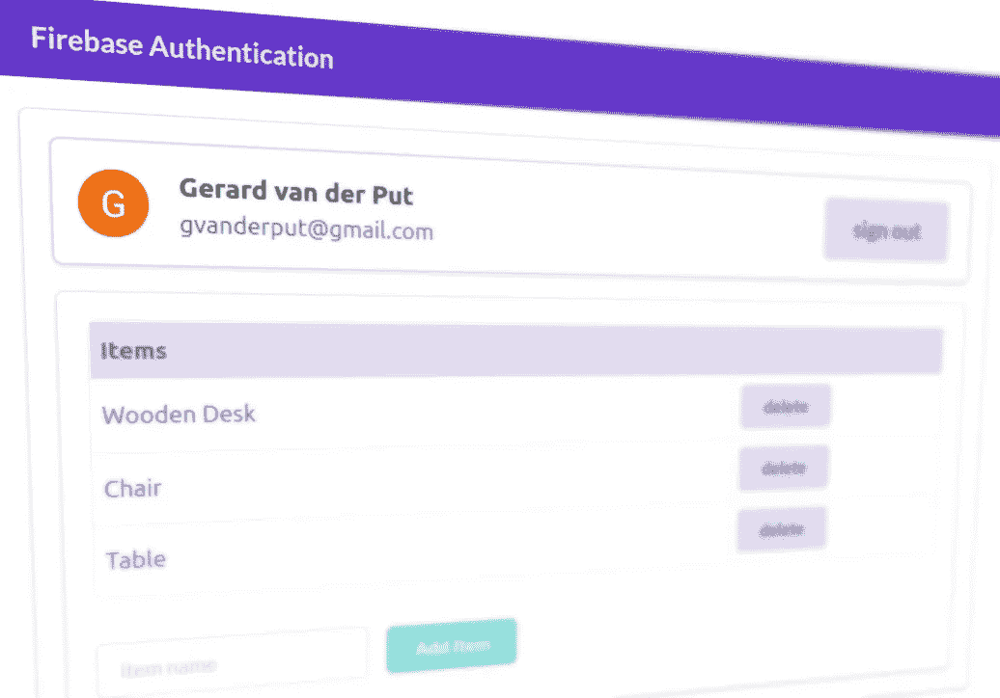
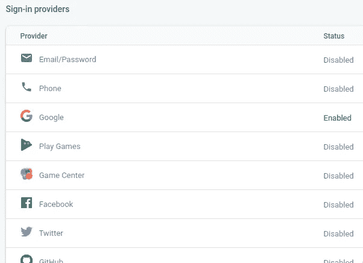
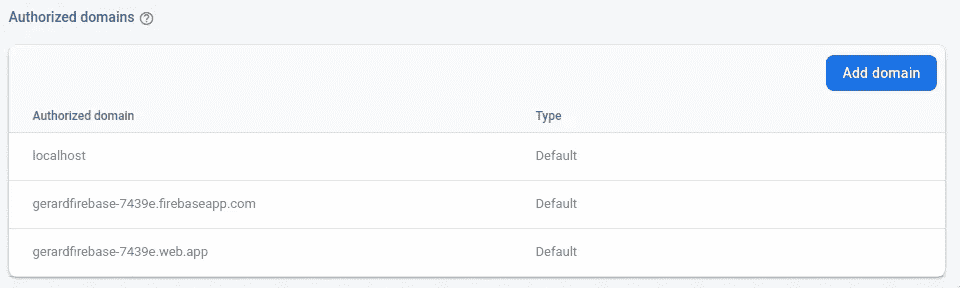
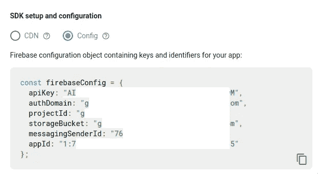
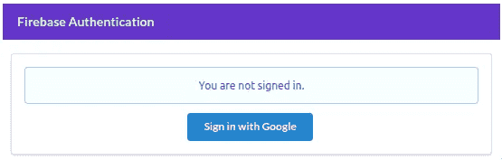
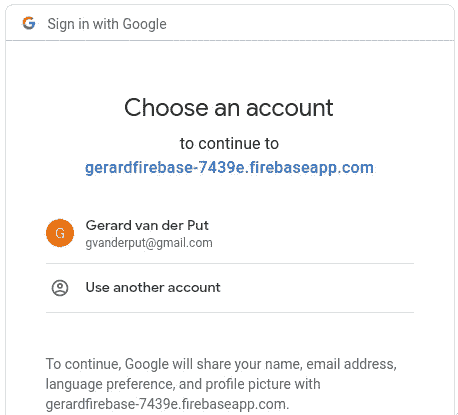
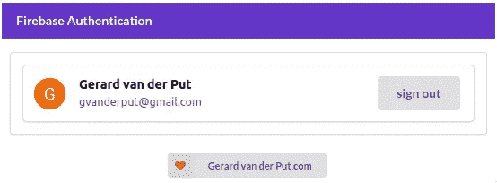
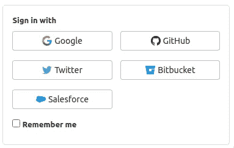

# 如何使用 Firebase 通过 React 执行用户身份验证

> 原文：<https://betterprogramming.pub/how-to-perform-user-authentication-with-react-using-firebase-5cfbf17e0993>

## 使用 Firebase SDKs 轻松验证 React 应用程序中的用户



我们今天将创造什么！图片由作者提供。

在您的应用程序中对用户进行身份验证曾经非常具有挑战性。这是一个很大的安全隐患，只有专家才敢实施和维护解决方案。但是现在，我们不再需要了。有无数的外部身份提供者使用 OAuth 2.0 和 OpenID Connect 等安全认证协议，我们可以利用这些协议，而无需自己编写代码，更重要的是，无需自己存储用户凭据。

Firebase 是谷歌开发的一个用于创建移动和网络应用的平台，它拥有大量的功能，在这方面令人印象深刻。今天，我们将通过使用他们的用于 JavaScript 的[认证 SDK](https://firebase.google.com/docs/web/setup?authuser=0) 来关注 Firebase 的用户认证。

如果你知道该做什么，这是相当简单的。让我们开始吧！我会一路解释某些概念。

*注:演示应用的所有代码都可以在我的* [*GitLab 资源库*](https://gitlab.com/gvanderput/gerard-firebase) *中找到。*

# Firebase 设置

首先，我们需要为我们的项目设置 Firebase。在 [Firebase 控制台](https://console.firebase.google.com/)中，创建一个新项目。给它起一个有意义的名字(在我的例子中是“GerardFirebase”)。

接下来，在左侧的“身份验证”部分，启用登录提供者。如你所见，有很多:



许多登录提供者是可用的(Firebase 控制台的屏幕截图)。

在本文中，我们将重点关注如何让用户使用他们的 Google 帐户登录我们的网站。因此，我们将启用“Google”条目。

在这样做的时候，我们必须为我们的应用程序提供一个名称，用户在登录时可以看到这个名称，同时提供一个他们可以看到的电子邮件地址(虽然是间接的——在显示之前，他们必须单击身份验证页面上的一个链接)。

另外，请注意“授权域”部分:



这些是在运行应用程序时可以使用的域。例如，当您使用 CRA (Create React App)或 Next.js 开发新的应用程序时，您最有可能使用本地主机域。在这种情况下，默认值就足够了。一旦您开始使用您的应用程序并使用一个真正的域，您就必须将它添加到这个列表中。或者更好的是，您可以创建一个专用的、独立的生产数据库！

一旦完成，你就可以走了。让我们写一些代码。

*注意:可以启用多个登录提供者，但这超出了本文的范围，因为我们必须在前端实现更多的代码。通过只关注 Google 登录提供商，我们可以更容易地解释概念和解决方案。*

# 在您的前端配置 SDK 的使用

将 Firebase SDKs 添加到 React 项目中:

```
$ yarn add **firebase**
```

之后，我们必须在代码中配置和初始化 Firebase SDK。创建 Firebase 引导文件:

当然，我们必须为我们的配置对象提供值。您可以将它们直接写在这个文件中，但这被认为是一种不好的做法。如果您将文件提交并推送到远程存储库，这些值也会被发送到那里，这很可能不是我们想要的。

我们可以将这些值存储在环境变量中。我使用的是 Next.js，所以我将在根目录下创建一个名为`.env.local`的文件，内容如下:

注:在本文中，实际值被替换为***值。

创建该文件后，我可以重新启动开发服务器，并使用引导文件中的值，如下所示:

如果你正在使用 CRA (Create React App)，你可以做一些类似的事情。具体细节在[这一页](https://create-react-app.dev/docs/adding-custom-environment-variables/)的文档中有描述。

# SDK 配置值

您可以在 Firebase 控制台的“项目设置”下找到实际值在显示它们之前，你必须进入项目设置>通用>你的应用>添加应用，然后添加一个 *Web 应用*。这样，您指示 Firebase 您将在 web 应用程序中使用 Firebase SDK，配置将显示如下:



# 包括引导文件

最后，我们必须通过将引导文件添加到索引文件来确保它包含在源代码中:

```
import "../path/to/bootstrap.js";
```

对于 Next.js 应用程序，将这一行添加到您的`pages/_app.js`文件中。如果您使用的是 CRA，请将其添加到`src/index.js`。

现在，一旦您运行应用程序，到 Firebase 项目的连接将被初始化，我们可以开始使用 SDK 功能。

# 认证上下文

在我们实际使用 Firebase SDK 之前，我们必须做一些准备工作。

我们希望能够在整个应用程序中访问有关登录用户的信息，因此我们将创建一个能够保存这些信息的 [React 上下文](https://reactjs.org/docs/context.html)。如果您不熟悉上下文，我建议在继续之前阅读我的其他文章:

[](/exploring-caching-techniques-in-react-d30bbb78d54d) [## 探索 React 中的缓存技术

### 如何使用记忆、上下文、使用记忆、使用状态和使用效果

better 编程. pub](/exploring-caching-techniques-in-react-d30bbb78d54d) 

创建一个新文件，该文件创建一个新的上下文并将其导出:

如您所见，该值可以是`null`(用户未登录—默认)或`User object`(我们有一个经过身份验证的用户)。

接下来，我们创建一个[高阶组件](https://reactjs.org/docs/higher-order-components.html)，它利用了我们新上下文中的提供者:

我们将用这个 HOC 来包装我们的整个应用程序(根组件),稍后会有更多内容。那么这个文件中发生了什么呢？

在第 6-7 行，我们看到我们有一些本地状态。它跟踪身份验证过程是否已经初始化，并且可以存储一个用户对象。很快会有更多。

最后，我们决定我们的 HOC 要渲染什么(第 11-21 行)。如果初始化还没有完成，我们返回我们很忙(“loading…”)。如果我们没有用户(第 15 行)，我们显示一个登录按钮:



当用户没有被认证时，我们的 HOC 返回一个登录按钮。

如果我们有一个授权用户，我们返回传递给这个`AuthContextProvider`组件的子组件。

但最重要的部分还是不见了。我们必须使用 Firebase SDK，这样当认证用户发生变化时，我们的 HOC 就会得到通知。导入相关的 SDK 代码:

```
import **firebase** from "firebase/app";
import "firebase/auth";
```

并添加下面的`useEffect`钩子(在上面的代码片段中，第 9 行没有这个钩子):

因为我们提供了一个空数组作为`useEffect`调用的第二个参数，所以这段代码将被执行一次(当这个 HOC 被挂载到 DOM 时)。

我们使用 Firebase 认证 SDK 中的`onAuthStateChange`函数。每当用户身份验证发生变化时(例如，用户登录或退出)，所提供的回调将使用一个参数(“im”——一个`Firebase.User`实例——或`null`)来执行，我们会相应地更新本地状态。

# 使用 AuthContextProvider 专用

确保在您的索引文件中用我们的 HOC 来包装您的根组件:

```
<AuthContextProvider>
  <MyApp />
</AuthContextProvider>
```

# 登录按钮

不久前我们看到，如果用户没有经过身份验证，我们就会呈现一个登录按钮。组件如下所示(特别注意第 9 行的`onClick`处理程序):

单击该按钮时，会发生两件事。首先，我们创建一个提供者。还记得 Firebase 项目配置中的登录提供者列表吗？在这里，我们可以选择一个已启用的提供者。我们只启用了谷歌的，所以这是我们创建的。

*注意:在这里你可以看到为多个提供商(如脸书、Twitter 等)创建多个登录按钮是多么简单。*

其次，我们通过调用`signInWithRedirect`方法，指示 Firebase SDK 启动一个带有重定向的*认证流。因此，当我们的用户点击按钮时，他们将被重定向到谷歌，以表明自己的身份:*



这样做之后，它们将被重定向回我们的应用程序。

如果你不希望你的用户通过重定向暂时离开你的应用程序，你可以使用`signInWithPopup`来代替。请注意，如果您正在创建一个移动应用程序，这将不起作用。

当它们被重定向回我们的应用程序时，我们对 HOC 中的`useEffect`钩子内的`firebase.auth().onAuthStateChanged`的调用的处理程序将被执行，我们将拥有一个经过认证的用户！



我们的应用程序中有一个经过身份验证的用户！

# 显示用户信息

由于我们已经在一个上下文中存储了关于用户的信息(请参阅:本文前面的),并且我们已经通过我们的 HOC(提供者)提供了该上下文的值，所以我们可以读取该信息并在屏幕上呈现它，如果需要的话，可以在任何组件中呈现。我的演示存储库中的`UserInfo`组件如下所示:

注意我们如何通过使用`useContext`钩子在第 9 行获得对用户对象的引用。

# 签名登记离开

最后，必须有一种方法让用户退出我们的应用程序。幸运的是，SDK 也使这一点非常容易实现:

# 结论

正如简介中提到的，用户认证过去很难，而且容易出现安全漏洞。通过利用 Firebase 等平台的功能，我们不会冒任何安全风险。

您可以在本文中看到，我们在应用程序中只以临时状态存储用户信息(当用户关闭应用程序时，该状态已经消失)。它存储在内存中。不要自己持久存储用户信息(例如，在数据库或本地存储中)！最有可能的是，你不必这样做。相反，请依赖登录/身份提供商，如 Google 或任何其他可信任的第三方，或者它们的组合:



Gitlab.com 在其登录页面上提供多个提供商。

使用 Firebase 身份验证 SDK 对您的用户进行身份验证为使用 Firebase 的更多功能打开了大门，例如他们的 Firestore 数据库。

我们很快就会看到。

感谢您的宝贵时间！