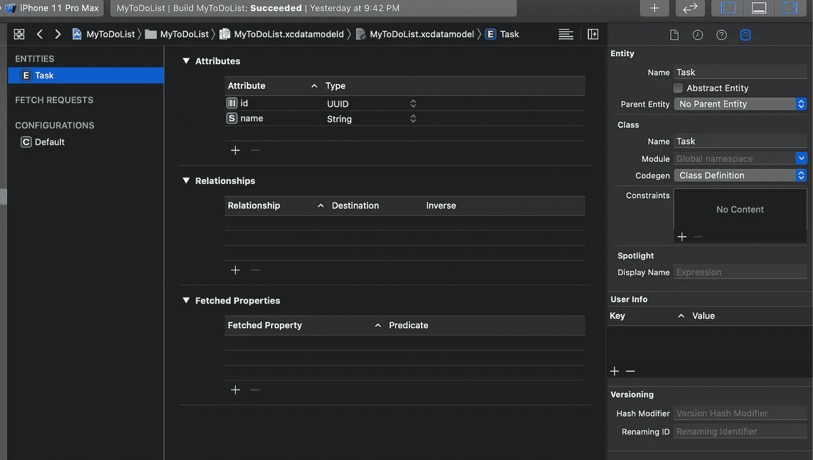

# 核心数据的 CRUD 操作

> 原文：<https://betterprogramming.pub/how-to-persist-data-with-core-data-9085b7943f42>

## IOS 编程指南

## 有时候本地存储是一个应用程序所需要的


[像素上的照片](https://www.pexels.com/photo/abstract-art-blur-bright-373543/)

现在的移动应用程序大部分时间都使用某种远程存储，但有时你可能会遇到需要在本地保存数据的特殊情况。它可以用来确保您的应用程序脱机工作。建立连接后，您可以将数据同步回远程服务器。在 iOS 中有多种方法可以实现这一点。可以用 SQLite，iCloud，Firebase 等。，但是我们将看看如何使用核心数据来实现这一点。

简而言之，去 [GitHub](https://github.com/Petey509/myToDoList) 下载我们将在学习使用核心数据的整个过程中使用的启动项目。喝杯咖啡或茶，或者任何你喜欢的饮料；我会等的。

准备好了吗？让我们开始吧。我们将添加、检索、删除和更新我们的本地存储。但首先，什么是核心数据？

核心数据用于保存应用程序的永久数据以供离线使用，缓存临时数据，以及在单个设备上为应用程序添加撤销功能。

更多信息，请访问苹果的[文档](https://developer.apple.com/documentation/coredata)。

我们的启动项目是一个简单的表格视图，能够添加、编辑和删除任务，因此得名 myToDoList。构建并运行项目。添加一些记录，关闭并重新打开模拟器。你会发现你的数据不见了。我们的应用程序还没有持久化数据。我们将修改它来解决这个问题。

## 保存数据

为了保存数据，我们需要创建核心数据模型。它将用于执行 CRUD(创建/读取/更新/删除)操作。先说车型。

点击`MyToDoList.xcdatamodeld` >添加实体。双击实体，将其重命名为 Task。单击属性部分下方的+号。命名属性 id 并选择字符串作为类型。再次单击+号，将属性重命名为 name，并选择 String 作为类型。选择 id 和 name 属性，并取消选中可选复选框。我们完成了模型。那不是超级简单吗？您的屏幕应该是这样的:



接下来，我们需要修改代码来使用模型保存我们的任务。我们需要首先构建以生成模型。按 Command + B 来构建。一旦构建成功，打开`MyToDoTableViewController.swift`文件。有时，由于某种原因，模型无法生成。为了确保我们不会遇到这种情况，请完全关闭 Xcode 并重新打开项目。应该会为您生成一个类名任务。

在导入 UIKit 后添加导入核心数据。

因为我们使用了一个字符串，现在使用了一个对象，所以我们会得到一些错误。我们需要先修复它们，然后才能开始使用核心数据。

进行以下更改。

```
//replace
var taskNames : [String] = []
//with
var taskNames : [Task] = []
let appDelegate = UIApplication.shared.delegate as! AppDelegatelet 
let context = (UIApplication.shared.delegate as! AppDelegate).persistentContainer.viewContext//replace
textField.text = self.taskNames[self.selectedIndex]
//with
textField.text = self.taskNames[self.selectedIndex].name//replace 
addTask(taskName: self.taskName.text!)
//with
let _task = Task(context: self.context)
_task.name = self.taskName.text!
_task.id = UUID().uuidString
addTask(task: _task)//change the method signature from
func addTask(taskName:String)
//to
func addTask(task:Task)//replace
self.taskNames.append(taskName)
//with
self.taskNames.append(task)//replace
self.taskNames[self.selectedIndex] = taskName
//with
self.taskNames[self.selectedIndex].name = taskName//replace 
cell.textLabel?.text = self.taskNames[indexPath.row]
//with
cell.textLabel?.text = self.taskNames[indexPath.row].name
```

我们现在应该能够构建和运行我们的项目了。继续点击构建按钮，然后点击运行按钮。您应该能够添加、删除和编辑。要编辑，请选择一个单元格，弹出窗口应该会显示出来。

到目前为止，我们所做的只是让我们的项目使用我们之前创建的核心数据模型。我们现在来看一下代码。

`taskNames`是我们用来存储数据的集合。

`context`是我们保存数据所需要的。

我们不打算报道`viewContext`,因为苹果在这个主题上有很好的文档。我们只打算用它。知道它允许访问本地存储。如果你想了解更多，请访问苹果的文档。

要保存任务，转到`addTask`方法并在最后一行后添加这一行代码。

```
self.appDelegate.saveContext()
```

你的`addTask`方法应该是这样的:

```
func addTask(task:Task){
   //insert taskname in collection
   self.taskNames.append(task)//this index is needed since we're using zero-base index
   let index = self.taskNames.count - 1//index path informs the table view of which section and index to add the new valuelet indexPath = IndexPath(item: index, section: 0)//insert value in table view
   self.tableView?.insertRows(at: [indexPath], with: .automatic)
   self.appDelegate.saveContext()}
```

没有办法验证任务是否被正确保存，但是相信我，它成功了。我们将通过检索我们保存的数据来证明这一点。

## 检索数据

打开`AppDelegate.swift`文件。我们将添加一个新方法`callretrieveTasks`。

```
func retrieveTasks()-> [Task]{//creating list and initialize it
    var _tasks : [Task] = []//get context
   let context = persistentContainer.viewContext//create request wiht entity Task
   let taskFetchRequest = NSFetchRequest<NSFetchRequestResult>(entityName: "Task")do{
       //fetch all tasks from local storage
       let tasks = try context.fetch(taskFetchRequest) as! [Task]
       if(tasks.count > 0 ){
           _tasks = tasks
       }}catch{
        print("Something happened while trying to retrieve tasks...")}
     return _tasks
}
```

选择`MyToDoTableViewController.swift`文件。我们还将使用覆盖方法之一，`viewWillAppear`。我们将集合设置为从 call `retrieveTasks`返回的任何数据，并重新加载表。

将这段代码添加到`viewDidLoad`方法之后:

```
override func viewWillAppear(_ animated: Bool) {
    self.taskNames = appDelegate.retrieveTasks()
    self.tableView.reloadData()  
}
```

构建并运行应用程序，瞧。在我们实现要检索的代码之前，您保存的记录现在应该显示在表视图中。让我们继续更新任务。

## 更新数据

要更新任务，我们只需要保存上下文中的更改。我们的`updateTask`方法将被修改为更新一个任务，重新加载表视图，然后更新本地存储。用下面的代码替换您的`updateTask`:

```
func updateTask(taskName:String){
     //just update the collect, then refresh the tableview
     self.taskNames[self.selectedIndex].name = taskNamedo{
          //needed to fetch request
          let fetchRequest = NSFetchRequest<NSFetchRequestResult>(entityName: "Task")//predicate to match task on id
          let predicate = NSPredicate(format: "id = %@", self.taskNames[self.selectedIndex].id!)//setting request predicate
       fetchRequest.predicate = predicate//look for task
       let foundTasks = try context.fetch(fetchRequest) as! [Task]//update found task
       foundTasks.first?.name = taskName//reload table
       self.tableView.reloadData()//save update
       try self.context.save()}catch{
        print("Something happen while trying to update a task")
    }}
```

我们快到了。现在我们可以添加、检索和更新了，剩下唯一要做的就是实现删除

## 删除数据

删除类似于编辑。两者使用相同的谓词。我们将在`commit editingStyle`委托方法中实现这个行为。用以下代码替换整个方法:

```
override func tableView(_ tableView: UITableView, commit editingStyle: UITableViewCell.EditingStyle, forRowAt indexPath: IndexPath) {if editingStyle == .delete {
    let _task = self.taskNames[indexPath.row]
    let context = appDelegate.persistentContainer.viewContext;let taskFetchRequest = NSFetchRequest<NSFetchRequestResult>(entityName: "Task")let predicate = NSPredicate(format: "id = %@", _task.id!)taskFetchRequest.predicate = predicatedo{let foundTaskts = try context.fetch(taskFetchRequest) as! [Task]context.delete(foundTaskts.first!// delete the record from collectionself.taskNames.remove(at: indexPath.row)//delete row from tableview
          tableView.deleteRows(at: [indexPath], with: .fade)//refresh tableview
          tableView.reloadData()//saving delete in context
           try context.save()}catch{
         print("Something happened while trying to delete task...")
    }
}}
```

就是这样。我们刚刚使用核心数据创建了一个具有本地存储的出色应用程序。谢谢你跟随我。直到下一次…

如果你在项目运作中遇到了问题，不要担心。完成的项目可以从 [GitHub](https://github.com/Petey509/CoreDataDemo) 下载。