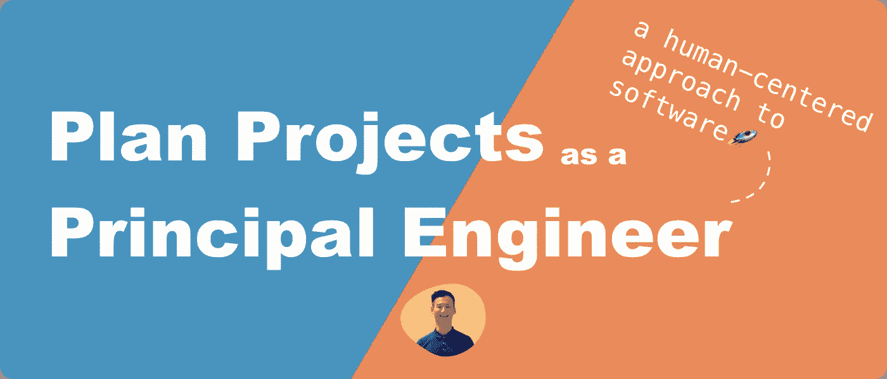
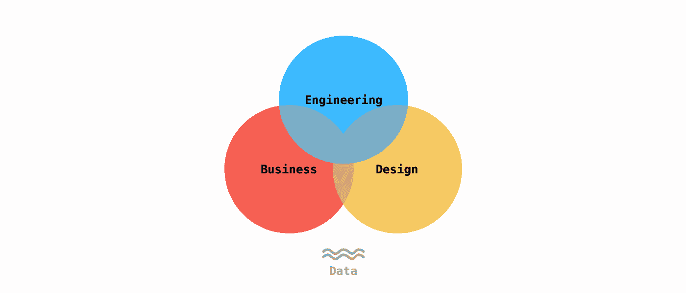
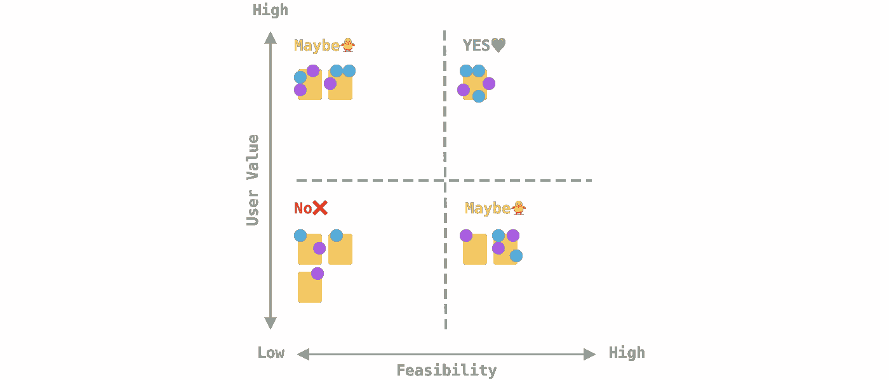
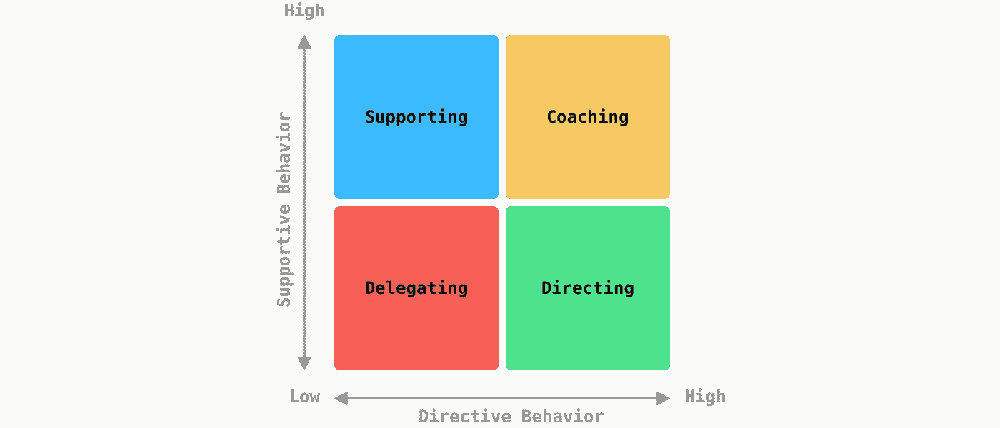
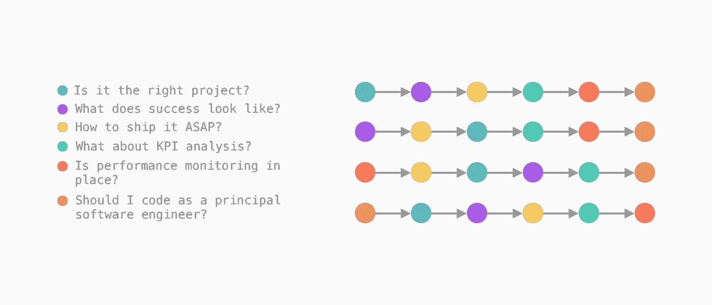

# 作为首席软件工程师如何规划项目

> 原文：<https://betterprogramming.pub/how-to-plan-projects-as-a-principal-software-engineer-1b1caefdf02c>

## 以人为中心的方法



# TL；速度三角形定位法(dead reckoning)

*   👑航运是女王。
*   🔭尽早想象并定义成功。
*   🤹不要忘记包括绩效监控和 KPI 分析。
*   🎯首席工程师是一个领导角色。想想你在这个项目中的参与程度。

对我来说，作为一名首席软件工程师，工作就是将工程、业务和人紧密联系在一起。



通常，作为首席工程师，你是组织中第一批听说某个项目的技术代表之一，你需要进行内部对话，要么继续，要么放弃。就时间预算、资源、利益相关者的沟通，甚至你自己的参与而言，在做计划时，有许多事情需要考虑。

所以我想和你分享我作为首席工程师对规划的看法，以及在项目的规划阶段应该问哪些重要的问题。

# 这是正确的项目吗？

你会听到不同期限的项目，这取决于你的组织通常如何产生商业想法。它可以是对潜在用户需求的观察，也可以是“我们三个月后就需要它”。不管怎样，一个简化的思路是这样的:

*   做还是不做？
*   如果“做”，时机对吗？
*   工程复杂程度如何？
*   努力程度如何？
*   我们有资源吗？
*   做还是不做？

还有很多因素。我的建议很简单:

> 跟随你的直觉😎

通常你会有一种直觉，一种兴奋或一种充满活力的感觉，对这个项目说“是”。随着时间的推移，为了培养直觉，我发现有一些练习对形成我的工程观点非常有用:

*   了解你的行业和竞争格局。
*   了解你的组织的战略。(如果你和我一样不知道“战略”在商业世界中意味着什么，我强烈推荐 A.G .雷富礼和罗杰 l .马丁的书《T2:为了胜利而战:战略如何真正发挥作用》。)
*   使项目与组织的 [OKR](https://rework.withgoogle.com/guides/set-goals-with-okrs/steps/introduction/) 保持一致
*   和设计师谈谈他们研究中的用户需求和痛点。
*   与项目经理(PM)或产品负责人(PO)讨论市场调查。
*   可视化您组织的项目组合。只要看一看，你就会对短期和长期承诺、团队/项目分配以及适应的缓冲之间的平衡有更好的感觉。

如果你不确定如何确定优先级，你可以和你的团队一起制定一个[优先级矩阵](https://www.nngroup.com/articles/prioritization-matrices/)来确定项目所处的位置。优先级矩阵如下所示:



注意**基于专业知识的投票**在这个过程中是至关重要的，因为它将揭示不同学科的人们如何看待项目的重要性和紧迫性。这是矩阵中看不见的第三轴。

# 成功是什么样子的？

在早期想象成功的样子会在很多方面帮助你:

*   巩固你对项目的直觉。
*   更清楚地向他人传达目标和与 OKRs 的一致性。
*   设计 KPI 来衡量进展和影响。

我喜欢用[亚马逊的“逆向工作”方法](https://www.quora.com/What-is-Amazons-approach-to-product-development-and-product-management/answer/Ian-McAllister)把我的想法放进**的新闻稿**。这是一个很好的方法，仅仅通过“看”终点线后发生的事情，就可以让人们处于相同的心态。

我以新闻稿为起点，邀请大家进行对话，并整合文档的参考资料。通常包括:

*   项目史诗或概述。
*   用户界面设计模型。
*   工程系统设计。
*   KPI 分析。

# 如何尽快发货？

> *“船学。”*

自从我读到这句话，它就成了我的指导原则。 [GitHub](https://dev.to/mscccc/how-we-use-ship-small-to-rapidly-build-new-features-at-github-5cl9) 在他们的领导原则中分享了相同的理念，我认为这种思维模式是精益和敏捷软件开发的基础，因为它:

*   以人为中心，以用户为中心。
*   以反馈和学习的迭代为动力。
*   可测量。

我喜欢使用[设计思维](https://www.nngroup.com/articles/design-thinking/)作为框架来思考问题以及如何在整个项目中迭代。结合新闻稿和 KPI，这是验证你的假设并坚持到底的好方法。

[设计冲刺](https://www.gv.com/sprint/)是解决问题和开始探索的另一个好工具。最重要的是，它很有趣🤩

当你面对一个复杂的项目时，确保你的系统设计方案包括更简单、更快速的替代方案。这将允许团队更快地迭代。

这里的要点是真正专注于**将项目交付到用户手中**，而不是实现一个完整的解决方案。

# KPI 分析呢？

并排查看业务 KPI 和 UX KPI 对于更好地理解数据非常有用。重要的是与项目经理和设计师一起深入分析，找出下一次迭代的方向。

我学到了统计学中的一些基本概念，这些概念对于与商业智能和设计团队合作非常有用。

*   [排列测试](https://www.jwilber.me/permutationtest/)
*   [p 值](https://en.wikipedia.org/wiki/P-value)
*   [A/B 测试](https://www.optimizely.com/optimization-glossary/ab-testing/)
*   [A/B/n 测试](https://www.optimizely.com/optimization-glossary/abn-testing/)
*   [多元检验](https://www.optimizely.com/optimization-glossary/multivariate-testing/)
*   [多臂土匪](https://www.optimizely.com/optimization-glossary/multi-armed-bandit/)
*   [何时进行多变量测试，而不是 A/B/n 测试](https://cxl.com/blog/multivariate-tests/)
*   [多臂强盗问题及其解决方案](https://lilianweng.github.io/posts/2018-01-23-multi-armed-bandit/)

# 绩效监控是否到位？

技术性能是将工程背景注入下一次迭代讨论的另一个机会。

一般来说，有两种类型的监控[:](https://developer.mozilla.org/en-US/docs/Web/Performance/Rum-vs-Synthetic)

*   真实用户监控(RUM)
*   综合监控

RUM 是关于实时数据的。它讲述了真实的用户行为，以及您的系统如何随着时间的推移而运行。综合监控在受控环境中报告您系统的数据，因此适合于[静态分析](https://en.wikipedia.org/wiki/Static_program_analysis)、[回归测试](https://en.wikipedia.org/wiki/Regression_testing)和[性能测试](https://en.wikipedia.org/wiki/Software_performance_testing)。

以下是一些有用的监控工具:

*   [格拉夫纳](https://grafana.com/)
*   [谷歌灯塔](https://developers.google.com/web/tools/lighthouse)
*   [自动扫描](https://github.com/mcollina/autocannon)
*   [柏树](https://www.cypress.io/)
*   [K6](https://github.com/grafana/k6)
*   [性能 API](https://developer.mozilla.org/en-US/docs/Web/API/Performance_API)
*   [Clinic.js](https://clinicjs.org/)

# 我应该以首席软件工程师的身份编码吗？

我相信您应该这样做，但是底线是授权给工程师，并确保您的参与不会阻碍或干扰迭代。

许多首席工程师有[不同的观点和经历](https://staffeng.com/guides/what-do-staff-engineers-actually-do)，但是我真的相信如果[编码是你的手艺](https://dawchihliou.github.io/articles/from-frontend-developer-to-principal-software-engineer#staying-true-to-craft)并且你热爱它，你应该编码。这个问题更多的是关于**何时何地**你应该编码。

我的[领导力教练](https://www.keyplay-consulting.com/)向我介绍了一个叫做[情景领导力](https://asana.com/resources/situational-leadership)的模型。我用它来思考我参与的项目。看起来是这样的:



该模型表明，有 4 种类型的领导风格，你可以根据情况灵活选择领导风格。

对于支持和指导的情况，我认为编码的最佳地点和时间是:

*   原型制作。
*   黑客马拉松。
*   开发人员体验工具。
*   数据可视化。

您的目的是保持项目的一定程度的参与和可见性，以便在需要时提供支持。这种情况通常发生在时间跨度较长的重要项目中。他们也是你花时间指导和赞助工程师的项目类型。

对于指导的情况，我认为最好不要编码，因为你对项目的方向高度投入。你将会做大量的分析和交流。动手工作经常会分散你的注意力。

# 最后的想法

我们谈到了一些我认为对规划有用的问题:

*   这是正确的项目吗？
*   成功是什么样子的？
*   如何尽快发货？
*   KPI 分析呢？
*   绩效监控是否到位？
*   我应该以首席软件工程师的身份编码吗？

重要的是要知道这些问题没有特定的顺序。你可以根据自己的情况以不同的顺序来考虑它们。



重要的是，在计划的最后，你有一个清晰的想法，如何迭代你的假设，并把项目带给用户。

# 参考

文章

*   [亚马逊的逆向工作方法——Quora](https://www.quora.com/What-is-Amazons-approach-to-product-development-and-product-management/answer/Ian-McAllister)
*   [亚马逊的逆向工作新闻稿模板和示例——伊恩·麦卡利斯特](https://www.linkedin.com/pulse/working-backwards-press-release-template-example-ian-mcallister/)
*   [设计思维 101 —尼尔森诺曼集团](https://www.nngroup.com/articles/design-thinking/)
*   [为什么设计思维行得通——HBR](https://hbr.org/2018/09/why-design-thinking-works)
*   [设计思维，讲解—麻省理工](https://mitsloan.mit.edu/ideas-made-to-matter/design-thinking-explained)
*   [设计冲刺— GV](https://www.gv.com/sprint/)
*   [我们如何在 GitHub-Dev 社区使用“ship small”快速构建新功能](https://dev.to/mscccc/how-we-use-ship-small-to-rapidly-build-new-features-at-github-5cl9)
*   [排列测试:统计测试的直观解释——贾里德·威尔伯](https://www.jwilber.me/permutationtest/)
*   [多臂土匪——优化](https://www.optimizely.com/optimization-glossary/multi-armed-bandit/)
*   [多臂强盗问题及其解决方法——翁莉莲](https://lilianweng.github.io/posts/2018-01-23-multi-armed-bandit/)
*   [A/B 测试—优化](https://www.optimizely.com/optimization-glossary/ab-testing/)
*   [A/B/n 测试-优化](https://www.optimizely.com/optimization-glossary/abn-testing/)
*   [多元测试—优化](https://www.optimizely.com/optimization-glossary/multivariate-testing/)
*   [何时进行多变量测试而不是 A/B/n 测试— CXL](https://cxl.com/blog/multivariate-tests/)
*   [p 值—维基百科](https://en.wikipedia.org/wiki/P-value)
*   [情境领导:4 种风格和品质](https://asana.com/resources/situational-leadership)
*   【Grafana、Apache Kafka 和 strim zi-Paolo patier no 在 Kubernetes 上实时监控一级方程式赛车遥测数据
*   [与 OKR 一起设定目标——重新:工作](https://rework.withgoogle.com/guides/set-goals-with-okrs/steps/introduction/)
*   [使用优先级矩阵为 UX 决策提供信息——尼尔森诺曼集团](https://www.nngroup.com/articles/prioritization-matrices/)
*   什么是目标和关键结果(okr)？—体式
*   [目标和关键成果(OKRs) — GitLab](https://about.gitlab.com/organization/okrs/)
*   [专家使用什么指标和 KPI 来衡量 UX 的有效性？—用户缩放](https://www.userzoom.com/ux-library/what-metrics-and-kpis-do-the-experts-use-to-measure/)
*   [优化的关键绩效指标(KPI)](https://cxl.com/blog/key-performance-indicators-kpi/)
*   [工程功能性能指标— GitLab](https://about.gitlab.com/handbook/engineering/performance-indicators/)
*   [成为胶水——坦尼娅·雷利](https://noidea.dog/glue)
*   [参谋工程师实际上是做什么的？— StaffEng](https://staffeng.com/guides/what-do-staff-engineers-actually-do)
*   [性能监测:RUM 与综合监测——MDN](https://developer.mozilla.org/en-US/docs/Web/Performance/Rum-vs-Synthetic)
*   [软件性能测试—维基百科](https://en.wikipedia.org/wiki/Software_performance_testing)
*   [性能测试对比负载测试对比压力测试— Blazemeter](https://www.blazemeter.com/blog/performance-testing-vs-load-testing-vs-stress-testing)
*   关于对软件进行压力测试，你需要知道的一切
*   [回归测试—维基百科](https://en.wikipedia.org/wiki/Regression_testing)
*   [静态程序分析—维基百科](https://en.wikipedia.org/wiki/Static_program_analysis)
*   [从前端开发人员到首席软件工程师——刘道智](https://dawchihliou.github.io/articles/from-frontend-developer-to-principal-software-engineer#staying-true-to-craft)
*   [时间管理—维基百科](https://en.wikipedia.org/wiki/Time_management)

书

*   [参谋工程师:超越管理轨道的领导力——威尔·拉森](https://staffeng.com/book)
*   [为赢而战:战略如何真正发挥作用——a . g .雷富礼、罗杰·马丁](https://www.goodreads.com/book/show/13586928-playing-to-win)

工具

*   [Clinic.js](https://clinicjs.org/)
*   [自动扫描— GitHub](https://github.com/mcollina/autocannon)
*   [性能 API — MDN](https://developer.mozilla.org/en-US/docs/Web/API/Performance_API)
*   [Cypress.io](https://www.cypress.io/)
*   [测试库](https://testing-library.com/)
*   格拉法纳
*   [谷歌灯塔](https://developers.google.com/web/tools/lighthouse)
*   [K6 — GitHub](https://github.com/grafana/k6)

```
**Want to Connect?**This article was originally posted on [Daw-Chih’s website](https://dawchihliou.github.io/articles/how-to-plan-a-project-as-a-principal-software-engineer).
```