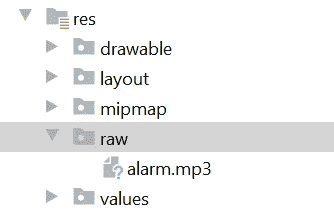
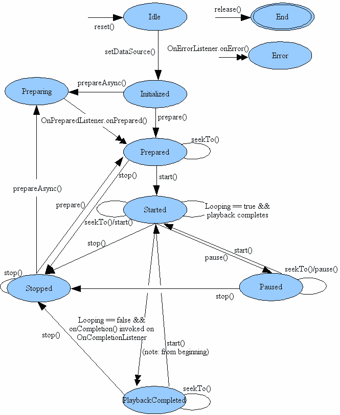

# 如何在您的 Android 应用程序中播放音频和视频文件

> 原文：<https://betterprogramming.pub/how-to-play-audio-and-video-files-in-your-android-app-15b846411cb2>

## 使用 MediaPlayer 控制音频/视频文件和流的播放


Josh Sorenson 在 [Unsplash](https://unsplash.com/s/photos/speaker?utm_source=unsplash&utm_medium=referral&utm_content=creditCopyText) 上拍摄的照片。

通过阅读本文，您将学习如何编写一个与用户交互的音频播放应用程序。基于[官方文件](https://developer.android.com/guide/topics/media/mediaplayer):

> “Android 多媒体框架支持播放各种常见的媒体类型，因此您可以轻松地将音频、视频和图像集成到您的应用程序中。您可以播放存储在应用程序资源(原始资源)中的媒体文件、文件系统中的独立文件或通过网络连接到达的数据流中的音频或视频，所有这些都使用`MediaPlayer`API。”

换句话说，你可以用它来播放视频和图像等媒体文件。说到这里，本文只着重于播放音频文件，作为对这个 API 的简要介绍。在此之后，您可以自由探索。

让我们开始你的 Android 项目吧。

# 1.设置

在继续之前，请确保您已经安装了 Android Studio 和必要的 SDK。添加以下`INTERNET`访问权限，因为我们稍后将尝试播放本地和在线音频:

```
<uses-permission android:name="android.permission.INTERNET" />
```

在`res`文件夹中，创建一个名为`raw`的新文件夹。将你的音频文件放入`raw`文件夹，如下图所示。只要遵循正确的命名约定，您可以随意命名它:



作者图片

对于在线音频文件，你可以设置自己的服务器，或者只需要一个有效的音频文件 URL 来测试它。让我们进入下一节，开始编写 Java 代码。

# 2.履行

## 导入

在 Java 类的顶部添加以下导入声明:

```
import android.media.AudioAttributes;
import android.media.MediaPlayer;
```

## 初始化

如果您打算只播放一个音频文件，您可以在`onCreate`函数中初始化它。根据音频文件的名称传入相应的资源:

```
mp = MediaPlayer.*create*(this, R.raw.*alarm*);
```

## 开始或继续播放

之后，您可以调用以下函数开始播放音频文件:

```
mp.start();
```

理论上，在调用`start`之前，你必须确保状态已经准备好。在这种情况下，`create`函数会自动为您完成这项工作。让我们看看下面的图表，以了解更多关于流程。如果你不按照正确的顺序，你会遇到`IllegalStateException`。



图片来自[安卓](https://developer.android.com/reference/android/media/MediaPlayer)。

## 中止

调用下面的函数暂停它。您可以通过再次调用`start`轻松恢复:

```
mp.pause();
```

## 正在播放

如果您需要检查 MediaPlayer 是否正在运行，请调用以下函数:

```
if (mp.isPlaying()) {}
```

## 停止

通过下面的函数调用可以很容易地停止媒体:

```
mp.stop()
```

您需要呼叫`prepare()`或`prepareAsync()`，然后才能再次呼叫`start()`。

## 释放；排放；发布

一旦您使用完它，并且不再需要 MediaPlayer 对象，强烈建议您释放它并将其设置为`null`以释放资源:

```
mp.release();
mp = null;
```

## 在线 URL

加载在线资源，需要调用`setDataSource`而不是`create`函数。初始化它，并传入指向相应在线音频文件的 URL 字符串。你必须将它包装在一个`try catch`块中来捕捉`IOException`错误。它可能需要一些时间来加载文件。建议用一个持续几秒钟的片段来测试一下。

# 3.结论

让我们回顾一下今天所学的内容。我们首先设置`INTERNET`访问权限，并将音频文件存储在`res`文件夹中。

然后我们探索了`MediaPlayer` API，包括如何基于本地资源初始化对象。有许多功能可用于开始、暂停、恢复或停止播放。

此外，我们甚至编写了一个从在线 URL 加载资源的函数。请随意进一步探索这个主题，并在视频文件上进行尝试。

感谢阅读。希望下一篇文章能再见到你！

# 参考

1.  [MediaPlayer 文档](https://developer.android.com/guide/topics/media/mediaplayer)
2.  [MediaPlayer 参考](https://developer.android.com/reference/android/media/MediaPlayer)