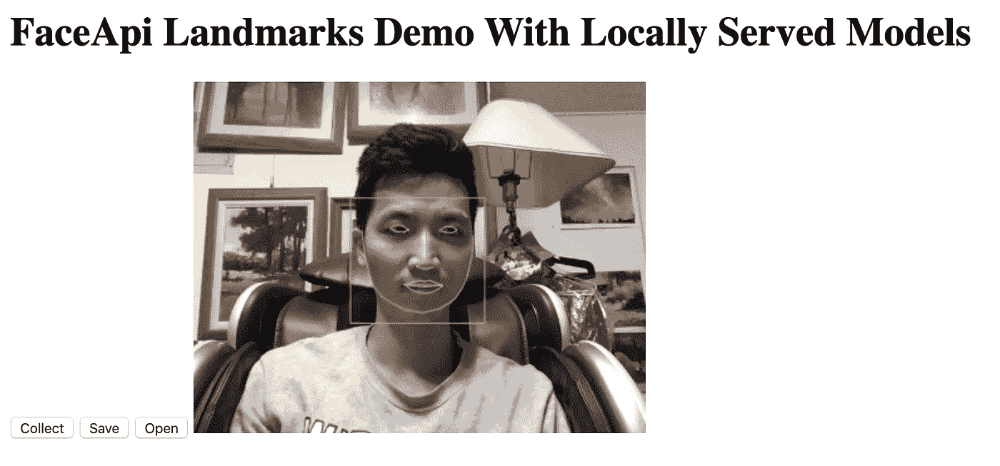
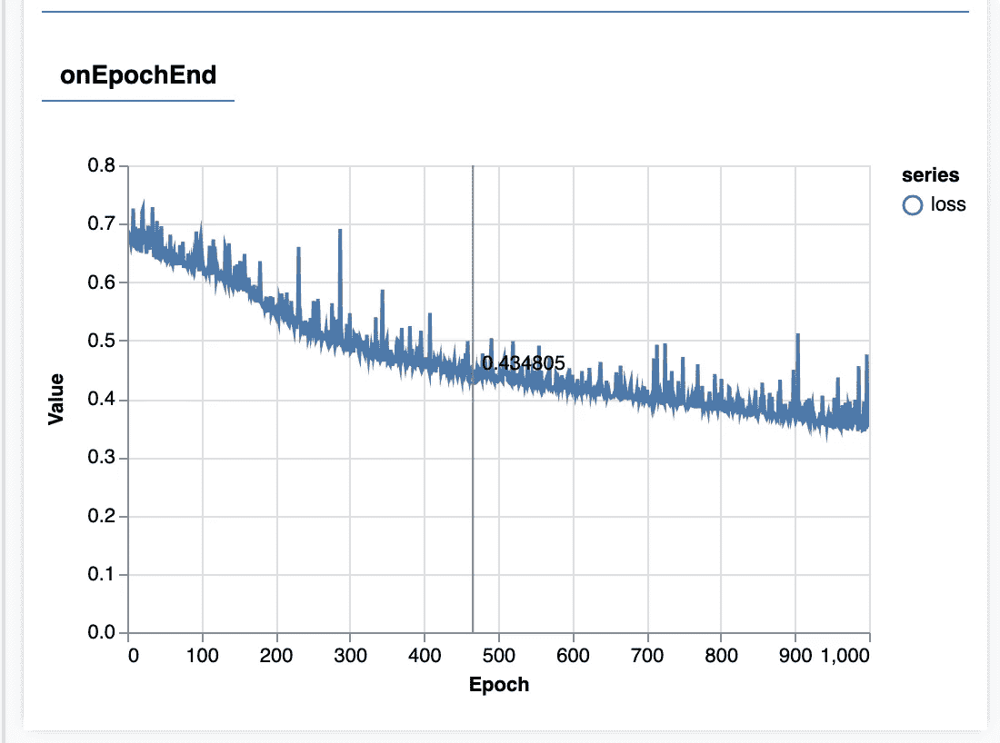
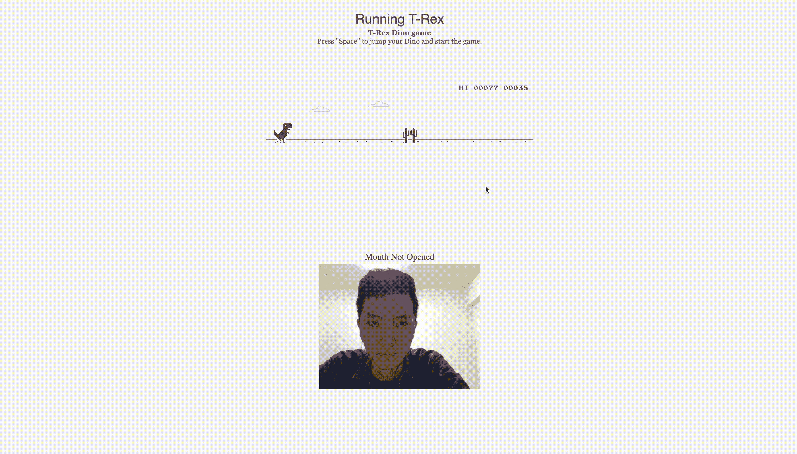

# 如何用脸玩 Chrome 的恐龙游戏

> 原文：<https://betterprogramming.pub/how-to-play-chromes-dinosaur-game-with-your-face-2b8f757e15c7>

## 享受 Face API 和 ML5js 带来的乐趣


[田中亮](https://unsplash.com/@callas1900?utm_source=medium&utm_medium=referral)在 [Unsplash](https://unsplash.com?utm_source=medium&utm_medium=referral) 上的照片

如果你使用 Chrome，你可能看过恐龙游戏。

这是一个简单的游戏，恐龙跳跃以避免障碍，这是我学习如何用我的脸操纵它的完美目标。

这是原版游戏，如果你没玩过的话。

# 该过程

在观看了几个来自编码培训的 youtube 视频后，我了解到让预测模型工作的简化步骤是:

1.  收集数据。
2.  训练数据。
3.  部署模型。

如果您不想自己编写代码，可以在本文底部随意克隆我的存储库。我已经把文件夹分成了`/collect /train /deploy`

根级别的其他文件是游戏本身的代码。

# 收集数据

## 1.用 ML5js 初始化神经网络

```
let options = {    
  inputs: 74,
  outputs: 2,
  task: "classification"  
};
const brain = ml5.neuralNetwork(options);
```

`inputs`设置为 74 是因为我在存储`mouth`和`jawOutline`的面部特征。

对于`mouth`和`jawOutline`有 37 个点，每个点包含一个用于`x`的数字和一个用于`y`的数字，所以我们将 37 乘以 2。

## 2.设置界面 API

## 3.开始收集数据

在`gotResults`功能中，通过用神经网络`brain`调用`.addData()`来捕获数据。

## 4.将数据保存为 JSON

添加一个触发以下事件的按钮，它会将一个 JSON 文件保存到您的下载文件夹中。

```
brain.saveData();
```

# 训练数据

使用上面生成的 JSON 文件，训练神经网络，并保存模型:

# 部署数据

这是您测试您的模型是否实际工作的地方。

如果你正确地做了上面的所有事情，你的下载文件夹中应该有三个文件:`model.json`、`model.weights.bin`和`model_meta.json`。

加载您的自定义模型，同时保留 Face API 模型，这样您的自定义模型就可以对 Face API 的结果进行预测。

如果你的模型有效，那就只需要用回调函数把所有东西包装起来。

在回调中，每当事件为`jump`时，我触发 T-Rex 跳跃。

# 实验



感谢 [ML5js](https://github.com/ml5js/ml5-library) 。它已经包含了检测面部特征的 Face-API。

## 尝试#1

最初，我想用我的眉毛来控制游戏。然而，我的“扬起的眉毛”的脸和我休息时的脸太接近了，所以模特无法区分它们。

## 尝试#2

我决定用张开和闭上的嘴，因为这样更明显。

如上图所示，当我准备好收集数据时，我点击了“收集”按钮。

收集的第一组数据只包含一个标签或一个类别。当我尝试训练时，它给出了一个关于热编码的错误。

## 尝试#3

然后我决定收集两个标签:

1.  张开嘴
2.  正常(闭着嘴)

`Open`按钮实际上是一个开关。当它是`Open`时，收集的数据被标记为`open`。

当我点击`Open`时，它切换到`Normal`——如果我收集数据，该数据被标记为正常。

最后，我点击`Save`按钮保存数据的 JSON 文件。

然而，当我用 1000 个纪元(1000 次迭代的训练)进行训练时，损失并没有下降到接近于零。



## 尝试#4

我收集了更多的数据——尤其是更多的`Normal`面部数据。

它成功地预测了我的嘴是否张开。

# 结果呢

*   它触发跳跃有点滞后。我怀疑这是因为我正在渲染两个画布，同时运行多个模型。
*   它只使用我的面部数据进行训练。它可能对其他人不起作用。
*   真的有用！



# 代码

[](https://github.com/davidyu37/face-game) [## davidyu 37/打脸游戏

### 在 GitHub 上创建一个帐户，为 davidyu37/face-game 开发做贡献。

github.com](https://github.com/davidyu37/face-game) 

# 游戏

 [## 霸王龙游戏

### 霸王龙恐龙游戏按“空格键”开始游戏，张开嘴跳

davidyu37.github.io](https://davidyu37.github.io/face-game/) 

我是一名学习机器学习的全栈开发人员。感谢阅读！