# 如何在 Swift Playgrounds 为 iPad 播放自定义音频

> 原文：<https://betterprogramming.pub/how-to-play-custom-audio-in-swift-playgrounds-for-ipad-77fe9798732b>

## 音乐让一切变得更好

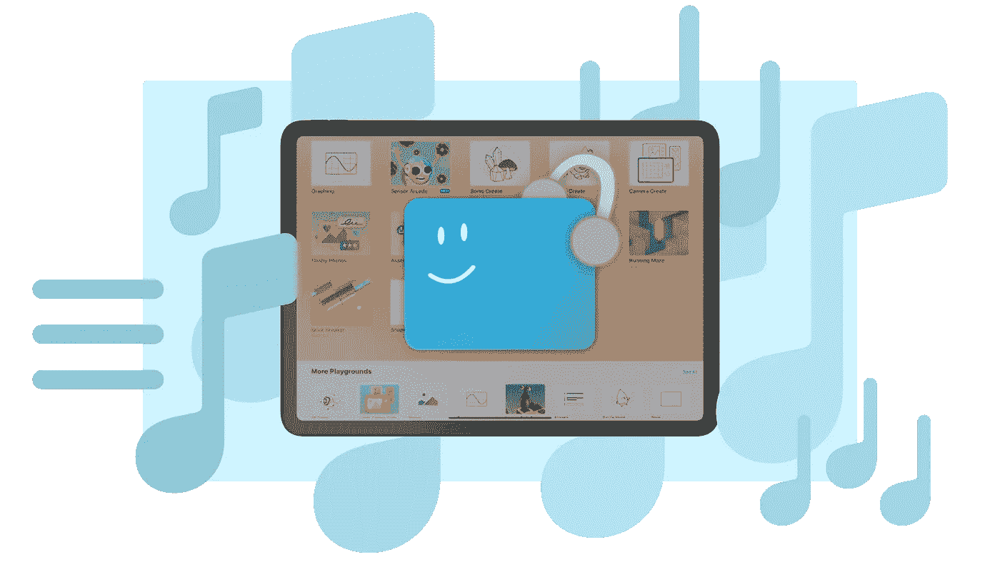

作者照片。

2016 年，苹果发布了 iPad 版的 Swift Playgrounds。配有外置键盘，它几乎和 Xcode 一样好，而且速度快很多，但有点过于简单。当然，你可以写代码，但是添加文件或者播放音频呢？

当我为今年的 [Swift 学生挑战赛](https://developer.apple.com/wwdc20/swift-student-challenge/)编写操场代码时，我开始使用我的 iPad。速度非常快。按下“运行我的代码”会在不到一秒的时间内产生结果！但是我遇到了一些困难——最大的困难是没有办法播放音频！我的游乐场被构造得像个游戏，什么样的游戏没有音乐？

没有及时找到解决办法，最终还是换回了 Xcode。但是当我有时间的时候，我做了一些实验，结果证明播放音频真的真的很容易！我将在 SwiftUI 和 UIKit 中向您展示如何操作。

# 1.将音频文件下载到文件中

你可以从互联网上获得像这样的免版税的音频文件:

[](https://notificationsounds.com/notification-sounds/slow-spring-board-570) [## 慢簧板

### 一个很好的共鸣琶音激发信心。时长:00:02。知识共享署名许可证。

notificationsounds.com](https://notificationsounds.com/notification-sounds/slow-spring-board-570) 

iPadOS 在 Safari 中加入了下载支持，所以我们可以直接下载到内置的 Files 应用中。方法如下:

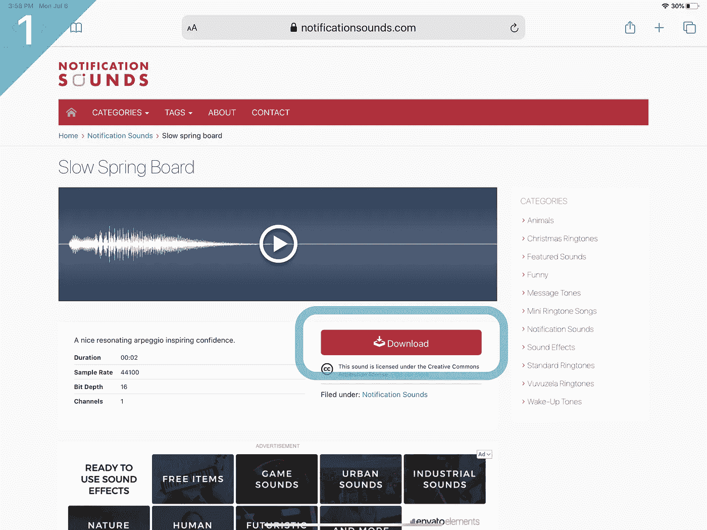

点击“下载”

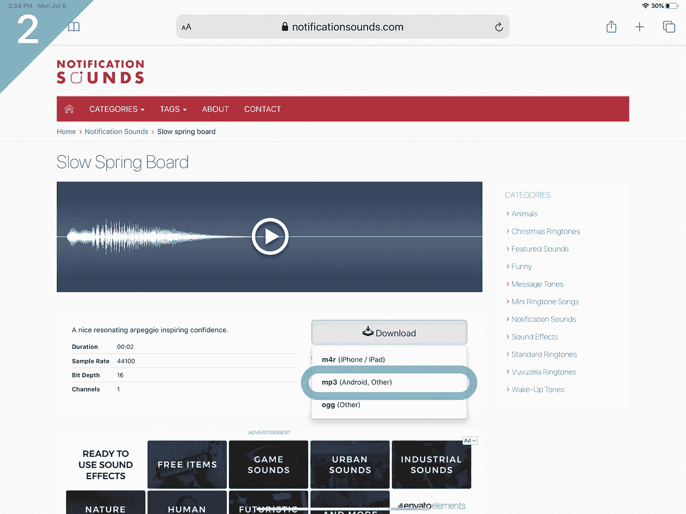

点击“mp3”

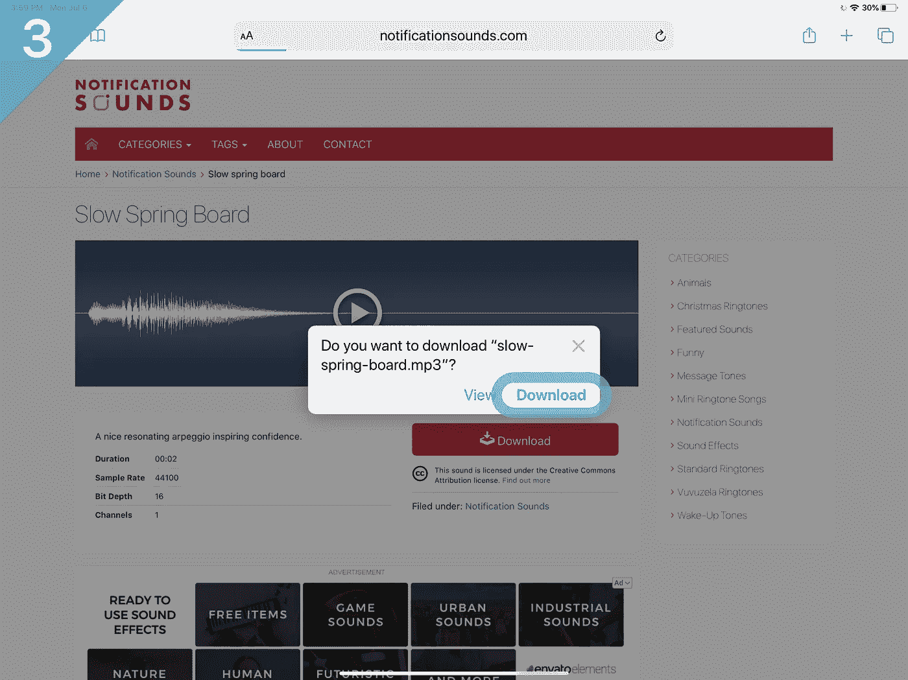

点击“下载”

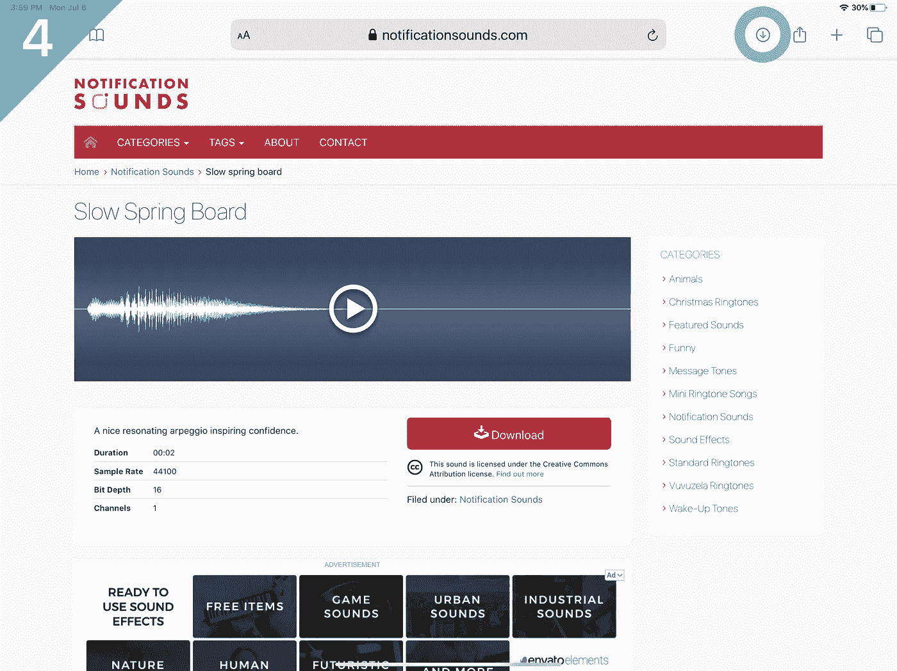

轻按 iPad 右上角的圆圈箭头图标

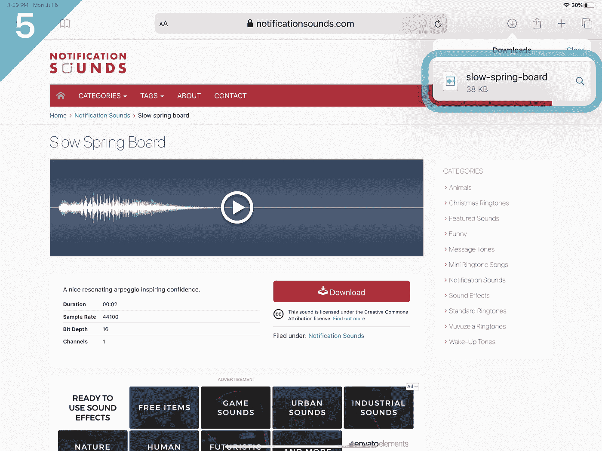

轻按音频文件

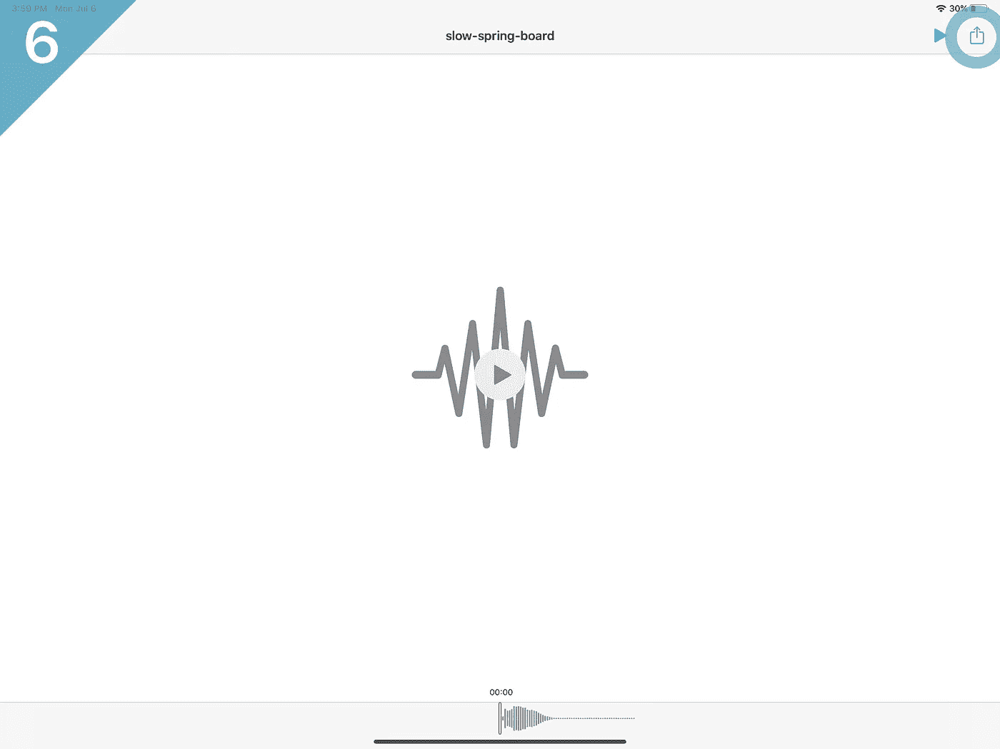

点击“共享”按钮

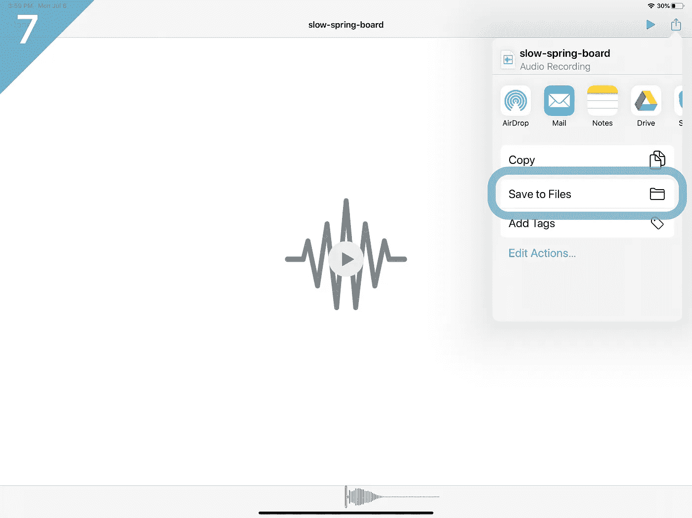

点击“保存到文件”

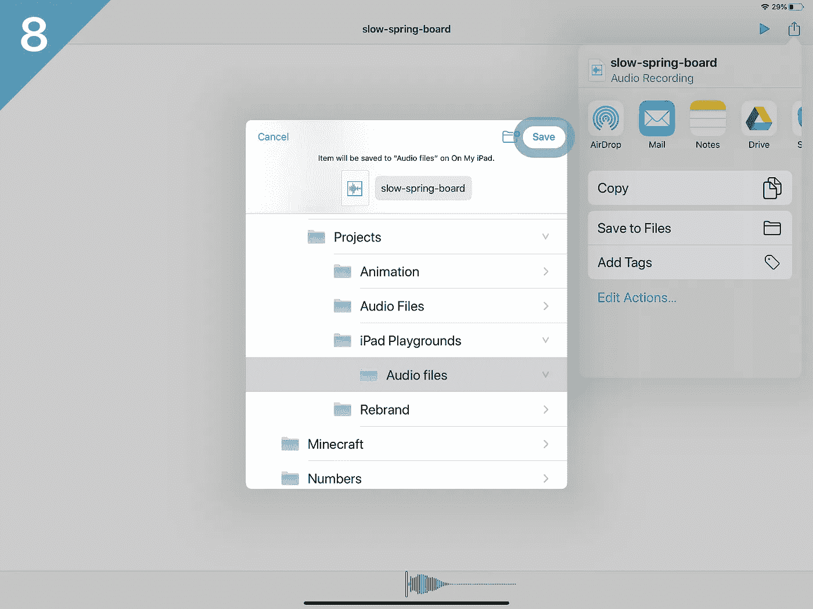

选择一个位置，然后点击“保存”

除了 Safari 之外，您还可以从电脑上空投文件、使用 u 盘、在 GarageBand 中创作自己的音乐等等。但是不管你用什么方法来获取音频文件，一定要记住你把它保存在哪里。

# 2.将文件导入 Swift Playgrounds

打开 Swift Playgrounds 应用程序，然后创建一个新游乐场或打开一个现有游乐场。之后，要导入音频文件:

1.  按下“+”图标。
2.  点击纸张图标。
3.  轻按“从…插入”

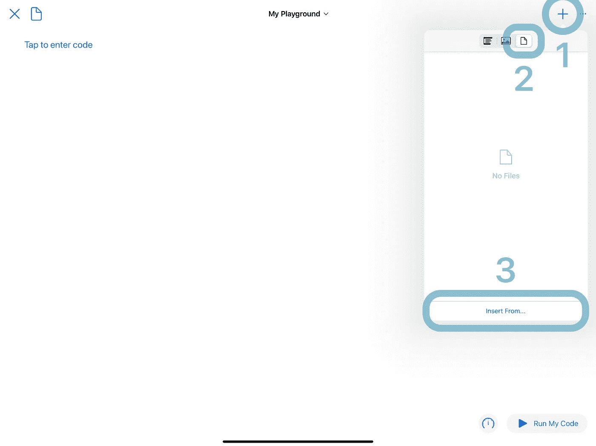

然后，选择您下载的文件！

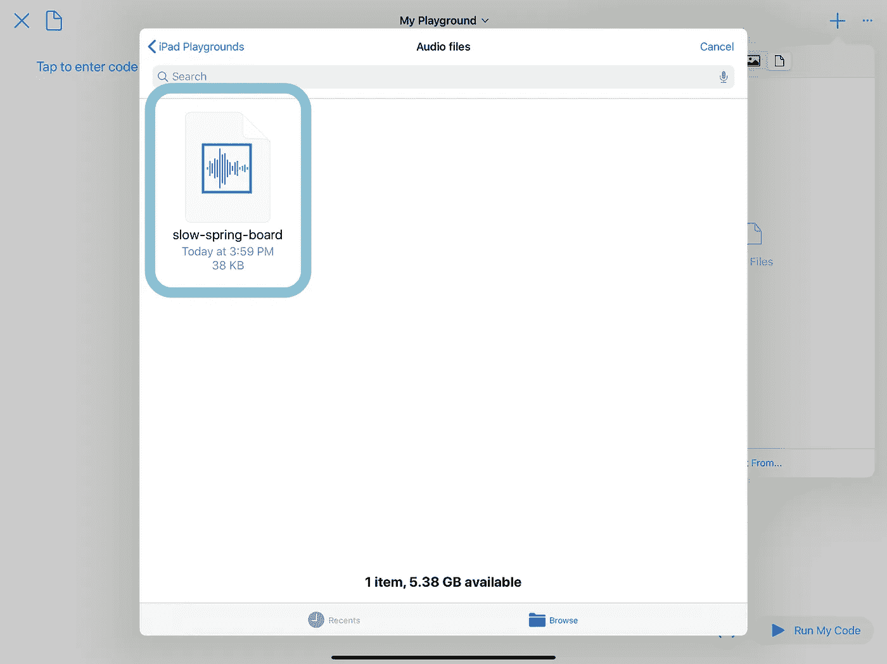

这会将您的音频文件导入到您的游乐场项目中。

# 3.播放音频！

## 斯威夫特伊

这是 SwiftUI 的启动代码。拷贝并粘贴到您导入音频文件的同一个游乐场项目中:

然后，用您的音频文件的名称替换`slow-spring-board`。就是这样！按下“运行我的代码”，然后轻按“播放音频！”享受你添加的音乐！

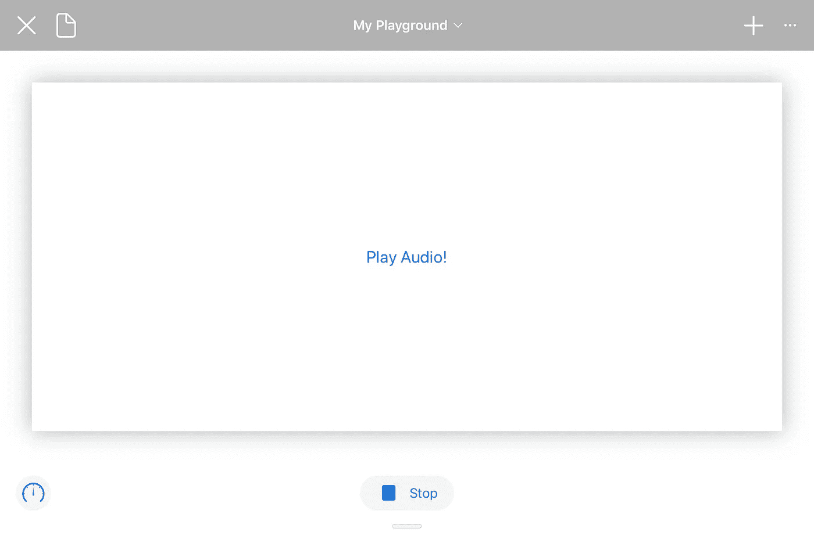

这里的诀窍是使用`Bundle.main.url(forResource:withExtension:)`。你*必须*这样做。如果您尝试通过“+”按钮添加文件文字(通过点击一个已经导入的文件)，它不会工作。

最后两行同样重要:

```
**let** audioPlayerView = SwiftUIAudioPlayerView()
PlaygroundPage.current.setLiveView(audioPlayerView)
```

这将创建 SwiftUI 视图的一个实例并显示它(我已经尝试过在不显示视图的情况下播放音频，它不起作用)。

## UIKit

在 UIKit 中播放音频的代码和在 SwiftUI 中完全一样，但是创建 UI 更难。下面是启动代码:

再次用您的音频文件的名称替换`slow-spring-board`。然后按“运行我的代码”，享受你的音乐！

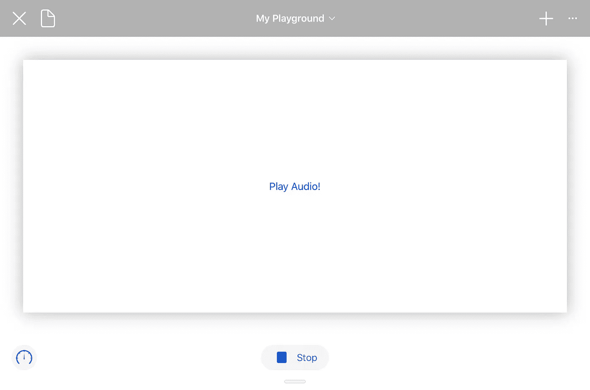

同样，您*必须*使用`Bundle.main.url(forResource:withExtension:)`，最后两行是显示视图所必需的。

```
**let** uikitAudioPlayerView = UIKitAudioPlayerView()
PlaygroundPage.current.setLiveView(uikitAudioPlayerView)
```

# 结论

iPad 的 Swift Playgrounds 使编码成为一种更快、更愉快的体验，但它有时会变得过于简单。像音频播放这样的功能很难找到。我在网上搜了一遍也没找到解决办法，只好自己实验了。

但是在这里！弄清楚这一点花了一些时间，但我现在可以回去在我的 iPad 上写代码了…我还得到了一些文章内容。

感谢阅读！