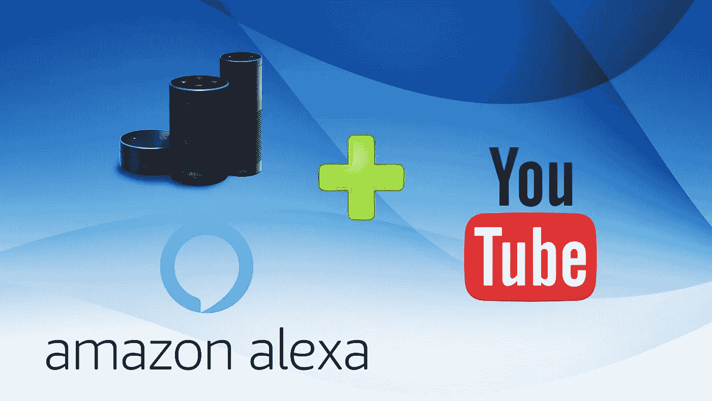
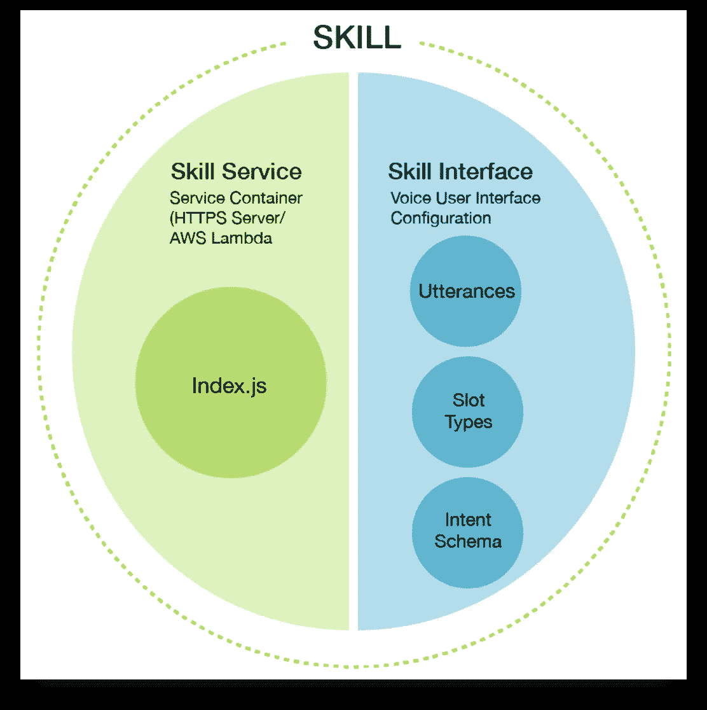
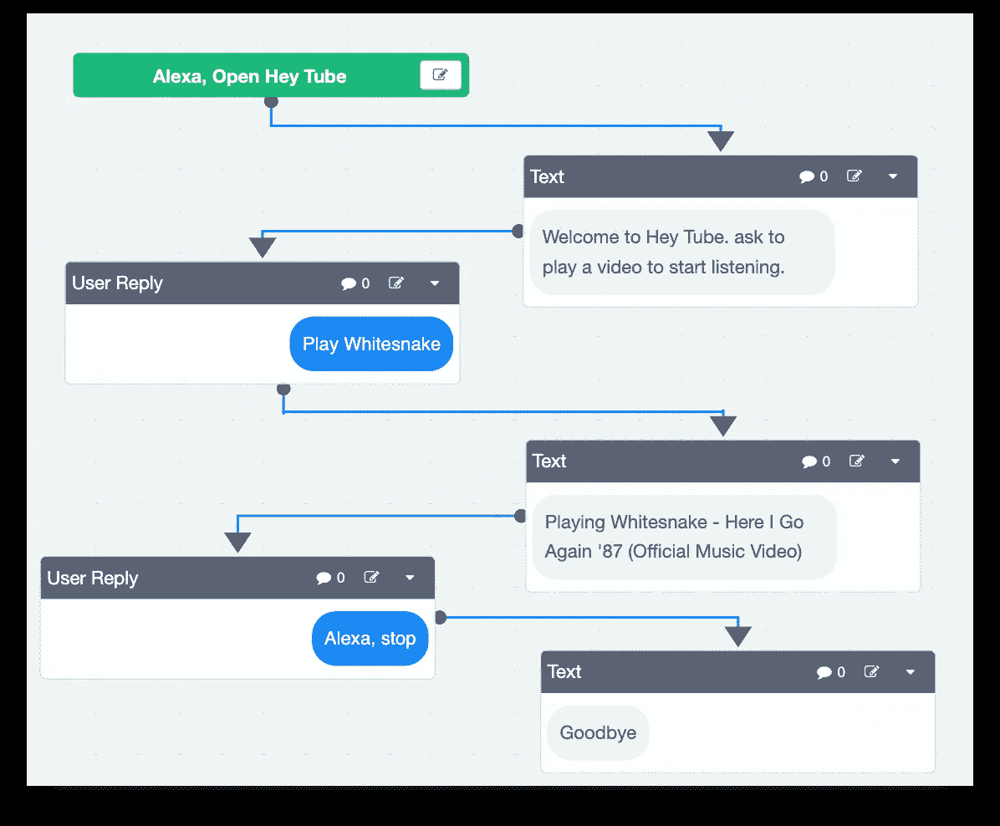
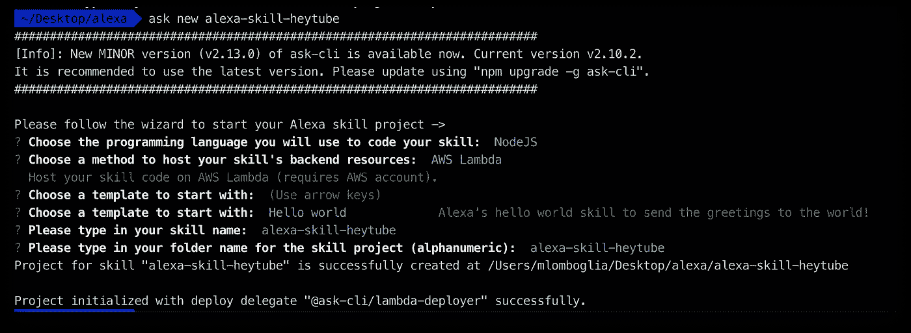
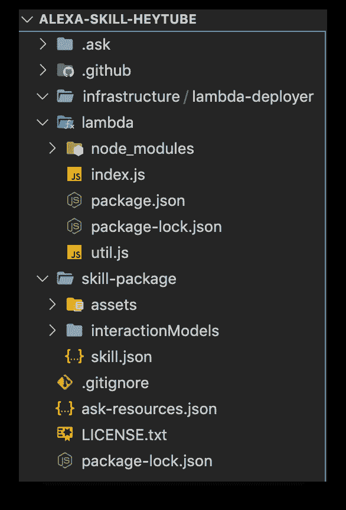
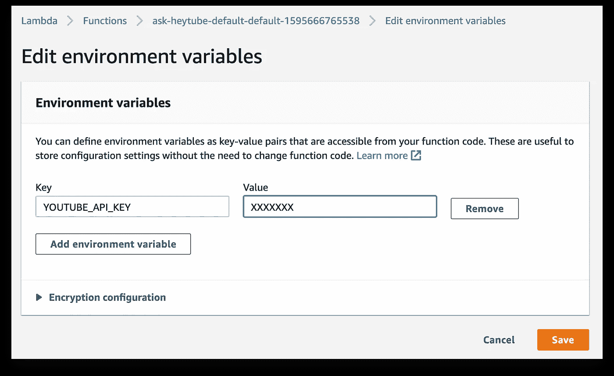
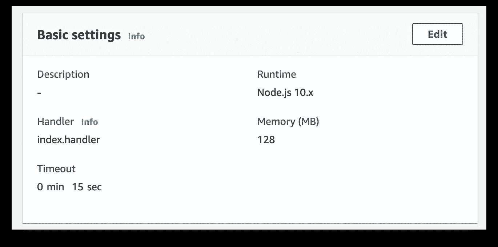
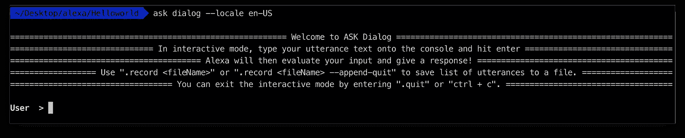

# 建立一个 Alexa 技能来播放 YouTube 视频中的音频

> 原文：<https://betterprogramming.pub/how-to-play-youtube-audio-from-your-alexa-e2d4fb8b5ce9>

## 如何从你的 Alexa 播放 YouTube 音频



# 介绍

你有没有想过让 Alexa 播放一段 YouTube 视频的音频？只需说“Alexa，请 Hey Tube 播放白蛇”，然后从 YouTube 上听一首非常棒的白蛇曲目。

在本文中，我将展示如何构建一个自定义的 Alexa 技能，以将您的亚马逊 Echo 设备连接到 YouTube。

*注意:切记该技能不会在亚马逊商店制作中发布，只能在开发模式下使用。这不是亚马逊认可的技能，只能用于教育目的。*

# Alexa 自定义技能

Alexa 自定义技能由两个主要部分组成:



[https://github . com/bignerdranch/developing-Alexa-skills-solutions/blob/master/course book/course book . pdf](https://github.com/bignerdranch/developing-alexa-skills-solutions/blob/master/coursebook/coursebook.pdf)

技能界面定义了您的技能的行为方式:

*   一组“意图”,代表用户可以用你的技能做的动作。
*   一组“示例话语”,指定用户可以说出的单词和短语来调用这些意图。你将这些话语映射到你的意图——这种映射形成了技能的“交互模型”。
*   标识技能的“调用名*”*。用户在使用您的技能发起对话时会包括此名称。

技能服务包含处理意图和执行动作的代码逻辑。该服务被部署为后端资源。对于本练习—部署在 AWS Lambda 中的 JavaScript

# 技能流

这是要开发的自定义技能流程:



*   该流以一条欢迎消息开始，并期望一个视频查询名称。
*   当被要求播放某个视频时，Alexa Interface 使用查询作为参数调用服务。
*   该服务调用 YouTube API 来搜索视频，然后将 URL 返回给 Alexa。
*   Alexa 开始播放视频网址中的音频。
*   用户可以随时要求 Alexa 停止播放。Alexa 会停止音轨，说“再见”。

# 我们开始吧

创建新的 Alexa 技能最简单的方法是使用 ASK CLI **。**

在开始之前，请确保您已经安装了 Amazon Developers 帐户、Node、AWS 帐户、AWS CLI 和 ASK CLI。

要获得完整详细的环境设置指南，请查看我以前的文章[使用 ASK CLI 快速建立 Alexa 技能](https://medium.com/swlh/quickly-build-an-alexa-skill-using-ask-cli-8ab2977bd126)。

让我们从创建新技能结构开始:`$ ask new`:



询问新的

选择:

*   NodeJS 作为编程语言
*   AWS Lambda 作为后端资源
*   Hello world 作为起始模板
*   选择一个技能名称:`alexa-skill-heytube`
*   选择一个文件夹名:`alexa-skill-heytube`

切换到您的新目录:`$ cd alexa-skill-heytube/lambda`

安装您的软件包:`$ npm install`

# 技能服务

打开您最喜欢的代码编辑器。我用的是 Visual Studio 代码。

这是你的起始技能结构:



vs 代码技能结构

技能服务文件位于`skill-package`文件夹中。

技能包包含 ASK 平台使用的所有资源——技能清单、交互模型和资产。

# **交互模型**

交互模型将说出的单词解析成特定的意图事件。通过提供一个示例话语列表，您可以定义应该映射到交互模型中特定意图名称的单词。样本话语是表示用户可能与技能对话的一种可能方式的字符串。这些话语用于生成自然语言理解模型。这将用户的声音解析为我们的技能意图。

交互模型的名字是`<locale>.json`，例如`en-GB.json`。

*注:我的 Alexa 配置为 en-GB，根据你的配置更新你的文件名，比如 en-US 或者其他。*

打开`iteractionModels/en-GB.json`文件:

与任何 json 文件一样，请密切注意格式:

*   将`invocationName`更新为你的技能名称:
    `“invocationName”: “hey tube”`
*   删除`HelloWorldIntent, AMAZON.NavigateHomeIntent`
*   创建获取 YouTube 视频的新意图:

```
{
   "name": "GetVideoIntent",
   "slots": [{
       "name": "videoQuery",
       "type": "VIDEOS"
   }],
   "samples": [
       "search for {videoQuery}",
       "find {videoQuery}",
       "play {videoQuery}",
       "start playing {videoQuery}",
       "put on {videoQuery}"
   ]
},
```

添加音频技能的标准要求意图:`AMAZON.PauseIntent`和`AMAZON.ResumeIntent`:

```
{
   "name": "AMAZON.PauseIntent",
   "slots": [],
   "samples": []
},
{
   "name": "AMAZON.ResumeIntent",
   "slots": [],
   "samples": []
}
```

我们还需要定义一个名为`VIDEOS`的类型。

在“类型”部分添加以下内容:

```
{
   "name": "GetVideoIntent",
   "slots": [{
       "name": "videoQuery",
       "type": "VIDEOS"
   }],
   "samples": [
       "search for {videoQuery}",
       "find {videoQuery}",
       "play {videoQuery}",
       "start playing {videoQuery}",
       "put on {videoQuery}"
   ]
},
```

注:如有必要，根据你的 Alexa 配置语言重命名或创建一个 json 文件的副本，如`en-US.json`。

## **技能清单**

技能清单是你技能的 JSON 表示，为 Alexa 提供了所有需要的元数据。交互模型和帐户链接模式(如果使用的话)是分开的。

打开`skill.json`。用你的技能总结、例句、名字和描述更新你的地区信息。您还可以在 png 格式中添加您的技能的小图标和大图标:

```
"locales": {
   "en-GB": {
      "summary": "Alexa Hey Tube Skill",
      "examplePhrases": [
         "Alexa open hey tube"
      ],
      "keywords": [
         "audio",
         "streaming",
         "youtube"
      ],
      "name": "Hey Tube",
      "description": "Alexa Skill to listen to youtube audio",
      "smallIconUri": "https://alexademo.ninja/skills/logo-108.png",
      "largeIconUri": "https://alexademo.ninja/skills/logo-512.png"
   }
}
```

将类别更新为`STREAMING_SERVICE`:

```
"category": "STREAMING_SERVICE",
```

启用 audioplayer 接口 API。这将使 Alexa 技能播放音频文件:

```
"apis": {
   "custom": {
      "interfaces": [{
         "type": "AUDIO_PLAYER"
      }]
   }
}
```

完整的`skill.json`可在此处获得:

skill.json

# YouTube 数据 API 密钥

您的应用程序必须有授权凭证才能使用 YouTube 数据 API。

使用 YouTube API 不会给调用 API 的实体带来任何金钱成本。如果您超出了配额，API 将返回 403 错误。每天的免费使用量限制在 100000 台——对于我们的使用来说绰绰有余。

按照以下步骤获取您的 YouTube API 密钥:

1.  前往[谷歌开发者控制台](https://console.developers.google.com/)
2.  点击图标右边的`Select project`下拉菜单创建一个新项目。点击`New Project`按钮并为其命名。
3.  在标题图标旁边的`Select Dropdown`中选择您的项目。
4.  点击`Enable APIs and Services`按钮。
5.  搜索`youtube data`。
6.  点击`Youtube Data API v3`。
7.  单击蓝色的启用按钮。
8.  在仪表板中，点击左侧边栏上的`Credentials`。
9.  点击`Create Credential`按钮。
10.  选择`API Key`。
11.  复制您新生成的密钥并暂时保存它。

## 保护 API 密钥

Google 提供了以下准则来保护您的 API 密钥:

> 当您在应用程序中使用 API 密钥时，请确保它们在存储和传输过程中是安全的。公开暴露您的凭据可能会导致您的帐户受到威胁，这可能会导致您的帐户出现意外费用。为了帮助保持 API 密钥的安全，请遵循以下最佳实践:

*   不要在代码中直接嵌入 API 键。嵌入在代码中的 API 密钥可能会意外地暴露给公众。例如，您可能忘记从您共享的代码中移除密钥。不要将 API 键嵌入到应用程序中，而是将它们存储在应用程序源代码树之外的环境变量或文件中。
*   不要将 API 键存储在应用程序源代码树内的文件中。如果您将 API 密钥存储在文件中，请将文件放在应用程序的源代码树之外，以确保您的密钥不会出现在源代码控制系统中。如果使用 GitHub 这样的公共源代码管理系统，这一点尤为重要。
*   设置[应用程序和 API 密钥限制](https://cloud.google.com/docs/authentication/api-keys#api_key_restrictions)。通过添加限制，您可以降低受损 API 密钥的影响。
*   删除不需要的 API 密钥，以最大限度地减少遭受攻击的风险。
*   定期重新生成您的 API 密钥。您可以从[凭证页面](https://console.cloud.google.com/apis/credentials)通过点击每个密钥的重新生成密钥来重新生成 API 密钥。然后，更新您的应用程序以使用新生成的密钥。生成替换密钥后，您的旧密钥将继续工作 24 小时。
*   在公开发布之前，请检查您的代码。在公开您的代码之前，请确保您的代码不包含 API 密钥或任何其他私有信息。

# 技能代码

现在我们准备在 NodeJS 中发展我们的技能。

打开`lambda/index.js`。`index.js` 将首先列出您通过 ASK CLI 创建的意图处理程序。

## **意图处理程序**

“意图”表示满足用户口头请求的动作。这将触发 lambda 处理程序`index.js`中定义的意图处理程序。意图处理程序接收传入的请求并返回适当的响应。

*   内置意图是为常见动作预定义的，您可以在自定义技能中实现这些动作，而无需提供任何示例话语。标准意图用于常见的一般行为，如停止、取消和寻求帮助。以下是可用的标准内置意图列表:

[](https://developer.amazon.com/en-US/docs/alexa/custom-skills/standard-built-in-intents.html) [## tech doc-模板

### 概述将 Alexa 直接集成到您的产品中。

developer.amazon.com](https://developer.amazon.com/en-US/docs/alexa/custom-skills/standard-built-in-intents.html) 

让我们编辑标准意图处理程序:

*   `LaunchRequestHandler` : 这个方法会处理我们技能的启动。

> “Alexa，打开嘿管”

编辑您的欢迎信息，并添加重复欢迎信息的重新提示:

**启动请求处理器**

*   `CancelAndStopIntentHandler` : 此方法将暂停播放音频。它将“停止”、“取消”和“暂停”视为关键字

> " Alexa，停止音乐"

取消 lAndStopIntentHandler

让我们创建一个定制的意图处理程序来处理`GetVideo`调用。

`GetVideoIntentHandler` **:** 这个方法将处理对 YouTube 视频的搜索，并返回音频流，以便 Alexa 可以播放它。

我将使用一个控制器助手函数来使代码更整洁。

> " Alexa，玩白蛇"

## 助手功能

控制器辅助程序有三种方法:

*   `search`:调用 YouTube API，根据用户收到的查询搜索视频。搜索返回视频信息，如视频 ID 和标题。
*   `play`:一旦接收到视频信息，就调用另一个 YouTube API 接收流，转换成 Alexa 要求的 140 质量。该方法将返回一个 URL。然后调用`addAudioPlayerPlayDirective` 开始播放音频流。
*   `stop` : 调用`addAudioPlayerStopDirective`停止播放音频流。

## **搜索视频**

为了搜索 YouTube 视频，我正在使用 npm 包`[yt](https://www.npmjs.com/package/youtube-search)-list`。

让我们安装它。在你的 lambda 文件夹中输入:`$ npm i --save yt-list`。

在文件顶部添加导入:

`const ytlist = require("yt-list");`

## **播放音频**

为了播放音频流，我使用了另一个 npm 包`[ytdl-core](https://www.npmjs.com/package/ytdl-core)`。让我们安装它。

在你的 lambda 文件夹中输入`$ npm i --save ytdl-core`。

在文件顶部添加导入:`const search = require("ytdl-core");`

两种方法如下:

从 YouTube 搜索并获取音频

## 技能建设者

最后一部分是向`SkillBuilder`添加请求处理程序。技能生成器是您技能的入口点，路由所有请求和响应:

技能建设者

完整的源代码可以在我的 GitHub 中找到:

[](https://github.com/mlomboglia/alexa-skill-heytube) [## 姆隆波利亚/阿莱克莎-斯奇尔-海图

### Alexa 播放 YouTube 视频音频的技巧。有助于 mlomboglia/alexa-skill-heytube 的发展，创造一个…

github.com](https://github.com/mlomboglia/alexa-skill-heytube) 

# 发挥你的技能

使用 ASK CLI 快速部署您的技能，而无需进入控制台。去你的技能文件夹根，输入:`$ ask deploy`。

会自动提问:

*   **部署技能元数据**:使用[技能包 API](https://developer.amazon.com/en-US/docs/alexa/smapi/skill-package-api-reference.html) 将技能的`skill-package/`目录内容打包上传到 Alexa Skills。如果这是您第一次部署技能，该命令会在已配置的 Amazon 开发人员帐户中创建一个新技能。
*   **在`lambda/`目录下构建一个技能代码**，并打包构建工件以部署到 AWS。这包括安装技能的依赖项和生产任何构建工件。对于为 Node.js 编写的技能，这意味着运行`npm install`来安装在`package.json`中声明的依赖项，并将其与 JavaScript 源代码打包在一起。
*   **将技能基础设施**构建工件部署到已配置的 AWS Lambda 函数。如果这是第一次部署技能并且没有配置 Lambda ARN，该命令将创建一个新的 Lambda 函数。
*   **启用技能**


一段时间后，您的技能部署在 AWS 中，并准备在开发模式中使用(还没有公开)。

验证您的部署:

*   登录 AWS 控制台→ Lambda

在创建 lambda 函数时验证您的新技能。


登录到 Alexa 开发者控制台，验证你的新技能已经创建。可以点击查看详情，但我不建议通过控制台编辑任何字段。


恭喜——你的第一个技能在 Alexa 和 AWS Lambda 中得到了恰当的部署。一切都是通过 CLI 完成的，不需要通过控制台。

您可以在 Visual Studio 代码中编辑您的代码，保存它并简单地键入`$ ask deploy`来重新部署您的技能。这样在开发的时候会节省你很多时间。

如果您使用 my repo 中的 skill.json 文件，您可能会收到以下错误:

> " message ":" Lambda arn:AWS:Lambda:eu-west-1:924338216746:function:ask-hey tube-default-default-1595666765538 的触发设置无效。"

这是因为 ask 正在使用之前为我的实例创建的端点 uri。在 **skill.sjon** 文件中，删除整个部分，包括之前的逗号:

```
,
"endpoint": {
"uri": "arn:aws:lambda:eu-west-1:924338216746:function:ask-heytube-default-default-1609336787911"
}
```

现在再试一次`$ ask deploy`

应该在文件中更新新的端点 uri

# 上次配置

最后一个配置是将您的环境变量添加到 Lambda。不幸的是，我找不到用 ASK CLI 添加环境变量的方法，所以我的方法是从 AWS 控制台到 Lambda。

单击服务名并滚动到“环境变量”部分。添加您的变量`YOUTUBE_API_KEY`、**、**，其值是您在上面的 Google 开发者控制台中创建的键。



添加您的 YOUTUBE_API_KEY

此外，增加你的服务超时在“基本设置”到 15 秒。



增加超时

现在让我们更新本地服务`revisionId`。

如果您现在尝试部署您的服务，因为您已经通过控制台更新了配置，您将得到以下错误:

> [错误]:当前版本 Id(Lambda ARN(arn:AWS:Lambda:eu-west-1:924338216746:function:ask-hey tube-default-default-1595666765538)的版本 ID 应为 a4d5f 786–96 C3–414 c-9 b94–4b 8 ecade 411 b，但找到了 1 DCD 52 FB-8626–4f 63-a4cc-c5fc 59454 f 04 请解决此版本不匹配问题，然后再次重新部署。

解决这个问题最简单的方法是:

1.  打开您的`.ask/ask-states.json`文件
2.  找到“revision id”:“XXXX”
3.  删除“revisionId”中的值:“”
4.  部署技能:`$ ask deploy`

# 测试第一个技能

要从命令行测试您的技能，运行`ask dialog`并指定您的技能所支持的语言环境:

```
$ ask dialog --locale en-GB
```

该命令打开一个交互式终端，您可以在其中模拟与 Alexa 的多回合对话:



打开你的技能，模拟一个对话:

```
**User  > Alexa open hey tube**
Alexa > Welcome to Hey Tube. ask to play a video to start listening.
**User  > play Whitesnake** Alexa > Playing  Whitesnake - Here I Go Again '87 (Official Music Video)
**User  > .quit**
```

第一项测试已经完成。如果你有一个 Alexa 设备，你可以在你的 Alexa 中测试这段对话——你应该会得到相同的结果，并听到白蛇乐队的一首很棒的歌。

你可以对你的技能做任何改变并重新部署。

您可以通过使用预先格式化的。json 文件来节省测试时间。

使用`**.record**`创建一个可重复的 JSON 测试文件:

```
User  > .record
```

我创建了 happyPath.json 作为示例:

```
$ ask dialog --locale en-GB --replay happyPath.json
```

你也可以通过 Alexa 开发者控制台进行测试:


Alexa 开发者控制台

# 结束语

这项技能的完整源代码可以在我的 GitHub 上找到:

[](https://github.com/mlomboglia/alexa-skill-heytube) [## 姆隆波利亚/阿莱克莎-斯奇尔-海图

### Alexa 播放 YouTube 视频音频的技巧。有助于 mlomboglia/alexa-skill-heytube 的发展，创造一个…

github.com](https://github.com/mlomboglia/alexa-skill-heytube) 

要获得完整详细的环境设置指南，请查看我以前的文章 [**使用 ASK CLI**](https://medium.com/swlh/quickly-build-an-alexa-skill-using-ask-cli-8ab2977bd126) 快速构建 Alexa 技能——学习创建您的第一个自定义 Hello World Alexa 技能。

查看多轨道技能版本，将单轨道技能增强为完整的音频播放器，以播放、停止、继续、跳过、循环和播放 YouTube 中的下一个相关音频轨道。

[](https://medium.com/better-programming/a-complete-alexa-skill-to-play-multi-track-audio-from-youtube-videos-9518d5219aa) [## 一个完整的 Alexa 技能，从 YouTube 视频播放多轨音频

### 从 YouTube 到您的 Alexa Echo 播放、暂停、继续、下一个、上一个和循环播放音频

medium.com](https://medium.com/better-programming/a-complete-alexa-skill-to-play-multi-track-audio-from-youtube-videos-9518d5219aa) 

请记住，有些视频可能无法播放，因为它们在 YouTube 上受到保护。

编码快乐！