# 如何使用 Python 用 Matplotlib 绘制图表和图形

> 原文：<https://betterprogramming.pub/how-to-plot-charts-and-graphs-with-matplotlib-using-python-ffb79ec6fd60>

## 成为用 Python 展示和组织数据的大师


科技日报在 [Unsplash](https://unsplash.com/s/photos/graphs?utm_source=unsplash&utm_medium=referral&utm_content=creditCopyText) 上拍摄的

数据是互联网时代的新黄金。大多数可用数据通常是非结构化的；因此，作为开发人员，我们需要一种易于解释的方法，这就是 Matplotlib 的用武之地。

# 介绍

来自[文件](https://matplotlib.org/)。

> Matplotlib 是一个用于在 Python 中创建静态、动画和交互式可视化的综合库。Matplotlib 让简单的事情变得简单，让困难的事情变得可能。

要开始使用 matplotlib，您需要安装 Matplotlib 及其依赖项:

```
pip install matplotlib
```

安装完成后，您应该得到以下输出。

```
Installing collected packages: numpy, six, python-dateutil, kiwisolver, pyparsing, packaging, cycler, fonttools, pillow, matplotlib
Successfully installed cycler-0.11.0 fonttools-4.29.1 kiwisolver-1.3.2 matplotlib-3.5.1 numpy-1.22.1 packaging-21.3 pillow-9.0.0 pyparsing-3.0.7 python-dateutil-2.8.2 six-1.16.0
```

然后按如下方式导入它:

```
import matplotlib.pyplot as plt
```

通过这个导入，您可以使用一个短别名 plt 来访问所有的 Matplotlib 函数。

这听起来可能很简单，但是折线图可以帮助您直观地了解事物是如何随着时间的推移而变化的。例如，您可以想象:

*   学生在特定时间内的表演
*   博客浏览量如何随时间变化
*   随着时间的推移，你所在城市的气温是如何变化的
*   一家企业一年的销售额
*   犯罪率

让我们创建一个简单的线形图来表示一个企业在五年内的成长情况。首先定义两个变量:

```
sales = [0, 1000,5000,15000,50000]
year =[2010,2011,2012,2013,2014,2015]
```

在 x 轴上画出年份，在 y 轴上画出销售额。下面的代码将绘制一个线形图来显示业务是如何增长的。

```
import matplotlib.pyplot as plt
year =[2010,2011,2012,2013,2014,2015]sales = [0, 1000,5000,15000,50000,100000]plt.plot(year, sales)plt.show()
```

确保两个列表的长度相同，否则将得到一个值 Error
我们的图表如下所示:

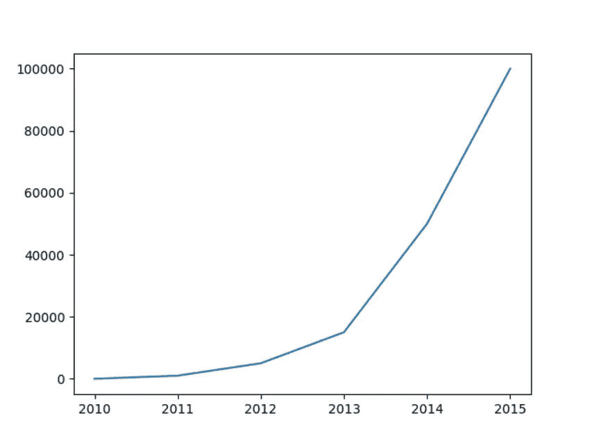

我们的图表看起来很好，但是如果没有任何标签，它不会传达任何信息，所以让我们给我们的图表指定 x 轴和 y 轴标签。

*   plt.tittle()给出一个标题
*   plt.xlabel 给图表一个 x 轴标签
*   plt.ylabel 为图表提供一个 y 轴标签

```
import matplotlib.pyplot as plt
year =[2010,2011,2012,2013,2014,2015]
sales = [0, 1000,5000,15000,50000,100000]
plt.plot(year, sales)plt.xlabel('year') 
plt.ylabel('Amount in Dollars') 

# title
plt.title("Linear graph Showing Growth of Lux store")
plt.show()
```

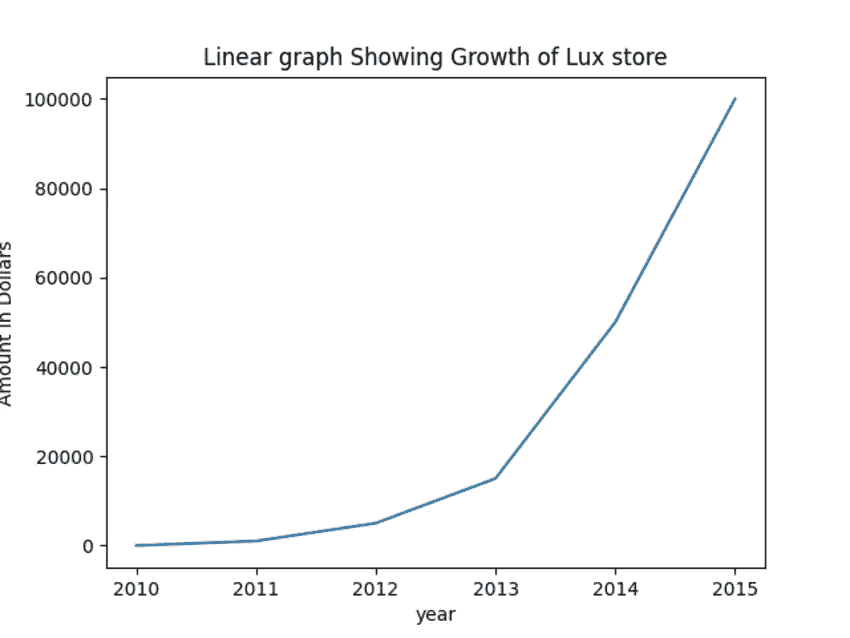

# 多重情节

有时你想比较两个数据集，这意味着你需要在同一个图上画两条线。Matplotlib 会自动为每一行分配不同的颜色。

假设我们想要比较同期的销售额和利润。订单的数据将是

```
profit = [0,80,200,1500,2800,2600,3000]
```

更新代码以反映订单数量和年份之间的图形线。

我们的图表现在看起来像这样:

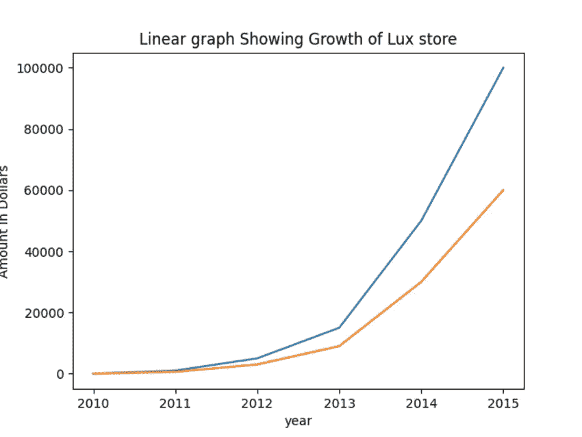

Matplotlib 会自动为每条线分配不同的颜色，如上图所示。您也可以使用颜色名称或十六进制代码为每条线指定不同的颜色。

```
plt.plot(year, sales, color = 'green)
plt.plot(year,profit, color ='[#](https://www.computerhope.com/cgi-bin/htmlcolor.pl?c=E42217)[7BCCB5](https://www.computerhope.com/cgi-bin/htmlcolor.pl?c=7BCCB5)')
```

这里我们用绿色表示销售线，蓝绿色表示利润线。

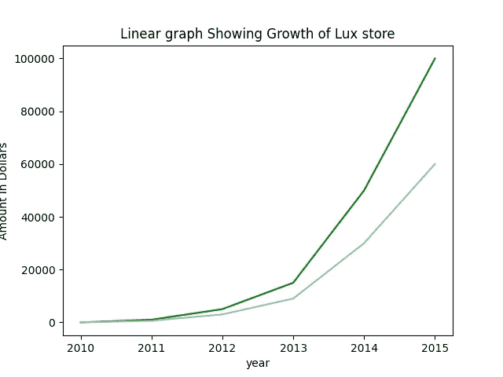

彩色图表

您也可以指定图形的线型。

```
plt.plot(year,profit, color ='#7BCCB5',linestyle ='--')
```

matplotlibe 中其他可用的样式包括:

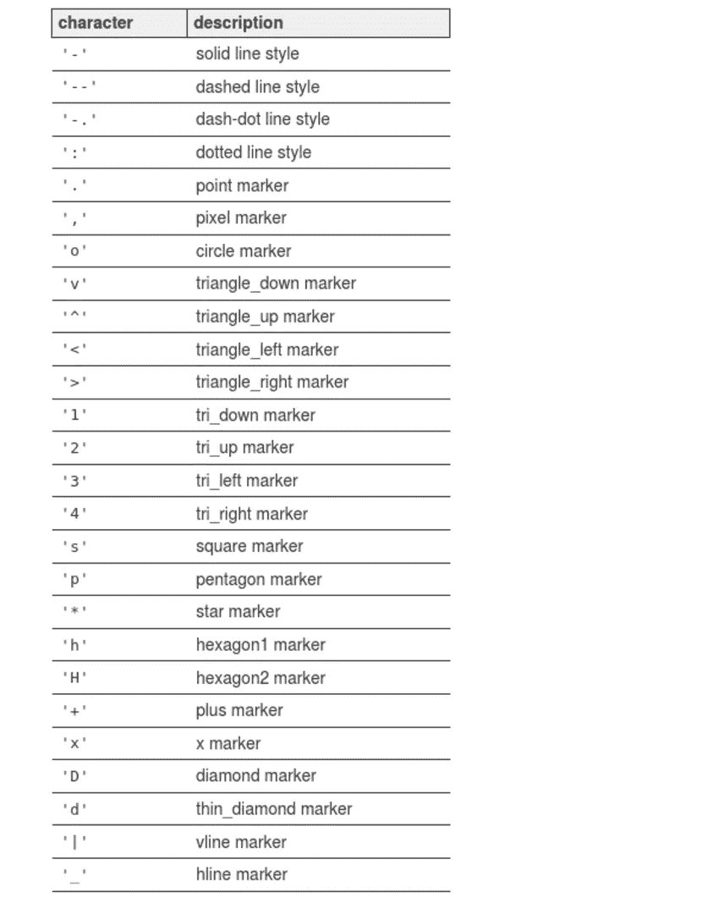

Matplotlib 文档中的 Screnshot

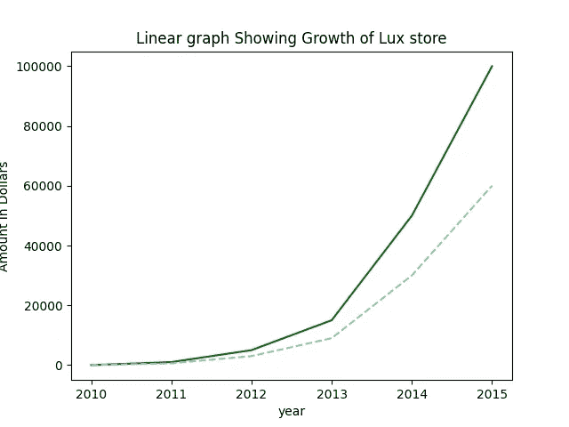

# 传说

当我们在图上有多条线时，用图例来给每条线命名。我们使用 plt.legend()并指定一个标签列表来显示
，我们希望第一行代表总销售额，而第二行代表利润。

```
plt.legend([‘Gross sum of sales’,’profits’])
```

legend 也将 loc 作为关键字参数。loc 将标签的位置指定为代码。例如，代码 10 表示居中，而 4 表示右下。让我们在图表中添加一个位置。

```
plt.legend([‘Gross sum of sales’,’profits’],loc =4)
```

我们的图表现在看起来像这样:

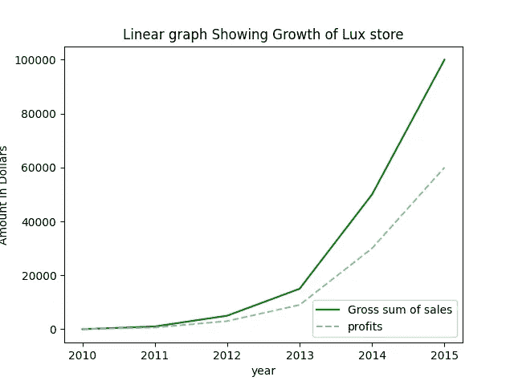

神话；传奇

# 条形图

顾名思义，条形图是用条来表示数据的图形。要使用 Matplotlib 创建条形图，您需要使用`plt.bar()`，它需要 2 个输入参数。

*   x 值
*   y 值

让我们创建一个简单的条形图，显示特定餐馆中比萨饼类型的受欢迎程度

```
from matplotlib import pyplot as pltpizzas = [    'Cheese','Veggie','Pepperoni','Meat','Margherita',
              'BBQ Chicken ','Hawaiian','Buffalo ']

popularity =  [98, 90, 86, 84, 82, 80]plt.bar(range(len(popularity)), popularity)
plt.show()
```

条形图现在看起来像这样:

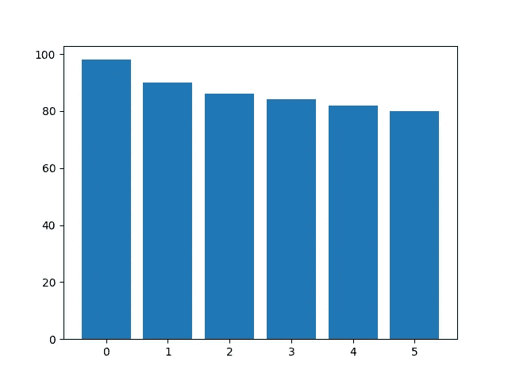

披萨条形图

上面的条形图看起来不错，但是没人知道我们代表的是哪种数据。让我们添加一些标签。Matplotlibs 提供了。set_xticklabels 方法，用字符串标签列表设置 xaxis 的标签。

在我们的例子中，字符串列表将是我们的比萨饼类型字符串。让我们添加 x 轴标签。

首先，我们用命令`plt.subplot()`定义一个轴对象

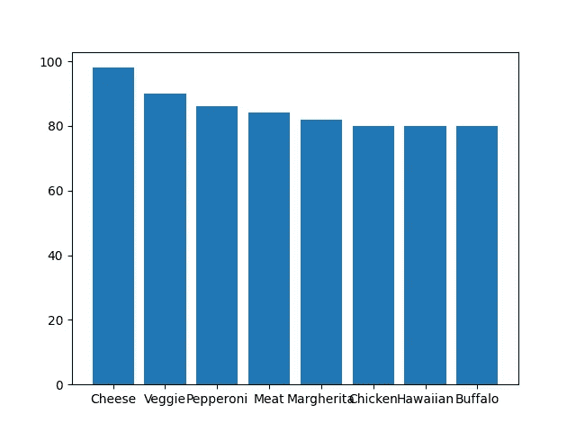

披萨图表

我们的标签看起来碎在一起；让我们旋转它们，使它们看起来更美观，向 set_xticklabels 方法添加一个参数旋转。

```
ax.set_xticklabels(pizzas,rotation=40)
```

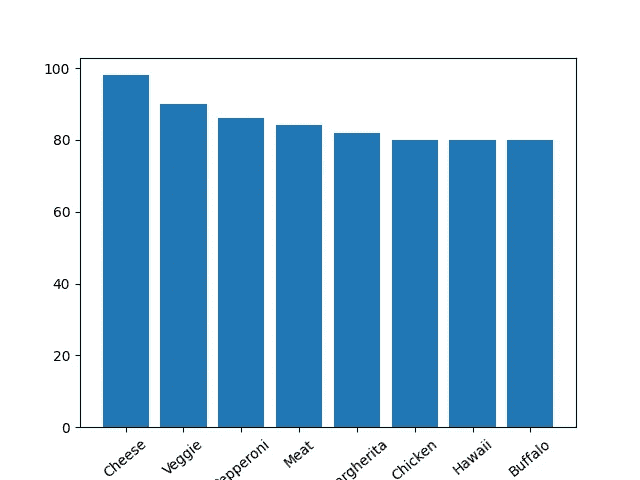

# 堆积条形图

堆积条形图比较两组数据，通常用上下堆积的条形图表示。

我们将首先定义第二个数据集，用 Matplotlib 绘制一个堆积条形图。在我们的例子中，我们比较了比萨在 A 和 b 两个城市的受欢迎程度。

```
popularity_in_A = [98, 90, 86, 84, 82, 80,80,80]popularity_in_B = [90, 85, 84, 83, 82, 80,80,80]
```

我们首先正常绘制底部条形图，然后使用指定的参数 bottom 关键字绘制第二个条形图。

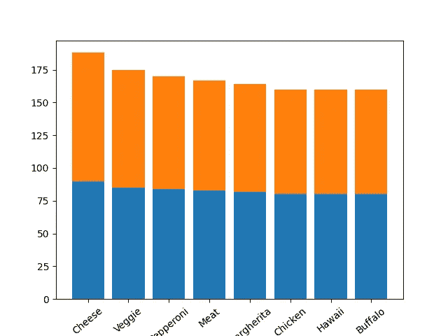

堆积条形图

# 饼图

根据维基百科，

> 一个**饼状图**(或一个**圆图**)是一个圆形的统计图形，它被分成若干片来说明数字比例。在饼图中，每个切片的弧长(及其圆心角和面积)与其代表的数量成正比

饼图可以用来表示

*   使用编程语言的人的图形表示
*   一项民意调查

要使用 Matplotlib 创建饼图，您可以使用命令 plt.pie()来获取您想要表示的值。例如，我们将绘制一个饼图，用下面的数据显示编程语言的流行程度。

```
programming_languages = ["Python", "Java","Javascript",   "C++", "C#", 'C','Typescript']Popularity = [230000, 170000, 150000, 100000,70000,70000,50000]
```

让我们绘制饼图

```
from matplotlib import pyplot as pltprogramming_languages = ["Python", "Java","Javascript",   "C++", "C#", 'C','Typescript']
Popularity = [230000, 170000, 150000, 100000,70000,70000,50000]plt.pie(Popularity,labels = programming_languages)
plt.axis('equal')plt.show()
```

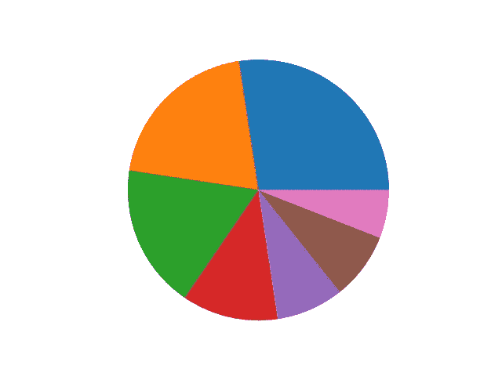

圆形分格统计图表

要添加标签，我们将使用 labels 关键字。您还可以为每个切片添加一个百分比标签，如下所示。

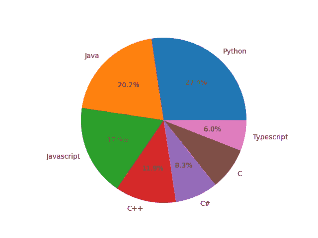

# 直方图

直方图是频率分布的图形表示。例如，您可以使用直方图来确定特定年龄组中有多少人。为了用 Matplotlib 创建直方图，我们使用了将数据作为输入的`plt.hist()` 。

[](/how-to-create-histograms-in-pygal-python-e0bca3d4e87d) [## 如何在 Pygal Python 中创建直方图

### Pygal 简介

better 编程. pub](/how-to-create-histograms-in-pygal-python-e0bca3d4e87d) 

让我们用下面的数据集画一个直方图。

```
data = [100,  210, 0, 3, 20, 1000]
```

除了数据之外，您还必须指定 bin 的大小；例如，我们的第一个 bin 可能在 0 和 20 之间。

```
from matplotlib import pyplot as pltdata = [100,  210, 0, 3, 20, 1000]
plt.hist(data, bins=20)plt.show()
```

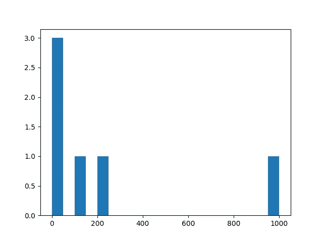

柱状图

# 结论

本教程介绍了如何用最常用的数据表示形式来表示数据。Matplotlib 是一个全面的库，允许你完全可视化和识别数据中的模式。

如果你喜欢读这篇文章，考虑注册成为一名[灵媒会员。](https://essyking.medium.com/membership)