# 如何使用 Python 和 Folium 在地图上绘制数据

> 原文：<https://betterprogramming.pub/how-to-plot-your-data-on-maps-using-python-and-folium-20c8bb39a7e2>

## 利用 Python 与 data 和 Leaflet.js 在制图方面的强大功能来创建丰富的地图可视化


左拉周在 [Unsplash](https://unsplash.com/s/photos/maps?utm_source=unsplash&utm_medium=referral&utm_content=creditCopyText) 上的照片

[yellow](https://github.com/python-visualization/folium)是一个 Python 包，它将 Python 提供的用于操作数据的所有工具与 [Leaflet](https://leafletjs.com/) JavaScript 库结合起来，以创建丰富的交互式地图。

和我的文章一样，我提供了一个 Google [Colab Jupyter 笔记本](https://colab.research.google.com/drive/1MnZepW9RLJjXKnbgxtIl0zcGAmwO4R9J?usp=sharing)，上面有所有的代码和结果。

# 创建基本地图

在我们开始构建任何东西之前，让我们安装一些我们将在整个教程中使用的库。你可以使用任何打包工具。我将提供 Pipenv 和 pip prepending `!`的例子，这样它就可以在 Jupyter 笔记本上工作，比如 Google Colab。

```
pipenv install folium pandasOr!pip install folium pandas
```

安装完库后，创建地图就像一行代码一样简单:

```
import folium
folium.Map(location=[48.130518, 11.5364172], zoom_start=12)
```

这将自动生成一个交互式[地图](https://python-visualization.github.io/folium/quickstart.html#Getting-Started)并将其输出到 Jupyter 笔记本，在那里您将能够与它进行交互。函数`Map`接受一些可选参数。在我们的例子中，我们发送的是位置(坐标)和默认的缩放级别。

如果一切顺利，您应该会看到这样的地图:

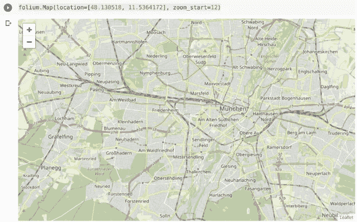

基本地图

即使这已经很令人兴奋了，我们也没有做什么特别的事情。Folium 的真正力量来自于将库的映射功能与 Python 的数据操作能力相结合，所以让我们开始做一些工作吧。

# 添加标记

我们可以添加到地图中的一个基本功能是标记地点的能力，这样就可以很容易地找到它们或者突出显示重要信息。

这可以很容易地用来自叶子的`Marker`函数来完成，正如我们接下来演示的:

```
m = folium.Map(location=[48.218871184761596, 11.624819877497147], zoom_start=15)tooltip = "Click Here For More Info"marker = folium.Marker(
    location=[48.218871184761596, 11.624819877497147],
    popup="<stong>Allianz Arena</stong>",
    tooltip=tooltip)
marker.add_to(m)m
```

与第一个例子类似，首先我们创建一个地图对象，然后我们也创建一个标记对象。[标记](https://python-visualization.github.io/folium/quickstart.html#Markers)对象是通过向点传递坐标、当有人点击标记时我们希望在弹出窗口上显示的内容、标记的工具提示以及其他选项创建的。

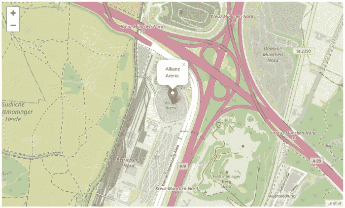

带标记的地图

标记有大量的配置选项，因为标记弹出窗口需要一个 HTML，所以有很多可能性。但是如果我们想在弹出窗口中显示图表呢？有没有简单的方法？

# 标记的图表弹出窗口

Folium 为任何标记类型的可视化提供了内置支持。可视化是由库[文森特](https://github.com/wrobstory/vincent)和[牵牛星](https://altair-viz.github.io/)实现的。

为了呈现一些可视化效果，我们将需要一些数据，所以让我们先获取这些数据:

```
import jsonimport requestsurl = (
    "https://raw.githubusercontent.com/python-visualization/folium/master/examples/data"
)
data = json.loads(requests.get(f"{url}/vis1.json").text)
```

接下来，让我们在标记中绘制数据:

```
m = folium.Map(location=[48.218871184761596, 11.624819877497147], zoom_start=15, tiles="Stamen Terrain")marker = folium.Marker(
    location=[48.218871184761596, 11.624819877497147],
    popup=folium.Popup(max_width=450).add_child(
        folium.Vega(data, width=450, height=250)
    ),
)marker.add_to(m)m
```

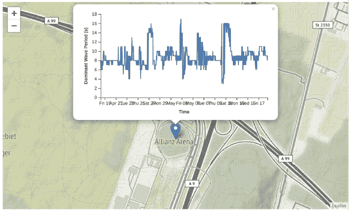

带有标记和地块的地图

太棒了，但是我们真的能改变标记本身而不仅仅是弹出窗口吗？简而言之，答案是肯定的，而且几乎可以用任何东西。

# 自定义标记

`Marker`函数允许许多参数化，从将标记图标从预定义图标库更改为形状到使用 HTML 构建您自己的标记，在本文中，我们将看到三个示例，从使用预定义图标开始:

```
m = folium.Map(location=[48.218871184761596, 11.624819877497147], zoom_start=15)tooltip = "Click Here For More Info"marker = folium.Marker(
    location=[48.218871184761596, 11.624819877497147],
    icon=folium.Icon(icon="cloud"),
    popup="<stong>Allianz Arena</stong>",
    tooltip=tooltip)
marker.add_to(m)m
```

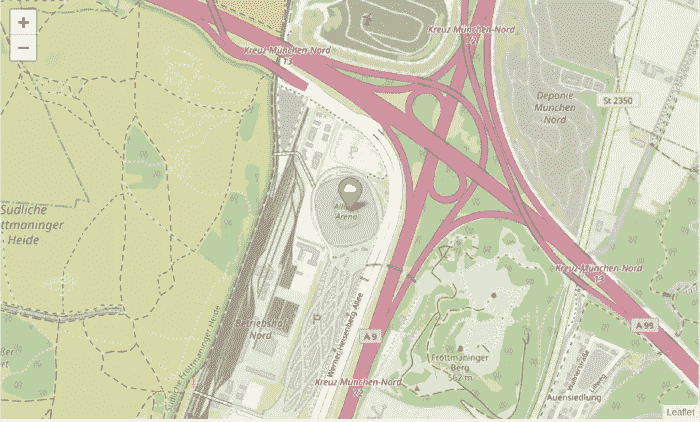

带有图标标记的地图

回到我们简单的 Allianz Arena 示例，我们现在已经用云改变了标记的图标，但是这些图标是从哪里来的呢？有哪些选择？

图标来自于 [Bootstra](https://getbootstrap.com/) p 库，但是你也可以使用[字体 Awesome](https://fontawesome.com/) 。

接下来，让我们使用形状(例如，圆)来构建我们的标记:

```
m = folium.Map(location=[48.218871184761596, 11.624819877497147], zoom_start=15)tooltip = "Click Here For More Info"marker = folium.CircleMarker(
    location=[48.218871184761596, 11.624819877497147],
    radius=50,
    popup="<stong>Allianz Arena</stong>",
    tooltip=tooltip)
marker.add_to(m)m
```

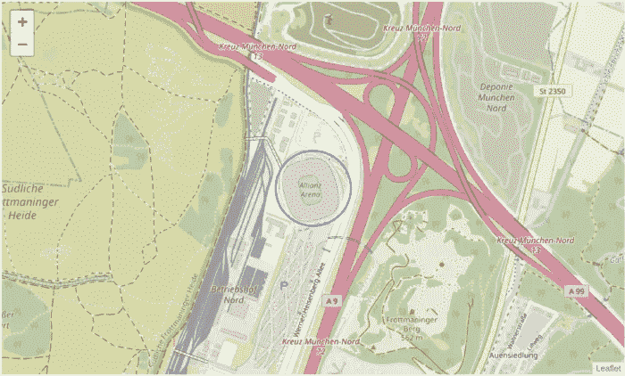

带有圆形标记的地图

最后，我们可以使用 HTML 来构建任何类型的标记。

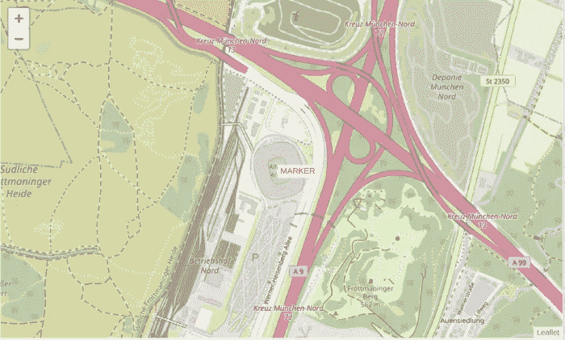

带有 HTML 标记的地图

在最后一个例子中，我们使用 HTML 创建一个 DIV 元素并放置一些文本作为标记，但是我们也可以使用 SVG 并呈现您想要的任何内容。只要记住把你的 HTML 居中，这样标记就在正确的位置，在我的例子中我没有这样做。

# Choropleth 地图

Choropleth 地图是流行的专题地图，用于通过预定地理区域(例如，国家或州)上的各种阴影图案或符号来表示统计数据。他们善于利用数据来简单地表示一个地区的期望测量的可变性。

为了创建 choropleth 地图，我们需要处理两种类型的数据:我们想要表示的阴影或颜色的统计数据和地理空间数据。

在我们的示例中，我们将使用美国各州来定义地区，以及美国失业统计数据(不是真实数据)。

让我们从绘制地理区域开始，也就是美国各州:

```
data_url = (
    "https://raw.githubusercontent.com/python-visualization/folium/master/examples/data"
)
us_states_url = f"{data_url}/us-states.json"m = folium.Map([43, -100], zoom_start=4)folium.GeoJson(us_states_url).add_to(m)m
```

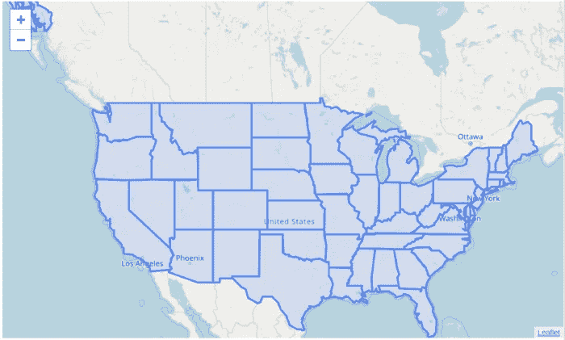

美国各州

我们的新地图现在包含了一个突出显示美国各州的覆盖图，但我们还可以做得更多。我们现在可以使用我们拥有的关于美国失业率的统计信息，并突出显示失业率高低的州。

首先，让我们看看数据是什么样的:

```
import pandas as pdus_unemployment_url = f"{data_url}/US_Unemployment_Oct2012.csv"
unemployment = pd.read_csv(us_unemployment_url)unemployment.head()
```

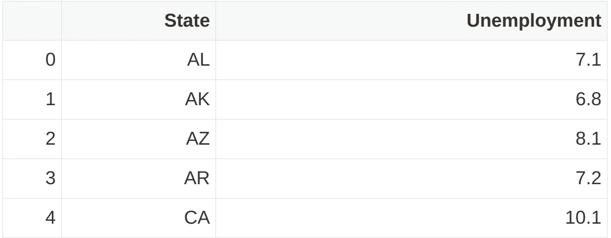

美国各州失业率的样本数据

数据非常简单:一列包含州，下一列包含失业率。

有了这些，我们就可以开始给地图上色了:

```
m = folium.Map(location=[48, -102], zoom_start=3)folium.Choropleth(
    geo_data=us_states,
    name='choropleth',
    data=unemployment,
    columns=['State', 'Unemployment'],
    key_on='feature.id',
    fill_color='YlGn',
    fill_opacity=0.7,
    line_opacity=0.2,
    legend_name='Unemployment Rate %'
).add_to(m)m
```

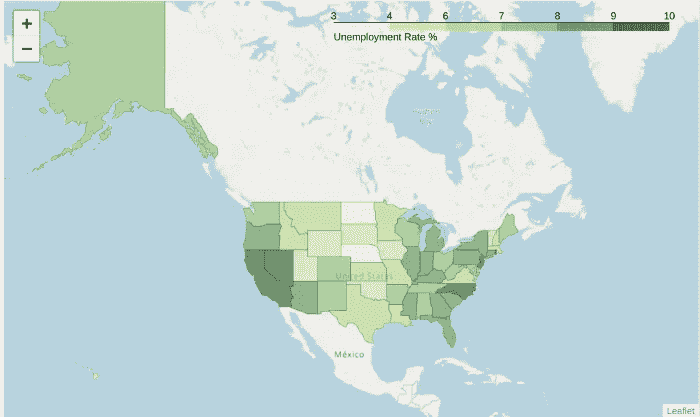

美国各州的失业率(虚假数据)

做得好！

# 热图

热图是地图的另一个流行选择。它们可以用于多种目的，包括天气状况、污染、人口密度等。

它们是非常强大的工具，在熊猫 T2 和叶子的帮助下，非常容易建造。让我们以芝加哥市的自行车站为例。我在网上发现了一个有趣的数据集，其中包含自行车站点的坐标，我们将使用这些坐标来构建我们的热图。

让我们加载数据:

```
stations_url = 'https://gbfs.divvybikes.com/gbfs/en/station_information.json'stations = json.loads(requests.get(stations_url).text)['data']['stations']
stations = pd.json_normalize(stations)
stations = stations[['lat', 'lon']] stations.head()
```

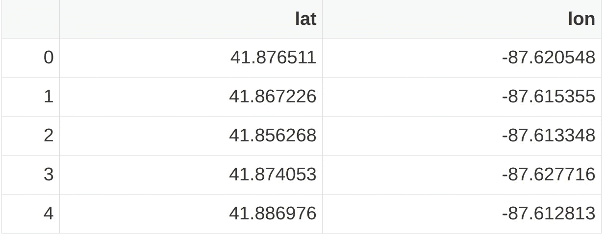

包含每个自行车站点的纬度和经度的站点数据集的样本数据。

87–87。58687 . 68888886861

自行车站数据有多列，包含大量数据。然而，对于我们的目的，我们只需要坐标，所以我们删除其余的。现在每一行代表一组自行车站所在的坐标(纬度和经度)。

接下来，我们将构建一个热点图来突出显示城市中自行车站点较为集中的区域。

```
from folium import pluginsm = folium.Map([41.8781, -87.6298], zoom_start=11)# convert to (n, 2) nd-array format for heatmap
stationArr = stations.values# plot heatmap
m.add_child(plugins.HeatMap(stationArr, radius=15))
m
```

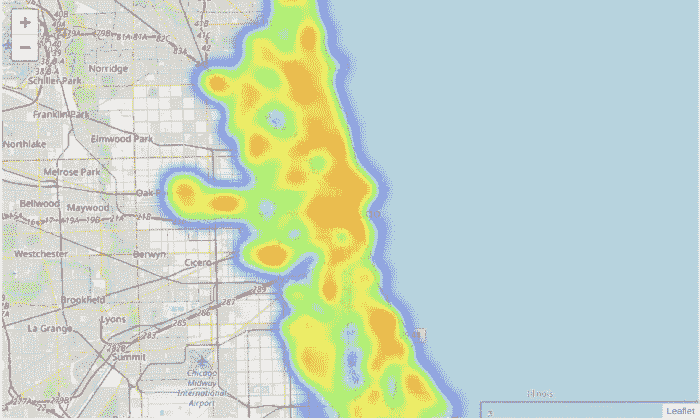

带热图的地图

干得好！热图的秘密是简单地使用一个来自 follow 的插件，传递一个带有每个站点的纬度和经度以及半径的矩阵。

# 地图切片

最后，在结束之前，我想强调一下 leav 的另一个特性，地图切片。到目前为止，我们使用了一种类型的地图渲染，但是我们可以使用许多选项，每个选项都会使地图看起来不同。

让我们看一些例子:

```
m = folium.Map(location=[30.4407159,-66.6017203], zoom_start=3)
folium.TileLayer('stamenterrain').add_to(m)
m
```

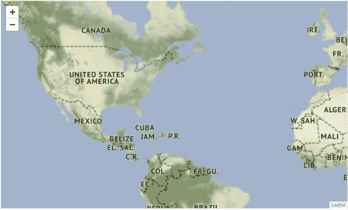

带有雄蕊地形层的地图

```
m = folium.Map(location=[30.4407159,-66.6017203], zoom_start=3)
folium.TileLayer('stamentoner').add_to(m)
m
```

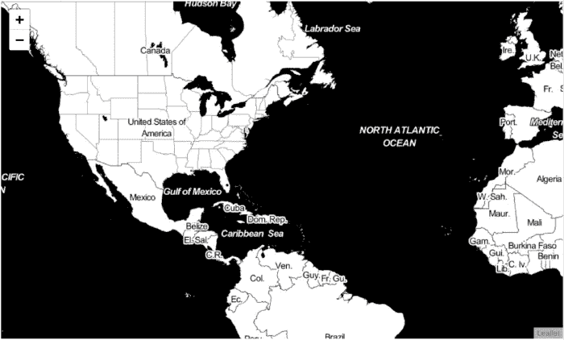

带有雄蕊调色剂层的地图

或者更好的是，您可以通过使用另一个名为`layerControl`的特性给用户提供选项。

```
m = folium.Map(location=[30.4407159,-66.6017203], zoom_start=4)# Add tiles
folium.TileLayer('stamentoner').add_to(m)
folium.TileLayer('stamenwatercolor').add_to(m)
folium.TileLayer('cartodbpositron').add_to(m)
folium.TileLayer('openstreetmap').add_to(m)# Add the option to switch tiles
folium.LayerControl().add_to(m)m
```

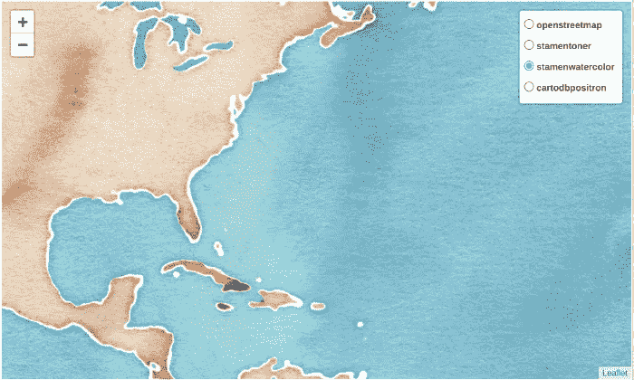

具有多个图层的地图

你现在可以在这张地图的右上角看到一个图层选择，用户可以使用它在图块之间切换。

# 结论

写这篇文章非常有趣！Folium 提供了许多配置选项和大量构建优秀地图的机会，我肯定会继续使用它来创造一些乐趣。

在研究这个主题的时候，我遇到了一些问题，因为文档不是很好；然而，在他们的 [GitHub 页面](https://github.com/python-visualization/folium/)上，他们提供了很好的例子，你可以运行来看看如何实现我们今天学到的一些东西。我强烈建议浏览一下。

感谢阅读！