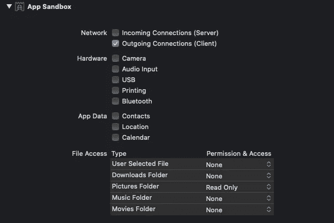
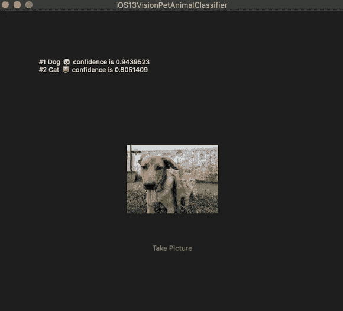

# 如何使用 Catalyst 将 iOS 应用移植到 MacOS

> 原文：<https://betterprogramming.pub/how-to-port-an-ios-app-to-macos-using-catalyst-196a9883e6f7>

## 它只需要点击五分钟

从 WWDC——要将 iOS 移植到 macOS，你真的只需要做这些

我出身于 iOS 背景，一直想开发 macOS 应用。

然而，出于某种原因，我对深入研究 OS X 和 AppKit 框架有点犹豫。苹果应用商店相对较小只是原因之一。

幸运的是，现在多亏了 Project Catalyst，我们可以轻松地将基于 iOS 和 UIKit 的应用移植到 macOS 上。

Catalyst 在将应用程序从一个平台移植到另一个平台时提供的便利将鼓励并把开发者带回苹果的生态系统。

我只花了五分钟就移植了我的一个 iOS 项目——我们将在本文中看到。

*你知道吗？* *项目的催化剂最初代号为杏仁糖。*

## 先决条件

*   你需要 Xcode 11
*   你需要 Mac Catalina 10.15

# 步伐

*   转到项目导航器|常规选项卡，只需启用 macOS 复选框
*   转到“签名和功能”,为您的使用案例启用您需要的任何权限(例如，文件读/写)
*   以 Mac 为目标构建即可

# 在后台

## **启用 Mac 支持会发生什么？**

当您启用 Mac 支持时，会为 macOS 应用程序创建一个新的捆绑包标识符。新 ID 只是旧 iOS 包标识符的前缀(`maccatalyst`)。

Xcode 增加了两个能力，分别是:加固运行时和 app 沙箱。
此外，Xcode 负责用来自`info.plist`的必要信息更新`entitlements`文件。

Catalyst 的一大改进是跨平台的单一统一苹果开发者证书。告别单独的 iOS 和 macOS 证书。

# 我们第一款使用 Catalyst 的 macOS 应用

我们将把我们的基于视觉的动物分类器 iOS 项目移植到我们的 macOS 应用程序中，我们在之前的文章[中已经介绍过这个项目。](https://medium.com/swlh/ios-vision-cat-vs-dog-image-classifier-in-5-minutes-f9fd6f264762)

因为我们的应用程序需要从照片库中访问图像，所以我们需要允许从功能部分访问图片文件夹。

将图片文件夹访问权限设置为只读，以便拾取图像

是时候运行我们的 macOS 应用程序了。下面是我们看到的:

看看我们移植的 macOS 应用程序的猫与狗分类器

总结了这篇文章。你可以从我们的 Github 库查看在 Mac 和 iOS 上都能工作的源代码[。](https://github.com/anupamchugh/iowncode/tree/mac-catalyst/iOS13VisionPetAnimalClassifier)

# 寻找更多的 iOS 13 功能？

 [## iOS 13 开发者清单

### 为 iOS 13 发布下一款应用时可参考的清单

medium.com](https://medium.com/better-programming/ios-13-checklist-for-developers-ef47e413aad2)