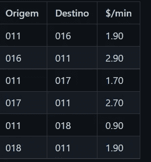
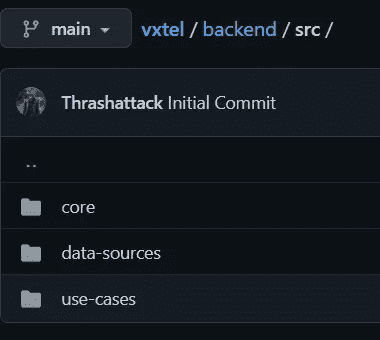
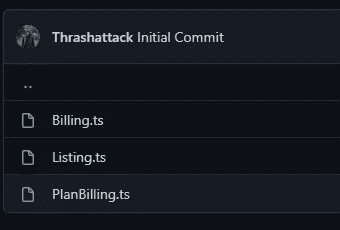
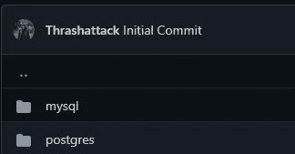
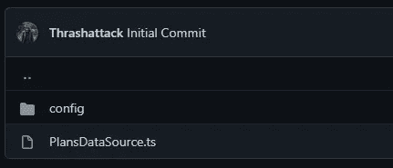
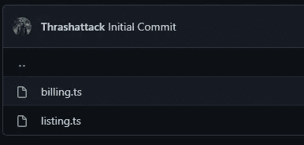

# 为可扩展和分散的业务编写微服务的六边形方法

> 原文：<https://betterprogramming.pub/how-to-ports-and-adapter-with-typescript-32a50a0fc9eb>

## 如何在 TypeScript 中使用端口和适配器

萨姆·巴耶在 [Unsplash](https://unsplash.com?utm_source=medium&utm_medium=referral) 上拍摄的照片

从我们作为软件工程师的职业生涯开始，我们就听说了好的实践、好的架构，以及向我们所有人宣扬它们的各自的清单，但是你并不总是清楚地看到如何在日常基础上将它们付诸实践。不是批评，干净的代码和干净的架构是我形成的基础。

去年，我和我的团队在 GeekHunter 这里集思广益，我们试图*整理关于我们主系统架构的房子*，以及我们可以采取的一些步骤，以达到我们所谓的带有功能外壳的*无状态核心。*

我们正在享受我们播种的果实，现在我们更接近百分之百的无国籍核心。

但这让我想起了我去年做的一个 POC 项目，使用 TypeScript 实现六角形或端口适配器架构的概念。

今天，我想与社区分享它，实践这些概念后，我可以看到这个小项目如何帮助我在过去更好地看到地面，并在尝试架构改进时将皮肤放在游戏上。

# 1—问题

这个项目是从开发猎人在 Linkedin 上发给你的几十个评估测试中选择一个来写的，以便进入一些随机的公司。

这里的背景是一家专门从事长途电话的电话公司，它想向市场发布一项新计划。它被称为“FaleMais”。

该公司根据呼叫者的来源和呼叫的目的地向客户收取一分钟的通话费用，如下表所示:

原始代码/目的代码/分钟价格

使用新的 FaleMais 产品，客户购买一个计划，就可以在一定时间内(以分钟为单位)免费通话，只需为额外的分钟付费。超出的分钟数在正常分钟费率的基础上增加 10%。这些计划是 FaleMais 30 (30 分钟)、FaleMais 60 (60 分钟)和 FaleMais 120 (120 分钟)。

VxTel 公司关心其客户的透明度，希望提供一个网页，让客户可以计算呼叫的价值。在那里，客户可以选择始发地和目的地城市的代码，以分钟为单位的通话时间，并选择 FaleMais 计划。该系统应显示两个值:(1)与计划关联的值和(2)没有计划的值。对于这个问题，应该忽略获取计划的初始成本。

这里我们只寻找后端，因为我们想接近六边形架构。这不一定是一个可伸缩的问题，但是可以。如果在现实世界中，每秒钟会有大量的调用，肯定需要一个好的架构。这里不提数据科学部分。

这里我将跳过项目的配置部分，那不是重点。用 Docker 记下用打字稿写的笔记是有效的。

首先我想解释一下目录结构，这是理解六边形结构的一个重要部分。

[六角形建筑目录](https://github.com/Thrashattack/vxtel/tree/main/backend/src)

首先，我们有我们的`Core`。就是我们上面提到的无状态核心。it dir 中的所有内容都是无状态的、声明性的和可实现的代码。

在这种情况下，它包含代表我们在域中处理的内容的`Entities`、`Repositories`，这些是说明如何获取/存储数据的接口，以及做任何需要实现业务目标的事情的`Services`，服务还处理业务规则。核心永远不会依赖于它的目录之外的任何东西。

然后我们有`data sources`和`use-cases`都是功能外壳的一部分。我们想要多少贝壳都可以。

在这种情况下，`data-sources`是我们在`Core`中定义的存储库的实现，这里您会发现一个`mysql`实现和一个`postgresql`实现，因为我决定将东西存储在单独的数据库中，以便不损害整个系统的可用性(以及作为 POC)。

这里你可以有任何你想要的数据源，如果你使用人工智能并且需要获取弹性数据，在这里实现它，等等…

用例将 API 作为微服务。他们使用数据源和核心服务来提供 REST API。我们可以按照我们想要的方式分割它，我们可以在不同的端口有不同的路由，或者我们可以轻松地在无服务器功能中转换每个用例。

# 2 —无状态核心

深入我们的应用核心，我们可以找到定义问题实体的结构:

这两个接口足以映射我们的问题。首先，我们有一个计划，它是一个实体，有一个名称，一个免费的发言时间，以及当超过免费时间时要征收的额外百分比税。

然后，我们有税映射成本在来源和目的地表以上。

进入内核的`Repositories`层，我们有定义如何获取或存储数据的接口。它们是接口，因为它们不想知道数据获取是如何实现的。

它们都定义了两种方法，一种是通过某些标识获取数据，另一种是获取所有数据。

现在我们可以深入到服务中，看看它是如何与业务规则相联系的。

我们有三个服务，一个用于开账单，一个用于列出所有的税和计划，另一个用于开账单，将计划计入账户。

[核心服务](https://github.com/Thrashattack/vxtel/tree/main/backend/src/core/services)

计费是一个简单地做问题中所描述的事情的服务:
它获取一个源和一个目的地(称为 A 和 B)，呼叫的总分钟数，并计算其计费。它还允许您传递每分钟的额外费用。

注意，这个服务使用存储库，所以它需要接收注入到构造函数中的存储库。

在此之后，我们有一个简单的列表服务，将用于获取所有的计划和税收。它还接收存储库作为依赖注入。

最后一个服务是计算给定特定计划的账单的服务。

它旨在扩展现有的`Billing`服务。您可以注意到，如果需要的话，在计算了额外的税费之后，它总是会从`Billing`服务返回方法。

这样，我们的无状态核心就准备好了，我们现在能够将这个核心服务用于我们想要的任何数据库，并在我们想要的任何 REST、Graphql 或 RPC 端点中公开它。

# 3 —功能外壳(数据源)

如前所述，我们决定在这里使用两个数据库，更多的是作为概念验证。

[数据来源](https://github.com/Thrashattack/vxtel/tree/main/backend/src/data-sources)

这两个实现都有一个 config dir 来存储迁移和 QueryBuilders，如果需要更多的数据源，它可以是一个公共接口。这里的 ORM 是 Knex。除了`config`dir，我们还有数据源实现。

[Mysql 数据源](https://github.com/Thrashattack/vxtel/tree/main/backend/src/data-sources/mysql/config)

在数据源配置中导航很重要，但这不是这里的重点。所以让我们跳过这一部分，因为您可以从存储库中浏览它。

`PlansDataSource`使用一些配置从核心实现`PlansRepository`。

转到`postegres`实施，我们有`TaxesDataSource`，我们还有一些将被跳过的配置。

也就是说，我们现在离拥有一个自上而下的全六边形架构只有一步之遥。

# 4 —功能外壳(用例)

既然一切都已设置好，而且最重要的是，它们是分离的，那么没有什么比作为微服务的用例更好的了。这里我们有两个:计费和列表。

[用例](https://github.com/Thrashattack/vxtel/tree/main/backend/src/use-cases)

在计费用例中，我们有一个 REST API 的 Express 服务器的完整实现，带有一些验证和对核心服务的调用。

在另一个端口，在另一个服务中，如果您愿意，可能在另一个群集中(你好，AWS lambda)，我们有列表服务。

# 还有更多

在这篇文章之后，你可以访问[这个 GitHub 库](https://github.com/Thrashattack/vxtel/tree/main/backend)来完全理解这个实现，我真的希望这能帮助你理解干净的六角形架构。