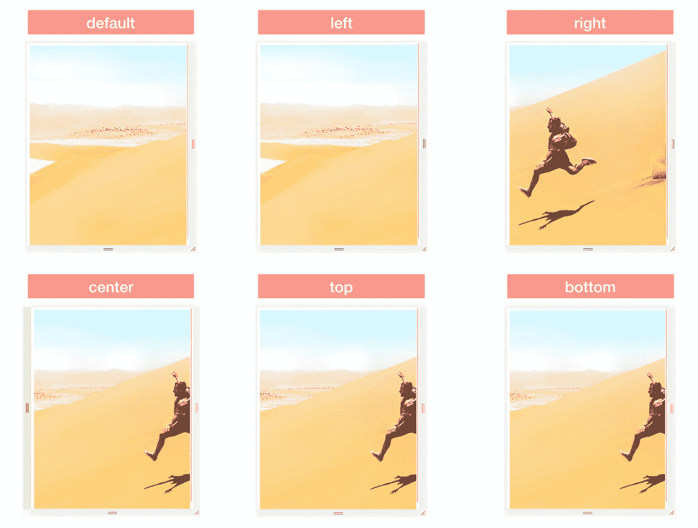
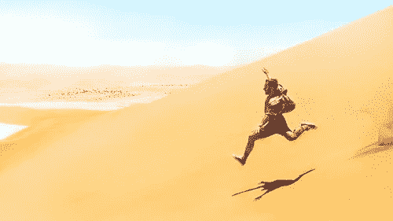
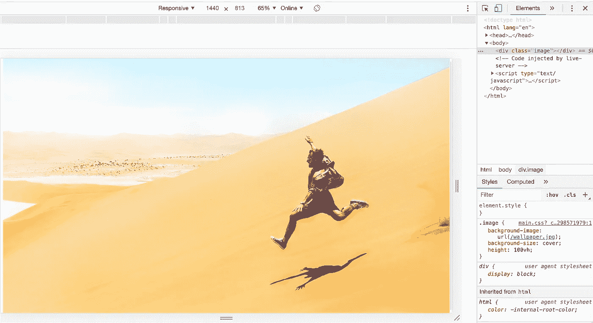
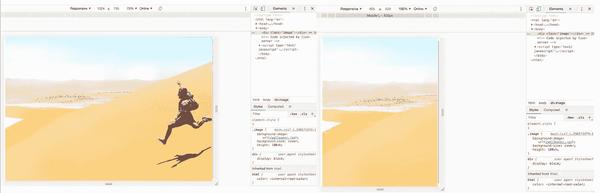
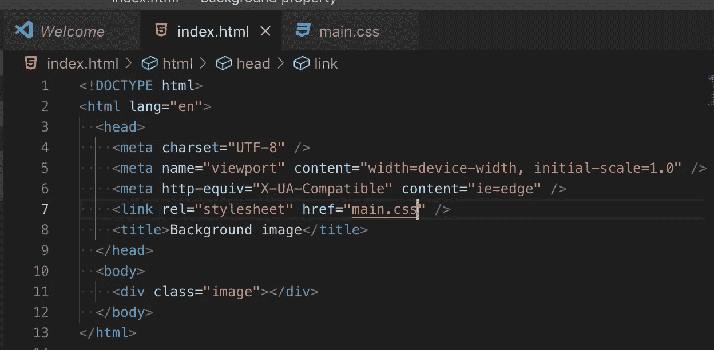
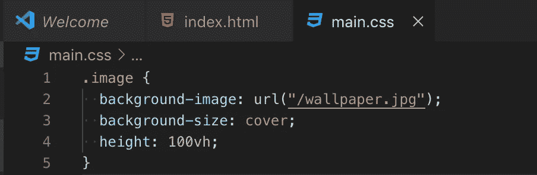
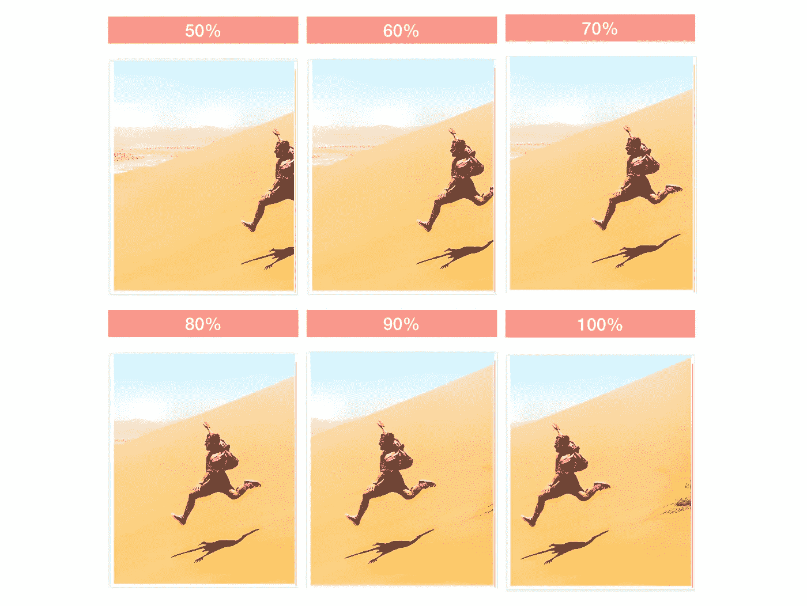
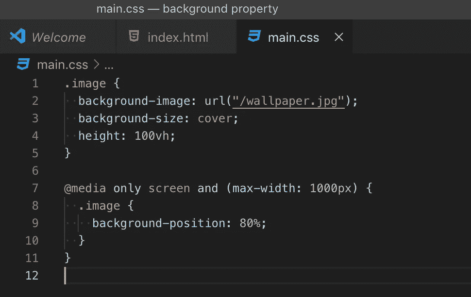
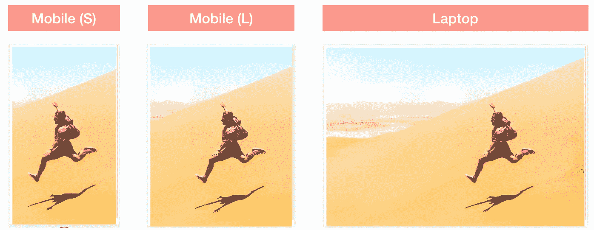

# 如何用 CSS 定位背景图片

> 原文：<https://betterprogramming.pub/how-to-position-background-images-with-css-73cc544975c3>

## 编码

## 使用背景位置来调整图像的位置

我想和你分享如何定位背景图片(而不是把它的位置留给浏览器，浏览器会从右边的方向裁剪图片，默认是从底部)。

对于这幅作品，我用一张前景中有一个男人的风景照片作为焦点。图片添加为`*background-image*`，CSS 属性为`*background-size: cover*` *。*因此，它将被重新调整大小以覆盖整个容器。

根据容器的大小，图像将被拉伸或裁剪。

我将用下面的照片来展示如何在网页上放置背景图片。目的是让图片覆盖整个网页，无论是手机还是桌面。

照片由 [Rémi Jacquaint](https://unsplash.com/@jack_1?utm_source=unsplash&utm_medium=referral&utm_content=creditCopyText) 在 [Unsplash](https://unsplash.com/t/travel?utm_source=unsplash&utm_medium=referral&utm_content=creditCopyText) 上拍摄

# 不同屏幕尺寸上的图像(如在 Chrome 开发工具中所见)

上图在大型笔记本电脑上看起来很棒。当我将原始图像与它在浏览器中的渲染效果进行比较时，它看起来有些拉伸(如下)。

在一台小型笔记本电脑上，尽管图像从右侧被裁剪，但图片中的男子仍然可见。然而，在手机上，他完全暴露了出来——不是设计师所预想的那样。

小型笔记本电脑上的图像与大型手机上的相同图像

我如何定位图像，使照片中的男子保持焦点？

# 方法

一个快速的解决方法是使用图像编辑器裁剪图像，然后根据屏幕大小显示正确的图像。

另一种方法是使用 CSS——这就是我在这里使用的。

## 位置使用的一些背景

*Position* 告诉浏览器如何在一个容器中放置一个图像，相对于它的容器的边缘。

*位置*的值可以用关键字(`top`、 `bottom`、`left`、`right`、`center`)、百分比或长度来表示。

默认`background-position`为`top left`或`0% 0%`。

*   如果只指定了一个值，根据这个值，我可以指定水平位置或垂直位置。然后将另一个位置设置为`center`。
*   如果使用两个非关键字值，第一个值表示水平位置，第二个值表示垂直位置。
*   如果使用三个或四个值，长度百分比值将作为前面关键字值的偏移量。

# 设置

我通过在`
` 元素上使用`background-image property`来添加我的图像文件。

查看 HTML 代码，`
` (我的图像文件)的容器是`<body>`。

# 更改图像的位置

## 使用关键字获取<position>值</position>

为了改变图像的位置，我添加了`background-position` 属性，并添加了`center`、`top`、 `bottom`、`left`和`right`作为值。以下是应用不同值时图像位置如何变化的屏幕截图:

在这种情况下，当我的图像以其完整高度(或接近其高度)显示时，将图像沿 Y 轴居中没有任何效果。因此，当我使用背景-位置:中心、背景-位置:顶部和背景-位置:底部时，我有效地使用了`background-position: center center.`

`left`

*   **X 轴:**图像靠着容器的左边缘设置，从*右侧*开始裁剪。
*   **Y 轴:**图像居中。

`right`

*   **X 轴:**图像靠着容器的右边缘设置，从*右侧*开始裁剪。
*   **Y 轴:**图像居中。

`top`

*   **X 轴:**图像居中。
*   **Y 轴:**图像靠着容器的上边缘设置，裁剪从*底部*开始。

`bottom`

*   **X 轴:**图像居中。
*   **Y 轴:**图像靠着容器的底部边缘设置，从*顶部*开始裁剪。

`center`

*   **X 轴:**图像居中。
*   **Y 轴:**图像居中。

## 使用非关键字作为<position>值</position>

除了使用关键字`center`、`top`、`bottom`、`left`和`right`作为值之外，我还可以使用百分比或其他 CSS 单位进行更精细的调整。

在应用了从 50%到 100%的不同百分比的图像截图中。80%看起来符合我的目的。

# 媒体查询

[CSS 媒体查询](https://developer.mozilla.org/en-US/docs/Web/CSS/Media_Queries)用于在手机上显示带有`background-position: 80%`的图片，同时保持其在桌面上的默认位置

为了决定用于媒体查询的断点，我从输入任何值开始，比如`max-width: 800px`，只是为了看看它在使用浏览器的开发工具的不同屏幕尺寸上看起来如何。然后，我调整断点的值，直到图像在所有屏幕尺寸下看起来都很好。在尝试了一些值后，`max-width: 1000px`看起来很适合这张图片，所以这是我断点的最终值。

最终产品…

我目前只有这些了。

如果你需要更多的灵活性来定位你的图像，有三个和四个`<position>`值可以用于你的背景位置属性。