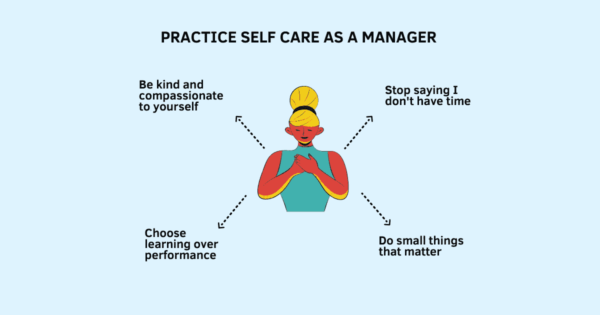

# 作为管理者如何实践自我保健

> 原文：<https://betterprogramming.pub/how-to-practice-self-care-as-a-manager-8da6c62c62c8>

## 你可以成为一个伟大的经理，也可以成为一个伟大的自己

鸣谢:作者

管理是一项棘手的工作。你需要关心他人和他们的成长，同时也要对他们的情感和精神健康负责。如果你是一个认真对待自己角色的人，你可能已经付出了很多努力，想成为一个优秀的管理者。

但是当经理并不容易。不管你花了多少时间或多努力，如果你拒绝给自己足够的空间去感受身体、精神和情感上的强大，你就永远无法满足你的员工的需求，或者对你做得很好的想法感到满足。

毫无疑问，大多数经理都想做好自己的工作。然而，他们没有意识到，要成为他人的好经理首先需要管理好自己。

管理不是一项个人运动。这更像是一场足球比赛。即使你是球场上的一名伟大球员，知道如何打出完美的击球，但没有准备好应对球场上其他球员的意外击球也会让你失去平衡。当比赛没有按预期进行时，你不仅需要保持冷静，而且打好比赛的一个重要部分是观察场上的其他球员，重申你的策略，并以一种让你感觉可控的方式微调你的方法。

对于你需要做的所有决定和需要采取的所有步骤，并没有一本规则手册。在这个过程中你会犯很多错误。你将很难[让别人听到你的想法](https://www.techtello.com/how-to-get-your-ideas-heard/)并说服他人。你决策的不确定性，以及每天为实现目标所做的努力，会对你的个人健康和心理健康造成很大的压力。

除非你学会照顾自己，否则你不可能真正富有成效。作为一名经理，练习自我保健不仅仅是必要的，它应该是你最优先考虑的事情。

# 作为管理者实践自我保健的策略

## 1.别再说我没时间了

大多数经理给出的不重视健康的最大借口是没有时间。

想一想。对于那些愿意在工作上花费 8-12 个小时的人来说，让人力资源每天锻炼或做一顿健康的饭菜是一场真正的斗争，这难道不令人难以置信吗？

然而斗争是真实的。大多数经理不这样做不是因为他们找不到时间做，而是因为他们操纵自己认为他们没有时间。

问题从来不是缺少时间。不去做你积极想要避免的事情是一种抵抗机制。热衷于将即时满足置于长期回报之上，跑步几分钟、游泳或去健身房都是次要的。工作一整天后很累，这些事情看起来很难赚钱。确信今天只是忙碌的一天，你承诺明天会做得更好，要么赶紧睡觉，要么看会儿电视犒劳自己。

如果健康对你很重要，正确的问题不是“我如何找到时间去健康？”你永远不会。

确实是。

我在回避什么？

不做的代价是什么？

> 腾出时间是一个框架，用于选择你想关注的事情，积累精力去做，打破默认的循环，这样你就可以开始更有意识地生活——杰克·纳普，腾出时间

一旦你决定关心自己，优先考虑你的健康，这里有一个诀窍:在早上上班前做这些事情(锻炼、健康饮食、冥想等)来开始你的一天。以关爱自己开始新的一天也为一天的剩余时间定下了积极的基调。

## 2.优先考虑重要的小事

成为经理的一个副作用是工作和家庭的界限开始消失。总有比你一天所能完成的更多的事情要做。紧急的事情比重要的任务更重要，让你在一天结束时感觉没有完成。

在工作和家庭之间转移优先事项不仅让你精疲力尽，疲惫不堪，而且你还开始生活在持续的内疚之中。对未实现的个人承诺的思考会让你在工作中分心，当你在家时，你的思想仍然被工作占据。想成为一名好经理的渴望和没有追求其他能给你的生活增添意义的目标的负罪感让你不断地在工作和家庭之间冲突。

当竞争的优先事项需要你的注意力，而你匆忙做出决定时，毫无疑问，大多数决定都以工作告终。晚上多花几分钟或者周末快速回复一封邮件很快就变成了额外的一小时。除非你有意识地优先考虑对你重要的事情，否则这些不健康的做法会成为你生活方式的一部分。

> 时间管理技巧，生活技巧，睡眠技巧，工作技巧。这些都反映了试图从一天中挤出更多时间的困扰，但重新安排你的日常模式以找到更多的工作时间并不是问题。问题是有太多的事情要做——杰森·弗里德

换句话说，少做事，但要做好。

作为一名经理，实践自我保健的想法很简单:确定什么是重要的，然后定义明确的界限，这样你就不会从你真正重视的事情上溜走。

举个例子:如果你一个月和朋友出去吃一次晚餐，或者一周两次晚上的瑜伽课，或者和你的孩子一起吃晚餐对你来说很重要，把它们放在你的日历上，就像你做其他事情一样。活在当下，享受那些没有工作干扰的时刻。对你的工作重点也做同样的事情。

这两个步骤通常对我有用:

1.  识别重要的小事。
2.  在做这些事情的时候保持高效。

## 3.从优秀到变得更好

作为一名经理，你可能会在前进的道路上面临许多挑战和挫折。当困难发生时，你是如何处理的——你是努力坚持下去还是带着自我怀疑的情绪放弃？

当你为自己设定绩效目标时，你想向别人证明你有多聪明、有才华、有能力。绩效目标与你的自我价值感紧密相连，这让你更少地关注学习，而更多地关注实现特定的结果。

海蒂·格兰特称之为“做好人”的目标。

> 绩效目标的特点是要么全有要么全无——你要么达到目标，要么没有。你要么赢，要么输……当你所关心的只是变得优秀时，几乎优秀或基本优秀并不能给你多少安慰——海蒂·格兰特

追求“做好人”的目标不仅会让你在没有达到特定结果时感觉糟糕，还会让你放弃尝试。在这些关键时刻放弃会让事情变得更糟，这进一步强化了你的信念，即你没有所需要的东西——有点像自我实现的预言。

另一方面，学习目标与过程相联系，而不把你的成功或自我价值感与具体的结果联系起来。有了学习目标，你就专注于你正在取得的进步和你提高了多少。挑战和挫折不会让你气馁。相反，它们表明需要付出更多努力，尝试不同的策略或者[寻求帮助](https://www.techtello.com/how-to-ask-for-help/)。你愿意做任何有助于你前进的事情。

海蒂·格兰特称之为“变得更好”的目标。

> 这些目标以完全不同的方式与自我价值联系在一起，因为它们是关于自我完善而不是自我确认——关于成为你能成为的最好的、最有能力的人，而不是证明你已经是了——海蒂·格兰特

作为一名经理，事情不会总是按预期进行。在通往成功的路上，你会面临许多障碍。你为自己设定的目标(变好或变得更好)不仅会深刻影响你的感受，还会影响你之后的行动。

作为一名管理者，要练习自我保健，多关注学习，少关注证明。你不仅会发现自己不那么焦虑和紧张，而且会更加满足，因为你知道只要你愿意再试一次，你总能做得很好。

## 4.正确看待事物

当你看着别人时，你期望他们把每件事都做得完美吗——没有错误，没有失误？你认为他们会贪多嚼不烂吗？你指望他们在面对不确定性或做出关键决定时，永远不会面对自我怀疑吗？

但是当涉及到你的时候，你会应用一套不同的规则吗？

*   失败会在你心中产生恐惧和抗拒吗？
*   你担心做出错误的决定会伤害你的能力吗？
*   你对[面临批评](https://www.techtello.com/how-to-deal-with-criticism/)感到焦虑吗？
*   你试图向别人隐瞒你的失败吗？

要有效地履行管理者的职责，你需要从自我怀疑转变为清晰和行动。如果你总是责备或自我批评，你就做不到这一点。

当事情变得像往常一样糟糕时，不要自责或扮演受害者的角色。相反，练习这个有用的技能:自我同情。

自我同情是以善意和理解面对你的错误和失败的能力，而不是苛刻地评判自己或以保护自我为目标的防御性行为。这是对你自己有同样的温暖感、同理心和积极的尊重，就像你在别人面临困境时对他们一样。承认生活有时是混乱和不完美的。毕竟，犯错是人之常情。

自我同情研究领域的先驱克里斯汀·内夫将其描述为—

> 自我同情不是无情地评判和批评自己的各种不足或缺点，而是意味着当面临个人失败时，你是善良和理解的——毕竟，谁曾说过你应该是完美的？

她定义了自我同情的三个主要组成部分:

*   **善待自己:**善待自己，理解自己，而不是严厉地批评和评判。
*   **共同人性:**通过认识到没有人总是完美的，在体验中感受与他人的联系。
*   正念:在平衡的觉知中持有经验，而不是忽视痛苦或夸大痛苦。

作为管理者要实践自我关怀，培养自我怜悯心，不要再追逐高自尊。自怜会让你正确看待事情，帮助你保持更加冷静和放松，从而使你能够做出有意识的选择，而不是对环境做出反应。

你可以成为一个伟大的经理，也可以成为一个伟大的自己。作为一名经理，要练习自我照顾，控制你的时间，优先考虑重要的小事，从“变好”转向“变得更好”，并正确看待事情。

# 摘要

1.  要成为一个有效的管理者，你不仅需要对你的团队好，还需要对自己好。
2.  如果你不把你的心理健康和个人幸福放在首位，这将损害你的生产力和表现。
3.  作为一名经理，要实践自我保健，你需要停止以缺乏时间为借口，开始做一些能让你身心健康的活动(锻炼、健康饮食)。
4.  不要为生活中的大事感到压力，而是找出重要的小事，界定界限，花时间远离干扰，让你的时间有价值，让你所做的一切都富有成效。
5.  不要试图通过向他人证明你的聪明和能力而变得优秀，而是通过关注你的进步、你进步了多少以及你正在学习的东西来变得更好。
6.  当事情不尽如人意时，不要批判和自我批评。把自怜作为一种工具，承认你的困难，忘记你的失败，不要让你的错误妨碍你采取行动。

在 Twitter 上关注我，了解更多故事。

*这个故事最初发表于*[*【https://www.techtello.com】*](https://www.techtello.com/practice-self-care-as-a-manager/)*。*