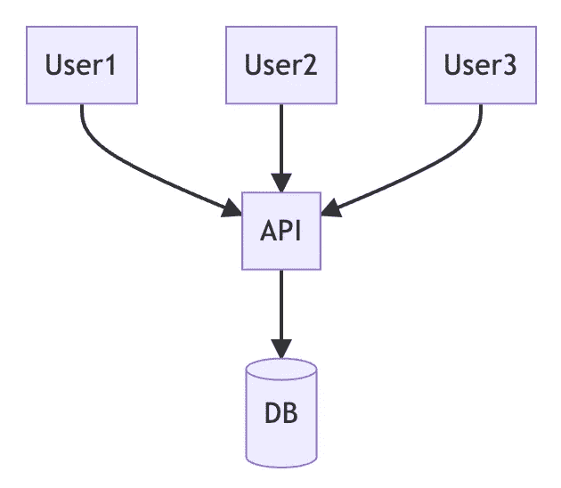
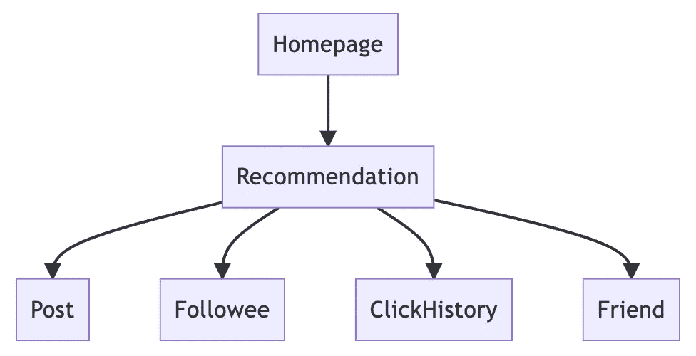
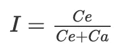

# 如何像专家一样准备设计评审？

> 原文：<https://betterprogramming.pub/how-to-prepare-a-design-review-like-an-expert-85d2ab85d7f5>

## 了解优秀设计评审的三个主要项目

照片由 [Unsplash](https://unsplash.com/photos/DuHKoV44prg) 上的 [Fotis Fotopoulos](https://unsplash.com/@ffstop) 拍摄

本文将以后端开发为例，但是相同的概念可以应用于各个领域。

在说明如何准备一份好的设计评审之前，我们先来介绍一下一份设计评审应该具备的内容。作为一名建筑师，我要告诉你我想看什么。

1.  [C4 车型](https://c4model.com/)
2.  [用户故事和用例](/how-to-design-in-clean-architecture-way-part-2-8524e76f2720)
3.  设计决策

作为一个架构师，我最想看到的是上面三项，不是代码流也不是数据库模式甚至也不是 RESTful API spec。

其中最重要的是 C4 模式。

# C4 模型

为什么 C4 模式如此重要？在解释之前，让我们简单介绍一下 C4 模型。

C4 模型包含四个 C

1.  上下文:这是系统的概述，描述了用户如何与整个系统交互。它将从用户的角度显示，因此不会显示系统的详细信息。
2.  容器:这里的容器不是指 docker 那样的容器虚拟化。C4 模型中的容器是指可以单独部署的实体，如 API 服务器、数据库、消息队列等。
3.  组件:组件是容器下的模块。它包含了领域驱动设计中模块之间的交互或者领域之间的关联。
4.  代码:最后是组件下的源代码。但是在描述架构的时候，我们不会展示代码的细节，能够描述对象之间的关系就足够了。

根据以上描述，C4 模型的目的是解释系统内的相互作用和关系。从最大的单元——用户交互，到对象与对象之间的交互，这些交互帮助架构师获得整个系统的全貌，知道这样的交互是否合适。

例如，从容器的角度来看，一个小的应用程序可能是这样的。

一些开发人员可能认为这样的图太简单了，然而，这样简单的图足以让架构师发现可能的问题。

1.  可伸缩性:当用户数量增加时，API 有什么办法处理吗？就算 API 能满足吞吐量，数据库呢？
2.  可靠性:当 API 崩溃时，是否存在 SPOF(单点故障)的风险？
3.  效率:当数据量增加，数据库响应时间变慢，用户会有什么感受？

这种非功能性需求可以从关系图中进行分析。以上只是一些常见的非功能性需求，完整列表见 [wiki](https://en.wikipedia.org/wiki/Non-functional_requirement) 。

然后，以组件视角为例。一个简单的社交媒体可能如下。

这也是一个非常直观的示意图。看起来它只是列出了各种模块。这样的图真的值吗？

是的。绝对的。

当我们评估一个架构的耦合程度时，我们通常使用`instability`作为一个指标。

`Ce`指传出耦合的数量，`Ca`指传入耦合的数量。越靠近`0`模块越稳定，反之亦然。关于耦合，[我有一篇文章](/temporal-coupling-in-code-e74899f7a48f)专门描述耦合的问题。

对于这个社交媒体，它的推荐模块的`instability`是`0.8`。这意味着推荐是不稳定的。只要修改了任何一个依赖模块，无论是接口还是行为，都会直接或间接地影响到推荐系统。

建筑师通过这样一个简单的图来分析整个架构。基于不同的领域，不同的架构，会有完全不同的解耦方式。没有现有架构的完整视图，架构师只能提供一些无关紧要的评论。

# 用户故事和用例

如何写出好的用户故事和用例我在[上一篇文章](/how-to-design-in-clean-architecture-way-part-2-8524e76f2720)中提到过。

在这一节中，我只是重复上面的 C4 模型。事实上，用户故事也符合 C4 模型中的上下文。要有一个好的故事，有一种方法可以得出正确的上下文。

# 设计决策

设计决策是整个设计评审的核心。整个设计评审就是检查每个设计决策是否正确。前面提到的 C4 模型、用户故事和用例只是为了给整个审查提供背景信息，以便理解每个决策背后的意义和风险。

但是设计决策是什么呢？

感觉是一个简单的词，但实际上很难感受到。所以我提供了一个简单的公式:

> *为什么做* A *(而不是* B *)？*

举个例子，

1.  为什么用 MySQL 而不用 MongoDB？
2.  为什么使用缓存？(而不是直接访问数据库)
3.  为什么使用同步 restful API 而不是异步 CQRS？

上面说的问题有点宽泛，我们继续缩小范围。

1.  为什么我们希望推荐系统使用同步调用从 post 系统获取数据？
2.  为什么这个功能要拆分成两个子功能？
3.  为什么这行源代码要这样写？

你注意到了吗？这都是设计决策，从系统定位到每行代码的原因，除了在设计评审中，你可能不会被问及每行代码的原因。因此，应该提出什么样的决定来讨论？

我的观点是，C4 模式的前三个目标值得讨论。通过写下 C4 模型，并列出每一行和每一块的目的和原因，架构师将能够在许多功能性和非功能性需求中识别潜在的问题和隐藏的风险。

至于最后的 **C** ，代码，还是留给开发者在代码评审的时候去发现吧。

# 结论

本文解释了优秀设计评审的三个主要项目。C4 模型给建筑师一个更快的系统概览；然后是特性将解决的用户故事和用例，以便架构师理解功能需求是什么；最后是开发人员的设计决策，以便架构师知道每个决策背后的权衡。

这样，大家都在同一页上。架构师可以提出他的建议，指出系统背后的风险，开发人员可以了解系统演进的方向和需要解决的问题。

重要的是要记住提供足够的信息，以便架构师能够做出正确的建议，否则你只会得到空话。

在我以前的文章中，我实际上已经解释了不同的设计决策，希望这些分析能够让您意识到需要在哪里做出决策以及应该如何做出决策。

*   为什么我们需要定义回购？[依赖注入](https://medium.com/interviewnoodle/whats-difference-between-unit-test-and-integration-test-aae6ef13220)
*   为什么我们需要层次？[分层架构](https://lazypro.medium.com/layered-architecture-clarification-e55b69d60e98)
*   如何进化出一个系统？[从独石转向 CQRS](https://medium.com/interviewnoodle/shift-from-monolith-to-cqrs-a34bab75617e)
*   怎么解耦？[事件驱动架构](/temporal-coupling-in-code-e74899f7a48f)