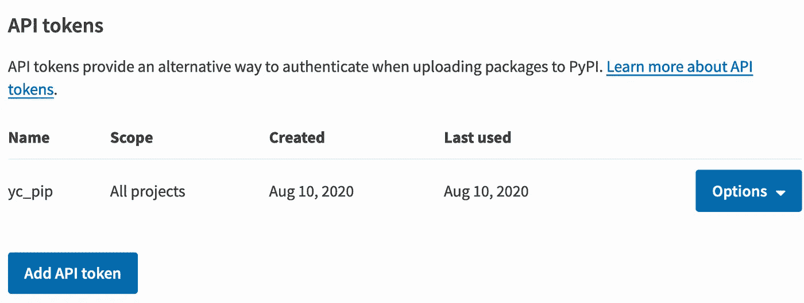
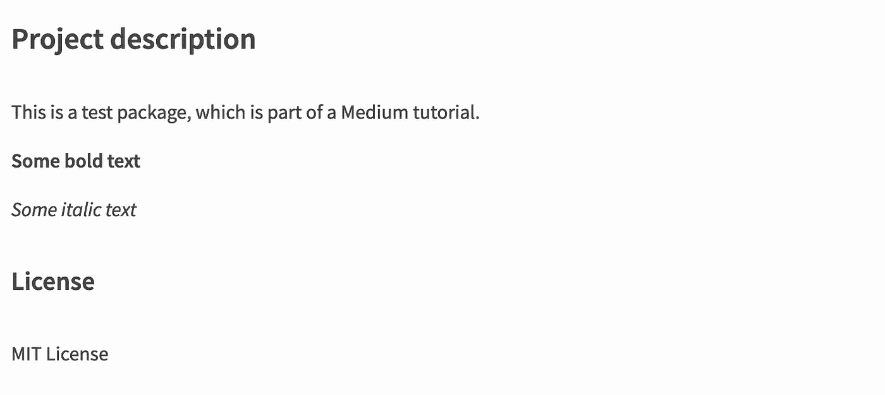

# 如何准备和发布您的第一个 Python 包

> 原文：<https://betterprogramming.pub/how-to-prepare-and-publish-your-first-python-package-85de378b77f6>

## 老实说，这很简单


照片由[照片爱好](https://unsplash.com/@photoshobby?utm_source=medium&utm_medium=referral)在 [Unsplash](https://unsplash.com?utm_source=medium&utm_medium=referral) 上拍摄。

Python 已经成为最流行的编程语言之一。一个主要原因是，我们这些 Python 的普通用户可以自由地分享我们的代码，其他人也可以非常方便地使用它。这种代码共享的一种正式方式是将你的所有代码打包成一个包，并上传到 Python 包索引([pypi.org](https://pypi.org/))，通过它，其他 Python 用户可以使用 pip 工具轻松安装你的包。

如果你自己发布过 Python 包，应该知道过程并不难。但是，对于没做过的人来说，你可能会误以为那一定是一个痛苦的过程。在本文中，我将向您展示准备您的包并发布它的步骤。

显然，第一步是完成你的项目。然而，我们都明白，包装从来都不是完美的。因此，您不必等到项目完成后才知道如何发布您的包。

出于当前教程的目的，让我们假设包含所有 Python 文件(例如`python_file_0.py`，如下所示)的目录称为`test_package`。这就是你想要发表的。为了简单起见，文件`python_file_0.py`只有下面的代码，当我们准备在包发布后导入它时会用到它:

```
def hello_world():
    print(**"Hello World!"**)
```

# 1.准备文件

在我们深入到发布的细节之前，让我们首先用必要的支持文件来构建目录:

包文件结构

*   在根目录下，在与 `test_package`相同的层次上，创建`README.md`文件。该文件将包含您希望用户了解的关于您的软件包的内容，例如安装和使用说明。
*   另一个同级的文件是`setup.py`文件。该文件将包含设置发布包所需的信息。我们一会儿会讨论这个文件里面有什么。
*   在`test_package`目录中，创建`__init__.py`文件。这个文件必须这样命名，它的作用是将一个常规目录转换成一个 Python 包。对于当前的简单包，我们可以将代码放在`python_file_0.py`中导出`from test_package.python_file_0 import hello_world`。

## 自述文件

理论上，你可以对这个文件只使用纯文本，但是我更喜欢使用一个 markdown 文件，它提供了格式化选项，让你读起来更有趣。为了简单起见，下面显示了一个示例`README.md`文件:

README.md

请注意，要点保存为 TXT 文件，在 GitHub 自动应用 markdown 文件的格式之前，它向您显示 markdown 的源文本。

通常，建议您包含关于软件包的许可信息，以便用户能够了解这些条款。在这种情况下，我们简单地使用 MIT 许可证。

## 安装文件

如前所述，我们使用`setup.py`文件来指示我们的包应该如何准备。以下代码向您展示了典型的`setup.py`文件的样子:

Python 包 setup.py

*   我们首先导入`setuptools`模块，它有方便的打包设置方法。
*   在`setup()`函数调用中，大多数参数都非常简单明了，应该是不言自明的。以下是一些亮点:

`name` : 包的分销名称，在 pypi.org 上必须是唯一的。为了确保唯一性，将您的 pypi 用户名附加到您的包名中总是一个好主意。

`long_description`:长描述通常从`README.md`文件设置。为了正确显示描述，通过设置`long_description_content_type`参数指定它是一个降价文件。

`packages`:您要在发行包中发布的包列表。因为我们只发布了一个包(`test_package`)，所以它的名字显示在列表中。但是，如果您想发布目录中的所有包，可以使用`setuptools.find_packages()`来方便地检索它们。

`python_requires`:指定您的包需要的 Python 版本。

# 2.准备上传

## 注册 PyPI 帐户

当我们谈论 PyPI 时，大多数时候，我们指的是常规网站([https://pypi.org/](https://pypi.org/))，这是索引 Python 包的地方。然而，网站的另一个测试实例([https://test.pypi.org/](https://test.pypi.org/))致力于测试目的，而不会搞乱官方索引。

请注意，这两个实例上的帐户是独立的。因此，出于测试目的，让我们只使用测试实例。来吧，在这里注册一个账户:[https://test.pypi.org/account/register/](https://test.pypi.org/account/register/)。

## 创建 PyPI API 令牌

准备好帐户后，建议您创建一个 API 令牌来上传包。转到您的帐户设置,“API 令牌”部分，然后单击“添加 API 令牌”



系统会提示您创建一个 API 令牌。您可以指定应用于所有项目或特定项目的此标记的范围。一旦创建了令牌，将它保存在某个地方以便以后可以检索是很重要的，因为出于安全原因，不能重新创建或恢复完全相同的令牌。

## 安装存档和上传工具

需要注意的是，有不同的工具用于归档和上传 Python 包。我们将使用的是`setuptools`、`wheel`和`twine`，它们更常用于 Python 包分发。

如果您的计算机上还没有安装它们，只需运行下面的命令即可安装所有三个软件包及其依赖项:

```
python3 -m pip install --user --upgrade setuptools wheel twine
```

# 3.分发包

## 存档包

第一步是通过归档来准备分发包。在终端中，导航到所有包文件(如`setup.py`)所在的根目录。运行以下命令:

```
python3 setup.py sdist bdist_wheel
```

该命令使用滚轮工具，该工具将使用`setup.py`文件中详述的指令创建分发所需的所有文件:

存档后的文件结构

具体来说，它将在`dist`目录中创建两个文件，如上所示。这些文件是可以上传的关键文件。

## 上传包

将包上传到 PyPI(同样，我们使用测试实例，但原则与常规实例相同)非常简单。我们将使用之前下载的`twine`工具，在终端中运行以下命令:

```
python3 -m twine upload --repository testpypi dist/*
```

本质上，这个命令请求将`dist`目录中的文件上传到 testpypi 存储库进行分发。系统会提示您输入用户名和密码。虽然输入用户名和密码上传到 PyPI 是可以的，但是如果您简单地使用`__token__`作为用户名，使用您之前创建的令牌作为密码，会更安全。

如果你一切都正确，你应该能够上传你的包没有任何问题。然而，如果有任何错误，它通常会给你关于你的`setup.py`文件中可能的错误的明确信息。只要纠正任何可能出现的错误，就可以了。

# 4.测试包

## 在 PyPI 上查看包

一旦您的包被上传到 testpypi，您就可以转到包的页面，看看所有的内容是否都显示正确(例如包描述)。在我们的情况下，网站应该在你上传后直接提供给你:【https://test.pypi.org/project/test-package-username/0.1.1/】T4。下面的截图向您展示了我们的`README.md`中详细描述的详细描述是正确呈现的:



pypi.org 上的测试包描述

## 导入包

同一个网页为您提供了安装测试包的命令行。只需复制并粘贴到您的终端:

```
pip install -i https://test.pypi.org/simple/ test-package-username==0.1.1
```

安装这个软件包应该没有问题。现在是时候测试我们是否可以使用这个包了——在我们将它上传到 pypi 存储库之后，它被认为是公共的。

测试包导入

如上所示，我们可以使用刚刚上传到 pypi 进行分发的第一个包。多么大的成就啊！

# 结论

在本文中，我们学习了创建通过 pypi.org 发布的 Python 包的四个主要步骤。虽然所示的示例集中在包索引的测试实例上，但是对于包索引的常规实例来说，一切基本上都是相同的。

# 参考

1.  [https://python hosted . org/an _ example _ pypi _ project/setup tools . html](https://pythonhosted.org/an_example_pypi_project/setuptools.html)
2.  [https://packaging.python.org/tutorials/packaging-projects/](https://packaging.python.org/tutorials/packaging-projects/)