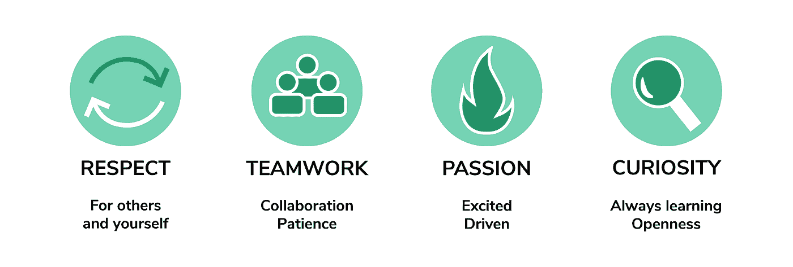
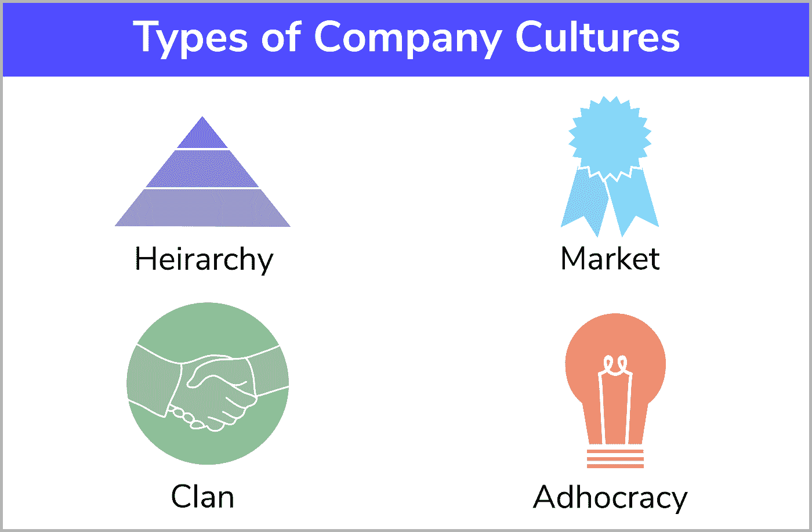
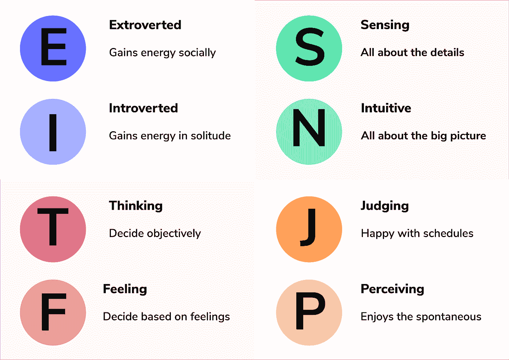
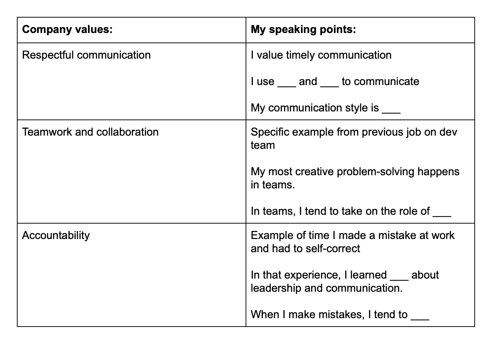
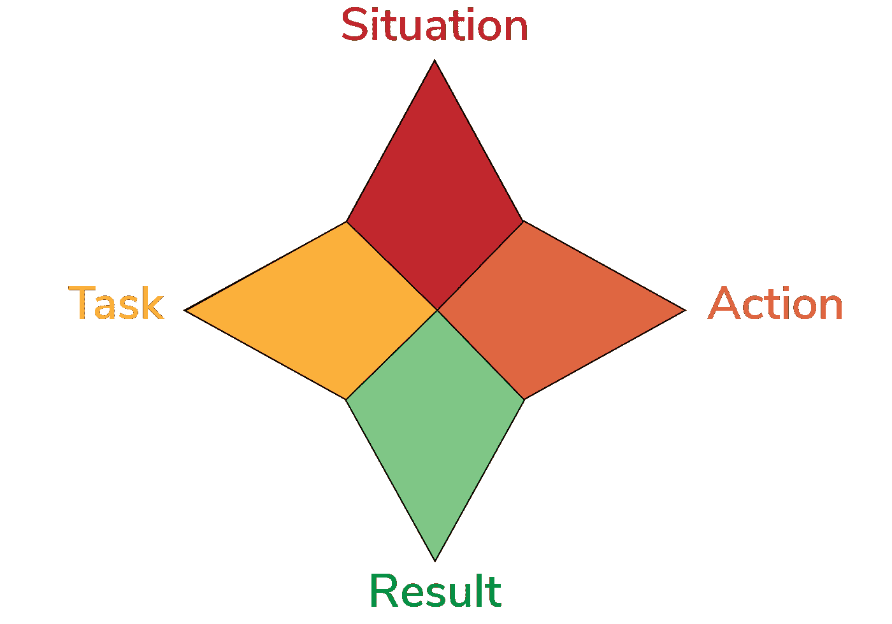
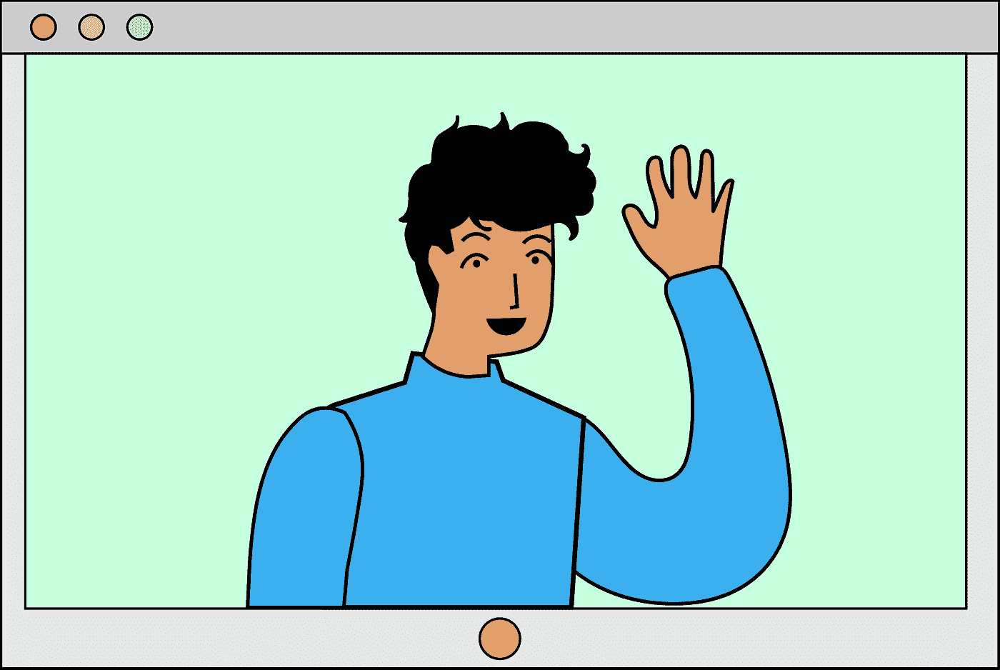
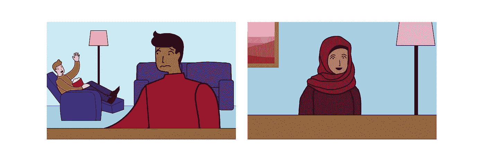

# 如何准备和应对行为面试问题

> 原文：<https://betterprogramming.pub/how-to-prepare-for-and-ace-behavioral-interview-questions-21e48322c672>

## 你的编程能力只是面试的一部分，剩下的是你如何与公司互动

作为一名软件工程师，当你想到面试时，你可能只会想到在白板上解决技术编码问题的画面。

事实证明，面试不仅仅是你的技术技能。行为和文化面试现在是你作为候选人被录用的一个重要部分。

许多有才华的候选人可能会被行为面试弄得不知所措，因为它们似乎远没有技术问题那么直接。但是不要害怕！为行为面试做准备是你面试之旅中有趣、令人振奋且必不可少的一部分。

今天，我们想带你浏览所有关于行为面试的须知信息，以消除你的恐惧，让你成为一名候选人。

# 这是我们今天要讲的内容

*   什么是行为面试？
*   为什么行为面试很重要？
*   如何准备行为面试？
*   虚拟面试指南。
*   其他资源/常见行为面试问题。

# 什么是行为面试？

如果技术面试衡量你的编程技能，行为面试试图发现你在与就业相关的情况或冲突中如何行动，包括积极的和消极的。

行为面试有助于雇主决定你是否是他们想与之共事的人。这些面试将要求你反思你过去的表现和行为，以了解你是谁，你如何在压力下行动，以及你如何理解职业精神。

记住，面试官比你更了解公司和职位，所以他们在寻找你性格中可能会暴露出问题的部分。

面试官可能想知道:

*   这个人在压力下冷静吗？
*   在一个团队里我能依靠这个人吗？
*   这个人会尊重同龄人吗？

行为面试因公司而异，取决于公司的价值观和文化。例如，一个高度赞扬独立工作的公司不会如此关注你的团队合作能力。

公司会优先考虑不同的价值观和属性，所以请记住，并不是只有一种方法可以准备和成功进行行为面试。稍后，我们将讨论如何研究公司价值观。

想更多地了解大型科技公司的企业文化吗？查看[codinginterview.com](http://codinginterview.com/)对亚马逊、网飞、谷歌、脸书等公司行为面试的详细分析。

# 为什么行为面试很重要？

在技术面试中脱颖而出显然很重要，但如果你想脱颖而出成为一名理想的候选人，行为面试同样重要。毕竟，技术技能是可以替代的。

真正让你有工作能力的必须超越这些技能，去做其他的事情。这种对你行为和自我反省能力的洞察可能是你在求职中成败的关键。

一个招聘团队想要找一个能让他们的生活更轻松，并且能融入公司的人。行为面试是一个至关重要的决定因素。它们甚至被用于降低法律风险、实施平等政策以及营造令人满意的工作环境。

在技术领域，软技能没有技术技能重要，这是一个普遍的误解。事实恰恰相反:软技能通常是雇佣一个候选人的决定性因素。

看看亚马逊的专家们对软技能评估的看法。作为一名潜在的雇员，软技能将决定你的成败。

他们表现出长寿、解决问题的技能和团队合作的能力。事实上，软技能是让招聘委员会中的非开发人员脱颖而出的唯一方法之一，他们可能不熟悉你带来的技术技能。

行为面试和你的编码面试一样重要，所以是时候准备了！

# 如何准备行为面试

许多求职者低估了行为面试，他们中的大多数人很少或根本没有做准备！有些人认为他们可以自由交谈，但这并不是一个好主意。

记住面试是有压力的！压力会产生负面的副作用，让你看起来毫无准备，你的大脑无法全力工作。

没有准备，你可能会东拉西扯，错过你的个人故事，或者专注于公司不喜欢的优势。

让我们完成四个简单的步骤，保证让你自信、专注，为接下来的行为面试做好准备。

关于最常见的行为面试问题列表，请参见文章末尾的参考资料列表。

# 第一步。熟悉问题的类型

## 先前的经验问题

先前的经验问题衡量你过去的行为，作为未来行为的预测。面试官想了解你的本能、倾向和影响力。

你可以用你以前的工作、志愿者工作甚至人际关系中的故事。主要重点应该放在职业经历上。

之前的工作经历问题几乎总是会要求你反思你的过去。你可以通过听过去时态动词和基于故事的回答等线索来识别这些问题。

常见的既往经验问题有:

*   给我一个你失败的具体例子。
*   告诉我你在工作中遇到阻碍的一次经历。
*   告诉我你在工作中必须解决的一个难题。
*   告诉我你寻求帮助的一次经历。

关键是要确保你回答的每件事都与提出的问题相关。所有的轶事和反思都应该回到问题的关键。

你的答案应该主要集中在你的行动、成就和思考过程上。避免描述团队做出的决定或不直接需要你努力的答案。这意味着你应该尽可能多地使用“我”这个代词。

看看这两种反应的区别。

*   我明白了为自己的行为负责是很重要的。
*   我们了解到团队中每个人都有责任是很重要的。

专注于自己似乎很自信，消息也很灵通。如果你以他人的角度说话，面试官也无法判断你的行为。

Protip:针对公司的价值观和核心原则策划你的答案。要了解更多这方面的信息，请查看[Codinginterview.com](http://codinginterview.com/)。

## 假设

假设性问题涉及“如果”。他们评估你运用过去的经验应对潜在挑战的能力，以及你面对公司特定问题时的直觉。

面试官会倾听你的创造力和个人偏见。你可以通过倾听这些线索来识别这些问题:

*   “如果……”
*   “想象一下…”
*   “你被要求……”
*   “把你自己放在……”

回答这些问题的关键是避免过多的细节。你回答中的任何细节都应该被框定为假设。

这也是你的公司特定研究派上用场的地方。如果你预先知道一个组织重视什么，你可以调整你的假设回答来满足他们的需求。

只要你的回答是深思熟虑的和理性的，用这些问题来大声思考也是很好的。散漫和主动处理信息是有区别的。让面试官看看面对不同挑战时你的大脑是如何工作的。

## 基于价值观的问题

基于价值观的问题提供了评估你是否适合该组织和角色的机会。这包括你带来的个人价值。

面试官不只是想雇佣有才华的人；他们还想建立符合他们目标的高效团队。这就是你对公司价值观和职位的研究派上用场的地方，我们将在后面讨论。

这些问题中的许多可能是假设性的，或者它们可能要求你描述你理想的工作环境。倾听以下线索:

*   描述一下你的理想…
*   你想看什么…
*   你在实践中是如何实现(插入价值)的？
*   对你来说重要的是…

在基于价值观的问题中，领导力也扮演着重要的角色。面试官希望雇佣符合他们文化和氛围的潜在领导者。例如，一个等级森严的组织对一个热爱民主决策的候选人不太感兴趣。

请注意，这些问题也是你评估自己对该职位兴趣的机会。你也是在面试公司！当他们对你的价值观提出质疑时，你可以反思自己在这种文化和角色中会有多满足。

继续学习。

> “练习行为面试，不要浏览视频或零散的文章。Educative 基于文本的课程易于浏览，并配有视频小工具，让学习变得快速高效。”— [**摸索行为面试**](https://www.educative.io/courses/grokking-the-behavioral-interview)

# 第二步。研究公司

正如我所提到的，很多准备工作都归结于对公司和职位描述做足功课。这包括职位的角色，公司的文化，品牌，以及他们可能会问你的问题。

研究一个组织的价值观会磨练你的答案，让你成为一个更投入的面试官。那么，在公司上哪里可以做这个功课呢？

*   公司网站
*   社交媒体平台(推特、脸书等。)
*   公司评论网站(LinkedIn、Glassdoor 等。)
*   服务和产品列表
*   顾客评论
*   新闻文章
*   观察现场位置(如果可能)
*   【Codinginterview.com 
*   更多

当你研究时，记下与组织相关的服务/产品的品牌、氛围和文化。你需要做的大部分研究都可以在组织的网站上完成。

大公司通常会对他们的价值观提供详细的声明，你可以在你的回答中真实地记住并执行。

你也可以调查公司领导的文章、社交媒体账户或公司评论网站，看看非员工对公司的看法。

说到社交媒体，你可能会想:“但推特能真正教会我什么？”原来，还挺多的！社交媒体的声音和氛围代表了公司的整体文化。

比如，他们的帖子是轻松的还是真实的？他们喜欢视觉还是文字？像这样的线索可以指导你回答问题的方式。他们是想让你开门见山还是友好相处？他们是希望你变得有创意还是直奔底线？

一旦你对公司的价值观和品牌有了很好的认识，你就可以开始集思广益，找出一些常见问题的答案，在真实和迎合他们的期望之间取得平衡。

例如，让我们说一个公司的首要任务是创造一种温暖的文化。你认为你应该关注以下哪些价值观？

*   独立和效率。
*   专业成长和决心。
*   尊重交流。

尊重沟通可能是组织的一个隐含价值。当你说话、介绍自己和回答问题时，你会希望给人以尊重和善于沟通的印象。

看看这两种反应的区别:

*   我非常准时，所以当我能通过日历设定每天的时间表让我保持在正轨上时，我工作得最好。
*   我重视自己和他人的时间，所以当我能清楚地传达我的时间表以满足团队整体需求时，我工作得很好。

虽然这两个都传达了相同的关于时间管理的信息，但第二个回答是以尊重他人和交流为导向的。

即使是措辞上的微小差异，也能让你的答案脱颖而出，成为一个很合适的答案。提前调查这家公司非常重要，可能会决定你的答案。

# 第三步。认识你的弱点，磨练你的优势

一旦你对摆在你面前的问题和公司价值观有了强烈的感觉，你就需要评估你的优势和劣势。

哪些问题你会准备好明确回答？哪些问题你很少思考过？这一步需要一些自我反省和自我调查。

这一步有一些提示。

## 做个性评估

性格评估不是一门明确的科学，但它们可以提供一些有趣的见解。性格测试可以帮助你了解你的价值观、恐惧、沟通方式和直觉。

在最基本的层面上，这些问题可能非常发人深省。在专业环境中使用的一些非常流行的性格测验是:

*   优势寻找者:关注职业优势和劣势。
*   [迈耶斯·布里格斯](https://www.myersbriggs.org/my-mbti-personality-type/mbti-basics/):关注你处理世界的方式。
*   [MAPP](https://www.assessment.com/) :关注你的需求和动机。
*   五大测试:关注你的社交取向和交流方式。
*   Riso-Hudson Enneagram :关注你作为一个人的恐惧和价值观。

## 把它写在纸上

评估你的优势和劣势的一个简单方法是把它们写出来。考虑做一个图表。在左边，用要点写出公司价值观。在右边，写出每个价值的潜在论点。这将帮助你确定你需要关注的地方。

如果你留下任何空白，考虑做一些自我反思，以产生潜在的答案。你甚至可以向朋友、爱人或前雇主寻求具体价值观的指导。他们可能会带来外部视角，激发新的思维方式。

看看下面的例子:

# 第四步。实践

一旦你做了功课和自我反省，是时候为面试实际练习了。练习你的面试答案一开始可能会觉得很尴尬，但它会帮助你组织你的答案，并从整体上建立自信。

如果你已经练习过一次面试回答，当它在面试中被问到的时候，你就不太可能东拉西扯或者错过目标。这里有一些提前练习回答的技巧:

## 使用星形方法

STAR 方法帮助你对行为面试问题做出结构化的回答。你可以用任何答案来实现这个缩写。

*   情况。描述与问题相关的具体情况。
*   任务。描述期望你完成的任务和职责。
*   行动。描述你是如何解决这些任务的。
*   结果。具体描述你行动的结果。

## 写出答案

与说话或打字相比，写东西会激活大脑的不同部分。写作需要一种更慢、更有意图的交流方式，这种方式可以让你对自己的答案有更深刻的理解。

当你练习时，试着先写出你的答案。慢下来，仔细选择触发公司价值观的词语。当你真的大声回答时，你更有可能保持条理和专注。

## 记录你自己

当我们大声说话时，我们不一定能听到我们实际上在说什么，或者我们可能会遇到什么。给自己录音能让你站在面试官的立场，更直接地倾听你的回答。

你甚至可以在你的手机上用视频或录音来做这件事。回放给你自己，注意你回应的优缺点。你甚至可以把它播放给你的家人或前雇主，以获得外界对你回答成功的建议。

准备阶段的一个很好的资源是 Educative 的“探索行为面试”课程，这是完全免费的。

它不仅通过真实世界的例子、测验和招聘经理的专业建议进行教学，还提供了一个独特的嵌入式视频小工具，您可以录制答案并回放以供评估。

## 和另一个人练习

在实践阶段，模拟面试对你来说是一个非常有用的工具。他们强迫你把所有的努力工作和研究都放到现实世界的环境中。

你可以和任何愿意认真对待你的回应并提出建设性批评的人一起这样做。也有网络公司提供模拟面试。

一旦你经历了一次模拟面试，一定要问一些好的改进问题，比如:

*   有什么特别的答案让你印象深刻吗？为什么？
*   哪些问题遇到最强烈或准备最充分？
*   哪些问题遇到最薄弱或毫无准备？
*   根据这次面试，用几句话描述一下我作为候选人的情况。
*   如果你能改变我的采访，那会是什么？
*   作为一名受访者，你从我身上感受到了什么？

## 总结这一部分

1.  熟悉面试题型。
2.  研究公司和工作职位。
3.  更多地了解你的优势和劣势。
4.  练习，练习，练习。

# 视频面试指南:你可能忘记准备的事情

视频和电话采访都是炒作。目前，由于全球范围的疫情，所有的科技公司都依赖视频访谈进行行为评估，行业领袖预测，这种趋势将在疫情结束后继续下去。

远程虚拟面试是新的标准，伴随这种变化而来的是一系列新的挑战，你需要为此做好准备。让我们来讨论一些视频/电话面试中常见的问题，这些问题可能是你没有想到要准备的。

# 电话/视频礼仪和技巧

进行电话或视频采访一开始可能会很棘手，因为我们习惯了面对面的礼节。以下是你在虚拟面试中要记住的一些事情。

## 1.有一个适当的设置

仅仅因为你的面试官不能通过电话看到你，并不意味着你不应该打电话或视频聊天。

*   衣服。即使是电话面试，穿上漂亮的工作服也能给自己设定期望。准备好你参加面对面面试时会穿的衣服。尽量避免分散注意力的模式。用柔和的颜色保持简单。
*   技术。请准备好充满电的设备和良好的互联网速度。视频面试，事先熟悉视频平台，手机静音。提前检查您的音频和扬声器是否正常工作。如果你用的是 Zoom 或 Skype，试着和朋友打电话测试一下所有的技术。如果需要的话，确保你的 IDE 或者 GDoc 已经为面试做好准备。
*   书桌。无论是电话面试还是视频面试，坐在一张合适的办公桌前会让你更好地为面试做准备。坐在一个合适的环境中不仅会让你变得更加专业，还会给面试官一个信号，表明你是有目的、有准备的。你会想呆在一个安静、光线充足的地方。
*   环境。一定要提前告诉和你住在一起的人关于面试的事情，以避免干扰。你甚至可以考虑在门上贴一个标志来阻止不速之客。从背景中清除任何杂乱或过于私人的物品。有一张全家福本身并不坏，但你想提供一个不受干扰的专业环境。

## 2.自我介绍

电话或视频面试时，你不能用握手或鞠躬来介绍自己。视频面试官可能会先介绍自己，甚至只是说:“你准备好了，我就准备好了。”

阅读适当时间的提示，用简单的问候介绍你自己。你可以考虑说:“早上好，谢谢你今天邀请我。我叫 ____”

你只需要简单的介绍就可以表达你的感激和兴奋，然后继续。

## 3.建立人际关系

因为你没有一对一聊天的好处，所以通过电话/视频建立某种形式的人际联系是很重要的。这可以通过在适当的时候讲一个适当的笑话，对你在公司的投资发表评论，或者在共同的价值观上建立联系来实现。

如果面试官提供了任何关于他们自己或他们的角色的信息，你可以考虑和他们建立联系，保持专业性。

例如，你可以问一个关于面试官的角色的问题，或者如果共同的爱好自然而然地出现的话，就建立一种联系。不要犹豫，在电话或视频面试中建立人际关系。这些是人类交流的自然组成部分，可以让你更令人难忘。

## 4.身体语言和姿势

既然你有控制周围环境的能力，那就让自己舒服一点，但一定要坐姿端正。这会让你感觉更专业，声音也会更清晰。

即使是电话面试，适当的坐姿也能激发你的大脑，并设定专业发言的期望。

对于电话面试，重要的是不要移动太多。避免移动身体或踱步，因为这可能会导致音频失真，甚至暗示接收端紧张。

对于视频面试来说，身体姿势和肢体语言非常重要。面试官会注意到你是否无精打采，翘着腿，或者经常整理头发。在你的视频中，坐直，避免拖拖拉拉。

就像你在一对一的面试中一样，和面试官进行眼神交流。试着把你的手放在桌子上方，因为这表示信任，并且在你说话的时候可以随意使用你的手。你会发现更加自然和舒适。

有很多技巧和窍门可以“破解”肢体语言技巧。虽然其中一些技巧可能会有所帮助，但不要认为你仅凭肢体语言就能进入一份工作。

最终，真正重要的是你的答案。事实上，过分强调这些技巧可能会分散你的注意力，或者让你在镜头前看起来很尴尬。

## 总结这一部分

1.  拥有一张整洁的办公桌。
2.  检查你的技术。
3.  穿得漂亮点。
4.  建立人际关系。
5.  好好坐起来。
6.  使用自然的肢体语言。

# 资源

在行为面试中脱颖而出取决于你在准备过程中付出的努力。幸运的是，有许多优秀的资源可以在这个旅程中帮助你。

## 课程

行为面试的权威资源是 Educative 的[探索行为面试](https://www.educative.io/courses/grokking-the-behavioral-interview)，它是专门为开发人员设计的。这是一个全面的行为采访指南，组织成一个，巩固的来源。再也不用在网上淘零散文章了！

行为面试问题或技巧列表不足以让你做好准备。你需要有针对性的、特定于开发者的指导。本课程包含真实世界的示例、测验、视觉效果和一个独特的视频小工具，以鼓励练习和自我评估。

## 编码面试

编码面试对于任何准备技术和行为面试的人来说都是一个决定性的地方。在这里，您可以找到公司特定的准备路线图、公司价值观的详细概述等。

*   [谷歌面试](https://www.codinginterview.com/google)
*   [脸书访谈](https://www.codinginterview.com/facebook)
*   [苹果采访](https://www.codinginterview.com/apple)
*   [亚马逊采访](https://www.codinginterview.com/amazon)
*   更多

CodingInterview.com 也是准备技术面试的宝贵资源。开发人员和软件工程师知道编码面试有多可怕。

他们需要几个月的准备来解决这些难题。CodingInterview 是你的一站式商店，提供指导面试准备的详细路线图。

## 其他资源

*   [Glassdoor 的行为面试指南](https://www.glassdoor.com/blog/guide/how-to-prepare-for-a-behavioral-interview/)
*   [行为面试准备指南](https://www.indeed.com/career-advice/interviewing/how-to-prepare-for-a-behavioral-interview)
*   [30 大行为面试问题](https://www.themuse.com/advice/30-behavioral-interview-questions-you-should-be-ready-to-answer)
*   [视频面试指南](https://biginterview.com/video-interview/)

# 行为面试问题清单:30 个常见问题

## 先前的经验问题

*   描述一次你为完成一个项目做了超出预期的工作。你的努力得到认可了吗？那让你有什么感觉？
*   告诉我一个你领导一个项目的时候。你在那个职位上做什么？作为项目的所有者，你感觉如何？
*   描述一个你观察到需要改进的过程或项目的情况。你大声说了吗？结果如何？
*   告诉我你在工作中犯错误的一次经历。发生了什么，你做了什么来改善这种情况？
*   请告诉我您必须同时管理多个项目的经历。你是怎么处理的？
*   描述一个你不得不适应项目或领导层重大变化的时候。你感觉如何？你是如何应对这种变化的？
*   你遇到过与同事或经理沟通不畅的情况吗？你是怎么处理的？
*   给我一个你不同意同事或其他程序员的例子。在这种情况下，你采取了什么行动？
*   描述一次你喜欢或感到失望的团队经历。什么效果好？什么不顺利？
*   给我一个你不得不面对一个需要创造性解决问题的复杂项目的例子。向我介绍一下你的决策过程。

## 基于价值观的问题

*   描述一下你理想的工作环境。在那种环境下，什么对你来说是重要的？
*   你喜欢单独工作还是团队工作？
*   描述一下你理想中的队友。这个人对你来说重要的是什么？
*   你如何描述你的沟通风格？
*   你能描述一下你的五年计划吗？你的职业抱负是什么？
*   请定义一下“正直”。在职业环境中，这对你意味着什么？
*   对你来说什么是职业精神？
*   你生活中的优先事项是什么？你如何对你的职责进行排序？
*   你对做哪种事情最有信心？
*   工作中什么事情最让你沮丧？你如何应对挫折？

## 假设性问题

*   假设我是你的主管，我要求你做一些你不同意的事情。你会怎么做？
*   如果你的队友没有达到标准预期，你会怎么做？
*   在五分钟的时间跨度内，以下人员向您寻求帮助:一位您不常与之交流的副总裁、您的经理和一位开发团队成员。你如何对它们进行优先排序？
*   如果你在一次会议上提出了一个强有力的建议，但你的团队决定反对，你会有什么感觉？你会怎么做？
*   你的团队两小时后要做一个报告，一名成员刚刚打电话来请病假。你是做什么的？
*   想象一下，你被告知使用一个你不熟悉的工具进行一个项目。你如何处理这个？
*   想象一下，你正在做一个你发现杂乱无章的项目，并且文档很差。你采取什么步骤？
*   假设你被这个职位录用了。描述你在办公室的第一天会采取的行动。
*   你意识到你在你的项目中犯了一个错误，但是你已经落后于最后期限了。你是如何进行的？
*   你会如何处理与一位与你截然不同的经理或同事的密切合作？