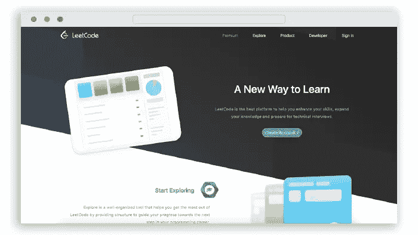
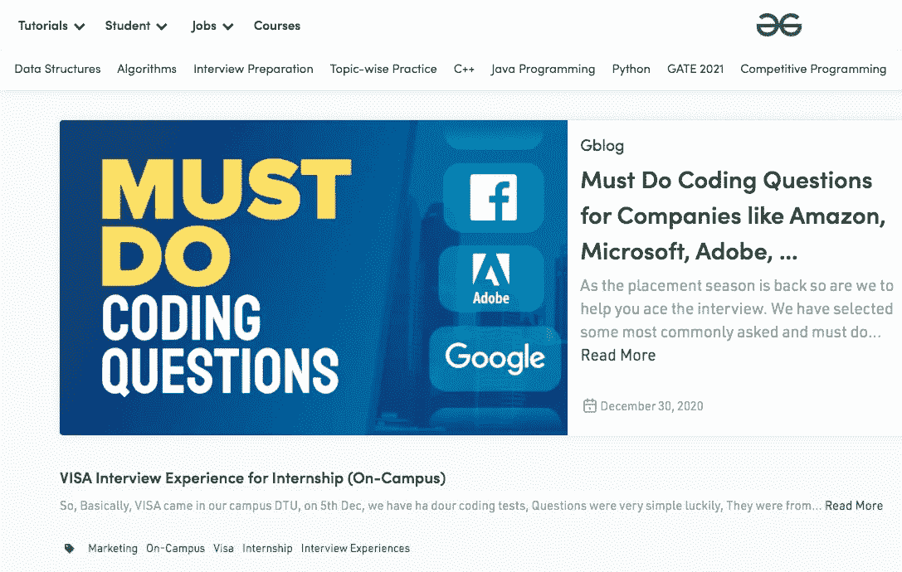
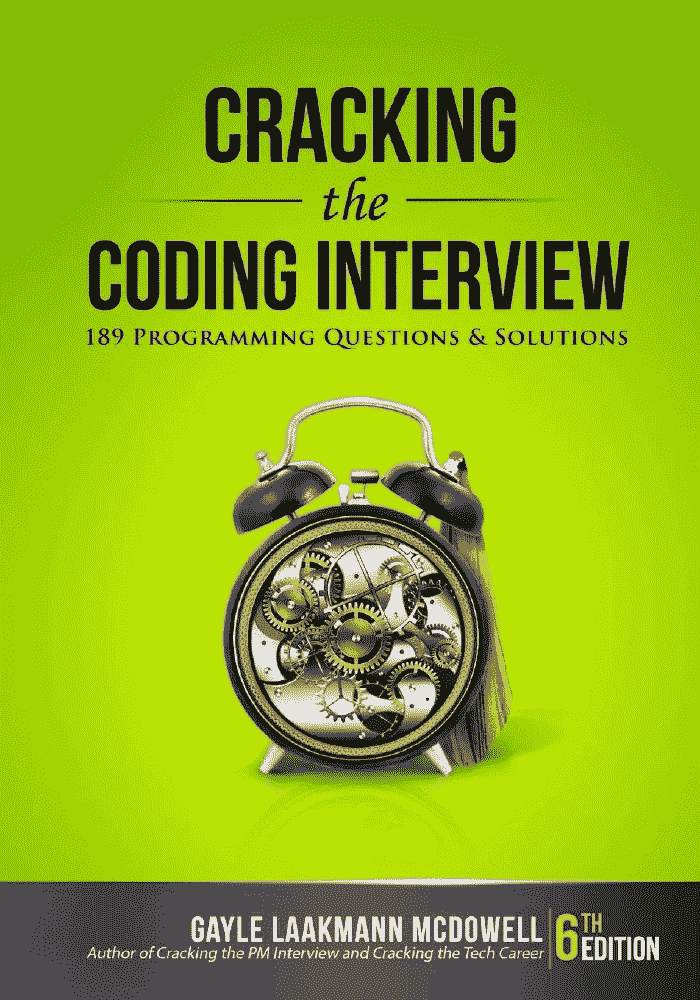

# 如何准备下一次编码面试

> 原文：<https://betterprogramming.pub/how-to-prepare-for-your-next-coding-interview-2a6a6080cfb0>

## 面试准备

## 掌握编码面试是一项你需要练习的技能

作者照片。

您拥有构建令人惊叹的网站、复杂的应用程序或快速可靠的 API 所需的技能。你想得到一份开发人员的理想工作，所以你开始参加面试。突然，你怀疑你所学的一切是否正确，你是否准备好接受一份工作。

我想我们都经历过。作为一名开发人员进行面试很有挑战性，这本身就是一项技能，因为面试问题通常会涉及我们通常不涉及的话题。那么，我们怎样才能通过面试并得到这份工作呢？两条建议:

1.  参加面试以获得实践。
2.  加入一个网站，它会帮助你准备面试中需要的技能。

面试就像编程一样:你需要练习、练习、再练习才能变得更好。

# 编码面试

雇用开发人员或软件工程师是一个与其他领域有些不同的过程。通常，一个候选人在得到一份工作之前必须经过至少两种类型的面试。这些包括:

*   与人力资源的经典面试，双方介绍自己，解释什么是价值主张，该公司必须提供什么，以及开发人员的经验。
*   技术或编码面试。

在第二种类型中，候选人需要向招聘方证明，他们拥有在公司取得成功所必需的技能——至少在理论上是这样。在实践中，技术面试通常更多的是关于计算机科学理论和解决算法，这些你在他们所做的工作中几乎不会用到。我不完全同意这种方法，但它有点像行业标准。另一种常见的方法是编码案例:一个你可以在家工作并提交的小项目。在面试中，你通常需要为你的工作辩护，并解释你所做的设计或编程决定。

因为这些编码案例或面试问题通常非常特别，所以您需要针对它们进行培训。谢天谢地，有很多网站可以帮你做到这一点。

今天我们就来回顾一下我最喜欢的准备编码面试的平台。

*注意:我与下面的任何网站都没有关系，名单也没有特别的顺序。它们都提供了很好的选择，你应该选择你觉得最舒服的平台。*

# 算法专家

图片来自[算法专家](https://www.algoexpert.io/product)。

[AlgoExpert](https://www.algoexpert.io/) 可能是这个列表中我最喜欢的资源。虽然你需要付费才能访问该平台，但它提供了丰富的体验，包括一系列定制的问题和挑战，以及视频解释、解决方案和出色的界面。

以下是该平台的一些功能:

*   115 个精选问题
*   70 多个小时的视频讲解
*   数据结构速成班
*   支持九种不同的编程语言:JavaScript、Python、Swift、C++、Java、C#、Go、Kotlin 和 TypeScript。
*   代码执行环境
*   时空复杂性分析
*   模拟编码面试:练习编码面试的最好方法是经历同样的经历。AlgoExpert 让你和其他人结对练习模拟面试。

# CoderByte

图片来自 [CoderByte](https://coderbyte.com/) 。

[CoderByte](https://coderbyte.com/) 是另一个帮助你准备编码面试的平台。它附带了帮助你在领先的科技公司找到工作的准备材料。

CoderByte 提供了三种不同的面试套件:

1.  算法和数据结构工具包
2.  谷歌面试准备工具包
3.  React 面试准备套件

以下是它的一些特点:

*   300 多项实践挑战
*   最重要的科技公司面临的共同挑战
*   代码执行环境
*   它伴随着一个讨论解决方案的社区。
*   模拟面试
*   免费挑战+订阅

# LeetCode

图片来自 [LeetCode](https://leetcode.com/) 。

LeetCode 是最受欢迎的平台之一，有超过 1750 个问题可以练习，还有一个庞大的社区和专家。它最酷的一点是可以过滤公司(如谷歌、网飞、脸书)提出的挑战，并练习这些特定公司通常提出的挑战。

以下是一些功能:

*   按公司过滤
*   它支持大量的编程语言。
*   免费+订阅

# 极客论坛

图片来自 [GeeksForGeeks](https://www.geeksforgeeks.org/) 。

[GeeksForGeeks](https://www.geeksforgeeks.org/) 与其他网站略有不同，因为它主要由用户提供的问题驱动(类似于 HackerRank)。它按公司对问题进行分类，这让它变得超级有趣。

GeeksForGeeks 团队也撰写文章教授各种编程概念。它是许多编程问题的良好来源，但是很难找到一个好问题。

# 破解 Gayle Laakmann McDowell 的编码采访

图片来自[亚马逊](https://www.amazon.com/Cracking-Coding-Interview-Programming-Questions/dp/0984782850)。

我知道，它不是一个平台，但它是一本帮助你掌握编码面试的好书。这本书收集了顶级科技公司的常见问题，涉及的主题包括大 O 符号、数据结构、算法、动态编程、面向对象编程等。

作者回忆了她在面试以及为微软、苹果和谷歌等大型科技公司工作的经历。

# 结论

得到公司的工作机会和做开发人员是不同的体验。因此，我们必须准备和练习这种技能来获得我们梦想的工作。这些网站大同小异，功能重叠很多，所以不要太专注于加入哪个平台学习。用你觉得最舒服的一个，练习，练习，再练习。这是变好的唯一方法。

感谢阅读！