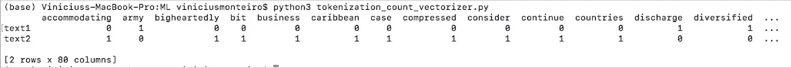

# 如何为自然语言处理(NLP)准备文本数据

> 原文：<https://betterprogramming.pub/how-to-prepare-text-data-for-natural-language-processing-nlp-97dadce77661>

## 句子分割、标记化、停用词移除、词干化和词条化介绍


图片由来自 [Pixabay](https://pixabay.com/?utm_source=link-attribution&utm_medium=referral&utm_campaign=image&utm_content=1170657) 的 [M. Maggs](https://pixabay.com/users/wild0ne-920941/?utm_source=link-attribution&utm_medium=referral&utm_campaign=image&utm_content=1170657) 拍摄

对于上下文，想象一下聊天机器人或自动文本摘要器的实现。

该算法必须找到单词和句子之间的相关性，并从数据中提取知识——这对计算机来说是一项复杂而耗时的任务。

因为这是一个复杂的操作，所以程序不能花时间处理那些对理解语义没有太大价值的部分。像“the”、“in”和“an”这样的停用词最好去掉，标点符号和数字也一样。

文本还必须以计算机能够最好地工作的方式进行分段和格式化。

本文将解释在自然语言处理(NLP)的第一步和关键步骤**【预处理】**中应用于书面内容的五个过程。我只考虑英语或类似的语言。

# 句子分割

它是关于识别一篇文章的每一句话。

为了分割英语中的单词，我们可以使用它们之间的空间。例如:“有四个空格的文本”=五个单词。

*句子呢？*

它从哪里开始或结束？句号是在句尾吗？如果句子中包含一个数字，比如 3.0，怎么办？查看下面的文本，从这个[文档](https://link.springer.com/content/pdf/10.1007%2F978-0-387-39940-9_421.pdf)中检索(文本分段部分)。

> Clairson International Corp .表示，预计截至 3 月 26 日的第二季度将出现净亏损，预计截至 9 月 24 日的财年将达不到分析师预计的 300 万至 400 万美元的利润，或每股 1，276 美分至 1，279 美分。(摘自《华尔街日报》(1988 年))

您必须解决不明确的句点、逗号和分号。

幸运的是，Python 中有一个库可以为我们做这件事——spaCy。spaCy 支持多种语言的标记化。这就是我在这篇文章中用来演示句子分段代码的库，但是也有其他的库。

下面是使用 spaCy 的 [Python 代码。要运行，您必须首先安装 spaCy 和核心英语库。该命令如下所示:](https://www.geeksforgeeks.org/python-perform-sentence-segmentation-using-spacy/)

```
pip install spacy
python -m spacy download en_core_web_sm
```

句子切分代码。来源: [Geeksforgeeks](https://www.geeksforgeeks.org/python-perform-sentence-segmentation-using-spacy/) 。

结果就是两句话。该算法识别出“Corp .”或“Sept .”中的点是缩写，而不是句子的结尾。

```
(base) Viniciuss-MacBook-Pro:ML viniciusmonteiro$ python3 sent_seg.pyClairson International Corp. said it expects to report a net loss for its second quarter ended March 26 and doesn't expect to meet analysts' profit estimates of $3.0 to $4 million, or 1,276 cents a share to 1,279 cents a share, for its year ending Sept. 24.(From the Wall Street Journal (1988))
```

# 标记化

标记化将文本分成多个部分，也称为“标记”有多种方法和库可以实现这一点，我将在这里展示其中的两种。

要了解更多细节，你可以看看这篇很棒的文章， [Frank Andrade](https://medium.com/u/fb44e21903f3?source=post_page-----97dadce77661--------------------------------) 写的《[用 Python](https://towardsdatascience.com/5-simple-ways-to-tokenize-text-in-python-92c6804edfc4) 标记文本的 5 种简单方法》。

## **空间**

我将使用非小说类书籍 [Livewired:不断变化的大脑的内幕](https://amzn.to/3h5BRHn)中的一段文字。

> *想象一下:*我们不是向火星发射一辆四百磅重的探测车，而是仅仅向火星发射一个球体，一个可以放在大头针末端的球体。利用周围来源的能量，这个球体将自己分裂成一个由相似球体组成的多样化军队。这些球体彼此相连，并衍生出各种功能:轮子、透镜、温度传感器和一个完整的内部导航系统。看到这样一个系统自动放电，你会大吃一惊。

使用空间的标记化。来源:[Python 中标记文本的 5 种简单方法](https://towardsdatascience.com/5-simple-ways-to-tokenize-text-in-python-92c6804edfc4)

```
['Imagine', 'this', ':', 'instead', 'of', 'sending', 'a', 'four', '-', 'hundred', '-', 'pound', 'rover', 'vehicle', 'to', 'Mars', ',', '\n', 'we', 'merely', 'shoot', 'over', 'to', 'the', 'planet', 'a', 'single', 'sphere', ',', 'one', 'that', 'can', 'fit', 'on', 'the', 'end', 'of', 'a', 'pin', '.', '\n', 'Using', 'energy', 'from', 'sources', 'around', 'it', ',', 'the', 'sphere', 'divides', 'itself', 'into', 'a', 'diversified', 'army', 'of', '\n', 'similar', 'spheres', '.', 'The', 'spheres', 'hang', 'on', 'to', 'each', 'other', 'and', 'sprout', 'features', ':', 'wheels', ',', 'lenses', ',', '\n', 'temperature', 'sensors', ',', 'and', 'a', 'full', 'internal', 'guidance', 'system', '.', 'You', "'d", 'be', 'gobsmacked', 'to', 'watch', '\n', 'such', 'a', 'system', 'discharge', 'itself', '.']
```

## **sklearn 和计数矢量器**

现在，我将向您展示一种方法，将每个部分标记并转换为数字。数字代表文本中的每个单词计数——这很有用，例如，如果您想要使用[余弦相似度](https://towardsdatascience.com/cosine-similarity-intuition-with-implementation-in-python-51eade2674f6)来比较两个文本。

首先，来自 panda 的数据帧存储文本，来自 sklearn 的 CountVectorizer 转换它们。我附上了同一本书的另一篇文章，这样你就可以看到它们之间的比较。

使用 CountVectorizer 进行标记化源代码:[Python 中标记化文本的 5 种简单方法](https://towardsdatascience.com/5-simple-ways-to-tokenize-text-in-python-92c6804edfc4)



图一。包含两个文本中每个单词的计数的矩阵。按作者。

# 停止单词删除

正如我在本文开头提到的，计算机理解文本需要大量的处理能力。你必须减少文本，只包含必要的信息。

这就是停用词删除的目的。Python 中的自然语言工具包(NLTK)可以帮助我们。它有一个 16 种不同语言的停用词列表。

明确地说，我所说的停用词是指“the”、“in”、“an”等。让我们看看代码和结果。下面的代码还展示了如何使用 NLTK 进行标记化。

要安装 NLKT，请访问 https://www.nltk.org/install.html 的。最后，要运行下面的代码，请运行以下命令:

```
python -m nltk.downloader stopwords
python -m nltk.downloader punkt
```

使用 NLTK 停止单词删除。来源:[https://www . geeks forgeeks . org/removing-stop-words-nltk-python/](https://www.geeksforgeeks.org/removing-stop-words-nltk-python/)

结果:

```
['Clairson', 'International', 'Corp.', 'said', 'expects', 'report', 'net', 'loss', 'second', 'quarter', 'ended', 'March', '26', "n't", 'expect', 'meet', 'analysts', "'", 'profit', 'estimates', '$', '3.0', '$', '4', 'million', ',', '1,276', 'cents', 'share', '1,279', 'cents', 'share', ',', 'year', 'ending', 'Sept.', '24', '.']
```

如果你与原文比较，你可以看到“或”、“一”、“到”等。，已被删除。

# 词干化和词汇化

词干化和词汇化有着相同的目标——将单词转换成它的基本形式。基础或头部形式也被称为引理。

例如，“saw”和“seen”来源于基本词“see”同样适用于“玩过”和“正在玩”。两个*都源于“玩”这个词。词干提取任务试图通过删除单词的最后几个字符来找到基本单词。对于“已播放”和“正在播放”，它工作正常。但是《电锯惊魂》就不一样了。词干提取任务将“saw”变成“s”*

在大多数情况下，术语化效果更好，但这是一个较慢的过程。

它在一个单独的预定义列表中搜索词根。单独的列表包含“saw”的基本单词是“see”的信息算法只需要在里面查一下。

这里有一个使用 NLTK 的词干化和词汇化的实现。

选择在动词(pos="v ")的上下文中进行词汇化对于单词“编码”来说并不合适。在这种情况下，词干处理更有效。也可以选择在名词(pos="n ")的上下文中进行 lemmatize，然后保持“编码”不变。

使用 NLTK 的词干分析和词汇化任务。

词干化任务后的结果:

```
**Word                After stemming**She                 shewas                 warunning             runand                 and**coding              code**at                  atthe                 thesame                sameand                 andI                   ithought             thoughtthis                thiwas                 waone                 oneof                  ofthe                 thecrazy               crazithings              thingI                   i've                 'veever                everseen                seen
```

词汇化后:

```
**Word                Lemma**She                 Shewas                 berunning             runand                 and**coding              cod**at                  atthe                 thesame                sameand                 andI                   Ithought             thinkthis                thiswas                 beone                 oneof                  ofthe                 thecrazy               crazythings              thingsI                   I've                 'veever                everseen                see
```

# 结论

这些不是在预处理阶段应用于文本的唯一任务。其他一些是网址，标点符号和数字删除，以及所有字符转换为一个共同的大小写(大写或小写)。

概括一下:目标是通过分析文本中无助于提取有用信息的部分来避免浪费存储和处理能力。此外，单词和句子的格式化和分离是必不可少的，以便算法可以理解它们之间的相关性。

感谢阅读。