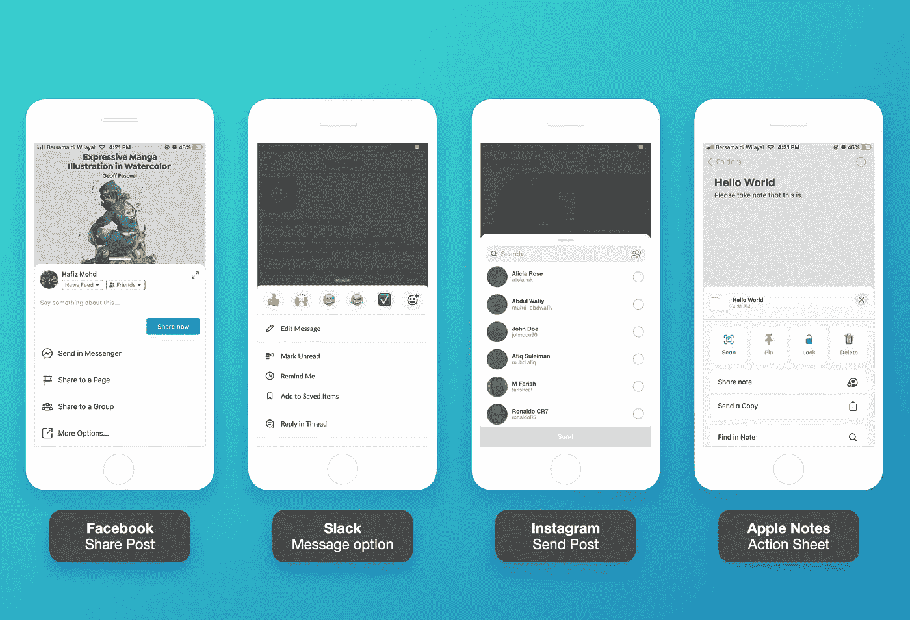
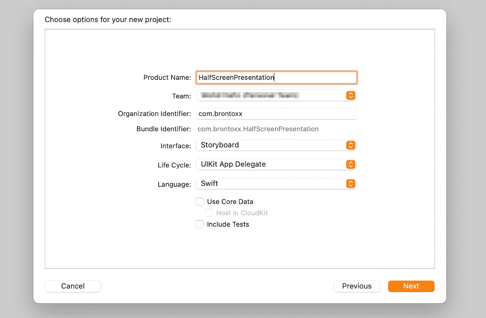
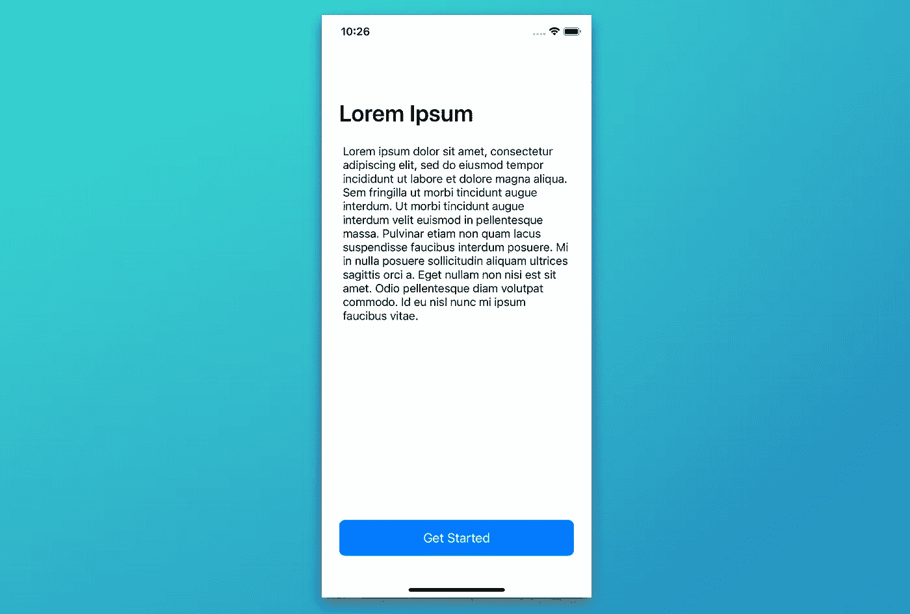
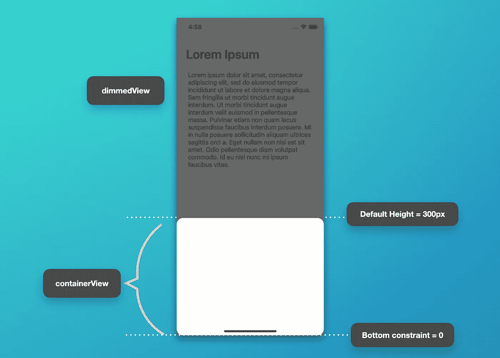
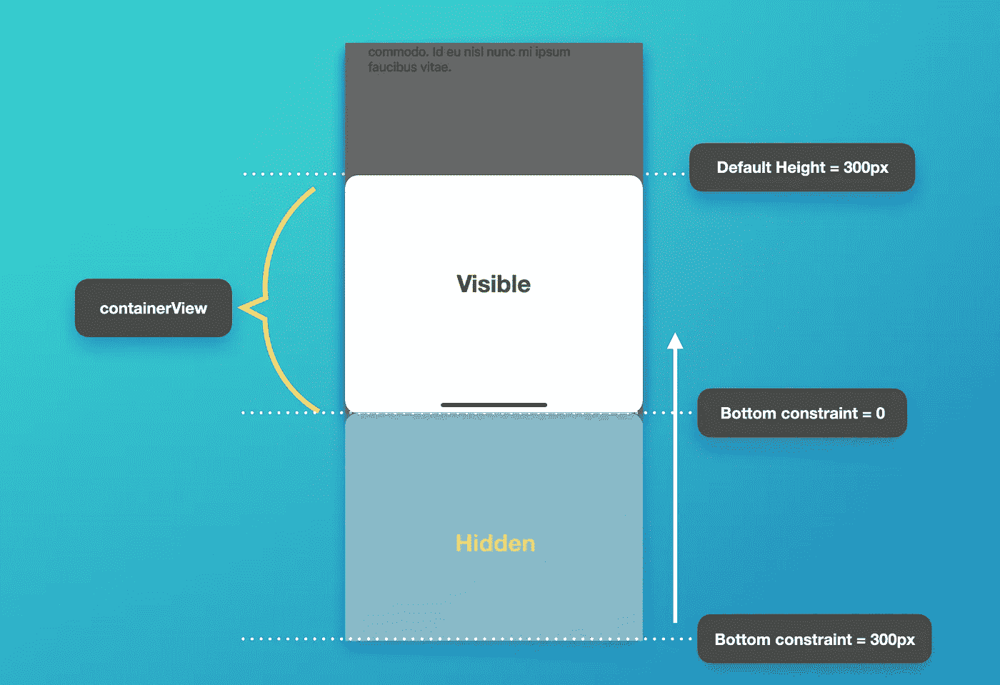
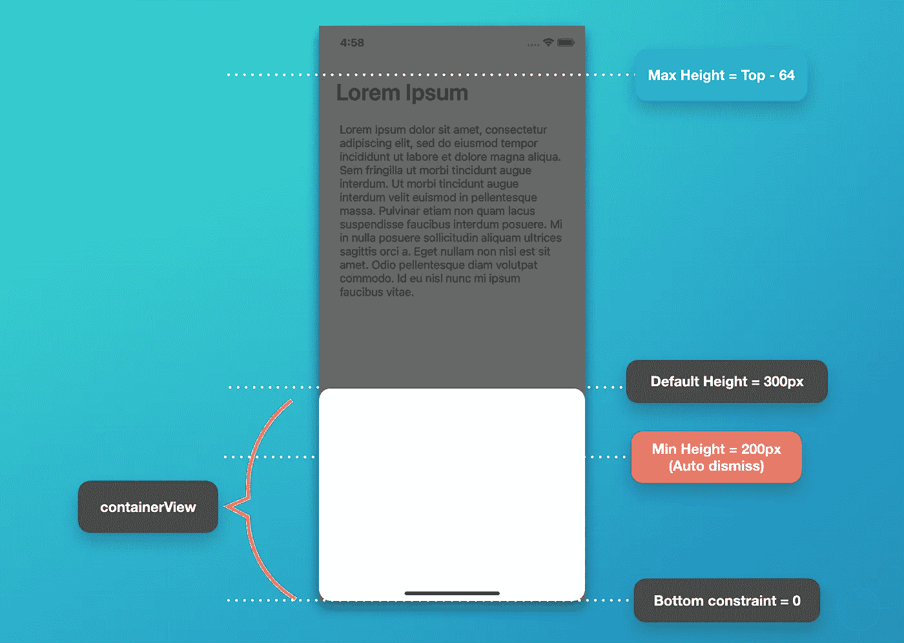

# 如何在 iOS 中呈现底部表单视图控制器

> 原文：<https://betterprogramming.pub/how-to-present-a-bottom-sheet-view-controller-in-ios-a5a3e2047af9>

## 不需要库的简单易行的方法



使用底部表单视图的应用程序。图片由作者提供。

底部表单模态视图控制器是一个具有很好的 UI/UX 设计的特性。当我们想用最少的内容呈现一个快速预览时，这是非常有用的。事实上，在大多数 iOS 实现中，它有一个平移手势功能(可拖动)，只需通过将视图拖动到顶部或底部来关闭控制器或扩展内容。也可以通过点击变暗的背景来快速关闭模式视图控制器。

该功能目前已在脸书、Slack、Instagram 等众多知名 app 中实现。

# 我们将建造什么？


在本文中，我们将创建一个简单的应用程序(如上所示),它带有一个模态视图控制器，具有以下功能:

*   可以有模式地呈现，内容大小约占屏幕大小的一半或更少(可定制)。
*   能够向下拖动以关闭视图控制器(使用平移手势识别器)。
*   能够向上拖动以展开视图控制器。
*   能够通过点击暗背景来关闭视图控制器。

我假设每个阅读这篇文章的人都已经熟悉了[自动布局](https://developer.apple.com/library/archive/documentation/UserExperience/Conceptual/AutolayoutPG/index.html)和修改约束。此外，我们将以编程方式构建它，包括创建视图和设置布局约束。

但是，您可以使用 Storyboard、Xib 或其他自动布局库。但是在整个教程中，请务必关注哪些约束将会发生变化并影响布局。

# 1.创建新的 UIKit 项目



用 UIKit 和故事板创建一个新项目。然而，我们不打算更新`Main.storyboard`文件，因为我们将在一个 Swift 文件中以编程方式创建整个文件。

## 移除故事板(可选)

您可以通过以下额外步骤完全删除故事板:

1.首先，从`Project > General > Main Interface`中删除“Main”。

2.打开`Info.plist`文件作为“源代码”,删除这两行:

```
<key>UISceneStoryboardFile</key>
<string>Main</string>
```

3.然后，从项目中删除`Main.storyboard`文件。

4.将下面的代码添加到`SceneDelegate.swift`中，从指定的视图控制器中设置我们的根窗口。

# 2.向 ViewController 添加视图

在这个项目中，我们将致力于两个主要的视图控制器:

1.  `ViewController`已经作为主页面存在于`ViewController.swift`中。
2.  `CustomModalViewController`是一个可展示的视图控制器，我们将在下一步创建它。



ViewController 页面的屏幕截图

现在，打开`ViewController.swift`，我们将添加一些文本和一个按钮，它们被包裹在`UIStackView`中。这个按钮将触发一个函数来呈现我们的自定义模态视图控制器。

用下面的代码更新您的`ViewController.swift`文件并运行项目(command + R)。你应该能够看到如上图所示的相同结果。

下面是对视图控制器中添加的每个要点的解释:

1.  将所有需要的 UI 组件，包括`UILabel`、`UITextView`和`UIButton`，添加到一个带有[懒人闭包](https://theswiftdev.com/lazy-initialization-in-swift/)的`UIStackView`中，并定义样式。我们不设置框架或大小，因为它将在接下来的步骤中的约束设置中处理。我还在`containerStackView`里面加了一个`spacer`把`registerButton`推到屏幕底部。
2.  我们常用`viewDidLoad()`来调用所有的设置方法。
3.  将一个动作方法绑定到`registerButton`。
4.  `setupConstraints()`方法是我们添加必要的子视图并设置约束的地方。我认为约束非常简单，尽管它们是以编程方式编写的。
5.  包装`activate()`函数中需要的所有约束，以立即更新每个视图的布局。
6.  将`containerStackView`边缘(顶部、底部、前缘和后缘)设置为 24px 间距的超级视图。
7.  将按钮高度设置为 50px。
8.  准备一个当我们点击`registerButton`时将被调用的`presentModalController()`方法。

很好，现在我们完成了第一页。让我们继续创建我们的第二个视图控制器。

# 3.创建 CustomModalViewController

创建一个名为`CustomModalViewController`的新控制器(您可以使用任何合适的名称)。然后添加一个名为`containerView`的`UIView`作为主视图来保存 UI 组件的子视图。下图显示了我们将在这一步中构建的第二个视图控制器:



CustomModalViewController 页面的屏幕截图

在初始阶段，我们将创建一个没有动画的空视图`CustomModalViewController`。下面是更新视图控制器的代码:

1.  创建一个`containerView`作为以后保存内容的主要位置。
2.  创建一个简单的`dimmedView`作为背光。
3.  创建可根据动画和`containerView`高度进行更改的动态约束。
4.  增加`dimmedView`和`containerView`为主子视图。
5.  设置静态(不可改变的)约束。
6.  将容器高度设置为默认值(300 像素)。
7.  将`containerView`的底部锚定设置为`0`，这样从底部边缘到 300px 高度都可以看到视图。

然后，更新`ViewController.swift`中的`presentModalController()`方法，如下所示:

我们没有将`present()`用于上面代码中显示的动画。因此，我们应该将`animated`的值设置为`false`。相反，我们将添加我们的自定义动画来制作暗淡背景和容器移动的动画。

现在，如果您运行项目并单击“开始”按钮，它将显示我们的新视图控制器，但没有任何动画。

# 4.用动画显示容器视图

添加一个名为`animatePresentContainer()`的新方法，它将从底部到默认高度呈现`containerView`。在`setupConstraints()`中，确保将初始底部常数更改为`defaultHeight` (300px)，这样`containerView`最初会隐藏在底部边缘下方。



底部锚值更改以上下移动容器视图

务必记住，如果底部锚点等于`0`，则`containerView`将可见。如果底锚大于`0`，会根据偏移值稍微隐藏。

这个新方法需要从`viewDidAppear()`调用。

# 5.添加暗视图动画

添加一个名为`animateShowDimmedView()`的新方法。然后通过更新 alpha 值制作一个简单的渐变动画，如下面的代码所示。这个方法也会在`viewDidAppear()`中用`animatePresentContainer()`调用。

# 6.添加自定义消除动画

在这一步，我们将模仿视图控制器解散动画。首先，添加一个名为`animateDismissView()`的新方法。它用于隐藏变暗的视图并将`containerView`移动到底部边缘下方。在动画结束时(在完成闭包中)，它会调用原生视图控制器的`dismiss()`方法，没有任何动画。

一旦完成这一步，当“开始”按钮被按下时，我们的应用程序应该能够平稳地呈现底部的`containerView`以及一个淡入淡出的动画。此外，您应该能够通过点击暗视图来关闭视图控制器。

# 7.设置平移手势以检测拖动运动

这部分很重要，因为我们想在`containerView`上平移时捕捉偏移值的距离。

1.添加一个名为`setupPanGesture()`的新方法，在主视图上设置手势，并将其绑定到 handler 方法。

2.创建一个名为`handlePanGesture()`的处理程序方法。为了更好地理解，让我们做一个简单的打印输出来捕捉拖动距离和方向:

3.现在，调用`viewDidLoad()`中的`setupPanGesture()`。

运行项目并尝试平移`containerView`。当检查底部输出日志时，它应该会打印出类似如下所示的结果:

```
Pan gesture y offset: -20.666671752929688
Dragging direction: going upPan gesture y offset: -14.333343505859375
Dragging direction: going upPan gesture y offset: -3.6666717529296875
Dragging direction: going upPan gesture y offset: 9.0
Dragging direction: going downPan gesture y offset: 14.333328247070312
Dragging direction: going downPan gesture y offset: 22.666656494140625
Dragging direction: going down
```

# 8.更新手势处理程序

根据上一步的结果，我们知道如果拖动方向向上，那么 *Y* 偏移总是负的，反之亦然。因此，为了用新的高度更新`containerView`，我们应该实现这个公式:

```
newHeight = containerHeight + (-translation.y)
```

因此，当我们拖动到底部时，容器高度会变小。当我们拖动到顶部时，高度会增加。完美！

## 扩展和消除条件

请记住，我们已经确定了我们的条件的价值。



*   默认高度:容器的固定默认大小
*   最大高度:容器可以呈现或被拖动的最大值。每当`containerView`从默认高度(300px)拖动到顶部时，无论用户是否放开，`containerView`都会一直增长到顶部(不能超过最大高度)。
*   最小高度:如果容器达到最小值或低于最小值，视图将自动关闭。这类似于“向下滑动以消除”操作。

现在，为固定值添加一些`let`常量，并添加一个`var`来保存对容器高度的更改。

然后，根据手势状态更新`handlePanGesture()`并添加一个新的`animateContainerHeight()`方法，用动画更新新的容器高度。容器的高度根据名为`containerViewHeightConstraint`的动态约束变量进行更新。有关详细解释，请参见代码中的注释:

# 9.向容器视图添加内容

如果您想在`containerView`扩展或收缩时看到内容的变化，这一步是可选的。

我们将添加两个标签和一个堆栈视图，然后将堆栈视图的约束设置到超级视图的边缘(`containerView`)。

# 项目已完成

恭喜你！现在，我们已经完成了所有的步骤，项目已经准备好运行了。我们已经编写了非常简单的代码，定制的模态视图控制器工作得很好。

完整的源代码可以从我的 GitHub [库](https://github.com/xmhafiz/CustomModalVC)下载。尝试将它实现到您的项目中，并通过创建一个可在其他视图控制器中重用的包装类来改进代码。

感谢阅读。编码快乐！

# WWDC21 更新

根据 [WWDC21](https://developer.apple.com/videos/play/wwdc2021/10063/) 中的最新会话，苹果发布了 UIKit 的更新，拥有一个可定制和可调整大小的底部表单，名为[uisheetepresentationcontroller](https://developer.apple.com/documentation/uikit/uisheetpresentationcontroller?changes=_2_1&language=objc)，可在 iOS15+上使用。这个更新绝对是每个开发者期待已久的特性。

# 参考

*   [https://developer . apple . com/library/archive/documentation/user experience/Conceptual/AutolayoutPG/index . html](https://developer.apple.com/library/archive/documentation/UserExperience/Conceptual/AutolayoutPG/index.html)
*   [https://developer . apple . com/library/archive/documentation/user experience/Conceptual/AutolayoutPG/programmaticallycreationconstraints . html](https://developer.apple.com/library/archive/documentation/UserExperience/Conceptual/AutolayoutPG/ProgrammaticallyCreatingConstraints.html)
*   [https://fluffy.es/facebook-draggable-bottom-card-modal-1/](https://fluffy.es/facebook-draggable-bottom-card-modal-1/)
*   [https://github.com/xmhafiz/CustomModalVC](https://github.com/xmhafiz/CustomModalVC)
*   [https://developer.apple.com/videos/play/wwdc2021/10063/](https://developer.apple.com/videos/play/wwdc2021/10063/)
*   [https://developer . apple . com/documentation/ui kit/uiview controller/customize _ and _ resize _ sheets _ in _ ui kit？language=objc](https://developer.apple.com/documentation/uikit/uiviewcontroller/customize_and_resize_sheets_in_uikit?language=objc)
*   [https://developer . apple . com/documentation/ui kit/uisheetpresentationcontroller？changes = _ 2 _ 1&language = objc](https://developer.apple.com/documentation/uikit/uisheetpresentationcontroller?changes=_2_1&language=objc)