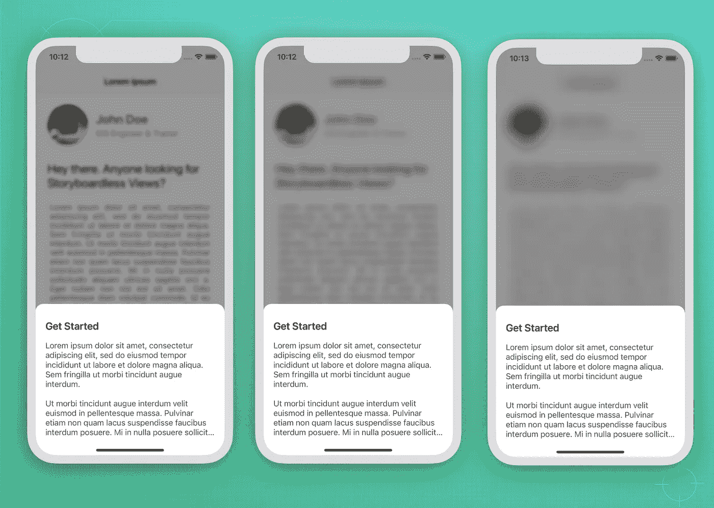
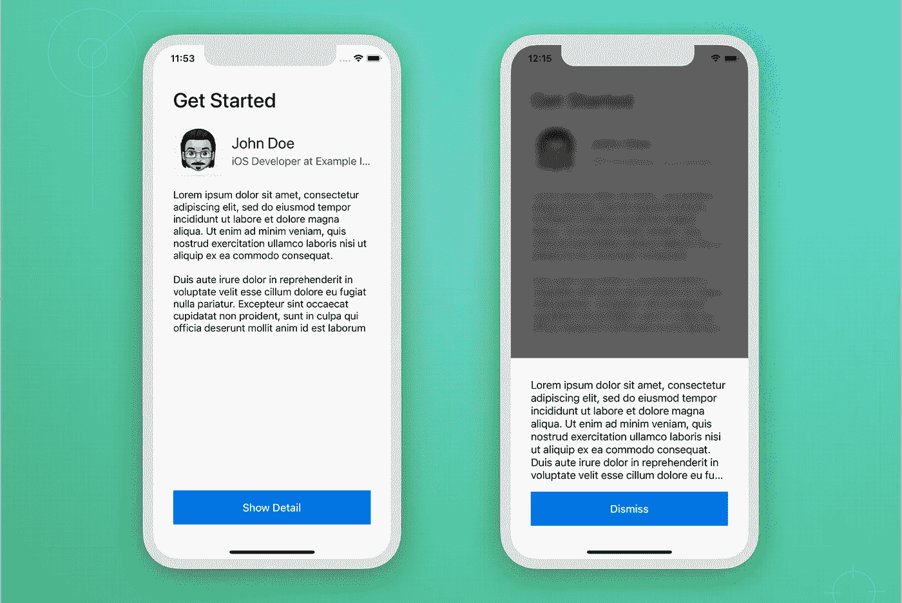
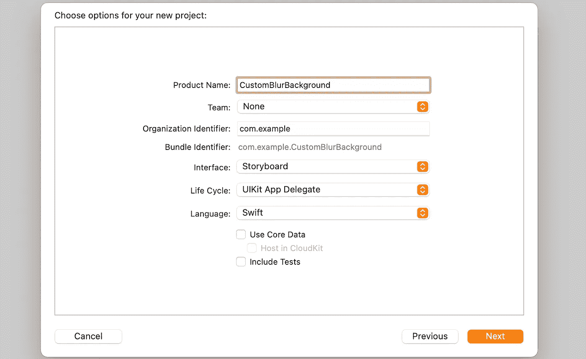
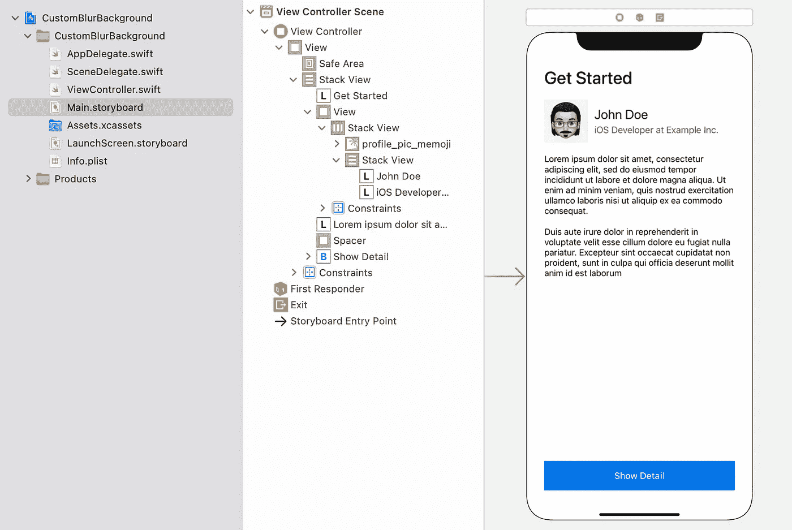
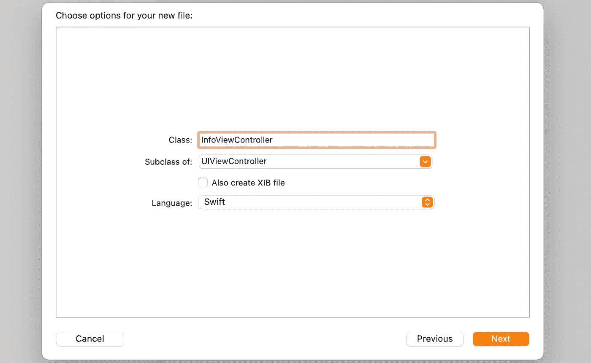
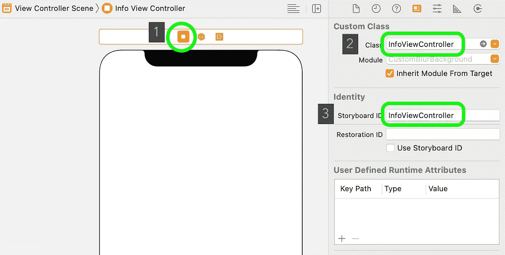
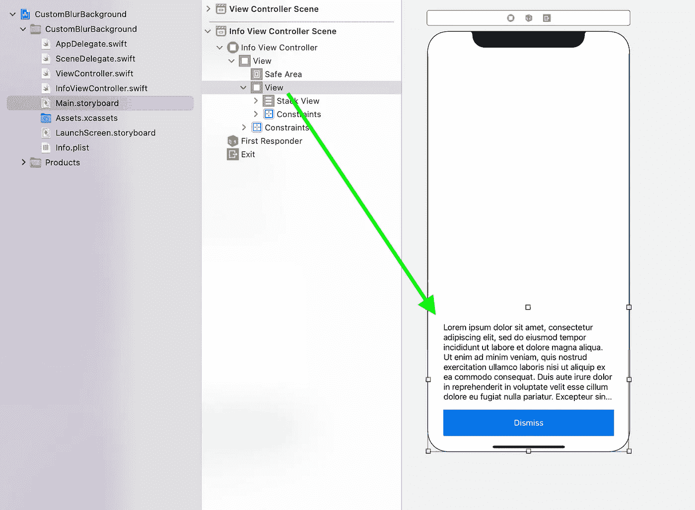
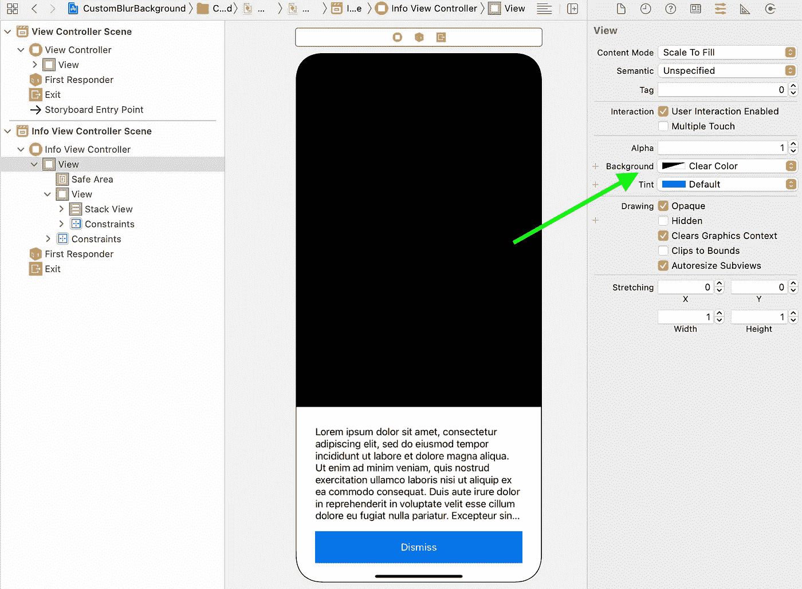
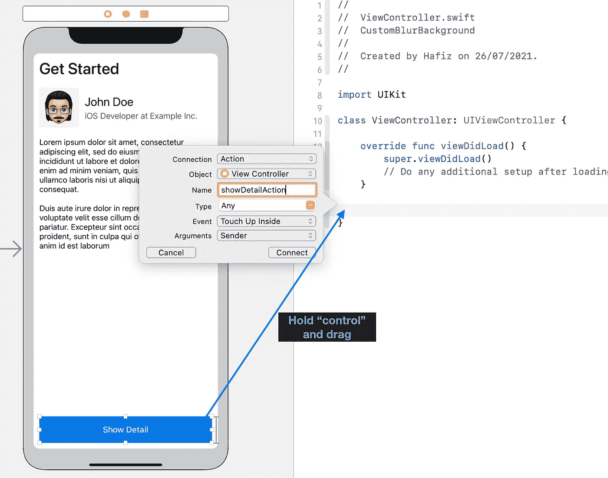
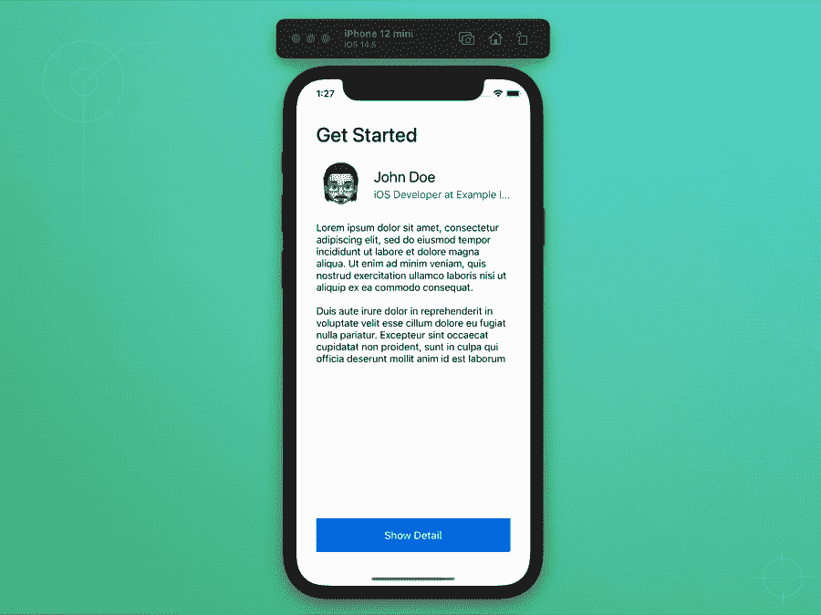

# 如何在 iOS 中呈现背景模糊的视图控制器

> 原文：<https://betterprogramming.pub/how-to-present-a-view-controller-with-blurred-background-in-ios-4350017e6073>

## 自定义 UIBlurEffect 的强度级别

不同强度等级的模糊背景示例(图片由作者提供)

# 有什么问题？

当我在搜索一个原生 iOS API 来创建一个模糊的背景视图，同时呈现一个如上图所示的模态 ViewController 时，问题就出现了。

我发现 iOS 已经为`[UIBlurEffect](https://developer.apple.com/documentation/uikit/uiblureffect)`提供了三种不同的风格，包括`.light`、`.dark`和`.extraLight`。然而，我不能设置强度等级，默认的模糊等级相当高。

可用的解决方案很少，但大多数都与`[UIImage](/three-approaches-to-apply-blur-effect-in-ios-c1c941d862c3)` [模糊效果](/three-approaches-to-apply-blur-effect-in-ios-c1c941d862c3) s 有关，而不是应用于单个`UIView`。

另一篇[文章](https://prograils.com/adding-gaussian-blur-to-your-swift-mobile-app)采用了类似的方法。它拍摄背景截图，并在截图图像中应用高斯模糊。这是很好的，但在处理和应用截屏图像上的模糊过滤器之前，它可以作为背景视图应用有几秒钟的延迟。

# 解决办法

幸运的是，我发现了一个[简单的解决方案](https://gist.github.com/darrarski/29a2a4515508e385c90b3ffe6f975df7)，它通过基于强度级别改变`UIViewPropertyAnimator`的值来实现`UIBlurEffect`。

它没有延迟，我们不必等待完成过程。而且还兼容 iOS12 及以上版本。

# 我们开始吧

在本文中，我们将创建一个带有两个 ViewControllers 的简单 UIKit 应用程序。

1.  `ViewController`，作为主页面，其中将呈现第二个视图控制器
2.  `InfoViewController`，一个背景模糊的模态视图控制器。

预期结果、ViewController 和显示的 InfoViewController

## 1.创建 UIKit 项目

## 2.向我们的 ViewController 类添加标签、图像和按钮

打开`Main.storyboard`并添加一个 StackView 作为主容器。

然后，添加图像、标签和按钮。你可以添加你自己的内容，因为它不是那么重要。

我们的主要目的只是展示模糊效果将如何影响文字和图像。此外，该按钮用于显示新的模态控制器。

请记住，左侧窗格中的`ViewController.swift`类已经链接(默认)到这个“视图控制器场景”

## 3.创建 InfoViewController

创建一个新的“可可触摸类”，并选择“UIViewController”。我们新的 ViewController 将被称为“InfoViewController”

然后，打开`Main.storyboard`。添加一个新场景(UIViewController ),并通过在文本框中输入类名将其连接到我们新创建的 InfoViewController 类，如下图所示。

此外，输入故事板 ID，以便稍后演示时调用。

## 4.将主容器视图添加到 InfoViewController

在本节中，我们将添加一个 UIView 作为主容器来保存包括标签和按钮在内的主要内容。这是因为在下一步中，当前背景视图将被更改为清晰的颜色。

因此，当显示 InfoViewController 时，只有这个主容器是可见的。

在底部添加 UIView 作为主容器

现在，设置视图背景颜色为`.clear`。

## 5.将 IBAction 添加到 ViewController 按钮以显示 InfoViewController

在这一步中，将“Show Detail”按钮作为 IBAction 连接到 ViewController，并输入函数名“showDetailAction ”,它将自动在 ViewController 中创建函数占位符。

将按钮连接到 ViewController

然后，将下面的代码添加到`showDetailAction`函数中，以呈现 InfoViewController(如果需要，可以使用 segue)。记住使用我们之前定义的相同标识符。

在这一阶段，如果您现在尝试运行项目并单击“显示细节”按钮，您将看到`InfoViewController`以透明背景呈现在主`ViewController`的顶部。

太好了！是时候添加背景模糊视图了。

## 6.添加自定义 UIVisualEffectView 子类

创建一个名为`CustomUIVisualEffectView.swift`的新文件，并添加以下代码。

## 7.向 InfoViewController 背景添加自定义 BlurView

创建一个名为`blurView`的 UIView。然后，创建一个容器视图，我们将在其中设置模糊效果和模糊视图。

随后，我们需要在`InfoViewController`中连接“解散”按钮作为 IBAction(类似于步骤 5)并处理解散动作。

现在，我们的`InfoViewController`将看起来像下面的代码。您可以更改第 10 行的`intensity`和第 14 行的灰色`alpha`值。

酷！现在，当你尝试运行这个项目并再次点击“显示细节”按钮时，你将在后面看到模糊的视图。

此外，您还可以在`blurView`上添加一个`UITapGestureRecognizer`，以允许点击时的解除动作。

# 项目已完成

恭喜你！现在，我们已经完成了所有的步骤，这个项目正如我们所期望的那样运行良好。

完整的源代码可以从我的 GitHub [库](https://github.com/xmhafiz/CustomIntensityBlurEffectIOS)下载。

尝试将它实现到您的项目中，并通过创建一个 ViewController 子类来改进代码，该子类可被其他模态 ViewController 重用，以具有模糊的背景视图。

感谢阅读。编码快乐！

# 参考

*   [在 iOS 中应用模糊效果的 3 种方法](/three-approaches-to-apply-blur-effect-in-ios-c1c941d862c3)
*   [要旨](https://gist.github.com/darrarski/29a2a4515508e385c90b3ffe6f975df7)
*   [UIBlurEffect 文档](https://developer.apple.com/documentation/uikit/uiblureffect)
*   [高斯模糊示例](https://prograils.com/adding-gaussian-blur-to-your-swift-mobile-app)
*   [自定义强度模糊 GitHub 项目](https://github.com/xmhafiz/CustomIntensityBlurEffectIOS)